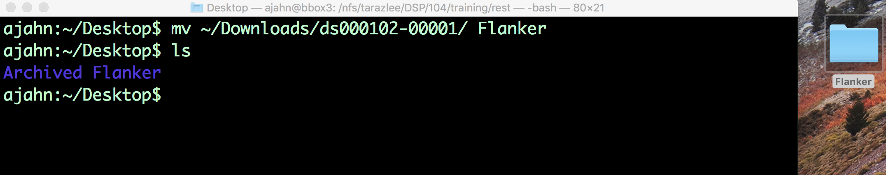
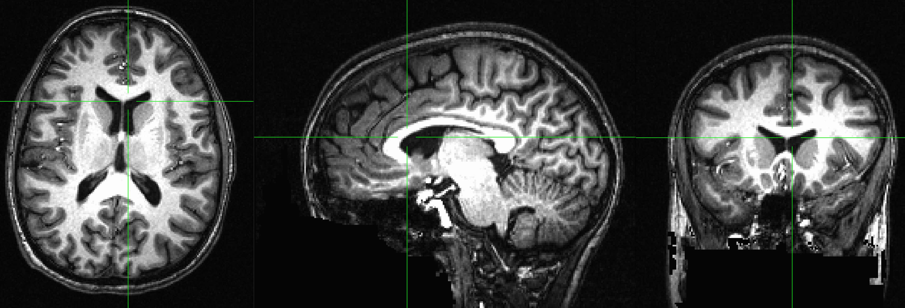
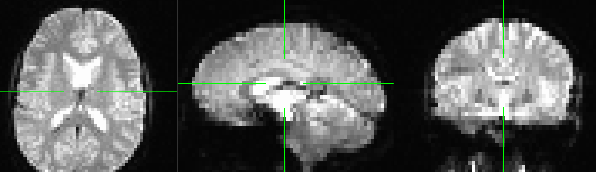

.. _AFNI_03_LookingAtTheData:

=====================================
AFNI Tutorial #3: Looking at the Data
=====================================

----------------

Overview: The AFNI Graphical User Interface
-------------------------------------------

Now that you've downloaded the dataset, you will want to **look at your data** - for example, you will want to know if there are any artifacts or problems with your data, and whether these can be alleviated by :ref:`preprocessing <AFNI_04_Preprocessing>`. 

Let's first rename the dataset to something that is clear and informative. If the dataset has been downloaded to your Downloads directory, navigate to the Desktop and type the following:

::

    mv ~/Downloads/ds000102_0001/ Flanker
    
Which will rename the folder to ``Flanker`` and put it on your Desktop.

    After downloading the Flanker dataset, type the command above to move it to your Desktop. Note: If you need to review Unix commands such as ``mv``, see :ref:`this tutorial <Unix_02_CopyRemove>`.
    
    
As you saw in the previous :ref:`Data Download page <AFNI_01_DataDownload>`, the dataset has a standardized structure: Each subject folder contains an anatomical directory and a functional directory labeled ``anat`` and ``func``, and these in turn contain the anatomical and functional images collected during the experiment. (The ``func`` directory also contains **onset times**, or timestamps for when the subject underwent either a Congruent or Incongruent trial.) This format is known as `BIDS <http://bids.neuroimaging.io/>`__, or Brain Imaging Data Structure, which makes it easy to organize and analyze your data.

.. figure:: 03_Flanker_DataStructure.png

    Example of the BIDS format. Note that the ``func`` directory contains functional data - in this case, two runs of functional data - and corresponding "events.tsv" files, which contain **onsets**, or timestamps of which condition happened at what time. You can open these as a text file or as a spreadsheet. We will use these later when we build our :ref:`General Linear Model <AFNI_GLM>`.
    
To look at and inspect the data, we will be using the **AFNI Graphical User Interface**, or GUI for short. You can open the GUI by opening a Terminal and typing ``afni`` from the command line and pressing enter. This will open a **Controller Window** and three **viewing windows**. Note that if the GUI is run from a directory that doesn't contain any images, AFNI will search any folders in the current directory. If there are no images there either, AFNI will load a dummy dataset.
    
.. Fix the above link when that page is complete

--------

Inspecting the Anatomical Image
-------------------------------
    
Whenever you download imaging data, check the anatomical and functional images for any **artifacts** - scanner spikes, incorrect orientation, poor contrast, and so on. It will take some time to develop an eye for what these problems look like, but with practice it will become quicker and easier to do.

To begin, let's take a look at the anatomical image in the ``anat`` folder for ``sub-08``. Navigate to the sub-08 folder and then type

::

    afni
    
and press return, which will open the AFNI graphical user interface. By default, AFNI will look for any images in the current directory - such as files in NIFTI or ANALYZE format - and load all of them into memory. If there were several other images in the current directory, for example, and you wanted to load only the anatomical image into the AFNI viewer, you would type:

::

    afni sub-08_T1w.nii.gz

    The anatomical image displayed in the AFNI viewer in axial, sagittal, and coronal views. You can close any of the windows if you only want to focus on a subset of the views. 
    
   
Inspect the image by clicking around in one of the viewing windows. Notice how the other viewing windows and crosshairs change as a result - this is because MRI data is collected as a three-dimensional image, and moving along one of the dimensions will change the other windows as well. If you have highlighted a window by clicking on it, you can scroll continuously through that viewing plane by using the mouse wheel to scroll up or down. 

.. note::

    You may have noticed that this subject appears to be missing his face. That is because the data from OpenNeuro.org have been **de-identified**: Not only has information such as name and date of scanning been removed from the header, but the faces have also been erased. This is done in order to ensure the subject's anonymity.
    

As you continue to inspect the image, here are two things to watch out for:

1. Lines that look like ripples in a pond. These ripples may be caused by the subject moving too much during the scan, and if the ripples are large enough, they may cause preprocessing steps like brain extraction or normalization to fail.

.. figure:: 03_Gibbs.png

    Photo credit: Sundar Amartur

2. Abnormal intensity differences within the grey or the white matter. These may indicate pathologies such as aneurysms or cavernomas, and they should be reported to your radiologist right away; make sure you are familiar with your laboratory's protocols for reporting artifacts. For a gallery of pathologies you may see in an MRI image, click `here <http://www.mrishark.com/brain1.html>`__.

----------

Inspecting the Functional Images
--------------------------------
    
When you are done looking at the anatomical image, click on the ``Read`` from the menu at the top of your screen. In the "Directories" sidebar, double-click on the filepath that ends in two dots (e.g., ``..``, which indicates one directory above the current directory). Then double-click on the ``func`` directory in the "Sessions" sidebar. This loads all of the images in the ``func`` directory, which you can then browse in the AFNI viewer.

.. note::

    Loading a new session into memory will allow you to look at any of the images in that session. If you want to switch to another session, click on ``Switch`` and select the session you want to load.

A new image will be displayed in the orthogonal viewing windows. This image also looks like a brain, but it is not as clearly defined as the anatomical image. This is because the **resolution** is lower. It is typical for a study to collect a high-resolution T1-weighted (i.e., anatomical) image and lower-resolution functional images, which are lower resolution in part because they are collected at a very fast rate. One of the trade-offs in imaging research is between spatial resolution and temporal resolution: Images collected at higher temporal resolution will have lower spatial resolution, and vice versa.

Many of the quality checks for the functional image are the same as with the anatomical image: Watch out for extremely bright or extremely dark spots in the grey or white matter, as well as for image distortions such as abnormal stretching or warping. One place where it is common to see a little bit of distortion is in the orbitofrontal part of the brain, just above the eyeballs. There are ways to `reduce this distortion <https://andysbrainbook.readthedocs.io/en/latest/FrequentlyAskedQuestions/FrequentlyAskedQuestions.html#how-can-i-unwarp-my-data>`__, but for now we will ignore it.

.. Reference the time-series glossary

Another quality check is to make sure there isn't excessive motion. Functional images are often collected as a time-series; that is, multiple volumes are concatenated together into a single dataset. You can rapidly flip through all of the volumes like pages of a book by clicking on the "Graph" button and then pressing the "v" key; you can stop at any time by pressing the space bar. During preprocessing, we will quantify how much motion there was in order to decide whether to keep or to discard that subject's data.

When you are finished looking at the data, click on the red "x" button in the top left of the Controller window. This will close the Controller window and all of the viewer windows. 

--------

Exercises
---------

1. If the AFNI viewer cannot find any images in the current directory, it will look in the directories lower in the hierarchy. What happens, for example, if you navigate to the folder ``sub-08`` and type ``afni``? From the same folder, what happens if you type ``afni func``? What happens when you navigate to the ``Flanker`` folder and type ``afni``?

2. AFNI includes many shortcuts and keyboard commands that allow you to manipulate the image viewer. Look at `this page <https://afni.nimh.nih.gov/pub/dist/src/html/afnigui.html>`__ and try some of the commands listed in the "Keyboard Shortcuts" section.

3. Navigate to the directory ``sub-01/anat``, and open AFNI. The three orthogonal slices will be displayed automatically; if you click the ``Graph`` button, you will see a single value. Then click on ``Define Overlay`` in the AFNI GUI, and note the number in the lower right corner of the panel that says "ULay = ". This number should match the number shown in the Graph window, representing the signal intensity at that voxel. Now click on the button ``Read`` in the AFNI GUI next to ``DataDir``, and use the navigation panel to select the ``func`` directory and click ``Set`` (Hint: Remember that in Unix, two dots (``..``) mean to go up one directory.) Click on the Graph button, and notice how this time-series is different. Why do you think that is? Again, open the Define Overlay panel and note how it corresponds to the value listed in the Graph window. If you were to copy the anatomical image into the ``func`` directory and select one image as an underlay (usually the anatomical image) and one as an overlay (usually the functional image), how would you interpret the values in the ULay and OLay fields?

4. Experiment with the ``Color`` and ``Gap`` options for the crosshair, located in the upper left of the AFNI GUI. Start to get a feel for what kind of defaults you like best to visualize the data.

Video
-----

For a video walkthrough of how to look at the data, click `here <https://www.youtube.com/watch?v=r0NYdToePKM>`__.
