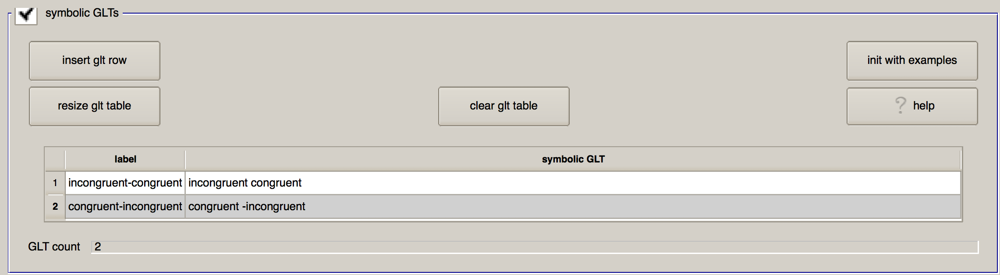
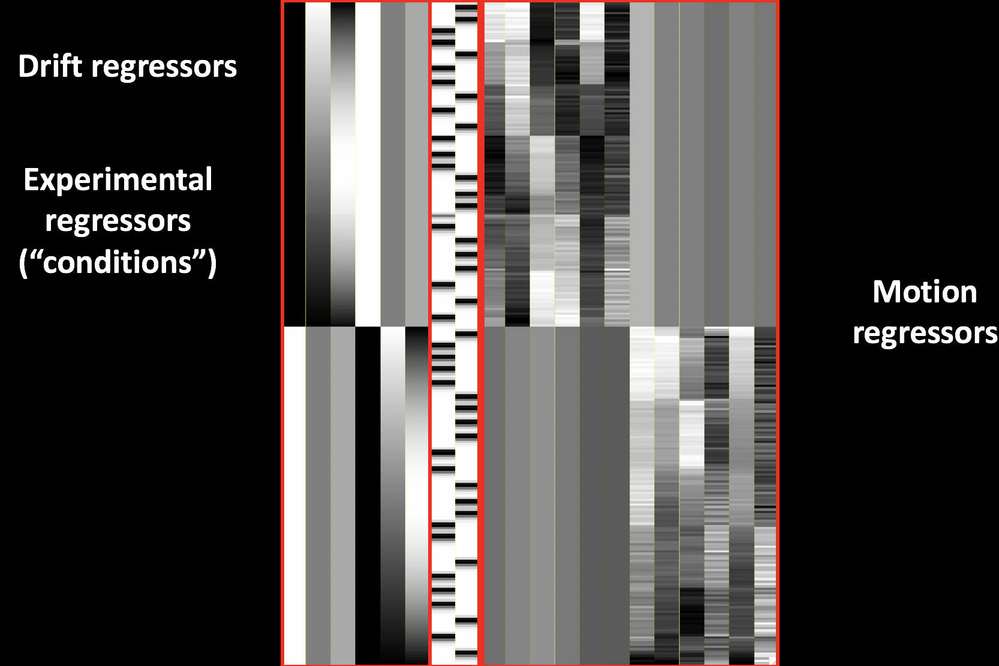

.. _AFNI_06_Stats_Running_1stLevel_Analysis:

===========================================
Chapter 6: Running the First-Level Analysis
===========================================

---------

uber_subject.py Revisited
***************

Previously, we used the command ``uber_subject.py`` to :ref:`set up the preprocessing script for a single subject <AFNI_Intermezzo_Uber_Subject>`. You may recall that we removed one of the processing blocks, called "regress", because we were not focusing on regression at the time. Now, however, we will add the regress block back into our uber_subject.py script, and combine both preprocessing and 1st-level analysis into a single script.

Let's create a new script for the same subject, ``sub-08``. First, remove From the directory containing all of your subjects, type ``uber_subject.py`` from the command line. This time, in the "analysis initialization" section, we will leave all of the blocks as they are (although since the data in this example dataset are already slice-time corrected, you could remove the "tshift" block without affecting the results, as discussed in an earlier chapter).

Fill in the anatomical and functional images :ref:`as you did for preprocessing <AFNI_Intermezzo_Uber_Subject>`, and keep make the same changes to the "extra align options" and "extra tlrc options". The sections of the GUI we will focus on in this chapter are: stimulus timing files; symbolic GLTs; and extra regress options.

Stimulus Timing Files
^^^^^^^^^^^^^^^^^^^^^

Having created the timing files in the :ref:`previous chapter <AFNI_05_Creating_Timing_Files>`, click on the "browse stim" button and select the files ``congruent.1D`` and ``incongruent.1D`` located in ``sub-01/func``. (You can select multiple files by holding down the command key and clicking on individual files.)

When you click "OK", you will see a table populated with the timing files you selected. In addition to showing the name of the timing file you selected, there are three other columns named "label", "basis", and "type". "Label" is how the timing file will be reference in the command that does the model fitting (i.e., ``3dDeconvolve``), whereas "basis" and "type" specify which basis function to apply to the timing files.

The default basis function of ``GAM`` specifies that the onset times should be convolved with the canonical HRF discussed in a :ref:`previous chapter <AFNI_03_Stats_HRF_Overview>`. This basis function requires that only one parameter be estimated - namely, the height of the HRF, which roughly corresponds to the amount of neural activity in response to that condition. Other basis functions that you can apply are the ``BLOCK`` function (i.e., the boxcar regressor that was discussed in the chapter on the HRF), a ``TENT`` function which estimates the activity at specified time-points after the onset of the condition, and ``SPMG2``, which includes a temporal derivative.

The field below, "init file types", allows you to specify the type of convolution you wish to use. The default of ``times`` means to convolve all of the time-points specified in the timing file and generate a parameter estimate for the HRF that on average fits all of the occurrences the best; ``IM``, on the other hand, will estimate a separate beta weight for each trial (which can be used, e.g., for more advanced analyses such as `beta-series analysis <https://www.sciencedirect.com/science/article/pii/S105381190400360X>`__). The ``AM1`` and ``AM2`` options are used for parametric modulation analyses (which are beyond the scope of the present tutorial), and ``files`` indicates that no convolution should be applied - which is useful for nuisance regressors such as motion.

When you have finished loading the files, this part of the GUI should look as follows:

.. figure:: 06_Stimulus_Timing_Files.png

Symbolic GLTs
^^^^^^^^^^^^^

The next section, "Symbolic GLTs", allows you to specify general linear tests that will be calculated after the beta weights above are estimated for the conditions above. The notation is a little strange, and it is probably easiest to click on the "init with examples" button to show example syntax for setting up the tests. When you do, you will see two contrasts: C-I, and mean.CI. 

Let's look at the first contrast: This uses **contrast weights** to specify how the contrast between different conditions will be calculated, and it prepends the contrast weights to the labels specified in the "stimulus timing files" section. No sign implies a contrast weight of +1, while a negative sign implies a contrast weight of -1. Therefore, the line ``congruent -incongruent`` means to weight the parameter estimate for the Congruent condition with +1, and to weight the parameter estimate for the Incongruent condition with -1, and then to take the difference between the two. Using a different computation, the second contrast takes the average of the two conditions by multiplying both by 0.5. 

.. note::
  As a general rule, contrast weights that compute a *difference* between conditions should sum to 0, and contrast weights that take an average across conditions should sum to 1.
  
Let's modify this table to practice the GLT syntax, and to set up the contrasts that we want. In the first row, change the "label" column to ``incongruent-congruent``, and in the "symbolic GLT" column, type ``incongruent -congruent``. Likewise, in the second row specify a contrast of ``congruent-incongruent``. When you have finished, the section should look like this:

Extra Regress Options
^^^^^^^^^^^^^^^^^^^^^

Lastly, we will indicate any preferences we have for the 3dDeconvolve command. The first field, "outlier censor limit", will remove any TRs from the analysis that have a censored outlier fraction greater than the amount specified in the field to the right. (These outliers are detected by ``3dToutcount``, which flags any voxels in a TR that have signal intensity greater than 3 standard deviations from the other voxels in brain mask.) If this is left at 0.0, then no TRs will be censored based on the output from 3dToutcount. We will leave this as is for now, since volumes with high amounts of motion will be censored.

The next field, "jobs for regression (num CPUs)", specifies how many processors to use for the regression analysis. Since this step can be computationally demanding, use the maximum number of CPUs that you can spare. In this case, I will set it to ``8`.

"GOFORIT level (override 3dD warnings)" will ignore any warnings about the design matrix detected by 3dDeconvolve. In general, you should not use GOFORIT unless you are positive that the matrix error is negligible. In general you will want 3dDeconvolve to throw a warning and stop running when it detects an abnormally high level of collinearity among two or more regressors.

The "bandpass in regression" field is usually for resting-state analyses, in order to remove both low and high frequency fluctuations. For task data, however, low-pass filtering (i.e., removing high frequency signal) risks removing actual signal related to the task. Leave this blank.

There are four checkboxes in addition. "Regress motion derivatives" will model higher-order derivatives of the motion regressors, which can capture more complex head movements. This is useful for populations that tend to move a lot, such as children or certain clinical subjects; and as long as you have a long time-series of data (e.g., more than 200 TRs in a run), you probably won't run out of degrees of freedom for estimating these extra parameters. For this tutorial I will leave it unchecked, but you are free to do whatever you want.

I also leave the "run cluster simulation" box unchecked, as this computes whether a cluster is statistically significant in real time as you change the thresholding slider. Since I generally don't perform inference on single subjects - we will do inference later at a group level - I omit this option. I do, however, check the "execute REMLfit" option, as this will create a separate statistical dataset that better accounts for temporal autocorrelation than the traditional 3dDeconvolve approach. Later on, we can use the output from 3dREMLfit to use information about the variability of the subject's parameter estimates in order to create more precise group-level inference maps.

When you are done, this section should look like this:

.. figure:: 06_Extra_Regress_Options.png

Now, click the top three icons in succcession (the sheet of paper, the magnifying glass, and the green "Go" button) to run both the preprocessing and the regression. In total, it should take about 5-10 minutes.

The Ideal Time-Series and the GLM
***************

While you're waiting for the analysis to finish, let's take a look at how the model we just created relates to the GLM. Remember that each voxel has a BOLD time-series (our outcome measure), which we represent with Y. We also have our two regressors, which we will represent with x1 and x2. These regressors constitute our design matrix, which we represent with a large X. 

So far, all of these variables are known - Y is measured from the data, and x1 and x2 are made by convolving the HRF and the timing onsets. Since matrix algebra is used to set up the design matrix and estimate the beta weights, the orientations are turned ninety degrees: Normally we think of the time axis as going from left to right, but instead it is depicted as going from top to bottom. In other words, the onset of the run begins at the top of the timecourse.

The next part of the GLM equation is the beta weights, which we represent with B1 and B2. These represent our estimate of the amount the HRF needs to be scaled for each regressor to best match the original data in Y - hence the name “beta weights”. The last term in this equation is E, which represents the residuals, or the difference between our ideal time series model and the data after estimating the beta weights. If the model is a good fit, the residuals will decrease, and one or more of the beta weights are more likely to be statistically significant. The correspondence of the GLM to the fMRI model you created is illustrated in the animation below.

.. figure:: GLM_fMRI_Data_FSL.gif

Examining the Output
**************

When the script finishes, navigate into the folder ``sub-08/subject_results/group.Flanker/subj.sub08/sub08.results``. In addition to the preprocessed blocks you saw previously, you will also see statistical datasets: The one labeled ``stats.sub_08+tlrc`` has been analyzed using the traditional 3dDeconvolve approach; the dataset ``stats.sub_08_REML+tlrc`` has accounted for temporal autocorrelation.

You will also see a few files beginning with an "X", such as ``X.xmat.1D``. These represent different parts of the design matrix. For example, you can view the design matrix by typing ``aiv X.jpg``:

For a different view, looking at all of the regressors in separate rows, type ``1dplot -sepscl X.xmat.1D``.

