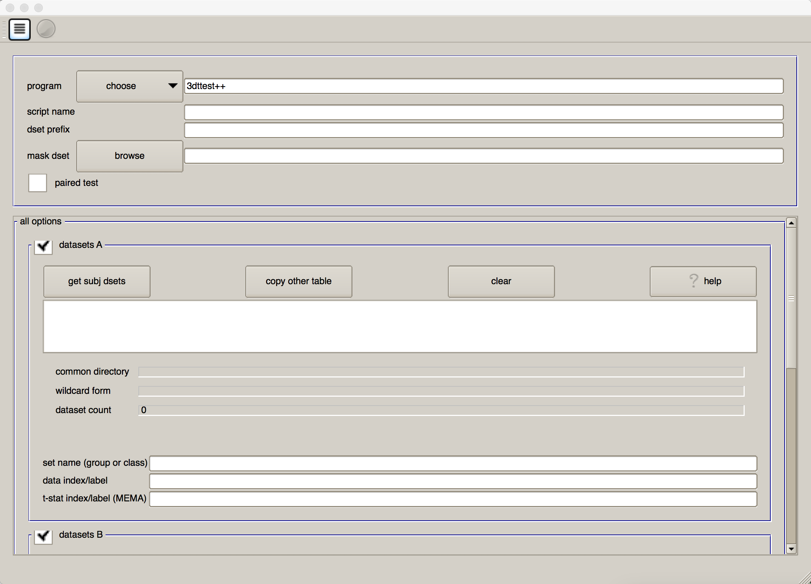
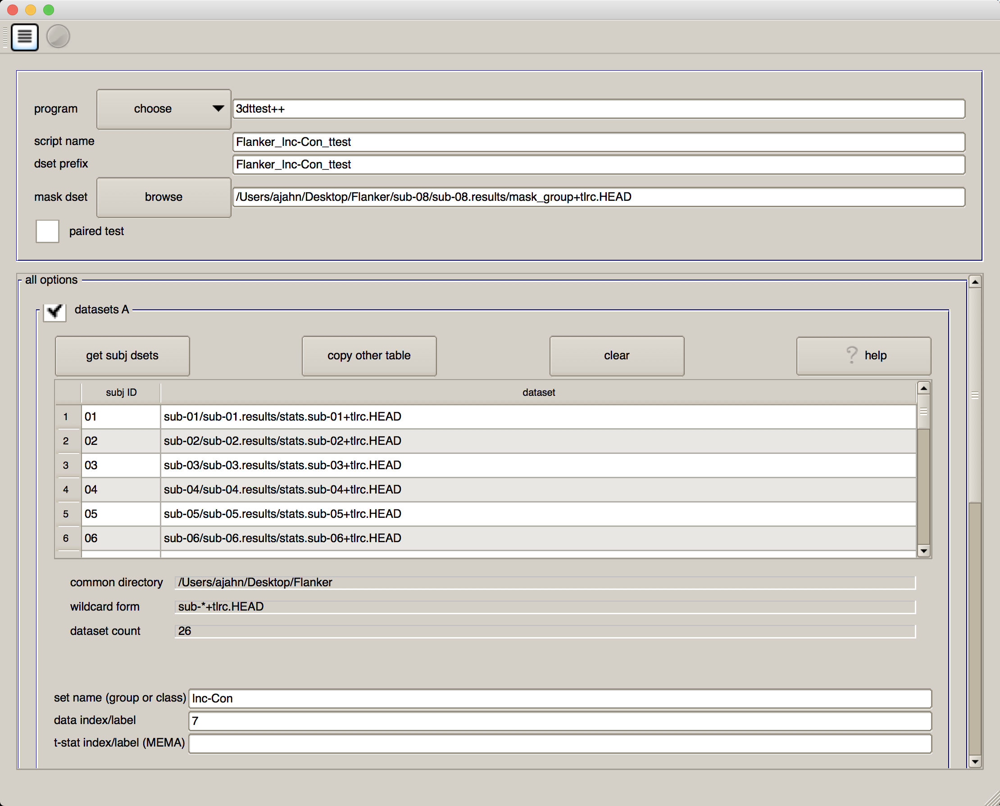
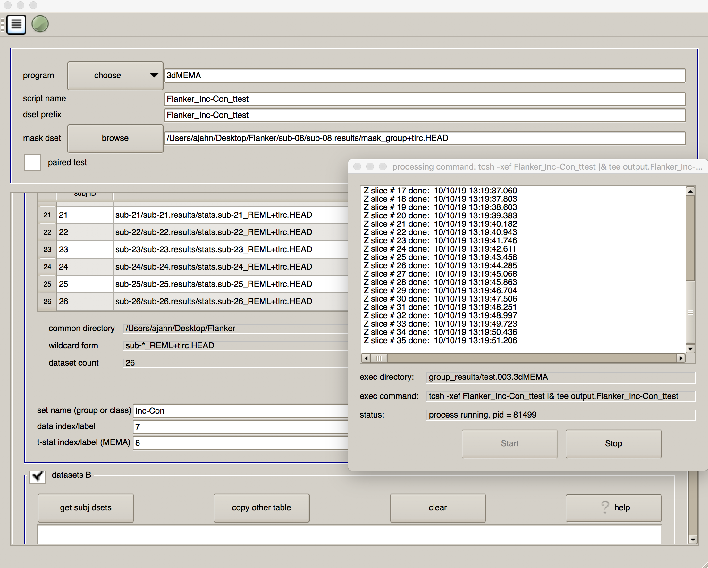

.. _AFNI_07_GroupAnalysis:

=====================
AFNI Tutorial #7: Group Analysis
=====================

--------

Overview
***************

Our goal in analyzing this dataset is to generalize the results to the population that the sample was drawn from. In other words, if we see changes in brain activity in our sample, can we say that these changes would likely be seen in the population as well?

To test this, we will run a **group-level analysis** (also known as a **second-level analysis**). In AFNI, this means that we calculate the standard error and the mean for a contrast estimate, and then test whether the average estimate is statistically significant. We will be doing this group-level analysis in two ways: Using 3dttest, which uses only the contrast estimates in testing for statistical significance; and using 3dMEMA, which accounts for both the difference between the parameter estimates, and the variability of that contrast.

Using uber_ttest.py
*******************

Just as we used a :ref:`graphical user interface to preprocess the data <01_AFNI_Commands_uber_subject>`, we can also use a GUI to set up our group-level analyses. If you type the command ``uber_ttest.py`` from the command line and press return, you will see this:

The first field, "program", allows you to choose between ``3dttest`` and ``3dMEMA``. As noted above, 3dMEMA allows you to account for the variability of the estimate as well, in order to give more weight to those subjects who have lower variability in their estimates. For now, leave it as "3dttest".

In both the "script name" and "dset prefix" fields, enter ``Flanker_Inc-Con_ttest``. For the "mask dset", you can choose any one of the subject's ``mask_group+tlrc`` images located in their results directories, as they should be similar. If you want to be more rigorous, you can calculate an intersection of the masks using AFNI's ``3dmask_tool`` command. The command would look something like this:

::

  3dmask_tool -input <path/to/masks/> -prefix mask_intersection+tlrc -union
  
We will now select each of the subject statistical datasets, using wildcards. If you click on the button "get subj dsets" in the "datasets A" section, you will be prompted to select a representative stats dataset. Select any of the subjects' statistical datasets, and replace the last two numbers of the subject ID with two question marks (i.e., ``??``). Then click on "apply pattern". If all of the subjects were analyzed the same way and have the same directory structure, you should see 26 entries in the field below. Review them to make sure they are all there, and then click "OK".

.. figure:: 07_Select_Datasets.gif

At the bottom of the "datasets A" section, you will see a few additional fields. In "set name (group of class), write ``Inc-Con``, and in "data index/label" type ``7``.

Why 7? If you open a Terminal and navigate to any of the subjects' results directories (for example, sub-08), type

::

  3dinfo -verb stats.sub-08+tlrc
  
This will show all of the sub-briks in that dataset, along with their labels. In our current example, we are looking for the contrast estimates for ``incongruent-congruent``. The output of ``3dinfo`` shows that this is located in sub-brik 7. Any sub-brik that contains the label "Coef" means that it is a parameter (or contrast) estimate; the label "Tstat" indicates that it is a t-statistic. (Likewise, "Fstat" means that it is an F-statistic.)

.. figure:: 07_3dinfo_output.png

.. note::

  What do you think the number to the right mean? For example, -19.2 to 11.3878? Why are they different between the "Coef" and the "Tstat" sub-briks? Does this difference make sense?
  
  
When you have finished, your GUI should look like the one below:

.. note::

  If you receive an error saying that one of the fields hasn't been filled in - but you can clearly see that it has been filled in - click on another field, and then try clicking the "Go" icon again.
  
  
Generating the Results
**********************

As with the uber_subject.py script, there are buttons at the top of the GUI for both generating the script and then running the script. First click on the icon that looks like a sheet of paper with lines on it, which will show you the command that has been generated. Review it to see how it has inserted all of your inputs into a command called 3dttest++, which will run the actual group-level analysis. Then click on the green "Go" icon to run the test. (It should take only a second.)

When it has finished, go back to your Terminal and type ``ls``. You will see a new directory called ``group_results``, and within that a folder called ``test.001.3dttest++``. Navigate into that folder, which contains the script that was used to generate the results ("Flanker_Inc-Con_ttest"), and another folder called ``test.results``, which contains the group-level output "Flanker_Inc-Con_ttest+tlrc". Load this in the afni viewer, and overlay it on top of the MNI152 template. Threshold the images to an uncorrected p-value of 0.001 (by right-clicking on the "p=" underneath the slider bar) and clusterize the data to only show clusters with an extent of 40 voxels or more; this will create an image like the one below. Does the location of the activation make sense, given the task and the paper this experiment was based on?

Modifying the 3dttest++ Script
^^^^^^^^^^^^^^^^^^^^^^^^^^^^^^

You can also modify the Flanker_Inc-Con_ttest script that contains the 3dttest++ command, which looks like this:

::

  #!/bin/tcsh -xef

  # created by uber_ttest.py: version 2.0 (December 28, 2017)
  # creation date: Wed Feb 19 11:33:21 2020

  # ---------------------- set process variables ----------------------

  set mask_dset = /Users/ajahn/Desktop/Flanker/sub-01/sub-01.results/mask_group+tlrc

  set dirA = /Users/ajahn/Desktop/Flanker

  # specify and possibly create results directory
  set results_dir = test.results
  if ( ! -d $results_dir ) mkdir $results_dir

  # ------------------------- process the data -------------------------

  3dttest++ -prefix $results_dir/Flanker-Inc-Con                     \
            -mask $mask_dset                                         \
            -setA Inc-Con                                            \
               01 "$dirA/sub-01/sub-01.results/stats.sub-01+tlrc[7]" \
               02 "$dirA/sub-02/sub-02.results/stats.sub-02+tlrc[7]" \
               03 "$dirA/sub-03/sub-03.results/stats.sub-03+tlrc[7]" \
               04 "$dirA/sub-04/sub-04.results/stats.sub-04+tlrc[7]" \
               05 "$dirA/sub-05/sub-05.results/stats.sub-05+tlrc[7]" \
               06 "$dirA/sub-06/sub-06.results/stats.sub-06+tlrc[7]" \
               07 "$dirA/sub-07/sub-07.results/stats.sub-07+tlrc[7]" \
               08 "$dirA/sub-08/sub-08.results/stats.sub-08+tlrc[7]" \
               09 "$dirA/sub-09/sub-09.results/stats.sub-09+tlrc[7]" \
               10 "$dirA/sub-10/sub-10.results/stats.sub-10+tlrc[7]" \
               11 "$dirA/sub-11/sub-11.results/stats.sub-11+tlrc[7]" \
               12 "$dirA/sub-12/sub-12.results/stats.sub-12+tlrc[7]" \
               13 "$dirA/sub-13/sub-13.results/stats.sub-13+tlrc[7]" \
               14 "$dirA/sub-14/sub-14.results/stats.sub-14+tlrc[7]" \
               15 "$dirA/sub-15/sub-15.results/stats.sub-15+tlrc[7]" \
               16 "$dirA/sub-16/sub-16.results/stats.sub-16+tlrc[7]" \
               17 "$dirA/sub-17/sub-17.results/stats.sub-17+tlrc[7]" \
               18 "$dirA/sub-18/sub-18.results/stats.sub-18+tlrc[7]" \
               19 "$dirA/sub-19/sub-19.results/stats.sub-19+tlrc[7]" \
               20 "$dirA/sub-20/sub-20.results/stats.sub-20+tlrc[7]" \
               21 "$dirA/sub-21/sub-21.results/stats.sub-21+tlrc[7]" \
               22 "$dirA/sub-22/sub-22.results/stats.sub-22+tlrc[7]" \
               23 "$dirA/sub-23/sub-23.results/stats.sub-23+tlrc[7]" \
               24 "$dirA/sub-24/sub-24.results/stats.sub-24+tlrc[7]" \
               25 "$dirA/sub-25/sub-25.results/stats.sub-25+tlrc[7]" \
               26 "$dirA/sub-26/sub-26.results/stats.sub-26+tlrc[7]"
             
Using this code as a template, you would change the directory for the output and the mask to a location on your machine. You would then replace each of the input files with the ones that you are interested in comparing, while keeping an index number next to each (e.g., 1 through 26 in this example).

If you want to compare two different groups, you would use the ``-setB`` option:

::

  #!/bin/tcsh -xef

  # created by uber_ttest.py: version 2.0 (December 28, 2017)
  # creation date: Wed Feb 19 13:23:11 2020

  # ---------------------- set process variables ----------------------

  set mask_dset = /Users/ajahn/Desktop/Flanker/sub-01/sub-01.results/mask_group+tlrc

  set dirA = /Users/ajahn/Desktop/Flanker

  # specify and possibly create results directory
  set results_dir = test.results
  if ( ! -d $results_dir ) mkdir $results_dir

  # ------------------------- process the data -------------------------

  3dttest++ -prefix $results_dir/Flanker-Inc-Con -AminusB            \
            -mask $mask_dset                                         \
            -setA Inc-Con_Group1                                     \
               01 "$dirA/sub-01/sub-01.results/stats.sub-01+tlrc[7]" \
               02 "$dirA/sub-02/sub-02.results/stats.sub-02+tlrc[7]" \
               03 "$dirA/sub-03/sub-03.results/stats.sub-03+tlrc[7]" \
               04 "$dirA/sub-04/sub-04.results/stats.sub-04+tlrc[7]" \
               05 "$dirA/sub-05/sub-05.results/stats.sub-05+tlrc[7]" \
               06 "$dirA/sub-06/sub-06.results/stats.sub-06+tlrc[7]" \
               07 "$dirA/sub-07/sub-07.results/stats.sub-07+tlrc[7]" \
               08 "$dirA/sub-08/sub-08.results/stats.sub-08+tlrc[7]" \
               09 "$dirA/sub-09/sub-09.results/stats.sub-09+tlrc[7]" \
               10 "$dirA/sub-10/sub-10.results/stats.sub-10+tlrc[7]" \
               11 "$dirA/sub-11/sub-11.results/stats.sub-11+tlrc[7]" \
               12 "$dirA/sub-12/sub-12.results/stats.sub-12+tlrc[7]" \
               13 "$dirA/sub-13/sub-13.results/stats.sub-13+tlrc[7]" \
            -setB Inc-Con_Group2                                     \
               14 "$dirA/sub-14/sub-14.results/stats.sub-14+tlrc[7]" \
               15 "$dirA/sub-15/sub-15.results/stats.sub-15+tlrc[7]" \
               16 "$dirA/sub-16/sub-16.results/stats.sub-16+tlrc[7]" \
               17 "$dirA/sub-17/sub-17.results/stats.sub-17+tlrc[7]" \
               18 "$dirA/sub-18/sub-18.results/stats.sub-18+tlrc[7]" \
               19 "$dirA/sub-19/sub-19.results/stats.sub-19+tlrc[7]" \
               20 "$dirA/sub-20/sub-20.results/stats.sub-20+tlrc[7]" \
               21 "$dirA/sub-21/sub-21.results/stats.sub-21+tlrc[7]" \
               22 "$dirA/sub-22/sub-22.results/stats.sub-22+tlrc[7]" \
               23 "$dirA/sub-23/sub-23.results/stats.sub-23+tlrc[7]" \
               24 "$dirA/sub-24/sub-24.results/stats.sub-24+tlrc[7]" \
               25 "$dirA/sub-25/sub-25.results/stats.sub-25+tlrc[7]" \
               26 "$dirA/sub-26/sub-26.results/stats.sub-26+tlrc[7]"

Non-Parametric Tests with 3dClustSim
************************************

.. note::

  For details on cluster thresholding and the terms that are used in this section, see :ref:`Appendix A <Appendix_A_ClusterCorrection>` of the fMRI Course, focusing on the section "AFNI's 3dFWHMx and 3dClustSim".

Newer versions of AFNI (from about 2019 onwards) have a new option, ``-3dClustSim``. This carries out a **non-parametric** test which doesn't make any assumptions about the shape of the null distribution; instead, a null distribution is created from the data itself, and statistical significance is determined by comparing the data to its own null distribution.

This would be done by inserting the string ``-3dClustSim`` after the 3dttest++ command; e.g.:

::

    3dttest++ -3dClustSim -prefix $results_dir/Flanker-Inc-Con                     \
            -mask $mask_dset                                         \
            -setA Inc-Con                                            
            

And keeping the rest of the input files the same.

The output of this command will be a z-statistic image which you can threshold as you would any other statistical image. The command will also output .1D files that contain lists of how large a cluster has to be in order to be determined significant. For example, the file ``TTnew.CSimA.NN3_bisided.1D`` will contain rows of each cluster-forming threshold and columns for each corresponding alpha threshold. For example, you may see output like this:

::

  # CLUSTER SIZE THRESHOLD(pthr,alpha) in Voxels
  # -NN 3  | alpha = Prob(Cluster >= given size)
  #  pthr  | .10000 .09000 .08000 .07000 .06000 .05000 .04000 .03000 .02000 .01000
  # ------ | ------ ------ ------ ------ ------ ------ ------ ------ ------ ------
   0.100000    7659   8174   8664   9262   9840  10571  11286  12271  13609  15859
   0.090000    6325   6804   7356   8015   8596   9246  10045  10982  12266  14584
   0.080000    4753   5301   5845   6425   7182   7830   8580   9649  10974  13194
   0.070000    3283   3696   4184   4778   5439   6243   7172   8153   9453  11699
   0.060000    2000   2291   2666   3136   3676   4409   5324   6295   7808  10056
   0.050000    1160   1336   1542   1797   2187   2629   3289   4323   5621   8082
   0.040000     659    740    843   1005   1194   1469   1801   2281   3385   5796
   0.030000     351    383    427    496    578    696    887   1148   1533   2837
   0.020000     170    188    207    230    262    305    373    476    664   1097
   0.015000     116    125    137    151    167    189    227    290    400    616
   0.010000      72     77     82     90     99    113    129    158    195    283
   0.007000      50     53     57     61     67     74     84    100    123    177
   0.005000      36     38     41     44     48     53     60     69     83    117
   0.003000      24     26     27     29     31     34     37     44     53     69
   0.002000      18     19     20     22     23     25     28     31     37     48
   0.001500      15     16     17     18     19     20     22     25     30     39
   0.001000      12     13     13     14     15     16     17     19     22     29

Going down the list to the row next to a cluster-forming threshold of p=0.001, we see that we would need a cluster size of 16 or greater in order to determine that the cluster is significant at the p=0.05 threshold.

Using 3dMEMA
*************

Close the AFNI viewer, and then use the Terminal to navigate back to the directory containing your subjects. Go back to the uber_ttest.py GUI (or open a new one), and make the following changes:

1. Change the "program" from 3dttest++ to 3dMEMA.
2. Change the "script name" and "dset prefix" to ``Flanker_Inc-Con_MEMA``.
3. Click on "get subj dsets", and select a subject's statistical dataset that has the "REML" string (e.g., ``stats.sub-08_REML+tlrc``). Use the wildcards as above to select all of the subjects' REML datasets.
4. In the field "t-stat index/label (MEMA)", type ``8``. The sub-briks of the REML dataset, which should be in an order identical to the non-REML statistical dataset, indicate that sub-brik #8 is the t-statistic associated with the contrast estimate of "incongruent-congruent."

As before, click on the script generator icon, and then click on the green "Go" button. This model estimation will take longer, and you will see a progress report for each slice that has been analyzed; in total, it should take only a couple of minutes.

When it has finished, you will see a new directory in the group_results folder called ``test.002.3dMEMA``, with a sub-directory called ``test.results``. Navigate to that folder, and overlay the results as before. Are the effects in the same location? Do these effects look stronger or weaker? Why?

Video
*****

Click `here <https://www.youtube.com/watch?v=JdgjeUTG-fc>`__ for a walkthrough of how to do group-level analysis in AFNI.
