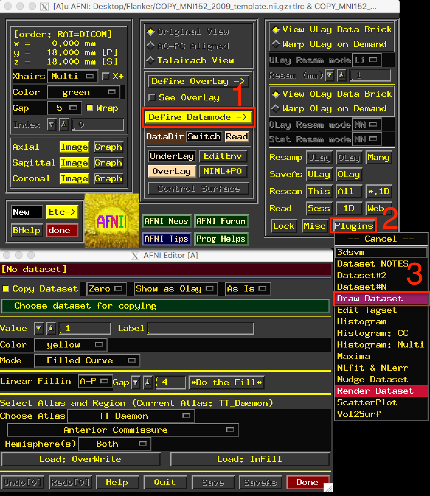
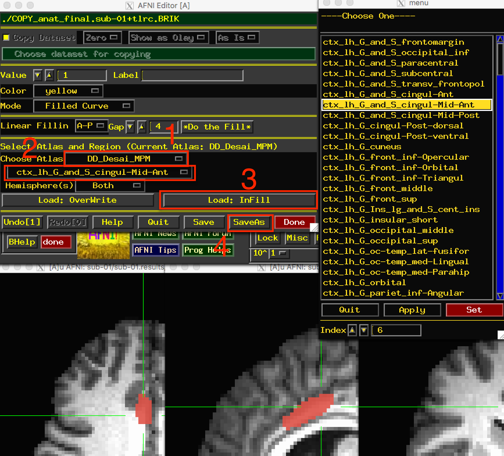
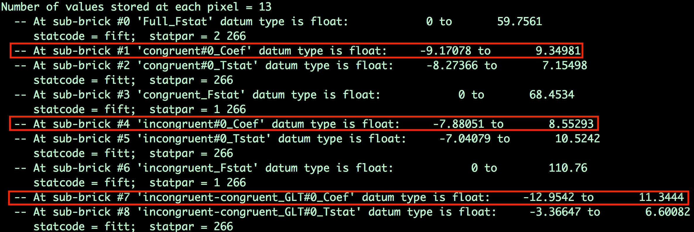

.. _AFNI_08_ROIAnalysis:

==============================
fMRI Tutorial #8: ROI Analysis
==============================

---------

Overview
********

You've just completed a group-level analysis, and identified which regions of the brain show a significant difference between the Incongruent and Congruent conditions of the experiment. For some researchers, this may be all that they want to do.

This kind of analysis is called a **whole-brain** or **exploratory** analysis. These types of analyses are useful when the experimenter doesn't have a hypothesis about where the difference may be located; the result will be used as the basis for future research.

When a large number of studies have been run about a specific topic, however, we can begin to make more specific hypotheses about where we should find our results in the brain images. For example, cognitive control has been studied for many years, and many fMRI studies have been published about it using different paradigms that compare more cognitively demanding tasks to less cognitively demanding tasks. Often, significant increases in the BOLD signal during cognitively demanding conditions are seen in a region of the brain known as the **dorsal medial prefrontal cortex**, or dmPFC for short. For the Flanker study, then, we could restrict our analysis to this region and only extract data from voxels within that region. This is known as a **region of interest (ROI)** analysis. A general name for an analysis in which you choose to analyze a region selected before you look at whole-brain results is called a **confirmatory analysis**.

Whole-brain maps can hide important details about the effects that we’re studying. We may find a significant effect of incongruent-congruent, but the reason the effect is significant could be because incongruent is greater than congruent, or because congruent is much more negative than congruent, or some combination of the two. The only way to determine what is driving the effect is with ROI analysis, and this is especially important when dealing with interactions and more sophisticated designs.

Using Atlases
*******

One way to create a region for our ROI analysis is to use an **atlas**, or a map that partitions the brain into anatomically distinct regions.

AFNI comes with several atlases in both Talairach and MNI space, which can be accessed through the AFNI GUI. Finding the atlases can be difficult - you must first click on ``Define Datamode``, and then click on ``Plugins``, and from the dropdown menu select ``Draw Dataset``. The figure below shows the Draw Dataset window.

  After opening up the AFNI GUI, click on the buttons in the order shown in the figure (1, 2, and 3).
  
Once you have opened the Draw Dataset window, you will first need to click on the button ``Choose dataset for copying``. Since all of our data has been normalized to the MNI_avg152T1 template, we have two options:

1. Select the MNI_avg152T1+tlrc template from the ``abin`` directory; or
2. Select one of the normalized anatomical images from the Flanker dataset.

In both cases, the images will be in MNI space and will have the same dimensions and voxel resolution. The purpose of making a copy of that dataset is to create a "clean" dataset with the same dimensions as the other images, but which we can write on by marking whichever voxels we want to belong to our ROI. In this case, navigate to the ``sub-01/sub-01.results`` directory, open the AFNI GUI, and open the Draw Dataset window. For the image to copy, select the file ``anat_file.sub-01``.

Once you have done that, you have several different atlases to select from. For the current tutorial, select the atlas ``DD_Desai_MPM``, and then click on the dropdown menu below it. You have many different regions to choose from, and the voxels represented by each label can be guessed at by the name; for example, ``ctx_lh_G_and_S_frontomargin`` probably refers to the cortical voxels of the gyrus and sulcus of the frontomarginal region of the left hemisphere.

Select ``ctx_lh_G_and_S_cingul_-Mid_Ant``, and then click on the button ``Load: InFill``. This will highlight in red all of the voxels belonging to that region of the atlas. You can undo this by clicking on the ``Undo`` button, which keeps several steps in memory. Now right-click the area to the left of the label dropdown menu to open a more compact view of the atlas regions, and select ``ctx_rh_G_and_S_cingul-Mid-Ant``. Click on ``Load: InFill`` to add that region to the current mask, and then click ``SaveAs``. Call the output ``midACC``. This will create a new file that contains values of "1" in the voxels that belong to the region, and zeros everywhere else; this is also known as a **mask**. When you are finished, click ``Done``.

  You can choose an atlas from the dropdown menu (1), and then choose a corresponding label from the atlas (2). Clicking on Load: InFill (3) will highlight those voxels within that label, and you can save the mask by clicking on SaveAs (4).

.. warning::

  The default in AFNI is for the results dataset to have a different resolution than both the normalized anatomical image and the template used for normalization. The AFNI template we used was the MNI_avg152T1+tlrc file, which has a resolution of 2x2x2mm; our statistics dataset, on the other hand, has a resolution of 3x3x3mm. In order to use a mask for an ROI analysis, it needs to be the same resolution as the dataset you are extracting from.

We can match the resolutions of our mask dataset and our statistics dataset by using AFNI's ``3dresample`` command. This command requires both a "master" dataset, which we will be resampling to, and an "input" dataset, which will have its dimensions and resolution changed to match the master datset:

::

	3dresample -master stats.sub-01+tlrc -input midACC+tlrc -prefix midACC_rs+tlrc
	
This will create a new file, midACC_rs (in which **rs** stands for re-sampled). Move this mask to the subject directory by typing ``mv midACC_rs+tlrc ../..``. We can then use it to extract data for our ROI analysis.
  
  

Extracting Data from the Anatomical Mask
************

Once you've created the mask, you can then extract each subject's contrast estimates from it. There are two ways that we could extract our contrast of interest Incongruent-Congurent:

1. Extract the contrast estimate Incongruent-Congruent from our stats file; or
2. Extract the individual beta weights for Incongruent and Congruent separately, and then take the difference between the two.

As we will see, option #2 allows you to determine what is driving the effect; in other words, whether a significant effect is due to both beta weights being positive but the Incongruent beta weights being more positive, both weights being negative but the Congruent betas more negative, or a combination of the two. It is only by extracting both sets of beta weights that we can determine this.

First, from the subjects directory type:

::

  3dinfo -verb sub-01/sub-01.results/stats.sub-01+tlrc.
  

This will return a list of all the beta weights and contrast weights contained in the stats file. 

The sub-briks index which beta weight belongs to which volume in the dataset. In this example, the beta weight for the Congruent condition is sub-brik 1, the beta weight for the Incongruent condition is sub-brik 4, and the contrast weight for Incongruent-Congruent is sub-brik 7. For this tutorial, we will extract sub-briks 1 and 4 and store them in separate files, and then extract the values for each subject from an ROI.

The individual sub-briks can be extracted using the following code, `extractBetas.sh <https://github.com/andrewjahn/AFNI_Scripts/blob/master/extractBetas.sh>`__:

::

#!/bin/bash

for subj in `cat subjList.txt`; do

	3dbucket -aglueto Congruent_betas+tlrc.HEAD ${subj}/${subj}.results/stats.${subj}+tlrc'[1]'
	3dbucket -aglueto Incongruent_betas+tlrc.HEAD ${subj}/${subj}.results/stats.${subj}+tlrc'[4]'
  
done

When it finishes, you will have generated two new datasets: Congruent_betas and Incongruent_betas. Open up one of the datasets in your viewer, and click on the ``Graph`` button of the AFNI GUI to scroll through the different volumes. How is this "time-series" different from the time-series you viewed in the raw imaging data? As another exercise, from the command line type ``3dinfo -nt Congruent_betas+tlrc``, in which the "-nt" option returns the number of volumes (or time-points) in the dataset. What number is returned, and what does it represent? Does it make sense?

You can now extract data from the anatomical mask by using the ``3dmaskave`` command:

::

	3dmaskave -quiet -mask midACC_rs+tlrc Congruent_betas+tlrc
	
Run the same command for the incongruent betas as well:

::

	3dmaskave -quiet -mask midACC_rs+tlrc Incongruent_betas+tlrc

.. note::

  Each number output from this command corresponds to the contrast estimate that went into the analysis. For example, the first number corresponds to the average contrast estimate for Incongruent-Congruent for sub-01, the second number is the average contrast estimate for sub-02, and so on. These numbers can be copied and pasted into a statistical software package of your choice (such as R), and then you can run a t-test on them.
  	
  
Extracting Data from an Sphere
************

You may have noticed that the results from the ROI analysis using the anatomical mask were not significant. This may be because the ACC mask covers a very large region; although the ACC is labeled as a single anatomical region, we may be extracting data from several distinct functional regions. Consequently, this may not be the best ROI approach to take.

Another technique is called the **spherical ROI** approach. In this case, a sphere of a given diameter is centered at a triplet of specified x-, y-, and z-coordinates. These coordinates are often based on the peak activation of another study that uses the same or a similar experimental design to what you are using. This is considered an **independent** analysis, since the ROI is defined based on a separate study.

The following animation shows the difference between anatomical and spherical ROIs:

.. figure:: 08_ROI_Analysis_Anatomical_Spherical.gif

To create this ROI, we will need to find peak coordinates from another study; let's randomly pick a paper, such as Jahn et al., 2016. In the Results section, we find that there is a Conflict effect for a Stroop task - a distinct but related experimental design also intended to tap into cognitive control - with a peak t-statistic at MNI coordinates 0, 20, 40.

.. figure:: 08_ROI_Analysis_Jahn_Study.png

We will create a **spherical mask** centered at these coordinates by using the command ``3dUndump``. The following code will place a 5mm sphere around the coordinates 0, 20, 44: 

::

	#!/bin/bash

	# This script creates a 5mm sphere around a coordinate
	# Change the x,y,z, coordinates on the left side to select a different peak
	# Radius size can be changed with the -srad option

	echo "0 20 44" | 3dUndump -orient LPI -srad 5 -master Incongruent_betas+tlrc -prefix ConflictROI+tlrc -xyz -

The ``-srad`` option specifies how large the radius of the sphere will be, while the ``-master`` option creates a mask dataset with the same resolution and voxel size as the master dataset. (Note that this means we won't have to resample the ROI created with this command.) The ``-prefix`` option labels the output file, and ``-xyz`` specifies the coordinates around which to center the sphere. the ``-`` after the -xyz option indicates that the output on the left side of the pipe - i.e., ``echo "0 20 44" - should be used as the input for that option.
	
.. note::
	
	The coordinates reported in most papers are in ``LPI`` orientation - that is, the coordinates increase in magnitude from negative to positive going from Left to Right, Posterior to Anterior, and Inferior to Superior. The letters in LPI correspond to the first letter in each of these pairings. The default orientation for AFNI datasets, on the other hand, is ``RAI`` - negative to positive going from Right to Left, Anterior to Posterior, and Inferior to Superior. For example, the coordinates 10, -14, 38 in LPI orientation would be -10, 14, 38 in RAI orientation. We use the -orient LPI option to convert the AFNI RAI coordinates to LPI coordinates.
	
The result of this command will be a file called ``ConflictROI``, which you can then use for an ROI analysis. We will use the same 3dmaskave command as above:

::

	3dmaskave -quiet -mask ConflictROI+tlrc Congruent_betas+tlrc

The output will be 26 rows, one number per row, representing the average beta estimate across the voxels of the mask that we extracted from. Use the same command to extract the beta estimates for the Incongruent_betas file, and then copy and paste both sets of numbers into a statistical software package.
  

The numbers you get from this analysis should look much different from the ones you created using the anatomical mask. Copy and paste these commands into the statistical software package of your choice, and run a one-sample t-test on them. Are they significant? How would you describe them if you had to write up these results in a manuscript?

-------

Exercises
********

1. Create an anatomical mask of a region of your choosing. For the copy dataset, select the "stats" dataset. Will you have to resample this mask in order to use it for an ROI analysis? Why or why not?
  

2. Use the code given in the section on spherical ROI analysis to create a sphere with a 7mm radius located at MNI coordinates 36, -2, 48.

--------

Video
*********

