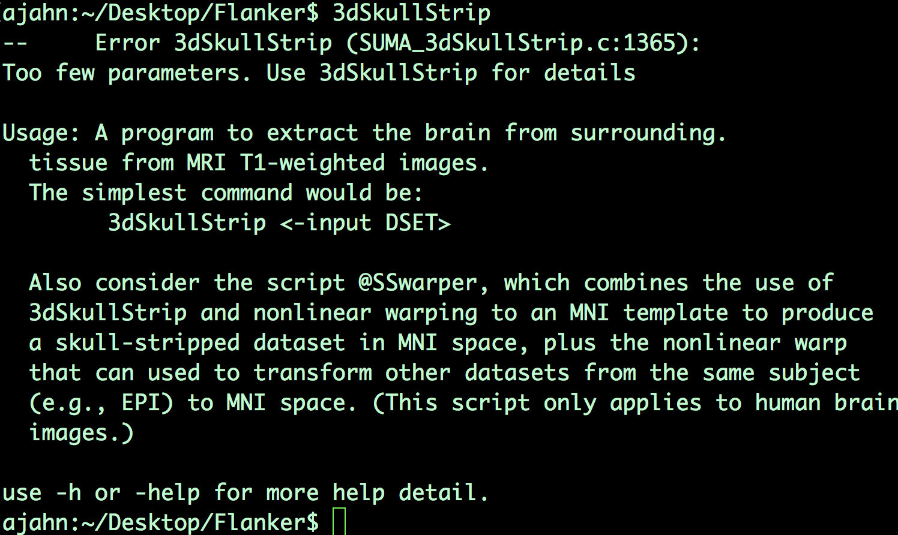
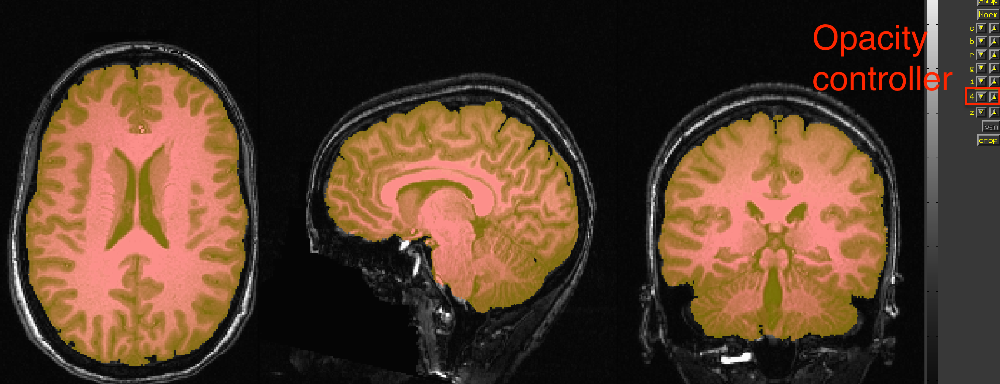
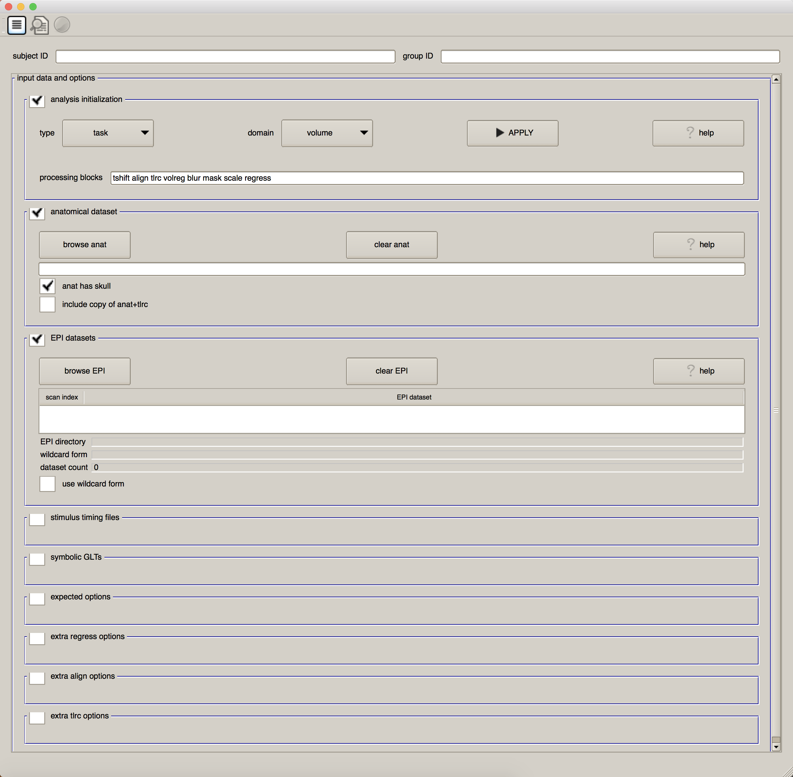

.. _01_AFNI_Commands_uber_subject:

=============
Chapter 1: AFNI Commands and uber_subject.py
=============

---------------

Overview
********

Among all of the fMRI analysis packages, AFNI has the reputation of being the most difficult to learn. Although this may have been true in the past, the AFNI developers have worked hard over the last few years to make their software easier to learn and easier to use: in addition to the viewer, recent versions of AFNI contain other graphical user interfaces that can be accessed through the commands ``uber_subject.py`` and ``uber_ttest.py``. These GUIs are used to create scripts which automate both the preprocessing and model setup for each subject.

Before we discuss those commands, however, we will review the basics of a typical AFNI command. The "uber" scripts, after all, simply compile large numbers of commands together in an order that processes the data. You will also be using individual AFNI commands to perform more advanced analyses, such as region of interest analysis.

AFNI Commands
*************

AFNI commands are similar to :ref:`Unix commands <Unix_Intro>`: They typically require at least one **argument**, or input, and they also usually require you to specify what to call the output of the command.

Let's take skull-stripping, for example - a common preprocessing step that removes the skull from the brain. The AFNI command to do this step is called ``3dSkullStrip``. Navigate to the directory ``sub-08/anat``, and then type "3dSkullStrip" and press enter. You will see the following message:

Usually, just typing the command without any arguments would print the help file by default. We are required here to specify an additional flag, ``-h``, to print the help; type ``3dSkullStrip -h`` and press return. You will notice that a lot of text is printed to the screen - more than can be displayed in the Terminal all at once. You will need to scroll up to see the entire help file, which you might be fine with. 

If, on the other hand, you would like to see the help file in a format that is easier to read, type ``3dSkullStrip -h | less``. The vertical bar indicates that the output from the command to the left of the bar - that is, "3dSkullStrip -h" - should be piped into the ``less`` command, which allows you to page up and down through the help file. When you are in this "paging window", type "d" to go down one page; "u" to go up one page; and the up and down arrows to go up or down by one line. To search the help file, type a forward slash (``/``) followed by the text you want to find, and press enter. To exit the paging window, press "q".

.. figure:: 04_01_AFNI_HelpFile.gif

The documentation and help files are some of AFNI's greatest strengths. The usage of each command is clearly outlined, and the reasons for using different options are explained in detail. Sample commands are given to cover different scenarios - for example, if the skull-strip leaves too much skull in the output image, you are encouraged to use an option such as "-push_to_edge".

The most basic usage of 3dSkullStrip is to use an "-input" flag to specify the anatomical dataset that will be stripped. For example,

::

  3dSkullStrip -input sub-08_T1w.nii.gz
  
After about a minute, a new file called ``skull_strip_out+orig`` will be generated. This is the skull-stripped anatomical image, which you can view by opening up the AFNI viewer. Look in all three viewing panes to see how well the skull-stripping worked; you will probably notice a few voxels of cortex being removed in the frontal lobes and some bits of dura mater left around the top and the back of the skull, but overall the skull-stripping did very well.

.. figure:: 04_01_Skullstrip.png

Another way to view the quality of the strip is to load the original anatomical image ``sub-08_T1w.nii.gz`` as an Underlay, and the skull-stripped image ``skull_strip_out`` as an Overlay. You can alternately view and hide the overlay by clicking anywhere in the viewing windows and then pressing the "o" key; another option is to press the "u" key to toggle between each image as an underlay. These viewing options will be helpful in any scenario in which you have to examine the data before and after a preprocessing step.

  Example of viewing the skull-stripped image overlaid on the original anatomical image. The opacity of the image can be toggled by the controller panel on the right.
  
Although the skull-stripping worked reasonably well, and is probably fine for most purposes, let's see if we can improve it by using any of the options specified in the help file. If you read it closely, you will notice an option, ``-push_to_edge``, which helps avoid removing any parts of the cortex. In general, it is better to err on the side of including small bits of dura mater and other non-brain matter, as opposed to removing any parts of the cortex. It is also useful to add a ``-prefix`` option to label the output as something intelligible. Type the following command:

::

  3dSkullStrip -push_to_edge -input sub-08_T1w.nii.gz -prefix anat_ss
  
In which ``ss`` stands for "skull-stripped".

After a couple of minutes, a new file called ``anat_ss+orig`` will be generated. Look at the images before and after in the AFNI viewer, and compare it to the skull-stripped image you generated previously. Do you see anything that looks better? Worse? Which skull-stripped image would you choose, and why?

Introducing uber_subject.py
***************************

In the following chapters, we will describe the rest of the preprocessing steps of a typical fMRI analysis pipeline; first, however, we should become familiar with a command that will create a script to run all of these preprocessing steps for you: AFNI's ``uber_subject.py``.

Technically, uber_subject.py is a graphical user interface that serves as a **wrapper** - that is, it takes all of the GUI input specified by the user and directs it into another wrapper called ``afni_proc.py``. This latter command then generates a large script that contains each of the individual AFNI commands needed to run each step of the preprocessing.

From the command line, type ``uber_subjec.py`` and press return. You should see something like this:

We will examine each part of this GUI in detail as we work through the following chapters. For now, pay attention to the first check box, "Analysis Initialization". By default, the data analysis type will be "task" (as opposed to "rest", when there is no task for the subject to do), and the domain is "volume" (as opposed to "surface", which we will discuss in a later chapter on a related program called SUMA). The words in the field after "processing blocks" - tshift, align, tlrc, volreg, blur, mask, scale, and regress - may seem unintelligible to you. (If this is your first time using AFNI, I would expect that they would look strange.) Our task is to learn about what each of these words mean, what preprocessing step they correspond to, and why we do them. 

As you become more proficient, you will be better able to change the details about the analysis to suit your needs; but for now, we turn to an example of how to create a preprocessing script with uber_subject.py.

.. note

  The following chapters will contain snippets of code demonstrating how each of the processing steps are run using AFNI commands. These snippets are, for the most part, taken from a preprocessing script that is created in a :ref:`later chapter <07_AFNI_Checking_Preprocessing>`, and it is referred to as the **proc script**. If you like, review that chapter first, and then read the intervening chapters while the data is being processed; or, proceed with the following chapters, with the previous remarks in mind.
  
  
Video
*****

For an overview of AFNI commands using 3dSkullStrip as an example, click `here <https://www.youtube.com/watch?v=78lGrdmC9fg>`__.
