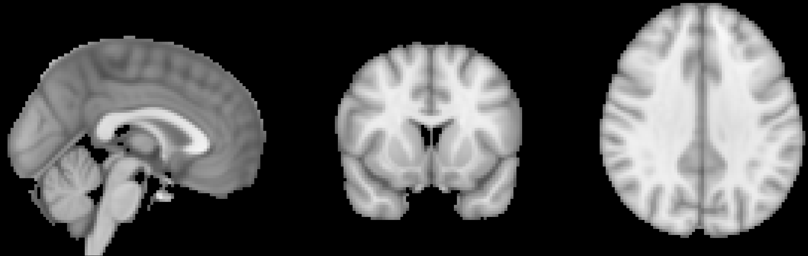

.. _03_AFNI_Registration_Normalization:

=====================
Chapter 3: Registration and Normalization
=====================

--------

Overview
***************

Although most people's brains are similar - everyone has a cingulate gyrus and a corpus callosum, for instance - there are also differences in brain size and shape. As a consequence, if we want to do a group analysis we need to ensure that each voxel for each subject corresponds to the same part of the brain. If we are measuring a voxel in the visual cortex, for example, we would want to make sure that every subject's visual cortex is in alignment with each other.

This is done by **Registering** and **Normalizing** the images. Just as you would fold clothes to fit them inside of a suitcase, each brain needs to be transformed to have the same size, shape, and dimensions. We do this by normalizing (or **warping**) to a **template**. A template is a brain that has standard dimensions and coordinates - standard, because most researchers have agreed to use them when reporting their results. That way, if you normalize your data to that template and find an effect at coordinates X=3, Y=20, Z=42, someone else who has warped their data to the same template can check their results against yours. The dimensions and coordinates of the template brain are also referred to as **standardized space**.

  An example of a commonly used template, the :ref:`MNI152 brain <MNI>`. This is an average of 152 healthy adult brains, which represent the population that most studies draw from. If you are studying another population - such as children or the elderly, for example - consider using a template created from representatives of that population. (Question: Why is the template blurry?)
  
  
Affine Transformations
****************

To warp the images to a template, we will use an **affine transformation**. This is similar to the rigid-body transformation described above in Motion Correction, but it adds two more transformations: **zooms** and **shears**. Whereas translations and rotations are easy enough to do with an everyday object such as a pen, zooms and shears are more unusual - zooms either shrink or enlarge the image, while shears take the diagonally opposite corners of the image and stretch them away from each other. The animation below summarizes these four types of **linear transformations**.

.. figure:: 04_03_AffineTransformations.gif

.. note:: As with rigid-body transformations, zooms and shears each have three degrees of freedom: You can zoom or shear an image along the x-, y-, or z-axis. In total, then, affine transformations have twelve degrees of freedom. These are also called linear transformations because a transformation applied in one direction along an axis is accompanied by a transformation of equal magnitude in the opposite direction. A translation of one millimeter *to* the left, for example, implies that the image has been moved one millimeter *from* the right. Likewise, if an image is enlarged by one millimeter along the z-axis, it is enlarged by one millimeter in both directions along that axis. Transformations without these constraints are called **nonlinear transformations**. For example, a nonlinear transformation can enlarge the image in one direction while shrinking it in the other direction, as when squeezing a sponge. These types of transformations will be discussed later.

Registration and Normalization
***************

Recall that we have both anatomical and functional images in our dataset. Our goal is to warp the functional images to the template so that we can do a group-level analysis across all of our subjects. Although it may seem reasonable to simply warp the functional images directly to the template, in practice that doesn't work very well - the images are low-resolution, and therefore less likely to match up with the anatomical details of the template. The anatomical image is a better candidate.

Although this may not seem to help us towards our goal, in fact warping the anatomical image can assist with bringing the functional images into standardized space. Remember that the anatomical and functional scans are typically acquired in the same session, and that the subject's head moves little, if at all, between the scans. If we have already normalized our anatomical image to a template and recorded what transformations were done, we can apply the same transformations to the functional images - provided they start in the same place as the anatomical image.

This alignment between the functional and anatomical images is called **Registration**. Most registration algorithms use the following steps:

1. Assume that the functional and anatomical images are in roughly the same location. If they are not, align the outlines of the images.

2. Take advantage of the fact that the anatomical and functional images have different contrast weightings - that is, areas where the image is dark on the anatomical image (such as cerebrospinal fluid) will appear bright on the functional image, and vice versa. This is called **mutual information**. The registration algorithm moves the images around to test different overlays of the anatomical and functional images, matching the bright voxels on one image with the dark voxels of another image, and the dark with the bright, until it finds a match that cannot be improved upon. (AFNI's preferred approach is a method called **LPC**, or Local Pearson Correlation, which gives greater weight to those regions of the functional image that are brighter: see `this paper <https://www.sciencedirect.com/science/article/pii/S1053811908010409>`__ for more details.)

3. Once the best match has been found, then the same transformations that were used to warp the anatomical image to the template are applied to the functional images.

.. figure:: 04_03_Registration_Normalization_Demo.gif

-----

Registration with AFNI's align_epi_anat.py
******************************************

The command ``align_epi_anat.py`` can do several preprocessing steps at once - registration, aligning the volumes of the functional images together, and slice-timing correction. In this example, however, we will just use it for registration. The code for this step will be found in lines 110-115 of your proc script:

::

  align_epi_anat.py -anat2epi -anat sub-08_T1w+orig \
       -save_skullstrip -suffix _al_junk          \   
       -epi vr_base_min_outlier+orig -epi_base 0  \
       -epi_strip 3dAutomask                      \   
       -giant_move                                \   
       -volreg off -tshift off 
       
The first option, ``-anat2epi``, indicates that the anatomical image will be aligned to the functional images - not vice versa. As a general rule, we want to introduce as few changes and interpolations to our functional data as possible. Therefore, if an image has to be moved and slightly deformed, we choose to do it to the anatomical image.

The ``-suffix`` command appends the string "_al_junk" to some of the intermediate stages of the registration, which we will use later for normalizing the functional images. The "epi" options (i.e., ``-epi``, ``-epi_base``, and ``-epi_strip``) signalize that the functional volume with the least variability will be used as a reference image, and that non-brain tissue should be stripped using 3dAutomask, an alternative to 3dSkullStrip. ``-giant_move`` attempts to find a good initial starting alignment between the anatomical and functional images; and the last two options indicate that we do not want to include alignment and slice-timing correction in the current command.

Normalization with AFNI's @auto_tlrc
************************************

Once we have aligned the anatomical and functional images, we will first normalize the anatomical image to a template. These warps, as you will see in the next chapter, will be applied to the functional images as well. To normalize the anatomical image, we will use the ``@auto_tlrc`` command; this and a following command, ``cat_matvec``, are found in lines 118-122 of your proc script:

::

  # warp anatomy to standard space
  @auto_tlrc -base MNI_avg152T1+tlrc -input sub-08_T1w_ns+orig -no_ss

  # store forward transformation matrix in a text file
  cat_matvec sub-08_T1w_ns+tlrc::WARP_DATA -I > warp.anat.Xat.1D

The first command indicates to use the image MNI_avg152T1 as a template, and the skull-stripped anatomical image as a **source image**, or the image to be moved around to best match the base, or reference, image. The ``-no_ss`` option indicates that the anatomical image has already been skull-stripped.

In order to align the template and the anatomical image, the anatomical image needs to be moved and transformed using the transformations described above. This creates a series of numbers organized in an **affine transformation matrix** which is stored in the header of the anatomical image. The second command, ``cat_matvec``, extracts this matrix and copies it into a file called ``warp.anat.Xat.1D``. How this matrix is used to bring the functional images to the same normalized space will be seen in the next chapter.
