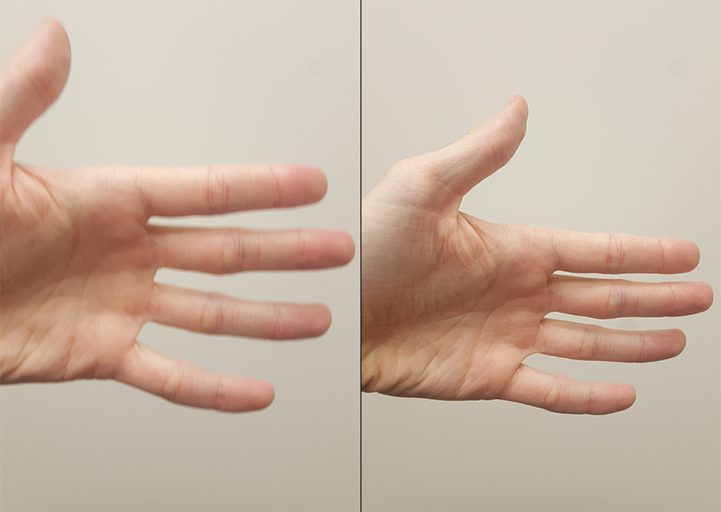

.. _04_AFNI_Alignment:

===============
Chapter 4: Alignment and Motion Correction
===============

-----------

Overview
********

If you've ever tried to take a photo of a moving object, usually the image is blurry. If, on the other hand, the object remains still when the photo is taken, you will get a much clearer and sharply defined image.

  A moving target leads to a blurry image (Left), whereas a stationary target leads to a more clearly defined image (Right). 
  
The concept is the same when we take three-dimensional pictures of the brain. If the subject is moving, the images will look blurry; if the subject is still, the images will look less blurry and more defined. But that's not all: If the subject moves a lot, we also risk measuring signal from a voxel that moves. We are then in danger of measuring signal from the voxel for part of the experiment and, after the subject moves, from a different region or tissue type.

.. Could include an animation here illustrating the above paragraph

These motions can also introduce confounds into the imaging data because motion generates signal. If the subject moves every time in response to a stimulus - for example, if he jerks his head every time he feels an electrical shock - then it can become impossible to determine whether the signal we are measuring is in response to the stimulus, or because of the movement.

Rigid-Body Transformations
**************************

One way to "undo" these motions is through **rigid-body transformations**. To illustrate this, pick up a nearby object: a phone or a coffee cup, for example. Place it in front of you and mentally mark where it is. This is the **reference point**. Then move the object an inch to the left. This is called a **translation**, which means any movement to the left or right, forward or back, up or down. If you want the object to come back to where it started, you would simply move it an inch to the right. 

Similarly, if you rotated the object to the left or right, you could undo that by rotating it an equal amount in the opposite direction. These are called **rotations**, and like translations, they have three **degrees of freedom**, or ways that they can move: around the x-axis (also called **pitch**, or tilting forwards and backwards), around the y-axis (also known as **roll**, or tilting to the left and right), and around the z-axis (or **yaw**, as when shaking your head "no").

.. note::

  Experiment with these translations and rotations by moving your own head. First, move your head from side to side while looking straight ahead (translation along the x-axis). Then, move your head forward and back (y-axis) and up and down (z-axis). Try the rotations as well.

We do the same procedure with our volumes. Instead of the reference point we used in the example above, let's call the first volume in our time-series the **reference volume**. If at some point during the scan our subject moves his head an inch to the right, we can detect that movement and undo it by moving that volume an inch to the left. The goal is to detect movements in any of the volumes and **realign** those volumes to the reference volume.

.. figure:: 04_04_MotionCorrectionExample.gif

  The reference volume can be any volume of the time-series (although it is typically the first, middle, or last volume). If during the scan the subject moves to the right, that motion can be "undone" with respect to the reference volume by an equal and opposite movement to the left.

AFNI's 3dvolreg
***************

Motion correction in AFNI is done using the command ``3dvolreg``. In a typical analysis script generated by uber_subject.py, there will be a block of code highlighted with the header ``======volreg======``. There are several commands in this block, but the most important one for our present purposes is the line that begins with "3dvolreg".

You will see several options used with this command. The ``-base`` option is the reference volume; in this case, the reference image is the volume that has the lowest amount of outliers in its voxels, as determined by an earlier command, ``3dToutcount``. The ``-1Dfile`` command writes the motion parameters into a text file with a "1D" appended to it, and ``-1Dmatrix_save`` saves an affine matrix which indicates how much each TR would need to be "unwarped" along each of the affine dimensions in order to match the reference image.

::

  # register and warp
  foreach run ( $runs )
    # register each volume to the base image
    3dvolreg -verbose -zpad 1 -base vr_base_min_outlier+orig    \   
             -1Dfile dfile.r$run.1D -prefix rm.epi.volreg.r$run \
             -cubic                                             \   
             -1Dmatrix_save mat.r$run.vr.aff12.1D               \   
             pb01.$subj.r$run.tshift+orig

This affine transformation matrix is then concatenated with the affine transformation matrices that were generated during the warping of the anatomical dataset to normalized space and during the alignment of the anatomical dataset to the fMRI data:

::

      # catenate volreg/epi2anat/tlrc xforms
      cat_matvec -ONELINE                                         \   
               {$subj}_T1w_ns+tlrc::WARP_DATA -I                 \   
               {$subj}_T1w_al_junk_mat.aff12.1D -I               \   
               mat.r$run.vr.aff12.1D > mat.r$run.warp.aff12.1D

This concatenated affine matrix is used with the ``3dAllineate`` command to create fMRI datasets that are both motion corrected and normalized in one step (using the ``1Dmatrix_apply`` option):

::

      # warp the all-1 dataset for extents masking
      3dAllineate -base {$subj}_T1w_ns+tlrc                        \
                -input rm.epi.all1+orig                         \
                -1Dmatrix_apply mat.r$run.warp.aff12.1D         \
                -mast_dxyz 3 -final NN -quiet                   \
                -prefix rm.epi.1.r$run
                

These blocks of code may be difficult to understand at first, but always keep in mind the basic structure of the AFNI commands: The command name, followed by options, and usually including a "-prefix" option to label the output. The motion correction and normalization commands often include a "-base" and "-input" pair of options as well, to indicate which dataset is being aligned to which reference dataset. You will most likely not be editing these lines of code in the file generated by uber_subject.py, but it is still useful to know why they are written the way they are; and you may use these commands outside of this script to align other datasets if you wish.
