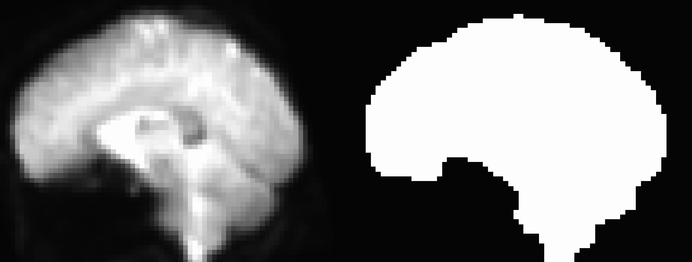
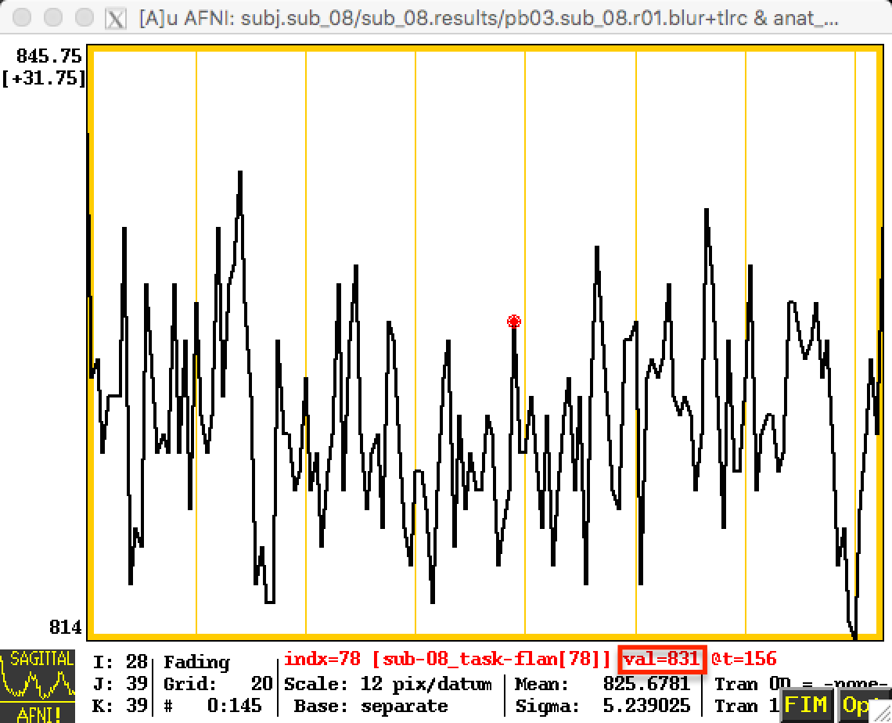
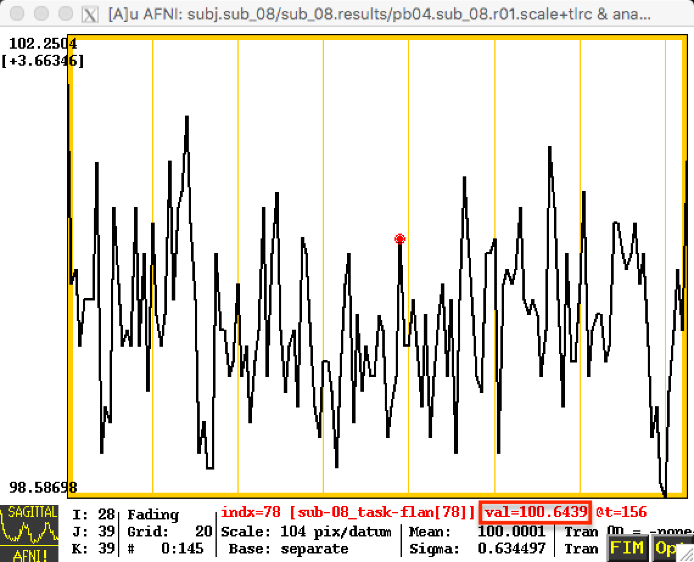

.. _06_AFNI_Masking_Scaling:

==============================
Chapter 6: Masking and Scaling
==============================

------------

What is a Mask?
***************

As you saw in previous tutorials, a volume of fMRI data includes both the brain and the surrounding skull and neck - regions that we are not interested in analyzing with AFNI, even though they do contain voxels with time-series data just as the brain voxels do. And, although it may not be obvious at first glance, we have large numbers of voxels that comprise the air outside the head.

To reduce the size of our datasets and consequently speed up our analyses, we can apply a **mask** to our data. A mask simply indicates which voxels are to be analyzed - any voxels within the mask retain their original values (or can be assigne a value of 1), whereas any voxels outside mask are assigned a value of zero. It is analogous to tracing an outline of a drawing with tracing paper, and then cutting along the lines and keeping whatever falls inside the lines, discarding the rest. Applied to fMRI data, anything outside the mask we assume to be noise or something of no interest.

Masks are created with AFNI's ``3dAutomask`` command, which only requires arguments for input and output datasets (lines 223-260 of the proc_Flanker script):

::

  foreach run ( $runs )
    3dAutomask -prefix rm.mask_r$run pb03.$subj.r$run.blur+tlrc
  end
  
  
The rest of the code within the "mask" block creates a union of masks that represents the extent of all of the individual fMRI datasets in the experiment. It then computes a mask for the anatomical dataset, and then takes the intersection of the fMRI and anatomical masks:

::

  # create union of inputs, output type is byte
  3dmask_tool -inputs rm.mask_r*+tlrc.HEAD -union -prefix full_mask.$subj

  # ---- create subject anatomy mask, mask_anat.$subj+tlrc ----
  #      (resampled from tlrc anat)
  3dresample -master full_mask.$subj+tlrc -input {$subj}_T1w_ns+tlrc     \   
             -prefix rm.resam.anat

  # convert to binary anat mask; fill gaps and holes
  3dmask_tool -dilate_input 5 -5 -fill_holes -input rm.resam.anat+tlrc  \
              -prefix mask_anat.$subj

  # compute tighter EPI mask by intersecting with anat mask
  3dmask_tool -input full_mask.$subj+tlrc mask_anat.$subj+tlrc          \   
              -inter -prefix mask_epi_anat.$subj

  # compute overlaps between anat and EPI masks
  3dABoverlap -no_automask full_mask.$subj+tlrc mask_anat.$subj+tlrc    \   
              |& tee out.mask_ae_overlap.txt

  # note Dice coefficient of masks, as well
  3ddot -dodice full_mask.$subj+tlrc mask_anat.$subj+tlrc               \   
        |& tee out.mask_ae_dice.txt

  # ---- create group anatomy mask, mask_group+tlrc ----
  #      (resampled from tlrc base anat, MNI_avg152T1+tlrc)
  3dresample -master full_mask.$subj+tlrc -prefix ./rm.resam.group      \   
             -input /Users/ajahn/abin/MNI_avg152T1+tlrc

  # convert to binary group mask; fill gaps and holes
  3dmask_tool -dilate_input 5 -5 -fill_holes -input rm.resam.group+tlrc \
              -prefix mask_group

The output of this code, which you will examine in greater detail in the next chapter, is the creation of a
mask which traces the outline of the signal detected by the image:

  Example of a masked image. The original image is on the left, while the mask is on the right. The mask consists of 1's for that voxels it determines to be within the skull, and 0's everywhere else.
  

.. warning::

  From the above image, you can see that there appears to be some parts of the orbitofrontal cortex excluded by the mask. Since the signal is relatively low in these regions to begin with (due to a phenomenon known as the **magnetic susceptibility artifact** which leads to signal dropout), the mask assumes that this region does not contain any brain voxels. This can be remedied by using a technique called **field map unwarping**. It is beyond the scope of the current tutorial, but if you are interested, you can read about one such method `here <https://andysbrainbook.readthedocs.io/en/latest/FrequentlyAskedQuestions/FrequentlyAskedQuestions.html#how-can-i-unwarp-my-data>`__.

Scaling
*******

One problem with fMRI data is that we collect data with units that are arbitrary, and of themselves meaningless. The intensity of the signal that we collect can vary from run to run, and from subject to subject. The only way to create a useful comparison within or between subjects is to take the contrast of the signal intensity between conditions, as represented by a beta weight (which will be discussed later in the chapter on statistics).

In order to make the comparison of signal intensity meaningful between studies as well, AFNI scales the timeseries in each voxel individually to a mean of 100:

::

  # scale each voxel time series to have a mean of 100
  # (be sure no negatives creep in)
  # (subject to a range of [0,200])
  foreach run ( $runs )
      3dTstat -prefix rm.mean_r$run pb03.$subj.r$run.blur+tlrc
      3dcalc -a pb03.$subj.r$run.blur+tlrc -b rm.mean_r$run+tlrc \
             -c mask_epi_extents+tlrc                            \
             -expr 'c * min(200, a/b*100)*step(a)*step(b)'       \
             -prefix pb04.$subj.r$run.scale
  end
  
  
These changes will be reflected in the time-series; the first image below represents the time-series before scaling, and the next image shows the time-series after scaling. Note that the values in the first image are relatively high - in the 800s - and that they are arbitrary; they could just as easily be around 500 or 900 in another subject. By scaling each subject's data to the same mean, as in the second image, we can place each run of each subject's data on the same scale.

  
  Before Scaling

  After Scaling

Now that we have completed our preprocessing steps, it is time to review each step and check the data quality. In the next chapter, we will walk through how this is done.
