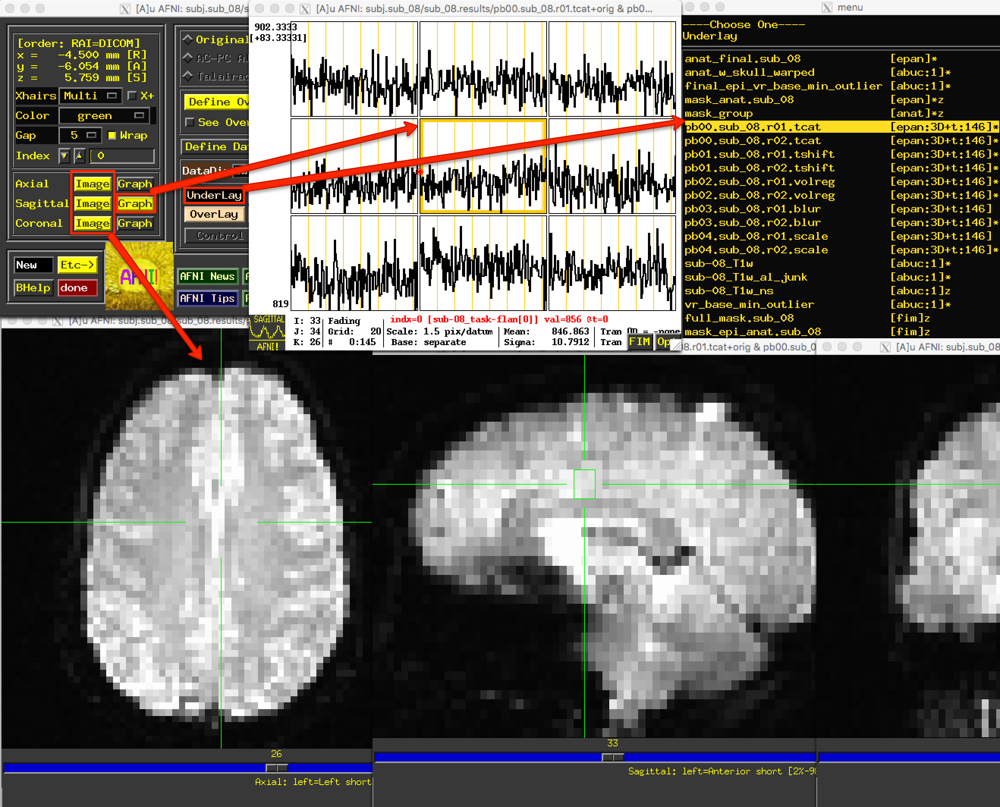
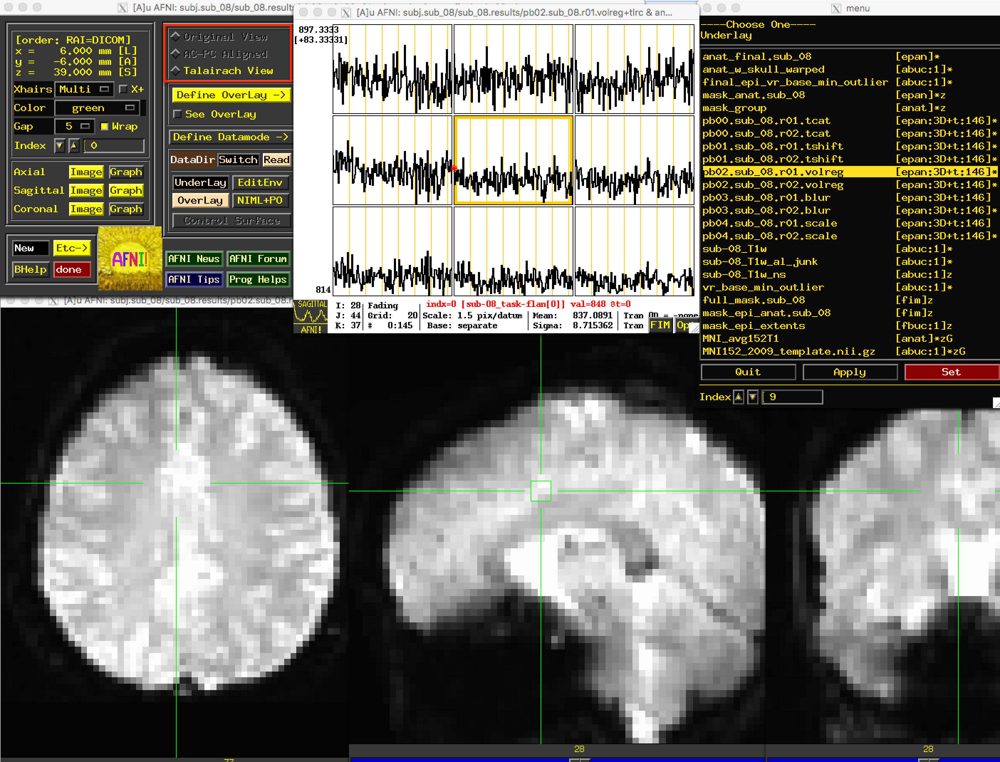
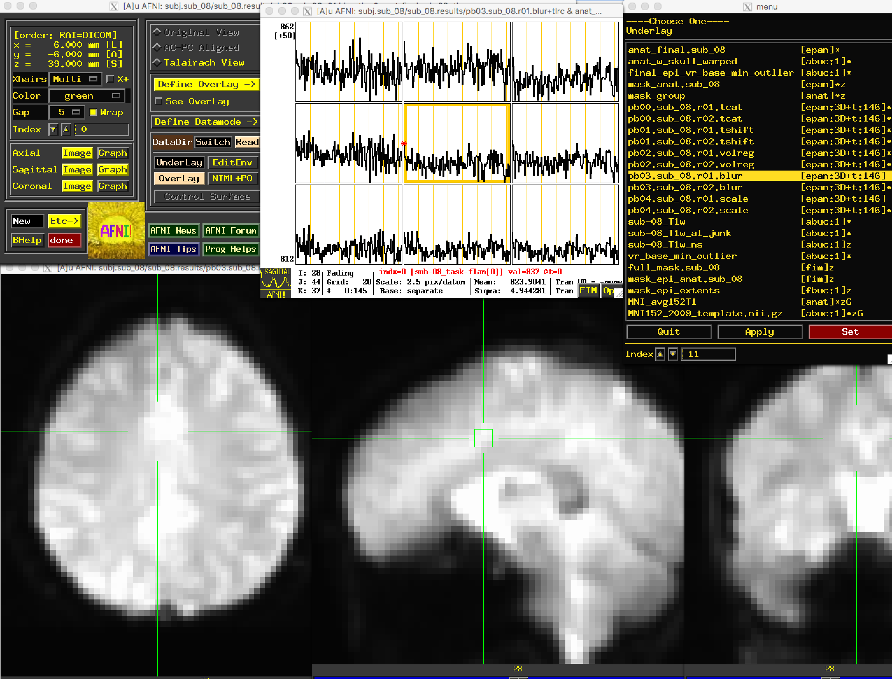

.. _07_AFNI_Checking_Preprocessing:

================
Chapter 7: Checking Preprocessing
================

--------

Navigating to the Preprocessed Data Directory
********

After the script generated by uber_subject.py has completed, navigate to the directory containing the preprocessed data. By default, AFNI will create a new directory tree in the following format:

::

  subject_results/group.<GroupName>/subj.<subjName>/<subjName>.results
  
In which GroupName and subjName are assigned in the subject ID and group ID fields of the uber_subject.py GUI. In this case, you would navigate to the results directory by typing:

::

  cd subject_results/group.Flanker/subj.sub_08/sub_08.results
  
.. note::

  Later on when we discuss **scripting** the analysis, or automating it over all of the subjects in our dataset, we will simplify the directory tree by pruning it of unnecessary sub-directories.
  
This directory contains different versions of the images after each step of preprocessing. For example, the files that contain the string ``pb01`` (i.e., Processing Block 01), and the string ``tshift``, means that these images have been slice-time corrected using the 3dTshift command.

.. figure:: 04_07_Preprocessing_Directory.png

  Example output from uber_subject.py. The files containing the "pb" string are the preprocessed functional images at each preprocessing step, and the files with the "T1w" string are the preprocessed anatomical images. Auxiliary functional images are created to assist with specific preprocessing steps, and auxiliary text files contain information about transformation matrices and movement parameters.
  

Viewing the Processed Functional Images
***************************************

Viewing the Slice-Time Corrected Data
^^^^^^^^^^^^^^^^^^^^^^^^^^^^^^^^^^^^^

After familiarizing yourself with what is in the preprocessed data directory, type ``afni`` to open the AFNI GUI. Click the ``Underlay`` button, and left-click on the fil ``pb00.sub_08.r01.tcat``; then, click on the ``Graph`` button next to any of the Axial, Sagittal, or Coronal views to view the time-series. Since the initial volumes had already been discarded before the data was uploaded to OpenNeuro, all of the time-points are of the same relative intensity. (In fact, there wasn't any need for the 3dTcat preprocessing step in the first place; but, aside from taking up more computer memory, there is nothing wrong with leaving it in.)

Similarly, the ``pb01`` images should be the same as the ``pb00`` images. If you examine the output text from the preprocessing, you will see a message printed during 3dTshift which states that the datasets are "already aligned in time", and that the "output dataset is just a copy of the input dataset". Up to this point, then, these files are essentially identical to the raw functional data. You could re-analyze this data by omitting both the 3dTcat and 3dTshift preprocessing steps, and it would get the same result. For now, however, look at each of these two processing outputs for each run in order to make sure that they do look the same, and that there are no apparent artifacts in them.

.. note::

  The Underlay menu has two columns: The left column is the file name, and the right column contains header informatino about the file. "epan" indicates that it is an echo-planar image (i.e., a functional image), whereas "anat" indicates that the file is an anatomical image. (For most purposes, "anat" is synonymous with "abuc".) Next to the "epan" string, "3D+t:146" indicates that it is a 3-dimensional image, plus a time dimension with 146 volumes, or time-points.
  
  
Viewing the Aligned and Co-Registered Data
^^^^^^^^^^^^^^^^^^^^^^^^^^^^^^^^^^^^^^^^^^

The next file to look at is the ``pb02`` "volreg" files, which have been 1) Motion-corrected - that is, each volume in the time-series for each run has been aligned to a reference volume; 2) Co-registered to the anatomical image; and 3) Warped to a standardized space, which in this case was the MNI152 template.

If you click on the pb02 images, you will notice that the **View** changes. There is a section of the AFNI GUI that contains the strings "Original View", "AC-PC Aligned", and "Talairach View". In this images, the "Talairach View" radio button is highlighted, signalizing that these images have been normalized. When you view this processing block for other subjects, the basic shape and outline of the images will look nearly identical, since they all have been warped to the same template. Again, check the images and the time-course in a few different locations to make sure there are no obvious artifacts.

.. warning::

  In AFNI, a +tlrc extension (and the "Talairach View") simply means that the image has been normalized. It does **not** mean that the image is necessarily in Talairach space; for legacy purposes, however (i.e., in order to make sure the code still worked in newer versions), the Talairach label was retained. You can check which space the image has been warped to by using the ``3dinfo`` command on the image, and finding the "Template Space" field - the three possibilities are "ORIG" (i.e., it hasn't been warped), "TLRC" (normalized to Talairach space), and "MNI" (normalized to MNI space).
  
  
Viewing the Smoothed Data
^^^^^^^^^^^^^^^^^^^^^^^^^

The following preprocessing step is **smoothing**, which averages the signal of nearby voxels together in order to boost any signal that is there, and to cancel out noise. These images will look more blurry as a function of the size of the smoothing kernel that you apply to the data; in this case, a smoothing kernel of 4mm will blur the data slightly, but not by much. Look at the images to make sure that the blurring looks reasonable, as in the figure below.

.. note::

  Open the "Graph" window and make sure your crosshairs are on the same voxel as you switch from the "volreg" image to the "blur" image. What do you notice about the time-series? Has it changed in any noticeable way? How would you describe the change, and why do you think it has changed the way it has?
  
