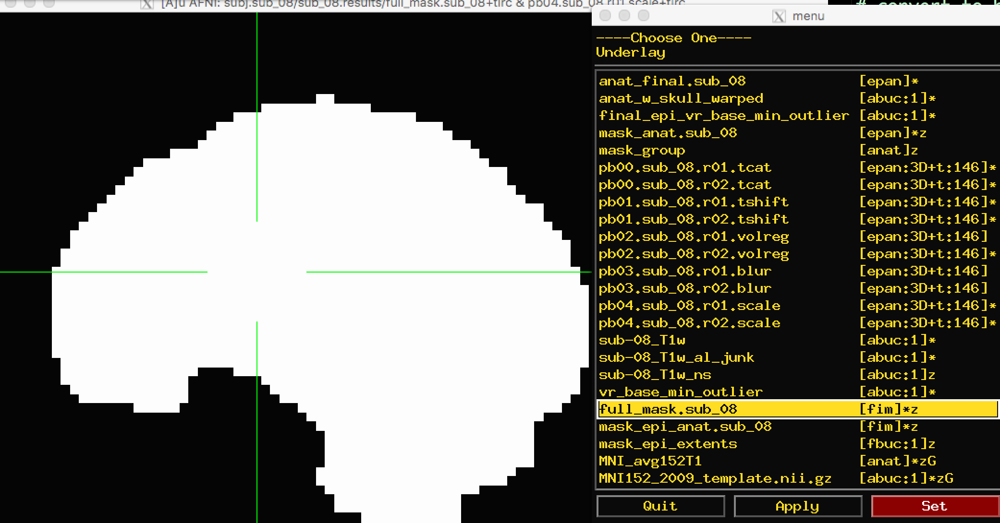
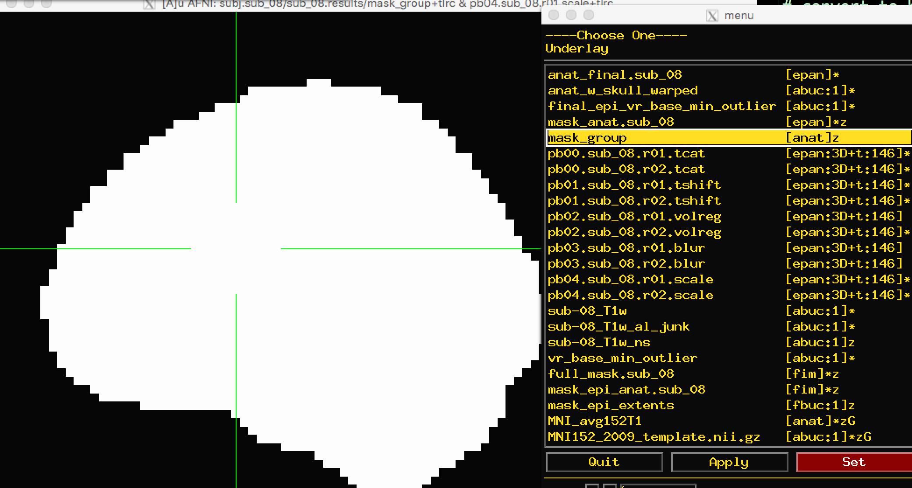
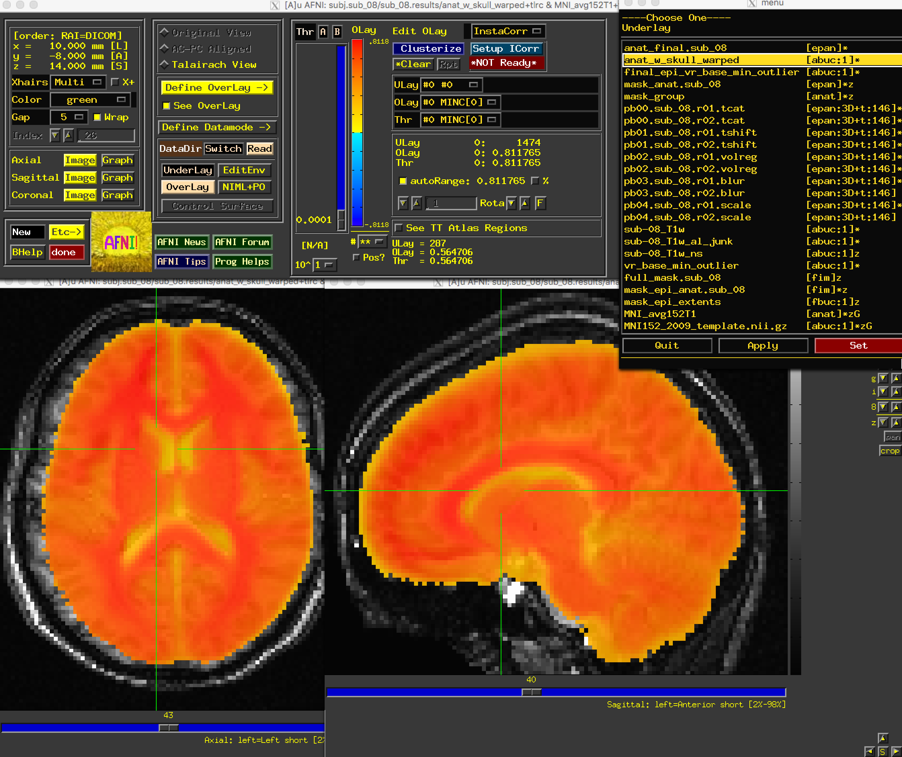
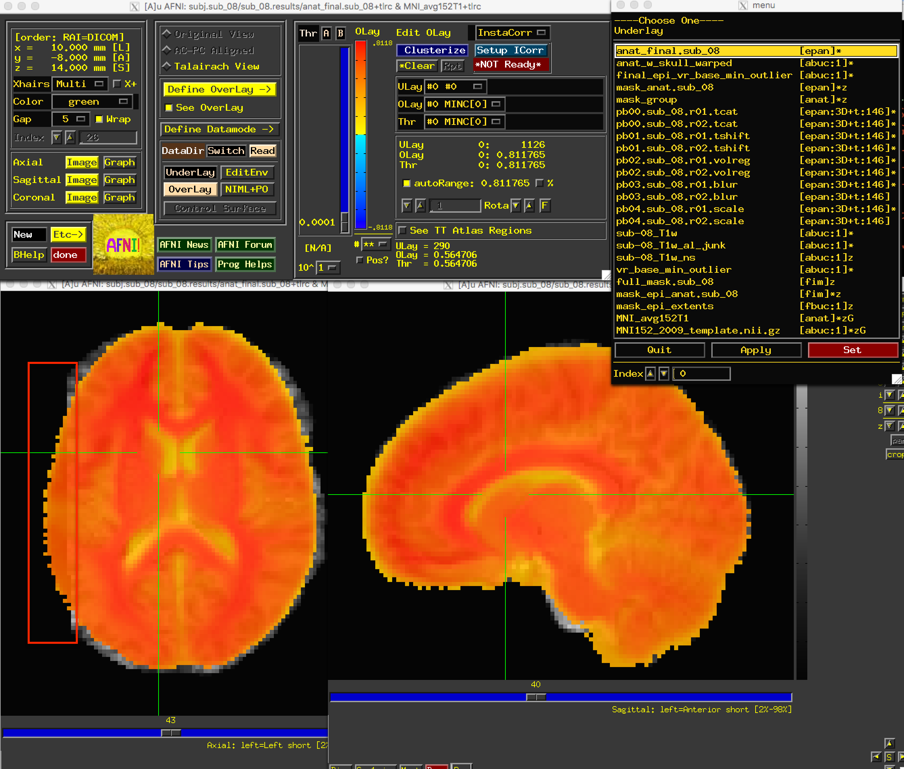
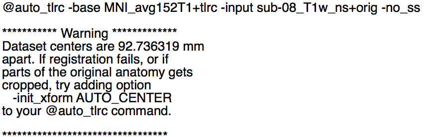
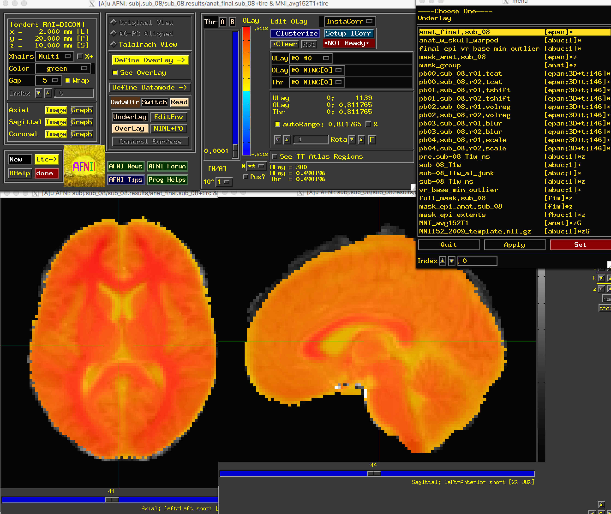

.. _07_AFNI_Checking_Preprocessing:

================
Chapter 7: Checking Preprocessing
================

--------

Navigating to the Preprocessed Data Directory
********

After the script generated by uber_subject.py has completed, navigate to the directory containing the preprocessed data. By default, AFNI will create a new directory tree in the following format:

::

  subject_results/group.<GroupName>/subj.<subjName>/<subjName>.results
  
In which GroupName and subjName are assigned in the subject ID and group ID fields of the uber_subject.py GUI. In this case, you would navigate to the results directory by typing:

::

  cd subject_results/group.Flanker/subj.sub_08/sub_08.results
  
.. note::

  Later on when we discuss **scripting** the analysis, or automating it over all of the subjects in our dataset, we will simplify the directory tree by pruning unnecessary sub-directories.
  
This directory contains different versions of the images after each step of preprocessing. For example, the files that contain the string ``pb01`` (i.e., Processing Block 01), and the string ``tshift``, means that these images have been slice-time corrected using the 3dTshift command.

.. figure:: 04_07_Preprocessing_Directory.png

  Example output from uber_subject.py. The files containing the "pb" string are the preprocessed functional images at each preprocessing step, and the files with the "T1w" string are the preprocessed anatomical images. Auxiliary functional images are created to assist with specific preprocessing steps, and auxiliary text files contain information about transformation matrices and movement parameters.
  

Viewing the Processed Functional Images
***************************************

Viewing the Slice-Time Corrected Data
^^^^^^^^^^^^^^^^^^^^^^^^^^^^^^^^^^^^^

After familiarizing yourself with what is in the preprocessed data directory, type ``afni`` to open the AFNI GUI. Click the ``Underlay`` button, and left-click on the fil ``pb00.sub_08.r01.tcat``; then, click on the ``Graph`` button next to any of the Axial, Sagittal, or Coronal views to view the time-series. Since the initial volumes had already been discarded before the data was uploaded to OpenNeuro, all of the time-points are of the same relative intensity. (In fact, there wasn't any need for the 3dTcat preprocessing step in the first place; but, aside from taking up more computer memory, there is nothing wrong with leaving it in.)

Similarly, the ``pb01`` images should be the same as the ``pb00`` images. If you examine the output text from the preprocessing, you will see a message printed during 3dTshift which states that the datasets are "already aligned in time", and that the "output dataset is just a copy of the input dataset". Up to this point, then, these files are essentially identical to the raw functional data. You could re-analyze this data by omitting both the 3dTcat and 3dTshift preprocessing steps, and it would get the same result. For now, however, look at each of these two processing outputs for each run in order to make sure that they do look the same, and that there are no apparent artifacts in them.

.. figure:: 04_07_3dTshift_3dTcat_Output.png

.. note::

  The Underlay menu has two columns: The left column is the file name, and the right column contains header informatino about the file. "epan" indicates that it is an echo-planar image (i.e., a functional image), whereas "anat" indicates that the file is an anatomical image. (For most purposes, "anat" is synonymous with "abuc".) Next to the "epan" string, "3D+t:146" indicates that it is a 3-dimensional image, plus a time dimension with 146 volumes, or time-points.
  
  
Viewing the Aligned and Co-Registered Data
^^^^^^^^^^^^^^^^^^^^^^^^^^^^^^^^^^^^^^^^^^

The next file to look at is the ``pb02`` "volreg" files, which have been 1) Motion-corrected - that is, each volume in the time-series for each run has been aligned to a reference volume; 2) Co-registered to the anatomical image; and 3) Warped to a standardized space, which in this case was the MNI152 template.

If you click on the pb02 images, you will notice that the **View** changes. There is a section of the AFNI GUI that contains the strings "Original View", "AC-PC Aligned", and "Talairach View". In this images, the "Talairach View" radio button is highlighted, signalizing that these images have been normalized. When you view this processing block for other subjects, the basic shape and outline of the images will look nearly identical, since they all have been warped to the same template. Again, check the images and the time-course in a few different locations to make sure there are no obvious artifacts.

.. figure:: 04_07_Volreg_Output.png

.. warning::

  In AFNI, a +tlrc extension (and the "Talairach View") simply means that the image has been normalized. It does **not** mean that the image is necessarily in Talairach space; for legacy purposes, however (i.e., in order to make sure the code still worked in newer versions), the Talairach label was retained. You can check which space the image has been warped to by using the ``3dinfo`` command on the image, and finding the "Template Space" field - the three possibilities are "ORIG" (i.e., it hasn't been warped), "TLRC" (normalized to Talairach space), and "MNI" (normalized to MNI space).
  
  
Viewing the Smoothed Data
^^^^^^^^^^^^^^^^^^^^^^^^^

The following preprocessing step is **smoothing**, which averages the signal of nearby voxels together in order to boost any signal that is there, and to cancel out noise. These images will look more blurry as a function of the size of the smoothing kernel that you apply to the data; in this case, a smoothing kernel of 4mm will blur the data slightly, but not by much. Look at the images to make sure that the blurring looks reasonable, as in the figure below.

.. figure:: 04_07_Blur_Output.png

.. note::

  Open the "Graph" window and make sure your crosshairs are on the same voxel as you switch from the "volreg" image to the "blur" image. What do you notice about the time-series? Has it changed in any noticeable way? How would you describe the change, and why do you think it has changed the way it has?
 
 
Viewing the Scaled Data
^^^^^^^^^^^^^^^^^^^^^^^^

The last preprocessing step generates scaled images, in which each voxel has a mean signal intensity of 100. This allows us to specify any changes relative to the mean as percent signal change; i.e., a value of 101 could be interpreted as a signal change of 1%.

Due to the greyscale of the images being more uniform in the brain voxels as compared to greater variability in the signal outside of the brain, these images will have less anatomical definition than the previous images. Nevertheless, you should still be able to see the outline of the brain, and the time-series values of the brain voxels should all be close to 100:

.. figure:: 04_07_Scaling_Output.png

Viewing the Masks
^^^^^^^^^^^^^^^^^

Because we are interested only in the voxels covering the brain, we created a mask that we can use to exclude any non-brain voxels. The mask will be binary: 1's in the voxels that are determined to be within the skull, and 0's outside of the skull. (More rigorous masks can be created which will also exclude cerebrospinal fluid and even white matter, but we are not considering those here.)

There are two masks that you can choose between: ``full_mask`` and ``mask_group``. The ``full_mask`` image is a union of all of the individual functional image masks, which have been determined to belong to the brain based on their signal intensity. Voxels with very low signal intensity are not considered brain voxels. As you can see with the ``full_mask`` image, this also excludes voxels in the orbitofrontal area, which is notorious for being susceptible to signal dropout:

The other mask, ``mask_group``, is a more liberal mask that has been dilated to more closely match the template that you have warped to - in this case, the MNI152 brain:

.. note::

  What do you notice about the time-series for the mask images? Click both inside the mask and outside. Do these values make sense?

Viewing the Anatomical Images
^^^^^^^^^^^^^^^^^^^^^^^^^^^^^

When viewing the results of the anatomical preprocessing, we will want to make sure that both the skull-stripping looks reasonable and that the images were normalized properly.

First, open the image ``anat_w_skull_warped``. If you have copied the MNI152 image into the ``aglobal`` directory, load it as an overlay image. (You can also copy it into the current directory by typing from the Terminal: ``cp ~/abin/MNI_avg152T1+tlrc* .``.) You may notice that while the sagittal view looks fine, the axial and coronal views look worse. In particular, it looks as though the image is slightly shifted to the right. Although it is common to have some variability in normalization, and that the anatomical and the template will never match perfectly, this is beyond the margin of error we are willing to extend to normalization.

The ``anat_w_skull_warped`` image, it should be noted, is the result of a warp being applied to the raw anatomical image. The warp itself was computed by normalizing the skull-stripped anatomical to a template. If that normalization was off somehow, it would have propagated to the other images. To check this, load as an underlay the image ``anat_final``:

We have found the source of the error: Part of the brain on the left has been removed during normalization. But how do we fix this?

When you detect an error in the preprocessed images, you should examine the output of your preprocessing script. If you started the script from the uber_subject.py GUI, the output will be printed to the "Processing Command" window; a copy of the text will also be stored in a file called ``output.proc.<subjID``, which is located one directory above the preprocessed data.

This text will contain both Warnings and Errors. Errors indicate that either a file is missing, or a command was not able to run successfully. Usually the script will exit after an error is encountered. Warnings, on the other hand, point out something that *may* be a problem. An example of a warning is the "dataset already aligned in time" notification that we received during slice-timing correction.

Another Warning, related to our current problem, occurred during the normalization step. This can be found slightly after halfway down the output, after the command ``@auto_tlrc``:

Apparently the centers of the anatomical and template images are very far apart. The output says that "if parts of the orignal anatomy gets cropped [sic]" (which is our current problem), "try adding option -init_xform AUTO_CENTER to your @auto_tlrc command." We can do so by navigating to one directory above the preprocessing directory (``cd ..``), removing the preprocessing directory (``rm -r sub_08.results``), and editing the file ``proc.sub_08`` to include the string ``-init_xform AUTO_CENTER`` after the @auto_tlrc command, which should be line 119 in your proc file:

::

  @auto_tlrc -base MNI_avg152T1+tlrc -input sub-08_T1w_ns+orig -no_ss -init_xform AUTO_CENTER

Save the file, and rerun it by typing ``tcsh proc.sub_08``. Wait a few minutes for it to finish, and then navigate into the preprocessing directory and load the same set of images as before. You should now see that the problem is fixed:

Next Steps
**********

Now that we have reviewed the preprocessing, we can move on to creating a **General Linear Model**, which will allow us to determine which conditions lead to greater BOLD signal compared to other conditions - which is the point of the experiment. To see how this is done, click the ``Next`` button.

Exercises
**********

1. Rerun the analysis, using a smoothing kernel of 10mm. What part of the preprocessing steps will be affected? Think about what the output will look like before running the script.

2. Overlay the ``full_mask`` and ``mask_group`` images on the normalized anatomical image (or overlay them on the template that you warped to, i.e. the MNI152 image). What differences do you notice between the mask? Where is there the most difference in the coverage of the masks? Why?
