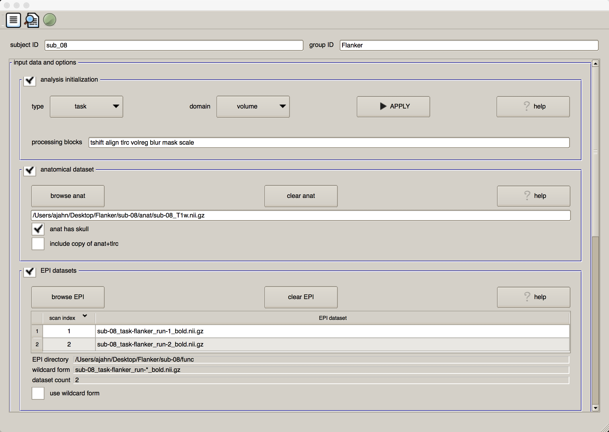
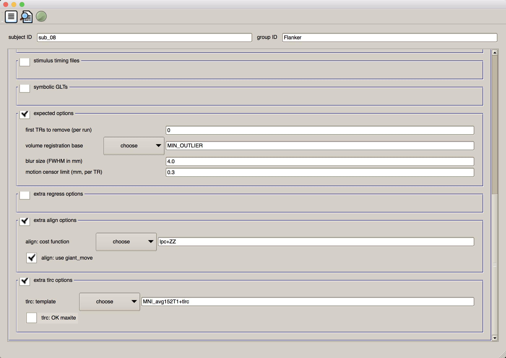
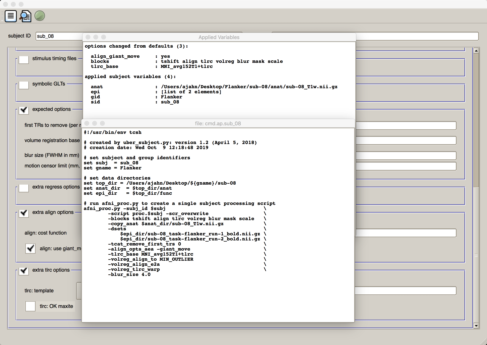
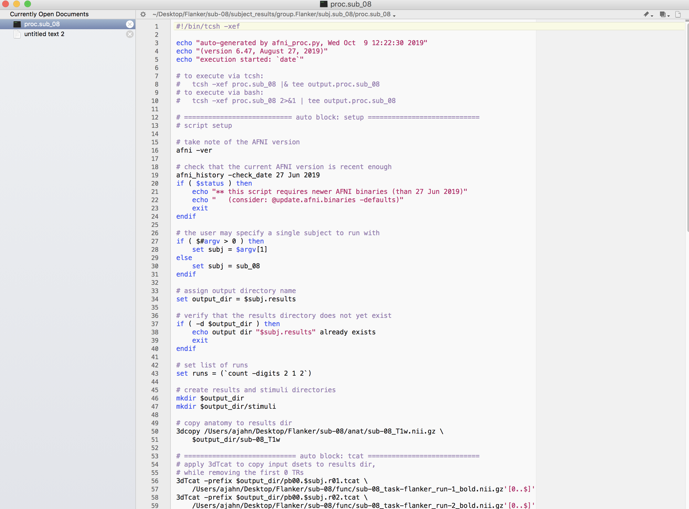
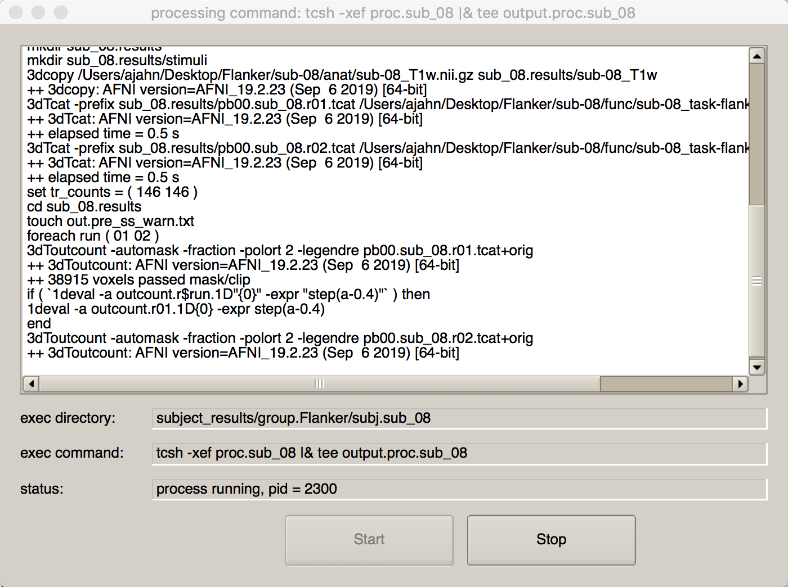

.. _AFNI_Intermezzo_Uber_Subject:

===========================================
Intermezzo: Running the Uber Subject Script
===========================================

-------------

Setting up the Analysis
***********************

Now that you are familiar with each of the preprocessing steps, we are ready to run these steps using the ``uber_subject.py`` graphical user interface. From the Terminal, navigate to the ``sub-08`` directory and type ``uber_subject.py &``.

.. note::

  The ampersand symbol ("&") will execute the command that you specified in the **background**; that is, it will run the command while at the same time keep the Terminal available for typing further commands. If you execute a command without the ampersand symbol, you can push the currently running command to the background by clicking in the Terminal that executed the command, and typing ``ctrl+z``. This will **suspend** the current command; to put it in the background (i.e., continue to run it while keeping the Terminal free), type ``bg`` in the Terminal and press ``Enter``.

In the subject ID field, type ``sub_08``, and in the group ID field, type ``Flanker``. Click on the box next to "Analysis Initialization" and remove the ``regress`` block. (We will include this later, when we run a general linear model for each subject.) Then click on the ``browse anat`` button in the "anatomical dataset" section, navigate to the ``anat`` directory, and select the file ``sub-08_T1w.nii.gz``. Select the functional datasets by clicking the ``browse EPI`` button in the "EPI datasets" section, navigate to the ``func`` directory, and hold down shift and click to select the files ``sub-08_task-flanker_run-1_bold.nii.gz`` and ``sub-08_task-flanker_run-2_bold.nii.gz``. The first half of the GUI should look as follows:

We will skip over the "stimulus timing files" and "symbolic GLTs" sections, as we are not yet doing regression. The default values in the "expected options" field are fine as they are - No TRs will be removed, the volume with the least amount of variability will be used as the reference image for alignment, a smoothing kernel of 4mm will be applied to the data, and any volumes that have a combined movement of 0.3mm from TR to TR will be flagged in a censor file (which will be used later, during regression).

Skip over the "extra regress options", and check the boxes next to "extra align options" and "extra tlrc options". The default cost function of ``lpc+ZZ`` is fine; however, I recommend checking the box next to ``align: use giant_move``. In case the functional and anatomical images are far away from each other (which can happen sometimes, due to the unforeseen changes in the scanner acquisition), an option called ``-giant_move`` will be used with the ``align_epi_anat.py`` command in order to bring them into a closer initial alignment.

Lastly, in the "extra tlrc options" field, choose the template ``MNI_avg152T1+tlrc``. This will use an MNI template, which are becoming more commonly used in fMRI analysis. When you have finished, the second half of the GUI should look like this:

Running the Analysis
*******************

When you are done setting up the analysis, you can execute it by clicking, from left to right, the three icons at the top of the GUI window. The first one looks like a sheet of paper with lines on it; this will generate the afni_proc.py command that includes everything that you specified in the GUI. Click on the icon, and it will return two windows: One listing each of the options that were changed from the defaults and listing each of the inputs, and another showing the code of the afni_proc.py command. Take a look at it to see how the commands and options listed in the afni_proc.py command correspond to the options you entered into the uber_subject.py GUI:

.. note::

  You will see a warning message that says "** warning: no stim timing files given (resting state?)" Since we are only running the preprocessing, we can ignore the message and click ``OK``.
  
  
When you have looked over the output windows, close them. Now click on the next icon, a magnifying glass over a sheet of paper. This will execute the afni_proc.py code listed in the previous window, and return any warnings or errors that you should be aware of. (We don't have any in this case.) You will also see a couple of lines of code specifying how to run the output of this command, which is a file called ``proc.sub_08``.

Close the window, and go back to your Terminal. From the ``sub-08`` directory, notice that there is a new directory structure that has been created. Within the next directory ``subject_results``, you will see ``group.Flanker``, and below that, ``subj.sub_08``. Navigate to this directory by typing ``cd subject_results/group.Flanker/subj.sub_08``. Within this directory, there are three files:

1. cmd.ap.sub_08: This is the afni_proc.py file that was generated by uber_subject.py.
2. output.cmd.ap.sub_08: This is the output of afni_proc.py that generates any warnings or errors you should be aware of.
3. proc.sub_08: The raw AFNI commands that will perform the actual preprocessing, as compiled by the afni_proc.py command. Open this file in either ``vi`` or TextWrangler to examine the contents. It should look something like this:

We are now ready to run this script. You can either type the code that was listed in ``output.cmd.ap.sub_08``, or you can simply press the Green icon button at the top of the uber_subject.py GUI. If you do the latter, you will see another window open up that shows each command being run, and its corresponding output:

Next Steps
**********

The preprocessing will take about five minutes, depending on the speed your machine. When it has completed, we will review the output of the preprocessing in the next chapter.
