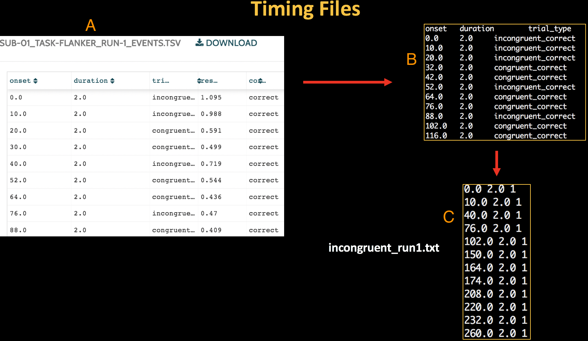

.. _AFNI_05_Creating_Timing_Files:

================================
Chapter 5: Creating Timing Files
================================

---------

The Ideal Time-Series and the Fitted Time-Series
*********

We just saw how we can use several regressors, or independent variables, to estimate an outcome measure such as GPA. Conceptually, we’re doing the same thing when we use several regressors to estimate brain activity, which is our outcome measure with fMRI data: We estimate the average amplitude of the BOLD signal in response to each condition in our model.

In the animation below, the different colors of the BOLD responses represent different conditions (such as Congruent and Incongruent), and the gray line represents the timecourse of our preprocessed data. This shows how the amplitude of each condition is being estimated to best fit the data; for the condition on the left, it is relatively high, whereas for the condition on the right, it is relatively low. You can also imagine a condition's BOLD signal which is not significantly different from zero, or which is even negative.

.. figure:: 05_05_GLM_fMRI_Data.gif

The Red and Green lines representing the HRFs are called the **ideal time-series**. This is the time-series that we expect, given the timing of each stimulus in our experiment. When we estimate beta weights to fit this ideal time-series to the data, the result is called a **fitted time-series**, shown in the animation as a blue line. 

.. note::

  Since every voxel has its own time-series, we do the procedure above for every voxel in the brain. This is known as a **mass univariate** analysis, since we estimate beta weights for each voxel's time-series. As there are tens or hundreds of thousands of voxels in a typical fMRI dataset, later we will need to correct for all of the tests we have done. This will be covered in a later chapter on group analysis.

Creating the Ideal Time-Series
*********

Our goal is to create the fitted time-series so that we can use the estimated beta weights in a group-level analysis. But to do that, we first need to create our ideal time-series.

Let's take a look at the Flanker dataset. Within each subject's ``func`` directory are files labeled ``events.tsv``. These files contain three pieces of information that we need to create our **timing files** (also known as **onset files**):

1. The name of the condition;
2. When each trial of the condition occurred, in seconds, relative to the start of the scan; and
3. The duration of each trial.

These need to be extracted from the events.tsv files and formatted in a way that the FSL software can read. In this case, we will create a timing file for each condition, and then split that file according to which run the condition was in. In total, then, we will create four timing files: 

1. Timings for the Incongruent trials that occurred during the first run (which we will call incongruent_run1.txt);
2. Timings for the Incongruent trials that occurred during the second run (incongruent_run2.txt);
3. Timings for the Congruent trials that occurred during the first run (congruent_run1.txt);
4. Timings for the Congruent trials that occurred during the second run (congruent_run2.txt).

Each of these timing files will have same format consisting of three columns, in the following order:

1. Onset time, in seconds, relative to the start of the scan;
2. Duration of the trial, in seconds;
3. Parametric modulation.

.. note::

  We will discuss parameteric modulation in a future module. For now, all you need to know is that it is a required column, and unless you have parametrically modulated trials (which we do not have in this dataset), set it to a value of "1" for each trial.
  

  
  The Run-1_events.tsv file on OpenNeuro.org (A). When we download it and look at it in the Terminal, it looks like the text in window (B). Our goal is to re-format the events file to create a timing file with three columns: Onset time, duration, and parametric modulation (C).
  
To format the timing files, download `this script <https://github.com/andrewjahn/FSL_Scripts/blob/master/make_FSL_Timings.sh>`__. (You can download it by clicking on the ``Raw`` button, then right-clicking in the newly-opened window and selecting "Save As".) We won't go into detail about how it works, but all you need to do is place it in the experimental folder containing the subjects, and type ``bash make_FSL_Timings.sh``. This will creating timing files for each run for each subject. To check the output, type ``cat sub-08/func/incongruent_run1.txt``. You should see numbers similar to the ones in the figure above.

Once you have created the timing files, you are now ready to use them to fit a model to the fMRI data. To see how to do that, click the Next button.

