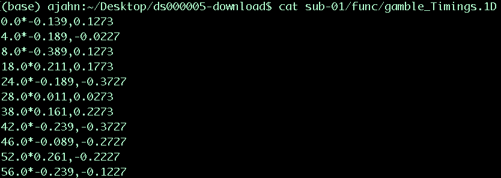
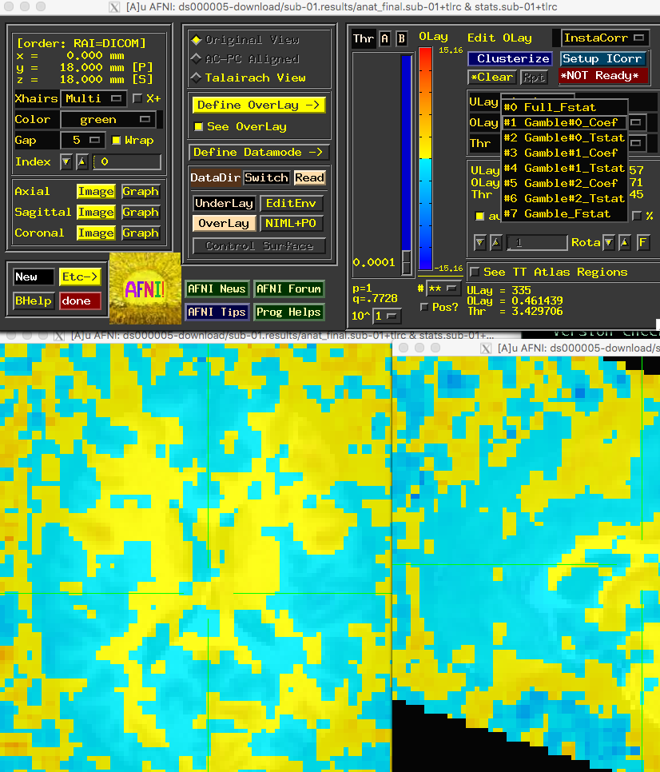

.. _AppendixA_ParametricModulation:

=========================================
Appendix A: Parametric Modulation in AFNI
=========================================

-----------------

Overview
********

This tutorial will show you how to set up a parametric modulation analysis in AFNI. A review of parametric modulation, as well as the dataset we will be analyzing, can be found :ref:`here <PM_Overview>`. This tutorial will focus on preprocessing the data and using the parametric modulators in the general linear model.

Preprocessing the Data
**********************

------------------

Creating the Timing Files
^^^^^^^^^^^^^^^^^^^^^^^^^

We will first create timing files that contain onsets for the Gamble, the parametric value for the potential Gain, and the parametric value for the potential Loss, for each run; in total, we will create nine regressors.

You can download a script to convert the timings into a format that AFNI understands by clicking `here <https://github.com/andrewjahn/AFNI_Scripts/blob/master/make_Gamble_Timings.sh>`__, clicking on the ``Raw`` button, and right-clicking anywhere on the screen and selecting ``Save As``. Save the file as a shell script into the ``Gambles`` directory. Once it has been downloaded, navigate to that directory with a Terminal and run the script by typing ``bash make_Gamble_Timings.sh``. Within each func directory you should now see a file called ``gamble_Timings.1D``, which looks like the following:

The first number is the onset of the gamble; the asterisk indicates that the numbers coming after it are the modulators, separated by a comma. We will use this in the model for each subject.

Creating the Preprocessing Script
^^^^^^^^^^^^^^^^^^^^^^^^^^^^^^^^^

Similar to the :ref:`scripting section <AFNI_06_Scripting>` of the AFNI tutorial, we will create a Batch script that can be used in a for-loop to analyze all of our subjects. Instead of using the ``uber_subject.py`` GUI, however, we will use the command ``afni_proc.py``. The script can be downloaded `here <https://github.com/andrewjahn/AFNI_Scripts/blob/master/runAFNIproc.sh>`__; click on ``Raw``, right-click and choose ``Save As``, and download it to your ``Gambles`` directory. If we open the file, this is what is inside:

::

  #!/bin/tcsh
  set subj = $argv[1]

   afni_proc.py -subj_id ${subj} -script proc.${subj} -scr_overwrite -blocks tshift                                                  \
     align tlrc volreg blur mask scale regress -copy_anat                                                                  \
     $PWD/{$subj}/anat/{$subj}_T1w.nii.gz                     \
     -dsets                                                                                                                \
     $PWD/{$subj}/func/{$subj}_task-mixedgamblestask_run-01_bold.nii.gz \
     $PWD/{$subj}/func/{$subj}_task-mixedgamblestask_run-02_bold.nii.gz \
     $PWD/{$subj}/func/{$subj}_task-mixedgamblestask_run-03_bold.nii.gz \
     -tcat_remove_first_trs 0 -align_opts_aea -giant_move -tlrc_base                                                       \
     MNI_avg152T1+tlrc -volreg_align_to MIN_OUTLIER -volreg_align_e2a                                                      \
     -volreg_tlrc_warp -blur_size 4.0 -regress_stim_times                                                                  \
     $PWD/{$subj}/func/gamble_Timings.1D                          \
     -regress_stim_labels Gamble -regress_stim_types AM2 -regress_basis 'BLOCK(3,1)'     \
     -regress_censor_motion 0.3 -regress_motion_per_run -regress_opts_3dD                                                  \
     -jobs 8 -regress_make_ideal_sum sum_ideal.1D                                                  \
     -regress_run_clustsim no

  tcsh proc.${subj}

The first line uses the first argument, or input, as the subject number for the rest of the script. The blocks tshift, align, tlrc, and so on, indicate the standard preprocessing steps of slice-timing correction, realignment, normalization, etc. The major difference from analyzing a non-parametric modulation dataset is using ``AM2``, which stands for Amplitude Modulation. This will orthogonalize the modulators with respect to the main regressor, but not with respect to each other; for more details on why this is important, see the link to the Mumford et al. paper down below.

Running the Analysis
********************

Now that we have a template preprocessing script, we can use it in a for-loop to analyze all of the subjects. Type the following:

::

  for i in `cat subjList.txt`; do
    tcsh runAFNIProc.sh $i;
  done
  
This will take a couple of hours. We will return when it has finished preprocessing.

Group-Level Analysis
********************

If you navigate into one of the output directories, such as ``sub-01.results``, and open AFNI, load the warped anatomical image as an underlay and the ``stats.sub-01.+tlrc`` image as an overlay:

::

  afni anat_final.sub-01+tlrc. stats.sub-01+tlrc.
  
In the ``Define Overlay`` window, there are multiple options in the ``OLay`` and ``Thr`` dropdown menus. The first one (``Gamble#0_Coef``) is the beta weight for the main regressor of "Gamble", while sub-brik 3 of ``Gamble#1_Coef`` corresponds to the parametric modulator of Gain and sub-brik 5 of ``Gamble#2_Coef`` corresponds to the parametric modulator of Loss. We will use these last two regressors as inputs into our group-level analysis.

Our script will look like this:

::

  #!/bin/tcsh -xef

  # created by uber_ttest.py: version 2.0 (December 28, 2017)
  # creation date: Wed Feb 19 11:33:21 2020

  # ---------------------- set process variables ----------------------

  set mask_dset = $PWD/sub-01.results/mask_group+tlrc

  set dirA = $PWD

  # specify and possibly create results directory
  set results_dir = test.results
  if ( ! -d $results_dir ) mkdir $results_dir

  # ------------------------- process the data -------------------------

  3dttest++ -prefix $results_dir/GainPM                     \
          -mask $mask_dset                                         \
          -setA GainPM                                           \
             01 "$dirA/sub-01.results/stats.sub-01+tlrc[3]" \
             02 "$dirA/sub-02.results/stats.sub-02+tlrc[3]" \
             03 "$dirA/sub-03.results/stats.sub-03+tlrc[3]" \
             04 "$dirA/sub-04.results/stats.sub-04+tlrc[3]" \
             05 "$dirA/sub-05.results/stats.sub-05+tlrc[3]" \
             06 "$dirA/sub-06.results/stats.sub-06+tlrc[3]" \
             07 "$dirA/sub-07.results/stats.sub-07+tlrc[3]" \
             08 "$dirA/sub-08.results/stats.sub-08+tlrc[3]" \
             09 "$dirA/sub-09.results/stats.sub-09+tlrc[3]" \
             10 "$dirA/sub-10.results/stats.sub-10+tlrc[3]" \
             11 "$dirA/sub-11.results/stats.sub-11+tlrc[3]" \
             12 "$dirA/sub-12.results/stats.sub-12+tlrc[3]" \
             13 "$dirA/sub-13.results/stats.sub-13+tlrc[3]" \
             14 "$dirA/sub-14.results/stats.sub-14+tlrc[3]" \
             15 "$dirA/sub-15.results/stats.sub-15+tlrc[3]" \
             16 "$dirA/sub-16.results/stats.sub-16+tlrc[3]"
             
Copy and paste this into your terminal, or download it `here <https://github.com/andrewjahn/AFNI_Scripts/blob/master/runGroupAnalysis_GainPM.sh>`__. It will create a new directory called GainPM, which you can overlay on a template brain and threshold at whatever level you want. At a relatively liberal voxel-wise uncorrected threshold of p=0.01, you can see that the gain modulators load significantly on the caudate nucleus. If we do the same analysis for the Loss modulators, which is sub-brik 5, you will see negative loadings in the same region. Compare this to the Tom et al. paper; do the results look similar? We could strengthen our results by changing the preprocessing or the GLM - for example, by increasing the smoothing kernel, or by using REML model estimation. This is left as an exercise for you to do on your own.

.. note::

  Because we have only 16 subjects, we won't be able to use AFNI's ETAC option, which is simliar to FSL's threshold-free cluster enhancement. If you did have more subjects, however, you could try using this option as well.

Video
*****

For a demonstration of what parametric analysis in AFNI looks like, click here.
