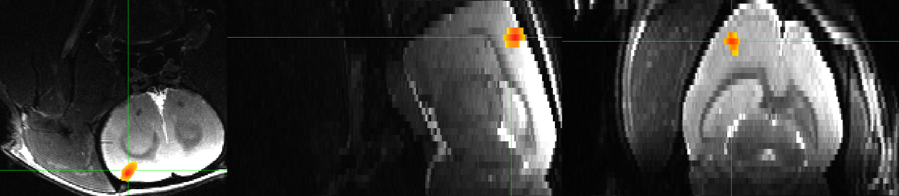

.. _AppendixB_AnimalAnalysis:

==============================
Appendix B: Analyzing Rat Data
==============================

Overview
--------

In addition to analyzing human brains, AFNI can be used to analyze animal brains as well. In this tutorial, we will replicate the results of a recent *Nature* paper published by Sirmpilatze, Baudewig, & Boretius (2019); a link to the paper can be found `here <https://www.nature.com/articles/s41598-019-53144-y#data-availability>`__, and a link to the data on OpenNeuro can be found `here <https://openneuro.org/datasets/ds001981/versions/1.0.3>`__.

The aim of the study was to examine how fMRI measures from task-based and resting-state analysis change over time when rats are anesthetized with Medetomidine. For our purposes, we will simply replicate the task-based effects of electrical forepaw stimulation (or EFS), as well as the resting-state results. The advanced user may choose to replicate their temporal variability analyses, but that is beyond the scoope of the current tutorial.

Preprocessing the Data
**********************

The Methods section of the paper states that the data were analyzed using Python tools, which called upon a combination of FSL and AFNI commands; nevertheless, we will use mostly AFNI commands here, as well as an advanced registration tool called ANTs. In particular, we will replicate the following preprocessing steps were done:

1. Slice-timing correction;
2. Band-pass filtering of less than 0.01Hz and greater than 0.15Hz;
3. Spatial smoothing of 0.5mm.
4. Coregistration between the functional and structural images;

Note that in this study motion correction was not performed, since the rats were anesthetized and did not move much. Consequently, motion regressors were not used in the model.

Let's begin with slice-timing correction. Using ``3dinfo`` on the first EFS run, we can see the following the in the header:

::

  Dataset File:    sub-01_task-efs_run-01_bold.nii.gz
  Identifier Code: NII_GMnEUUfC2G6z4SOYguib2A  Creation Date: Tue Apr 18 12:27:02 2023
  Template Space:  ORIG
  Dataset Type:    Echo Planar (-epan)
  Byte Order:      LSB_FIRST {assumed} [this CPU native = LSB_FIRST]
  Storage Mode:    NIFTI
  Storage Space:   324,403,200 (324 million) bytes
  Geometry String: "MATRIX(0.2,0,0,-12.8,0,-0.2,0,9.4,0,0,0.5,-5.94792):128,96,30"
  Data Axes Tilt:  Plumb
  Data Axes Orientation:
    first  (x) = Right-to-Left
    second (y) = Posterior-to-Anterior
    third  (z) = Inferior-to-Superior   [-orient RPI]
  R-to-L extent:   -12.800 [R] -to-    12.600 [L] -step-     0.200 mm [128 voxels]
  A-to-P extent:    -9.600 [A] -to-     9.400 [P] -step-     0.200 mm [ 96 voxels]
  I-to-S extent:    -5.948 [I] -to-     8.552 [S] -step-     0.500 mm [ 30 voxels]
  Number of time steps = 220  Time step = 1.50000s  Origin = 0.00000s
    -- At sub-brick #0 '?' datum type is float
    -- At sub-brick #1 '?' datum type is float
    -- At sub-brick #2 '?' datum type is float
  ** For info on all 220 sub-bricks, use '3dinfo -verb' **
  
The TR is 1.5s, there are 220 volumes in this run, and the voxel resolution is 0.2x0.2x0.5mm, which explains why the resolution in the sagittal and coronal planes looks lower than in the axial plane.

To slice-time correct this data, type:

::

  3dTshift -tzero 0 -quintic -prefix sub-01_run-01_STC.nii sub-01_task-efs_run-01_bold.nii.gz

Next, we bandpass the data using 3dBandPass:

::

  3dBandpass -prefix sub-01_run-01_STC_BP.nii 0.01 0.15 sub-01_run-01_STC.nii
  
And then smooth the data with a 0.5mm kernel:

::

  3dmerge -1blur_fwhm 0.5 -doall -prefix sub-01_run-01_STC_BP_Smoothed.nii sub-01_run-01_STC_BP.nii
  
  
.. note::

  On my machine, 3dBandpass appears to generate noisy output, regardless of the parameters used. For the rest of this tutorial, we will skip bandpassing by typing ``3dmerge -1blur_fwhm 0.5 -doall -prefix sub-01_run-01_STC_Smoothed.nii sub-01_run-01_STC.nii``.

First-Level Analysis
********************

Looking within the task-efs_events.tsv file, we find that the onsets were:

::

  onset   duration
  60      30
  150     30
  240     30
  
This is the same for all of the subjects in the study, except for subject sub-07 (see note on the OpenNeuro repository). Accordingly, we can make an onset times file called ``Timings.txt``, which contains this line of code:

::

  60 150 240
  
Additional lines identical to the one above can be added for however many runs you are analyzing from this particular rat. However, since electrical forepaw stimulation should elicit a strong BOLD response, we should see a significant effect in just one run.

Once we have the timing file, we can insert it into a ``3dDeconvolve`` command, such as the one below:

::

  3dDeconvolve -input sub-01_run-01_STC_Smoothed.nii \
        -polort 3 \
        -num_stimts 1 \
        -stim_times 1 Timings.txt  'BLOCK(30,1)' \
        -stim_label 1 EFS \
        -gltsym 'SYM: EFS' \
        -glt_label 1 EFS \
        -tout -x1D X.xmat.1D -xjpeg X.jpg \
        -bucket stats.sub-01.nii
        
This will apply a 3rd-order polynomial (recommended for runs of 300s or more, which applies to this run), and convolves a 30-second boxcar basis function with each onset time specified in the Timings.txt file. The lines of code beginning with ``stim`` and ``glt`` specify the label for the output statistic dataset, and any contrasts. In this case, since there is only one condition, we are just doing a simple effect of electrical forepaw stimulation. Since the right forepaw was stimulated, the result should localize to the left somatosensory cortex. Once we run ``3dDeconvolve`` and generate the dataset ``stats.sub-01.nii``, we can load it into the AFNI viewer and overlay it on the T2-weighted anatomical image:

  Single-rat results for a simple effect of electrical forepaw stimulation, thresholded at p=0.001, cluster threshold of k=40 voxels. Note that on these images, left is located on the left side of the panel, and the top of the brain is at the bottom of the image. We will later see how to reorient these images so that they match better with the figures reported in Sirmpilatze et al., 2019.
  

Normalizing the Brains
**********************

Although there are rat templates available (such as the SIGMA template, available `here <https://www.nitrc.org/projects/sigma_template>`__, or the `Waxholm Rat Atlas, available from the AFNI site <http://afni.nimh.nih.gov/pub/dist/atlases/waxrat/waxratbrainv2.tgz>`__), you may instead decide to use a study-specific template generated from the subjects included in your sample. For example, if we have six rats, we can choose one of them to be a fixed template image, and register all of the other rat brains to that image.

This was the approach used by the authors of the study, and they used a suite of normalization tools called Advanced Normalization Tools, or `ANTs <http://stnava.github.io/ANTs/>`__. Instructions for how to download and install the package can be found on the e-book :ref:`here <ANTs_Overview>`. 

Once you have installed the package, let's use the first six rat brains in the dataset. Using the first rat as the template, or fixed image, we can register the others to it by using teh ``antsRegistrationSynQuick.sh`` command:

::

  #!/bin/bash

  antsRegistrationSyNQuick.sh -d 3 -f sub-01/anat/sub-01_T2w.nii.gz -m sub-02/anat/sub-02_T2w.nii.gz -o sub-02/anat/sub-02_to_sub-01
  antsRegistrationSyNQuick.sh -d 3 -f sub-01/anat/sub-01_T2w.nii.gz -m sub-03/anat/sub-03_T2w.nii.gz -o sub-03/anat/sub-03_to_sub-01
  antsRegistrationSyNQuick.sh -d 3 -f sub-01/anat/sub-01_T2w.nii.gz -m sub-04/anat/sub-04_T2w.nii.gz -o sub-04/anat/sub-04_to_sub-01
  antsRegistrationSyNQuick.sh -d 3 -f sub-01/anat/sub-01_T2w.nii.gz -m sub-05/anat/sub-05_T2w.nii.gz -o sub-05/anat/sub-05_to_sub-01
  antsRegistrationSyNQuick.sh -d 3 -f sub-01/anat/sub-01_T2w.nii.gz -m sub-06/anat/sub-06_T2w.nii.gz -o sub-06/anat/sub-06_to_sub-01
  
This will create one warped image for each of the other subjects, normalized to have the same size and dimensions as sub-01's anatomical image. We then average them together using ``3dcalc``:

::

  3dcalc -a sub-01_T2w.nii.gz -b sub-02_to_sub-01Warped.nii.gz -c sub-03_to_sub-01Warped.nii.gz -d sub-04_to_sub-01Warped.nii.gz -e sub-05_to_sub-01Warped.nii.gz -f sub-06_to_sub-01Warped.nii.gz -expr '(a+b+c+d+e+f)/6' -prefix anat_average.nii
  
Which will generate an average image, ``anat_average.nii``, which will look smoother than the other images:

.. figure::

  AppendixB_Averaged_RatBrain.png
  
We then down-sample this image to match the resolution of the functional images (0.2 x 0.2 x 0.5mm^3):

::

  3dresample -master sub-01/func/sub-01_task-efs_run-01_bold.nii.gz -input anat_average.nii -prefix anat_average_rs.nii
  
Which should result in a slightly lower-resolution anatomial image:

.. figure::

  AppendixB_Resampled_Average_Anatomical.png
  
You can skull-strip the image using AFNI's ``3dSkullStrip`` command with the ``-rat`` option:

::

  3dSkullStrip -prefix anat_stripped.nii -rat -input anat_average_rs.nii
  
  
Warping the Individual Subjects to Sub-01
*****************************************

Since we used ``sub-01``'s anatomical image as a template, and given that each subject's functional and anatomical images are already well aligned, we can normalize each subject's functional data to the ``sub-01`` template by using the command ``antsApplyTransforms``. In this case, we will need to warp the functional images in two stages: Once to coregister the functional data to its corresponding structural image, and then apply the structural-to-template normalization warps to the individual functional images.

First, place all of the relevant anatomical and functional files in a new folder called ``Registration``:

::

  mkdir Registration
  for i in sub-01 sub-02 sub-03; do
  cp $i/anat/*.nii.gz Registration; 
  cp $i/func/${i}_task-efs_run-01_bold.nii.gz Registration; 
  done

We begin by taking the mean of the time-series for each subject:

::

  cd Registration
  for i in sub-01 sub-02 sub-03; do
  3dTstat -prefix meanFunc_${i}.nii ${i}_task-efs_run-01_bold.nii.gz;
  done

We then resample the template image to the functional image's size and resolution (in this case, using the mean image for sub-02's functional data, but any mean image will do):

::

  3dresample -master meanFunc_sub-02.nii -input sub-01_T2w.nii.gz -prefix template_rs.nii
  
We now follow the template code provided `here <https://github.com/ANTsX/ANTs/wiki/Forward-and-inverse-warps-for-warping-images,-pointsets-and-Jacobians#warping-multiple-modalities-to-a-common-template>`__, from the ANTs website:

::
  
  for i in sub-02 sub-03; do
  antsRegistrationSyNQuick.sh  -d 3 -f ${i}_T2w.nii.gz -m meanFunc_${i}.nii -o t2ToT1_ -t r;
  antsRegistrationSyNQuick.sh -d 3 -f template_rs.nii -m ${i}_T2w.nii.gz -o ${i}_anat_ToTemplate_ -t sr;
  antsApplyTransforms -d 3 -e 5 -i stats.${i}.nii -o stats_${i}_DeformedToTemplate.nii.gz -r template_rs.nii -t ${i}_anat_ToTemplate_1Warp.nii.gz -t ${i}_anat_ToTemplate_0GenericAffine.mat -t t2ToT1_0GenericAffine.mat;
  done

And then we can run a group analysis with the following code:

::

  #!/bin/tcsh -xef

  # created by uber_ttest.py: version 2.0 (December 28, 2017)
  # creation date: Wed Feb 19 11:33:21 2020

  # ---------------------- set process variables ----------------------

  # specify and possibly create results directory
  set results_dir = test.results
  if ( ! -d $results_dir ) mkdir $results_dir

  # ------------------------- process the data -------------------------

  3dttest++ -prefix $results_dir/ForePawStimulation                     \
            -setA ForePawStimulation                                            \
               01 "stats.sub-01.nii[1]" \
               02 "stats_sub-02_DeformedToTemplate.nii.gz[1]" \
               03 "stats_sub-03_DeformedToTemplate.nii.gz[1]"
