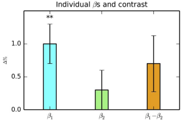

.. _AppendixD_EffectSizes:

==================================
Appendix D: Reporting Effect Sizes
==================================

------------------

Overview
********

Once you have finished analyzing your dataset with AFNI, you may wonder how you should report the results. Within the field of cognitive neuroscience, it is common to report the t-statistic for each effect or each contrast, and to show the results as a t-statistic map overlaid on a template brain. Furthermore, within the tables of a paper, many researchers will report the peak t-statistic of a given cluster.

While this may seem like a reasonable approach - after all, most readers want to know whether a given result is due to chance, and the author has to decide on how to compress the data into some kind of easily understood result - it can also obscure the full picture, and give a distorted view of the practical significance of the result. For example, suppose that a pharmaceutical company advertises a drug that lowers cholesterol. If that was all the information we had, we might assume that the drug has a significant effect, and is worth paying for. If, however, on closer inspection, it is revealed that the drug leads to a drop of just 0.01% in the person's cholesterol, we may reconsider whether the drug is worth taking - and indeed, whether the drug in fact "works" at all. The discriminating buyer would also weigh this against the cost of the drug and its side effects; a drug that lowers cholesterol by 5% and is relatively cheap without any side effects would probably be worth taking, while a drug that lowers cholesterol by 10%, but costs hundreds of dollars per pill and comes with a host of negative side effects, would probably not be worth taking.

Similarly, we should ask ourselves the same question about the effects we observe in the neuroimaging literature: Does this effect exist? Usually some kind of statistic, such as a t-statistic and its associated p-value, allows us to answer that question with some kind of certainty. However, we also should remember that the commonly used threshold of p=0.05 is arbitrary, and that small variations around this threshold can lead to one effect being judged significant, and therefore real, while the other is dismissed as non-significant, and therefore that the effect does not exist.

Limitations of Reporting Statistics
-----------------------------------

This kind of binary significant/non-significant approach can lead to potentially interesting effects being hidden, as we saw in the previous appendix on :ref:`Highlighting vs. Hiding <AppendixC_HighlightingResults>`. In addition, reporting just the statistic tells you nothing about the magnitude of an effect: Using the cholesterol example above, we could have several clinical trials that all find an extremely consistent decrease of 0.01%, which would lead to an extremely significant p-value - let's say, p<0.00001. If this statistic was all the reader saw, however, they would have no idea about the miniscule effect size, which is what they are actually interested in.

It follows that p-values and t-statistics on their own are difficult to compare with each other; frequently, any comparisons are meaningless, since the values themselves are dimensionless. If you were to find that one effect gives you a p-value of 0.0001, for example, this doesn't tell you anything about the size of another researcher's effect which yielded a p-value of 0.049. If you are both using the nominal p=0.05 threshold, you will have both rejected the null hypothesis, and decided that an effect exists; yet, you may have found a consistent yet extremely small effect, while the other researcher may have found a gigantic effect, albeit with more variability.

Instead, we can expand the scope of the data we report by also including the effect size. With fMRI data, the values we gather from the scanner are arbitrary, and can vary from subject to subject, as well as from scanner to scanner; consequently, these values are meaningless when compared across studies. To make them more interpretable, the values are typically scaled - for example, by normalizing each voxel's time-series to its mean value, which is done in AFNI. Other approaches, such as grand mean scaling in FSL and SPM, normalize each voxel's time-series relative to the average of all the voxels within the brain (i.e., the grand mean). This also attempts to bring the values of all the voxels into a similar range, but does not account for spatial heterogeneity - although, this can be accounted for with Marsbar in SPM, and featquery in FSL.

.. note::

  As mentioned in the Chen et al. (2017) paper, the average BOLD signal is typically within a similar range across scanners of the same field strength, which for most research institutions is 3-Tesla. However, higher field strengths, such as 7-Teslas, and different scan parameters, such as TE, can lead to much higher average BOLD signal, and therefore bias the effect size. It is good practice to report your field strength and all of your relevant scan parameters, which may permit a conversion of the BOLD effect size to comparable values across scanners.

One should also be aware that differences in significance between conditions doesn't necessarily imply a significant difference in their effects. For example, condition A might be highly significant, and condition B might not be significantly different from zero. However, the paired t-test between the conditions reveals that there is not a significant difference between them. This may seem obvious, but fallacious claims of significant differences between conditions frequently show up in the scientific literature; for a concise overview of these types of fallacies, see `this paper <https://www.nature.com/articles/nn.2886).>`__ by Sander Nieuwenhuis et al. (2011).

  Figure 2 from Chen et al. (2017). In this figure, note how B1 is significant, B2 is non-significant, but the difference between them is non-significant as well.

Implications for Reproducibility
--------------------------------

Reporting both the statistic and the effect size together can aid reproducibility by giving the reader a sense of both the reliability of the effect and the magnitude of the effect itself. As the t-statistic is a mixture of both magnitude and variability, it is important to "unpack" the magnitude aspect of it in order to evaluate both its practical significance and whether it might be an artifact. In an example from the paper, imagine that a t-statistic of 3.35 is reported with 22 degrees of freedom - roughly corresponding to a p-value of 0.001. This might seem like a reasonable t-statistic, and it is; however, if the magnitude of the BOLD effect is around 10%, this is clearly different from what most experiments would expect, and is either an unbelievably large effect, or an artifact. Only reporting the t-statistic masks the effect size.

