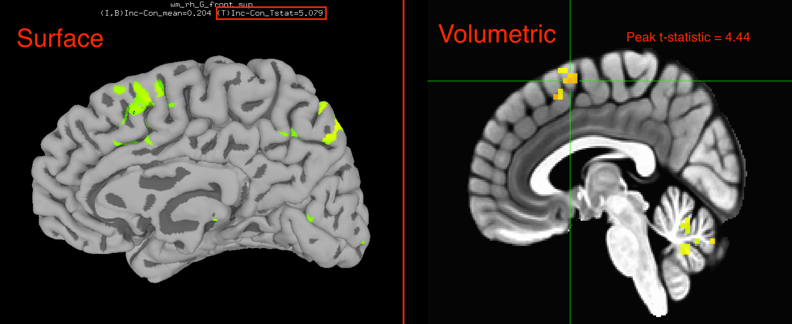
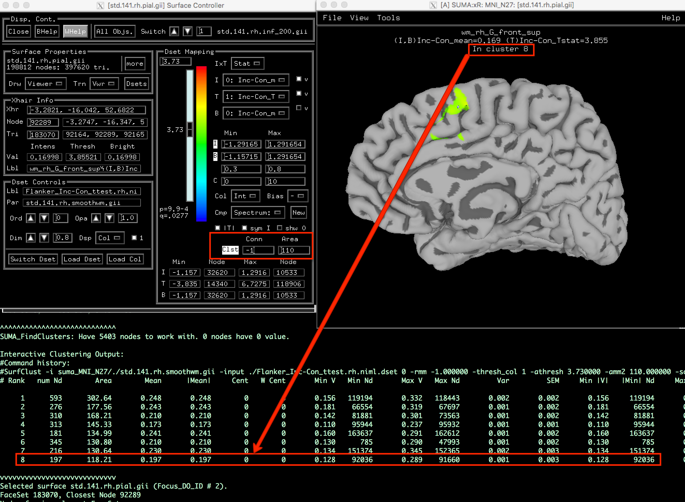

.. _SUMA_04_GroupAnalysisOnTheSurface:

================================
SUMA Tutorial #4: Group Analysis
================================

------------------

As with our :ref:`group analysis of the volumetric data <AFNI_07_GroupAnalysis>`, we can average the contrast estimates over all of our subjects and display them on a template brain. See the :ref:`last tutorial <SUMA_03_AnalysisOnTheSurface>` for instructions on how to download and unpack this template brain if you have not already done so.

We can adapt the same uber_ttest.py script we created during the volumetric group analyses to analyze the surface data, making sure to append the string ``.niml.dset`` to the output in order to indicate that it is a surface file that can be read by SUMA. The framework of the t-test is the same: We load each subject's statistics file and specify the sub-brik that we want to contrast. (If you recall from viewing the individual subject results, sub-brik #10 represents the contrast estimate for Incongruent-Congruent.) We then do this for both the left and right hemispheres, since we have run separate GLMs for each side of the brain:

::
	
  #Left Hemisphere
  
  set dirA = $PWD

  # specify and possibly create results directory
  set results_dir = test.results
  if ( ! -d $results_dir ) mkdir $results_dir

  # ------------------------- process the data -------------------------

  3dttest++ -prefix $results_dir/Flanker_Inc-Con_ttest.lh.niml.dset               \
          -setA Inc-Con                                            \
             01 "$dirA/sub-01/sub-01.results_SUMA/stats.sub-01.lh.niml.dset[10]" \
             02 "$dirA/sub-02/sub-02.results_SUMA/stats.sub-02.lh.niml.dset[10]" \
             03 "$dirA/sub-03/sub-03.results_SUMA/stats.sub-03.lh.niml.dset[10]" \
             04 "$dirA/sub-04/sub-04.results_SUMA/stats.sub-04.lh.niml.dset[10]" \
             05 "$dirA/sub-05/sub-05.results_SUMA/stats.sub-05.lh.niml.dset[10]" \
             06 "$dirA/sub-06/sub-06.results_SUMA/stats.sub-06.lh.niml.dset[10]" \
             07 "$dirA/sub-07/sub-07.results_SUMA/stats.sub-07.lh.niml.dset[10]" \
             08 "$dirA/sub-08/sub-08.results_SUMA/stats.sub-08.lh.niml.dset[10]" \
             09 "$dirA/sub-09/sub-09.results_SUMA/stats.sub-09.lh.niml.dset[10]" \
             10 "$dirA/sub-10/sub-10.results_SUMA/stats.sub-10.lh.niml.dset[10]" \
             11 "$dirA/sub-11/sub-11.results_SUMA/stats.sub-11.lh.niml.dset[10]" \
             12 "$dirA/sub-12/sub-12.results_SUMA/stats.sub-12.lh.niml.dset[10]" \
             13 "$dirA/sub-13/sub-13.results_SUMA/stats.sub-13.lh.niml.dset[10]" \
             14 "$dirA/sub-14/sub-14.results_SUMA/stats.sub-14.lh.niml.dset[10]" \
             15 "$dirA/sub-15/sub-15.results_SUMA/stats.sub-15.lh.niml.dset[10]" \
             16 "$dirA/sub-16/sub-16.results_SUMA/stats.sub-16.lh.niml.dset[10]" \
             17 "$dirA/sub-17/sub-17.results_SUMA/stats.sub-17.lh.niml.dset[10]" \
             18 "$dirA/sub-18/sub-18.results_SUMA/stats.sub-18.lh.niml.dset[10]" \
             19 "$dirA/sub-19/sub-19.results_SUMA/stats.sub-19.lh.niml.dset[10]" \
             20 "$dirA/sub-20/sub-20.results_SUMA/stats.sub-20.lh.niml.dset[10]" \
             21 "$dirA/sub-21/sub-21.results_SUMA/stats.sub-21.lh.niml.dset[10]" \
             22 "$dirA/sub-22/sub-22.results_SUMA/stats.sub-22.lh.niml.dset[10]" \
             23 "$dirA/sub-23/sub-23.results_SUMA/stats.sub-23.lh.niml.dset[10]" \
             24 "$dirA/sub-24/sub-24.results_SUMA/stats.sub-24.lh.niml.dset[10]" \
             25 "$dirA/sub-25/sub-25.results_SUMA/stats.sub-25.lh.niml.dset[10]" \
             26 "$dirA/sub-26/sub-26.results_SUMA/stats.sub-26.lh.niml.dset[10]" 
	
  #Right Hemisphere

   3dttest++ -prefix $results_dir/Flanker_Inc-Con_ttest.rh.niml.dset               \
          -setA Inc-Con                                            \
	     01 "$dirA/sub-01/sub-01.results_SUMA/stats.sub-01.rh.niml.dset[10]" \
             02 "$dirA/sub-02/sub-02.results_SUMA/stats.sub-02.rh.niml.dset[10]" \
             03 "$dirA/sub-03/sub-03.results_SUMA/stats.sub-03.rh.niml.dset[10]" \
             04 "$dirA/sub-04/sub-04.results_SUMA/stats.sub-04.rh.niml.dset[10]" \
             05 "$dirA/sub-05/sub-05.results_SUMA/stats.sub-05.rh.niml.dset[10]" \
             06 "$dirA/sub-06/sub-06.results_SUMA/stats.sub-06.rh.niml.dset[10]" \
             07 "$dirA/sub-07/sub-07.results_SUMA/stats.sub-07.rh.niml.dset[10]" \
             08 "$dirA/sub-08/sub-08.results_SUMA/stats.sub-08.rh.niml.dset[10]" \
             09 "$dirA/sub-09/sub-09.results_SUMA/stats.sub-09.rh.niml.dset[10]" \
             10 "$dirA/sub-10/sub-10.results_SUMA/stats.sub-10.rh.niml.dset[10]" \
             11 "$dirA/sub-11/sub-11.results_SUMA/stats.sub-11.rh.niml.dset[10]" \
             12 "$dirA/sub-12/sub-12.results_SUMA/stats.sub-12.rh.niml.dset[10]" \
             13 "$dirA/sub-13/sub-13.results_SUMA/stats.sub-13.rh.niml.dset[10]" \
             14 "$dirA/sub-14/sub-14.results_SUMA/stats.sub-14.rh.niml.dset[10]" \
             15 "$dirA/sub-15/sub-15.results_SUMA/stats.sub-15.rh.niml.dset[10]" \
             16 "$dirA/sub-16/sub-16.results_SUMA/stats.sub-16.rh.niml.dset[10]" \
             17 "$dirA/sub-17/sub-17.results_SUMA/stats.sub-17.rh.niml.dset[10]" \
             18 "$dirA/sub-18/sub-18.results_SUMA/stats.sub-18.rh.niml.dset[10]" \
             19 "$dirA/sub-19/sub-19.results_SUMA/stats.sub-19.rh.niml.dset[10]" \
             20 "$dirA/sub-20/sub-20.results_SUMA/stats.sub-20.rh.niml.dset[10]" \
             21 "$dirA/sub-21/sub-21.results_SUMA/stats.sub-21.rh.niml.dset[10]" \
             22 "$dirA/sub-22/sub-22.results_SUMA/stats.sub-22.rh.niml.dset[10]" \
             23 "$dirA/sub-23/sub-23.results_SUMA/stats.sub-23.rh.niml.dset[10]" \
             24 "$dirA/sub-24/sub-24.results_SUMA/stats.sub-24.rh.niml.dset[10]" \
             25 "$dirA/sub-25/sub-25.results_SUMA/stats.sub-25.rh.niml.dset[10]" \
             26 "$dirA/sub-26/sub-26.results_SUMA/stats.sub-26.rh.niml.dset[10]" 

Once this code has been run, you can view the results on the surface template, opening a new viewer for each hemisphere (and making sure that the ``-spec`` file matches the hemisphere you are viewing):

::

	suma -spec suma_MNI_N27/std.141.MNI_N27_rh.spec -sv suma_MNI_N27/MNI_N27_SurfVol.nii -input Flanker_Inc-Con_ttest.rh.niml.dset 
	
	suma -spec suma_MNI_N27/std.141.MNI_N27_lh.spec -sv suma_MNI_N27/MNI_N27_SurfVol.nii -input Flanker_Inc-Con_ttest.lh.niml.dset 
	
	
If you compare the surface results to the volumetric results, you will see that a significant effect of Inc-Con is in roughly the same area: The pre-supplementary motor area, or pre-SMA. However, the surface results are stronger (a peak t-statistic in the right hemisphere of 5.079 compared to 4.44 for the volumetric results, for example), and you are able to see where the activation traces the gyri and sulci of the brain. The surface-based figures not only look better, but allow you to see more nuances in the data as well.

Multiple Comparisons Correction
*******************************

As with the volumetric analysis, we will need to correct for the number of vertices in our dataset (as opposed to the number of voxels). The commands needed to run a cluster simulation on the surface are more involved; similar to how we created an entire preprocessing script with uber_subject.py, we will create a cluster correction script with ``slow_surf_clustsim.py`` (note that this should be done for both hemispheres):

::

	slow_surf_clustsim.py -save_script surf.clustsim.001 -uvar spec_file suma_MNI_N27/std.141.MNI_N27_lh.spec \
	 -uvar surf_vol suma_MNI_N27/MNI_N27_SurfVol.nii -uvar blur 4.0 -on_surface yes -uvar pthr_list 0.001 \
	 -uvar results_dir clust.results.001
	
And then run the output script:

::

	tcsh surf.clustsim
	
This script can take a while; the total processing time may be 60-90 minutes, depending on the speed of your machine.

.. note::

	Does the Eklund et al. 2016 paper apply to surface results? According to the FreeSurfer developers, analyses of the structural data also showed the same bias towards higher smoothness than was expected by their cluster simulations, indicating the need for a cluster-defining threshold of p=0.001 or stricter in order for the cluster simulations to be accurate. I haven't read whether the same problems apply to the functional data used with SUMA, but to be on the safe side, use a cluster-defining p-threshold of p=0.001.
	
This script will generate z max images. To find the corresponding alpha p=0.05 value for an cluster-defining p-value of p=0.001, for example, type:

::

	quick.alpha.vals.py -niter 1000 z.max.area.0.001
	
Which will return two columns: the number of vertices, in square millimeters, on the left; and the corresponding corrected p-threshold on the right. Scroll down until you find the number of vertices corresponding to a corrected p-threshold of 0.05, and then threshold this number of vertices in the SUMA viewer. Whichever clusters remain will be statistically significant.

You can then view these clusters in the SUMA viewer by loading the statistics dataset onto the template, and setting the p-threshold slider to your cluster-defining p-threshold. (Note: You can set the p-threshold exactly by clicking in the field above the p-threshold slider and entering ``0.001p`` to set a vertex-wise p-threshold of p=0.001, for example.) In the fields next to ``Clst`` in the bottom right of the control panel, enter the cluster-corrected threshold in the box underneath ``Area``. For example, if we found that we need at least 110 contiguous vertices to be a statistically significant cluster, you would enter this into the field. 

Then click on the ``Clst`` string to activate the interactive Clusterize feature, which will leave in the image only those clusters that pass the threshold. A table of the significant clusters will be printed to your Terminal; right click on the clusters in the viewing window to see which cluster is centered at your cross-hairs, and match this up with the cluster "# Rank" in the table. You should see something like the figure below:

Exercises
*********

1. Switch between the different surface views using the ``,`` and ``.`` keys. In the right hemisphere, it appears that there is a significant cluster in the pre-SMA, and also in the cingulate sulcus; take a screenshot of a view that is oriented to best capture both of these effects.

2. Re-run the t-tests, this time using 3dMEMA with the REML results from the surface analysis. How do they differ from the non-REML analysis? Is it similar to the difference you observed between the REML and non-REML analyses with the volumetric data?

3. Re-run the surface analyses using a larger smoothing kernel, such as 10mm or 15mm. How do the results change? Do you think it is appropriate to use a larger smoothing kernel in this case? Why or why not?

4. See `this page <https://afni.nimh.nih.gov/pub/dist/doc/htmldoc/SUMA/Controllers.html#suma-controllers>`__ for a summary of what all the different SUMA buttons do, noting the similarity between them and the AFNI controller. Experiment with different color maps, opacities, and viewing options.
