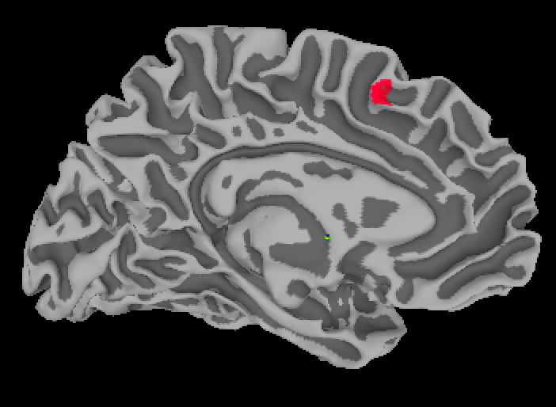

.. _SUMA_05_ROIAnalysisOnTheSurface:

=============================================
SUMA Tutorial #5: Region of Interest Analysis
=============================================

---------------

Just as with our volumetric analyses, we can extract data from a region of interest (ROI) containing only those vertices that we are interested in.

Converting Volumetric Data to the Surface
*****************************************

The SUMA viewer includes a tool for drawing ROIs on the surface; these can then we saved into .niml.dset files, and used with an ROI tool such as 3dmaskdump or 3dROIstats. Instead of doing that, however, let's assume that we want to use the same ROI as with our volumetric data - the midACC ROI created using the atlas, and the ConflictROI sphere created from the coordinates of another study.

The command ``3dVol2Surf`` can be used to convert a volumetric dataset to a surface dataset:

::

  3dVol2Surf -spec suma_MNI_N27/std.141.MNI_N27_lh.spec -sv midACC+tlrc. -surf_A lh.pial -grid_parent midACC+tlrc. -map_func mask -out_niml midACC_ROI_lh.niml.dset
  
  
This command, run from the directory containing the subjects and the ``suma_MNI_N27`` directory, resamples the midACC dataset to the surface. The ``-surf_A`` option indicates which surface to resample to - in this case, the pial surface - and ``-map_func`` specifies that the output dataset should be a mask, i.e., 1's inside the mask and 0's everywhere else. As with the other surface commands, you should do this same procedure with the right hemisphere, if the mask bridges both hemispheres:

::

  3dVol2Surf -spec suma_MNI_N27/std.141.MNI_N27_rh.spec -sv midACC+tlrc. -surf_A rh.pial -grid_parent midACC+tlrc. -map_func mask -out_niml midACC_ROI_rh.niml.dset
  
  
We can do the same thing for the Conflict ROI, e.g.:

::

  3dVol2Surf -spec suma_MNI_N27/std.141.MNI_N27_lh.spec -sv ConflictROI+tlrc. -surf_A lh.pial -grid_parent ConflictROI+tlrc. -map_func mask -out_niml ConflictROI_lh.niml.dset
  
  3dVol2Surf -spec suma_MNI_N27/std.141.MNI_N27_rh.spec -sv ConflictROI+tlrc. -surf_A rh.pial -grid_parent ConflictROI+tlrc. -map_func mask -out_niml ConflictROI_rh.niml.dset
  
  
As before, make sure to view the ROI after you have resampled it to make sure it is where you think it should be:

::

  suma -spec suma_MNI_N27/std.141.MNI_N27_lh.spec -sv suma_MNI_N27/MNI_N27_SurfVol.nii -input ConflictROI_lh.niml.dset
  
  suma -spec suma_MNI_N27/std.141.MNI_N27_rh.spec -sv suma_MNI_N27/MNI_N27_SurfVol.nii -input ConflictROI_rh.niml.dset

  
Extracting the Data
*******************

Lastly, we will need to extract the data. It is easiest to do this by concatenating all of the stats files together, and then using an ROI tool on them; however, unlike the volumetric data, 3dbucket's ``-aglueto`` option doesn't work with surface data. In this case, we will need to use 3dTcat to combine the files:

::

  for hemi in ${hemi} rh; do
  3dTcat -prefix ${hemi}_Congruent_Betas.niml.dset sub-01/sub-01.results_SUMA/stats.sub-01.${hemi}.niml.dset'[1]' \
    sub-02/sub-02.results_SUMA/stats.sub-02.${hemi}.niml.dset'[1]' \
    sub-03/sub-03.results_SUMA/stats.sub-03.${hemi}.niml.dset'[1]' \
    sub-04/sub-04.results_SUMA/stats.sub-04.${hemi}.niml.dset'[1]' \
    sub-05/sub-05.results_SUMA/stats.sub-05.${hemi}.niml.dset'[1]' \
    sub-06/sub-06.results_SUMA/stats.sub-06.${hemi}.niml.dset'[1]' \
    sub-07/sub-07.results_SUMA/stats.sub-07.${hemi}.niml.dset'[1]' \
    sub-08/sub-08.results_SUMA/stats.sub-08.${hemi}.niml.dset'[1]' \
    sub-09/sub-09.results_SUMA/stats.sub-09.${hemi}.niml.dset'[1]' \
    sub-10/sub-10.results_SUMA/stats.sub-10.${hemi}.niml.dset'[1]' \
    sub-11/sub-11.results_SUMA/stats.sub-11.${hemi}.niml.dset'[1]' \
    sub-12/sub-12.results_SUMA/stats.sub-12.${hemi}.niml.dset'[1]' \
    sub-13/sub-13.results_SUMA/stats.sub-13.${hemi}.niml.dset'[1]' \
    sub-14/sub-14.results_SUMA/stats.sub-14.${hemi}.niml.dset'[1]' \
    sub-15/sub-15.results_SUMA/stats.sub-15.${hemi}.niml.dset'[1]' \
    sub-16/sub-16.results_SUMA/stats.sub-16.${hemi}.niml.dset'[1]' \
    sub-17/sub-17.results_SUMA/stats.sub-17.${hemi}.niml.dset'[1]' \
    sub-18/sub-18.results_SUMA/stats.sub-18.${hemi}.niml.dset'[1]' \
    sub-19/sub-19.results_SUMA/stats.sub-19.${hemi}.niml.dset'[1]' \
    sub-20/sub-20.results_SUMA/stats.sub-20.${hemi}.niml.dset'[1]' \
    sub-21/sub-21.results_SUMA/stats.sub-21.${hemi}.niml.dset'[1]' \
    sub-22/sub-22.results_SUMA/stats.sub-22.${hemi}.niml.dset'[1]' \
    sub-23/sub-23.results_SUMA/stats.sub-23.${hemi}.niml.dset'[1]' \
    sub-24/sub-24.results_SUMA/stats.sub-24.${hemi}.niml.dset'[1]' \
    sub-25/sub-25.results_SUMA/stats.sub-25.${hemi}.niml.dset'[1]' \
    sub-26/sub-26.results_SUMA/stats.sub-26.${hemi}.niml.dset'[1]'
    
  3dTcat -prefix ${hemi}_Incongruent_Betas.niml.dset sub-01/sub-01.results_SUMA/stats.sub-01.${hemi}.niml.dset'[4]' \
    sub-02/sub-02.results_SUMA/stats.sub-02.${hemi}.niml.dset'[4]' \
    sub-03/sub-03.results_SUMA/stats.sub-03.${hemi}.niml.dset'[4]' \
    sub-04/sub-04.results_SUMA/stats.sub-04.${hemi}.niml.dset'[4]' \
    sub-05/sub-05.results_SUMA/stats.sub-05.${hemi}.niml.dset'[4]' \
    sub-06/sub-06.results_SUMA/stats.sub-06.${hemi}.niml.dset'[4]' \
    sub-07/sub-07.results_SUMA/stats.sub-07.${hemi}.niml.dset'[4]' \
    sub-08/sub-08.results_SUMA/stats.sub-08.${hemi}.niml.dset'[4]' \
    sub-09/sub-09.results_SUMA/stats.sub-09.${hemi}.niml.dset'[4]' \
    sub-10/sub-10.results_SUMA/stats.sub-10.${hemi}.niml.dset'[4]' \
    sub-11/sub-11.results_SUMA/stats.sub-11.${hemi}.niml.dset'[4]' \
    sub-12/sub-12.results_SUMA/stats.sub-12.${hemi}.niml.dset'[4]' \
    sub-13/sub-13.results_SUMA/stats.sub-13.${hemi}.niml.dset'[4]' \
    sub-14/sub-14.results_SUMA/stats.sub-14.${hemi}.niml.dset'[4]' \
    sub-15/sub-15.results_SUMA/stats.sub-15.${hemi}.niml.dset'[4]' \
    sub-16/sub-16.results_SUMA/stats.sub-16.${hemi}.niml.dset'[4]' \
    sub-17/sub-17.results_SUMA/stats.sub-17.${hemi}.niml.dset'[4]' \
    sub-18/sub-18.results_SUMA/stats.sub-18.${hemi}.niml.dset'[4]' \
    sub-19/sub-19.results_SUMA/stats.sub-19.${hemi}.niml.dset'[4]' \
    sub-20/sub-20.results_SUMA/stats.sub-20.${hemi}.niml.dset'[4]' \
    sub-21/sub-21.results_SUMA/stats.sub-21.${hemi}.niml.dset'[4]' \
    sub-22/sub-22.results_SUMA/stats.sub-22.${hemi}.niml.dset'[4]' \
    sub-23/sub-23.results_SUMA/stats.sub-23.${hemi}.niml.dset'[4]' \
    sub-24/sub-24.results_SUMA/stats.sub-24.${hemi}.niml.dset'[4]' \
    sub-25/sub-25.results_SUMA/stats.sub-25.${hemi}.niml.dset'[4]' \
    sub-26/sub-26.results_SUMA/stats.sub-26.${hemi}.niml.dset'[4]' 
  done

.. note::

  To find the sub-briks that correspond to the Congruent and Incongruent beta weights, you can use ``3dinfo``.

And then extract them with 3dROIstats:

::
 
  for hemi in lh rh; do
    echo "Extracting Congruent beta weights for ${hemi}"
    3dROIstats -quiet -mask ConflictROI_${hemi}.niml.dset ${hemi}_Congruent_Betas.niml.dset
    echo "Extracting Incongruent beta weights for ${hemi}"
    3dROIstats -quiet -mask ConflictROI_${hemi}.niml.dset ${hemi}_Incongruent_Betas.niml.dset
  done
  
If this is done correctly, you should see a significant effect of Incongruent-Congruent in the right hemisphere, but *not* in the left hemisphere. This is another advantage of surface-based analyses: You are able to better discern where exactly in the brain the activation is located.

.. warning::

  When performing the same t-test across both hemispheres, be sure to divide the p-value by 2 to account for multiple comparisons.
