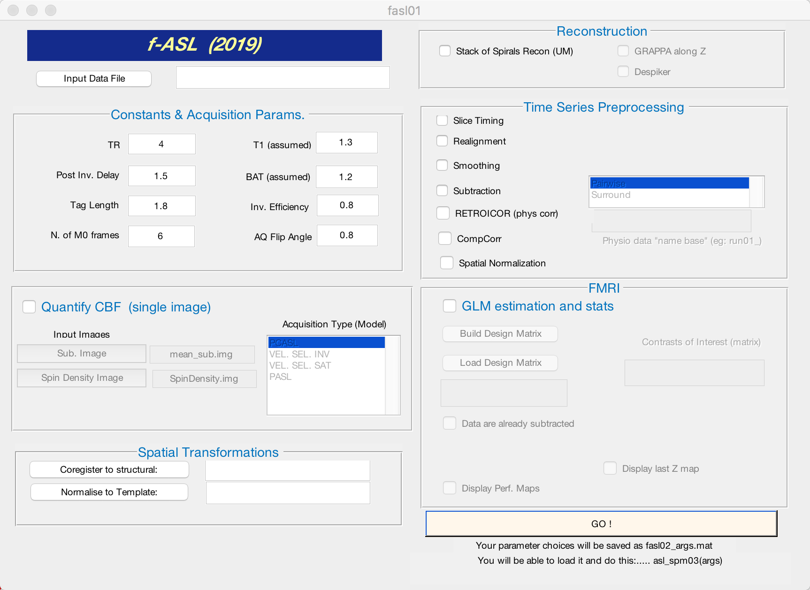
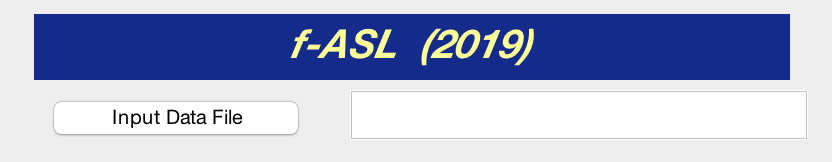
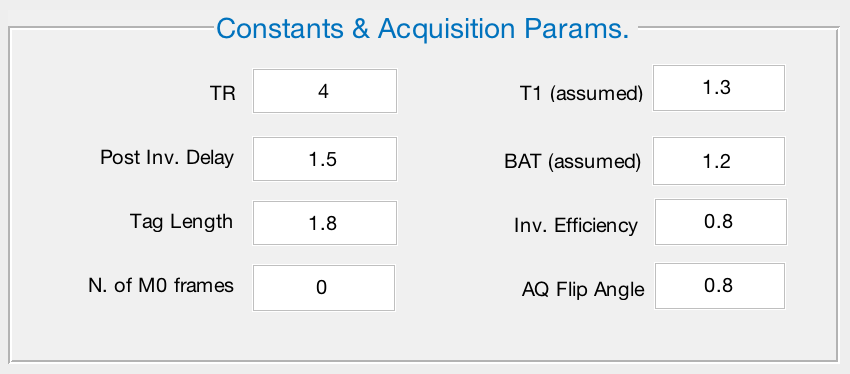
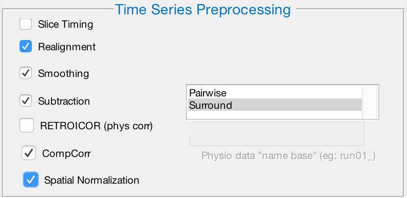
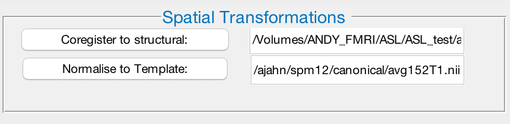
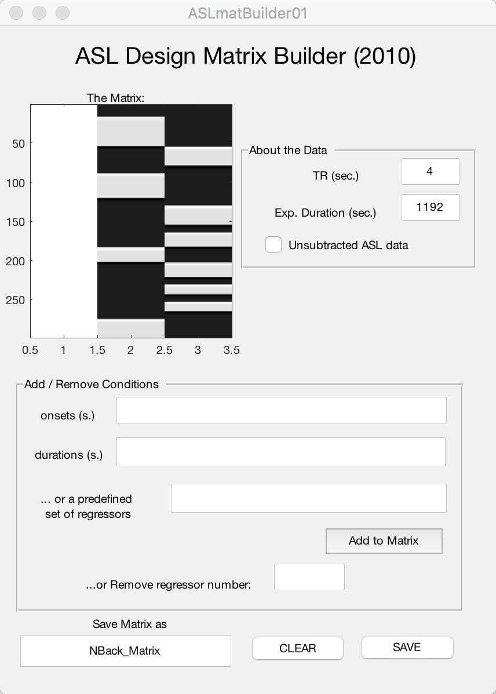
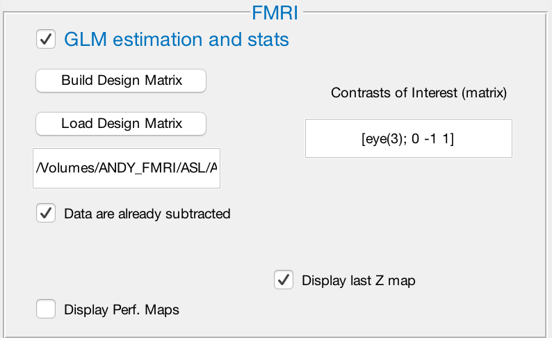

.. _04_fASL_GUI:

=========================
fASL Tutorial #4: The GUI
=========================

----------

Overview of the GUI
*******************

Navigate to the directory that contains ``run_1`` and ``run_2``. When you open the fASL GUI by typing ``fasl02`` from the command line in Matlab, you will see this window:

  
The GUI is divided into several windows, each responsible for a different aspect of ASL processing. Certain steps are greyed out, and only become useable when a box is checked - for example, you won't be able to create a design matrix unless you check the box next to ``GLM estimation and stats``. We will walk through what each step does, and which options you may want to change in order to adapt them to your analysis.

.. note::

  Not all of the steps are needed to analyze the dataset. For the purposes of this tutorial, we will omit the ``Quantify CBF`` and ``Reconstruction`` steps.

Input Data File (Required)
^^^^^^^^^^^^^^^^^^^^^^^^^^

Click the button ``Input Data File`` to open a window that you can use to select your input data. The ASL data has already been reconstructed for you - that is, it has been converted to a format that can be analyzed with SPM's preprocessing tools. Navigate to the directory ``run_2/func``, select the file ``run_2.nii``, and then click ``Open``.

.. note::

  fASL is able to reconstruct raw data as well. In that case, you would load your raw data, and then check the box next to ``Stack of Spirals Recon (UM)`` in the ``Reconstruction`` box. Check with your scan technician whether the scan used GRAPPA along the Z-axis; if so, check the corresponding box.
  
  
Constants & Acquisition Params
^^^^^^^^^^^^^^^^^^^^^^^^^^^^^^

This window contains the parameters that were used to acquire the scan, such as TR, T1 decay, and arterial transit time. We will only change one of the defaults: Decrease the ``N. of M0 frames`` from 6 to 0. When you are finished, the window should look like this:

Time Series Preprocessing
^^^^^^^^^^^^^^^^^^^^^^^^^

These steps are similar to the preprocessing steps described in the :ref:`FSL Short Course <fMRI_04_Preprocessing>`; review those steps for more details about what each one does.

Since these reconstructed data have already been slice-time corrected, leave that box unchecked. We also do not have physiological regressors for this data set, so we will leave that box unchecked as well. Check the rest of the boxes: Realignment, Smoothing, Subtraction, CompCorr, and Spatial Normalization. After you have checked the box next to Subtraction, you will have two options to choose from: **Pairwise** and **Surround**. These refer to how the contrast images are created from subtracting the control images from the label images. Pairwise subtracts each image from its neighbor, while Surround takes a triplet of images, multiplies the middle one by two, and subtracts it from the surrounding images. In this experiment, we acquired the ASL images with a Surround paradigm - select that option by clicking on it with your mouse.

  The preprocessing window should have these boxes checked, and the Surround option highlighted.
  
  
Spatial Transformations
^^^^^^^^^^^^^^^^^^^^^^^

Since we have decided to do Spatial Normalization by checking that box in the Time Series Preprocessing window, we will need to point to the location of the subject's anatomical image, and a template image to normalize the data to. Click on ``Coregister to Structural``, and navigate to the subject's ``anatomy`` directory. Select ``anat_ss.nii``, which is a skull-stripped anatomical dataset.

Next, click on ``Normalise to Template``. Any normalized template can be used; in this example, we will use one of SPM's standard templates. Navigate to the ``ASL_Lab`` directory, and select the image ``avg152_T1.nii``.

----------

FMRI
****

Now that we have all of the preprocessing steps ready to go, we will create a general linear model to analyze the data once it has been preprocessed. This will require creating a design matrix indicating which condition occurred at which time, and for what duration. We will also specify which conditions we want to contrast against each other - which in this example will be the 4-back compared to the 1-back task. The resulting image will show differences in cerebral blood flow between those conditions.

To begin, click on ``Build Design Matrix``. This will open up another window that says ``ASL Design Matrix Builder``. In the field next to ``TR (sec.)``, enter the number ``4``. In the ``Exp. Duration (sec.) field, enter ``1192``. Leave unchecked the box next to ``Unsubtracted ASL data``.

.. note::

  If you were to look at the header of the unprocessed functional data, you would notice that there 300 time points. Since the TR is 4 seconds, it follows that the total duration of the run is 1200 seconds. Why then do we type 1192 in this window? When we specified Surround subtraction in the Time Series Preprocessing window, this indicated to fASL to remove the first and last TRs from the time series, as they do not have both left and right neighboring volumes. This change in the duration of the run will also be reflected in the Onsets field below, which we turn to next.
  
  
In the ``onsets (s.)`` field, type the following string:

::

  [65 355 733 1098]-8
  
These are the onsets for the **1-back** condition. We place the onsets in brackets, and then append -8 at the end; this will subtract 8 from each of the onset times, corresponding to the removal of the first and last TRs of the run (2 TRs of 4 seconds each = 8 seconds).

Next, in the ``durations (s.)`` field, type:

::

  [149 125 72 96]
  
These numbers represent the length of each block of the condition, with the beginning of the block specified by the onsets above. For example, the first block of the 1-back task started 65 seconds into the scan, and lasted for 149 seconds. Another block of 1-back trials occurred 355 seconds into the scan and lasted for 125 seconds, and so on.

Now click the button ``Add to Matrix``. This will add a column to the matrix which contains bands of grey overlaying a column of black. The grey bands indicate when the 1-back condition was presented to the subject. In the design matrix, time is represented as starting at the top (i.e., timepoint 0) and ending at the bottom. You should see how the onsets and the durations correspond to the location and length of each of the grey bands.

We will add another column for the 4-back task. Enter the following onsets:

::

  [219 520 656 810 922 1010]-8
  
And the following durations:

::

  [96 96 72 72 48 48]
  
Then click ``Add to Matrix``. Lastly, in the field under ``Save Matrix as``, type ``NBack_Matrix`` and click ``SAVE``. When you have done that, close out of the window.  If you have done everything correctly, your design matrix should look like this:

.. note::

  If you made any mistakes in the onset or duration vectors and accidentally added it to the matrix, you have two options: 1) Click the ``CLEAR`` button to remove all of the regressors and begin from scratch; or 2) Enter the regressor number in the ``Remove regressor number`` field. In the completed example above, there are three regressors: The first one, an all-white column, represents the baseline regressor; and next two represent the 1-back and 4-back regressors. If you wanted to delete the regressor for the 1-back task, for example, you would type the number ``2`` into the field and press enter. You should see it disappear from the matrix. 
  
  To keep everything in order, if you do have to remove a regressor, we recommend clearing everything and starting over. This will keep the regressors in the correct order for specifying the contrast weights, which we will now review.
  
  
Contrast weights
^^^^^^^^^^^^^^^^
  
Click on ``Load Design Matrix`` and select the NBack_Matrix you just created. fASL will display a figure showing the matrix you just created; make sure it looks like the matrix above, and then close the figure.

.. note::

  If you are having trouble creating the design matrix, we have already created one for you. Click on ``Load Design Matrix``, navigate to the main ``ASL_Lab`` directory, and select ``NBack_Matrix``.

In the ``Contrasts of Interest (matrix)`` field, type the following:

::

  [eye(3); 0 -1 1]
  
This is Matlab syntax which creates a 3x3 identity matrix, and then adds another row (0 -1 1). Although you can't see it here, keep in mind that this line expands to:

::

  1 0 0
  0 1 0
  0 0 1
  0 -1 1
  
In other words, 4 contrasts will be created: One simple effect for each regressor in the model, and one contrast between the 4-back and 1-back tasks. Take a moment to think about why we specified the last line the way we did; do these contrast weights make sense given the order of the regressors in the design matrix?

Make sure that the boxes are checked next to ``Data are already subtracted`` and ``Display last Z map``. The FMRI window should look like this:

  
  
When you have reviewed everything and it looks correct, press ``GO!`` to begin the analysis. It should take about 5-10 minutes. When it finishes, you will see several figures printed to the screen and several new files written to your directory; we will explain what they are in the next section.
  

  
