.. _05_fASL_Results:

=======================================
fASL Tutorial #5: Examining the Results
=======================================

------------

Overview
********

After running the analysis, a series of figures will be displayed on your screen - in total, there are 12 figures that are generated. We will group them into the following categories to make it easier to understand them:

* Figures 3 and 4 are the **Time-Series** figures;
* Figures 2, 5, and 6 are the **CompCorr** figures;
* Figures 1, 7, and 8 are the **Design Matrix** figures;
* Figures 9, 10, 11, and 12 are the **Results** figures.

We will explain each of these groups in turn.

The Time-Series Figures
***********************

Figure 3 shows the *unsubtracted* time-series across the brain. The panels in the upper-right, top-left, and bottom-left show the coronal, sagittal, and axial views of the image. The figure may be a little blurry, but you should be able to make out the basic structures of the brain, such as the ventricles and the corpus callosum.

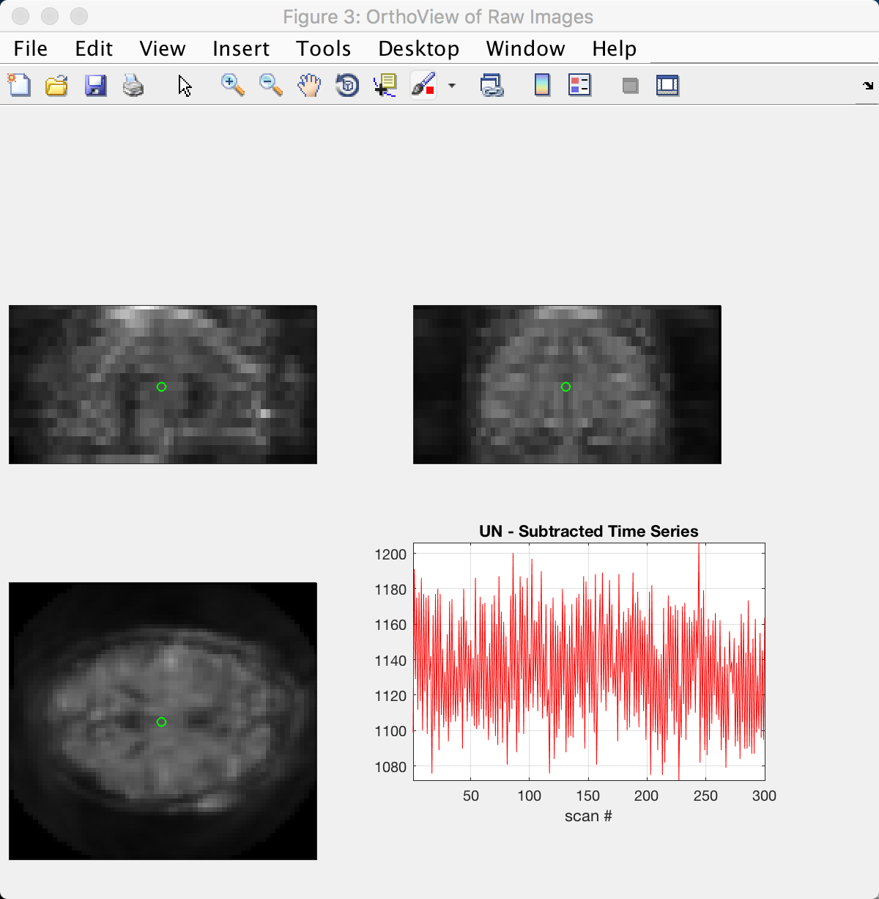

The structures become clearer in Figure 4, which shows the *subtracted* time-series. In the axial slice, you can see brighter colors in the fronto-lateral parts of the brain; this makes sense, given that the subject performed an N-back task which is associated with greater activation in these regions. 

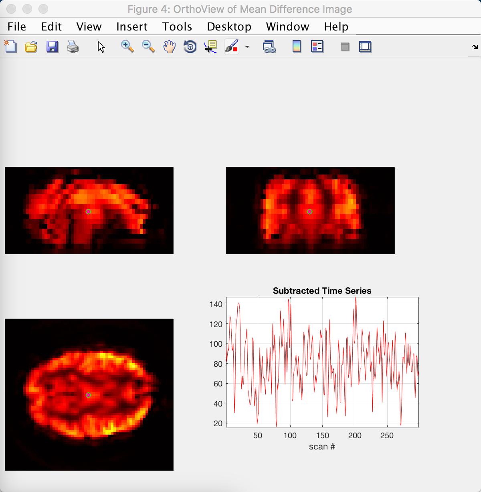

The CompCorr Figures
********************

The next group of figures show the results of using *CompCorr*, which identifies components capturing noise in the brain and then regresses them out of the data. Figure 2 shows the voxels (or pixels in this figure, as they are depicted on a 2-dimensional slice) that are used for the CompCorr analysis; voxels with a particularly high standard deviation are good candidates, because high variance in the data is usually associated with physiological noise and head movement. These voxels are usually found around the edge of the head, as well as within the ventricles and major arteries.

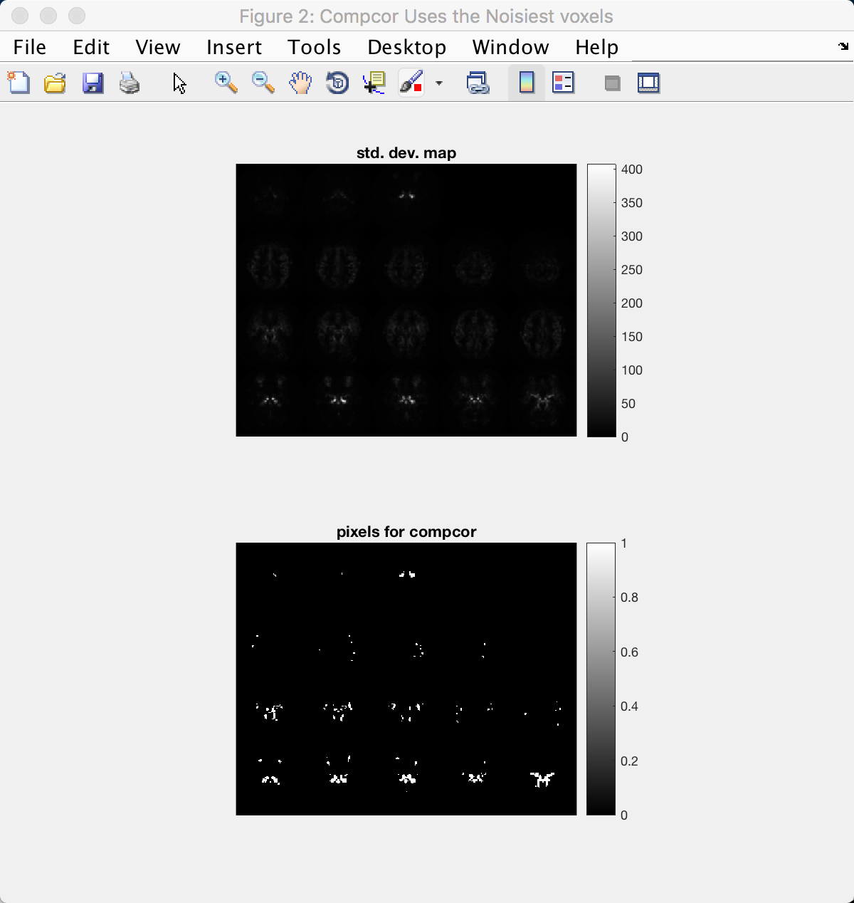

CompCorr then generates twelve components from these voxels as see in Figure 5. Note that line in the upper panel tapers off and bends around the 12th component, as depicted on the x-axis. This is a heuristic used to determine a balance between choosing too many components (which may result in overfitting and loss of degrees of freedom), and choosing too few (which may not capture the full range of noise components in the data).

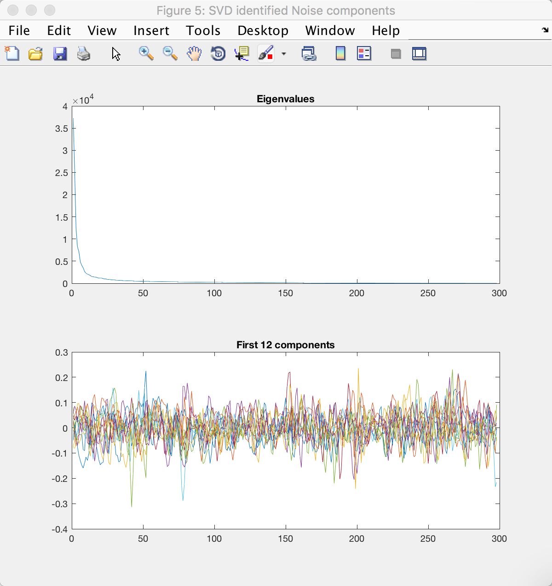

The last figure in this group compares the standard deviation map of the data before and after CompCorr. Note the change in scale on the y-axis; the maximum value has decreased by nearly ten-fold, and the variance is more evenly distributed throughout the brain.

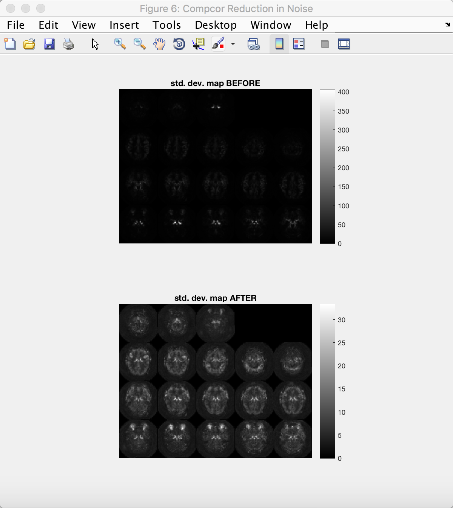

The Design Matrix Figures
*************************

We will next examine the design matrices before and after CompCorr is applied to the data. Figure 1 is the same as what you saw in the previous tutorial when you set up your design matrix; the scan number is on the y-axis, and the regressors are represented by the columns. Make sure this looks the same as before.

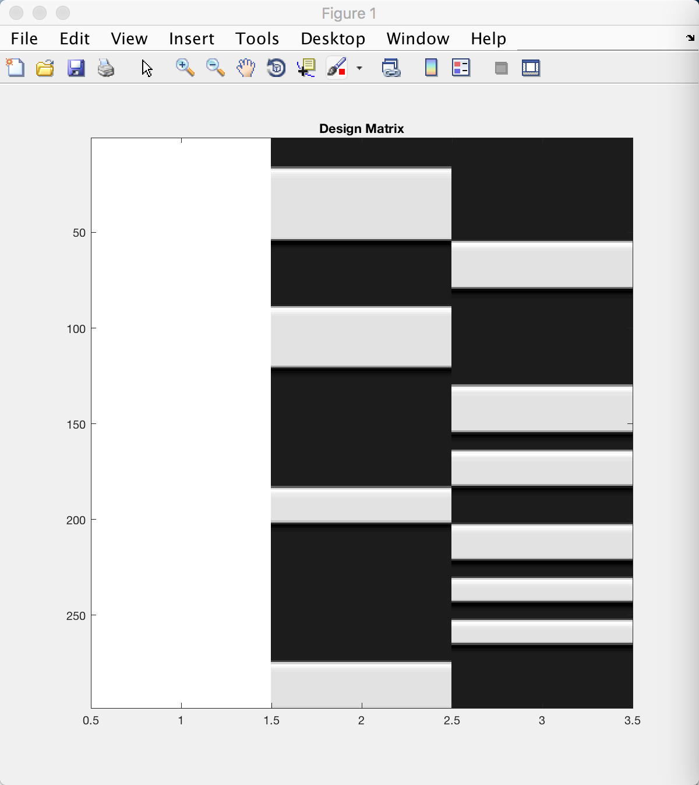

Figure 7 shows the same three columns, plus the additional twelve component regressors that were generated by CompCorr; in total there should be fifteen columns. This model will be fit at each voxel the same way that we do in a typical fMRI analysis, and any variance explained by noise in the data should be modeled (or "load onto") one of the CompCorr components.

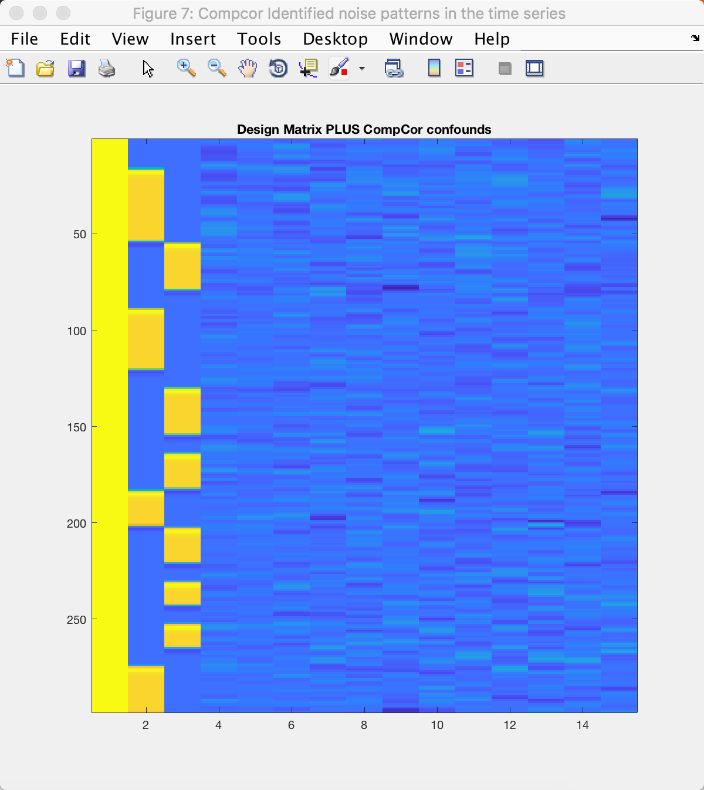

The contrasts that you created are shown in the right panel of Figure 8. (The left panel shows the same design matrix as in Figure 7, but in greyscale.) Each row depicts a different contrast; a white bar represents a contrast weight of 1, and a black bar represents a contrast weight of -1. Compare this with the contrast matrix you created previously, and see how the numbers correspond to the black and white bars of this figure.

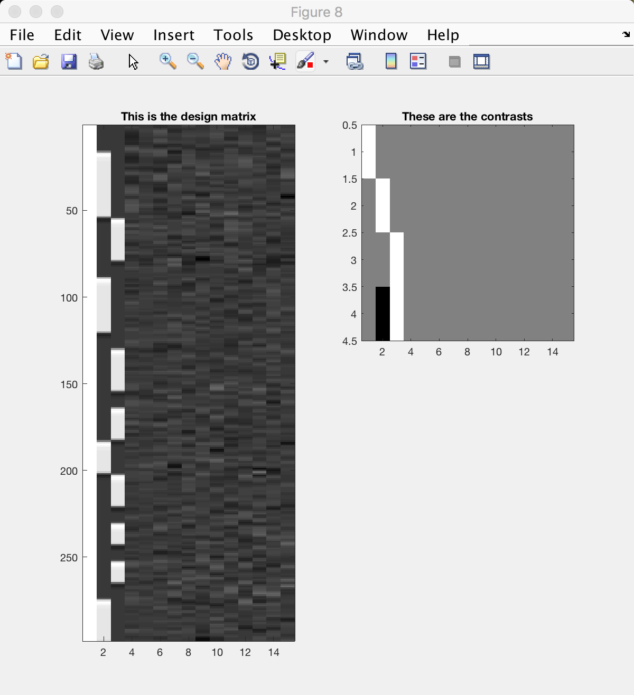

The Results Figures
*******************

The last group of figures show the results of your analysis, weighted by the contrasts specified above - one figure is generated for each contrast.

Figure 9 depicts the first contrast, which compares the data to baseline. (This figure and the following ones are displayed in *lightbox view*, which shows a series of axial slices starting at the top of the brain in the top-right panel, and descending slice by slice to the left and down.) Virtually every voxel within the brain should be active, as represented by yellow and red colors; some of the voxels outside the brain will be blue.

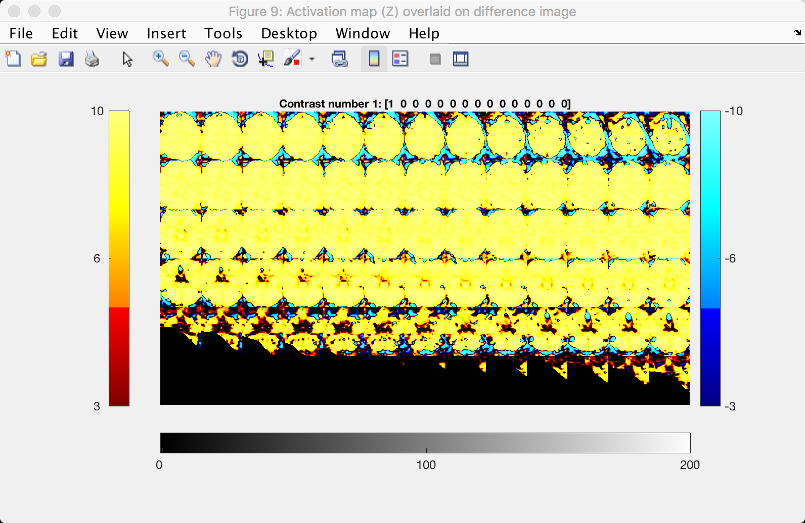

The activation of the 1-back and 4-back conditions, as compared to baseline, is shown in Figures 10 and 11:

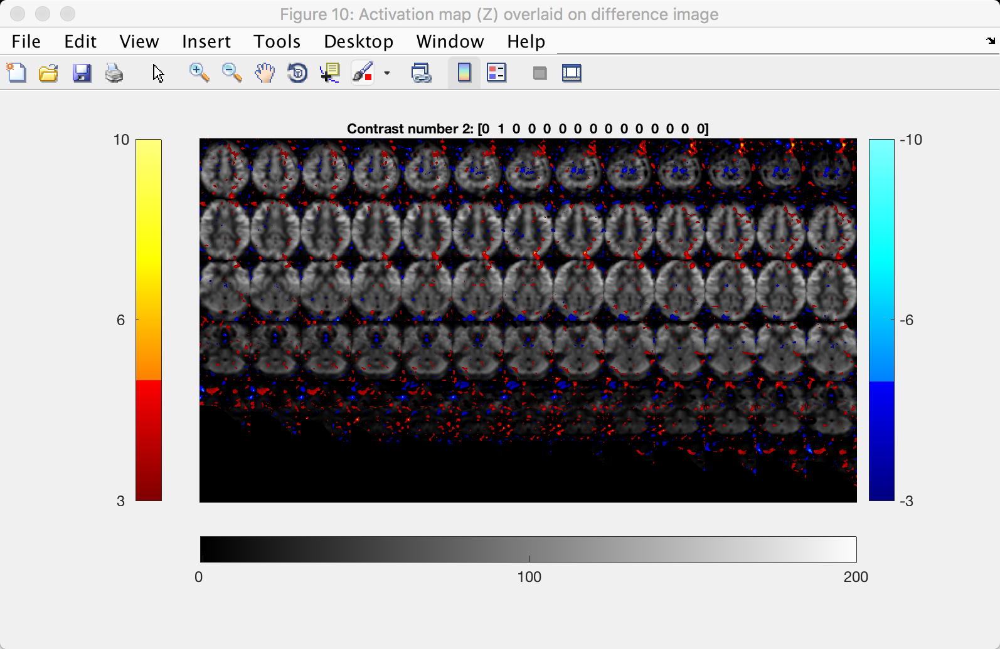

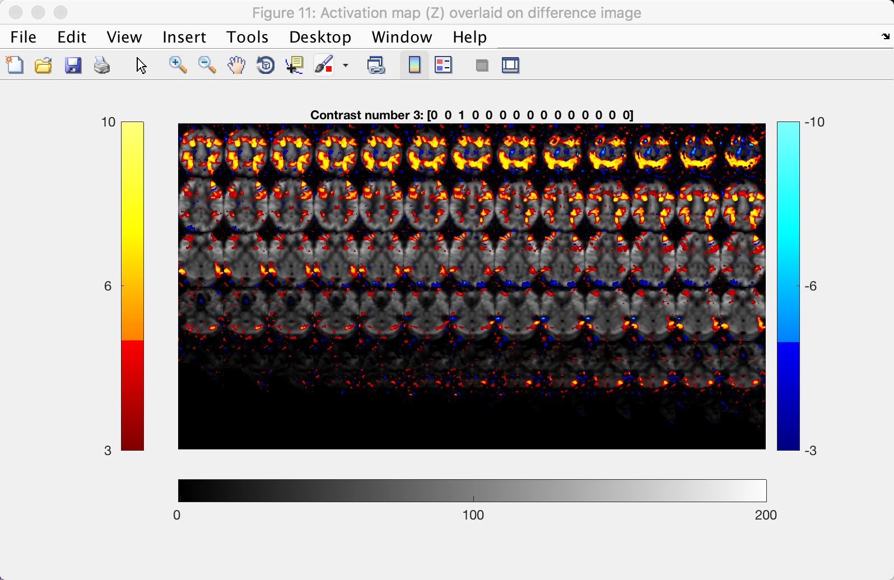

Lastly, the contrast between the 4-back and 1-back tasks is shown in the last figure, Figure 12:

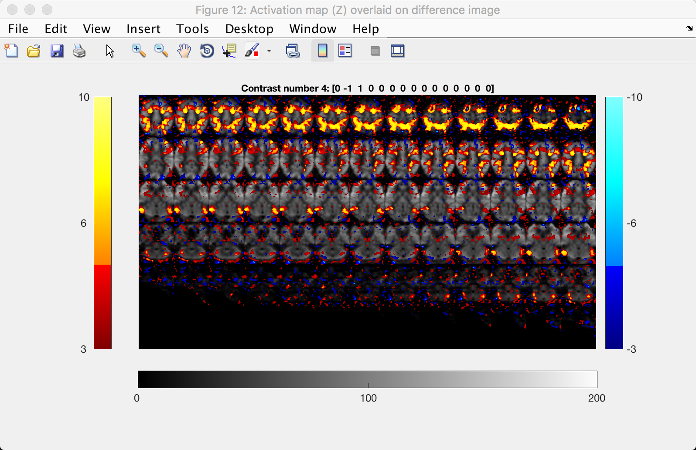

Note the higher CBF values in the fronto-lateral regions, which is what we would expect in a working memory task.
