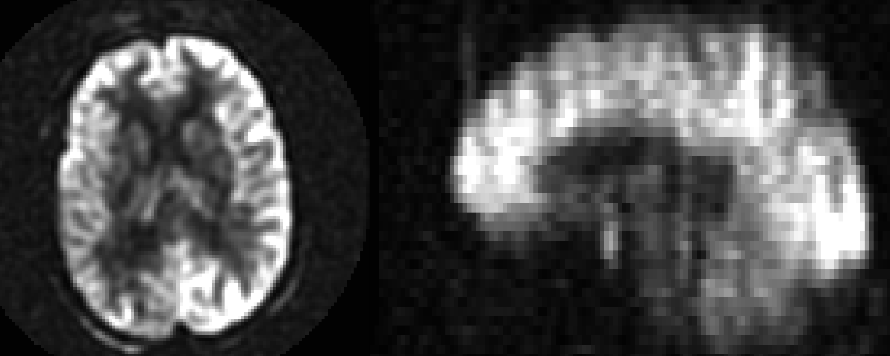
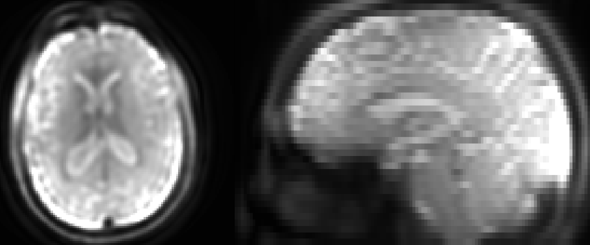
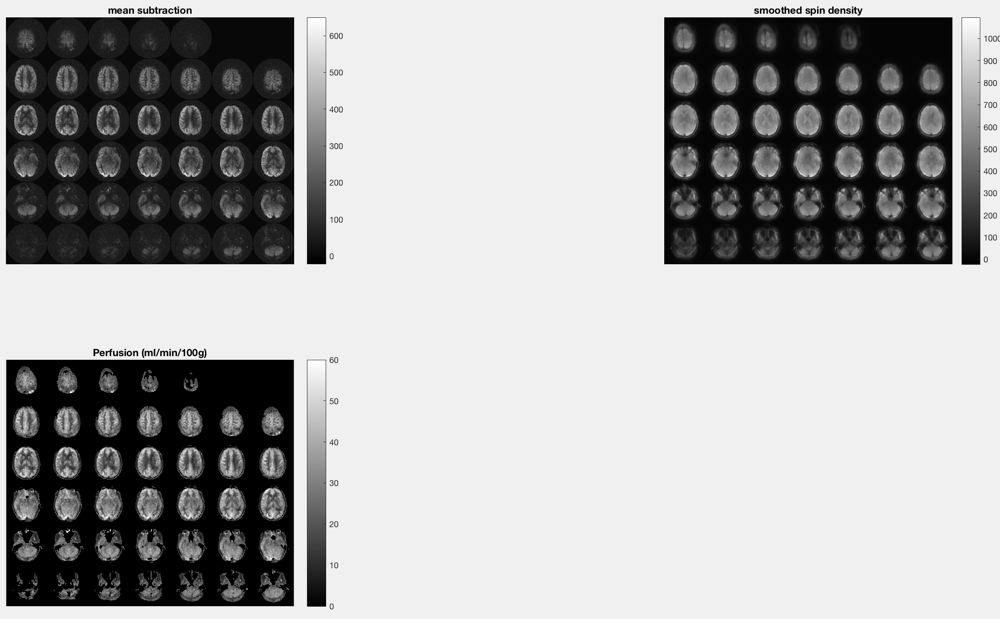

.. _06_fASL_Quantification:

================================
fASL Tutorial #6: Quantification
================================

------------

Overview
********

One of the benefits of Arterial Spin Labeling is the ability to **quantify** the amount of blood flow, or perfusion, in a particular region of the brain. In contrast to an imaging modality such as fMRI, for example, ASL data can be quantified in units that have an interpretable value and can be directly compared across studies.

General Electric (GE) scanners generate raw ASL data in files known as **P-files**. These raw files can be read by the fASL GUI by loading them in the ``Input`` field, and preprocessed as in the earlier tutorials. In addition, GE scanners create an image with the label "vasc" prepended to it, indicating that much of the preprocessing has already been done on this data. This image contains two volumes: The first volume is the mean of the subtraction between the Tag and the Control images, and the second volume is the Spin Density image. Both are needed to calculate the amount of perfusion at each voxel.

  An example Mean Subtraction image.

  An example Spin Density image.

Scaling the Images
******************

Due to ceiling effects when collecting the data, the perfusion images are scaled to a much higher number than is biologically plausible; therefore one needs to "undo" this scaling. In our example, the images were scaled by 32, and then by 3. We need then to divide the images by 32, and then by 3. This is achieved by typing ``1/32/3`` in the "Scanner Scaling" box of the GUI:

.. figure:: 06_ScannerScaling.png

.. warning::

  The scaling factor of the ASL images may differ between scanners; make sure to check with your GE technican about how much the images were scaled.

Once you have entered the appropriate scaling factor, check the box next to "Quantify CBF (single image)". If quantification is all you want to do, click the ``Go!`` button.

Viewing the Output
******************

fASL will generate a "lightbox" figures (i.e., individual slices laid out in a montage) for the Mean Subtraction, Spin Density, and Perfusion images. Each of the images should have the anterior part of the head oriented toward the top of your screen, and you should be able to discern the gross anatomy of the brain in each of the images. The perfusion images are scaled to be between 0 and 60 ml/min/100g, with brighter areas located in the grey matter. If the entire perfusion image is uniformly bright, you may have to use a different scaling factor.

  
