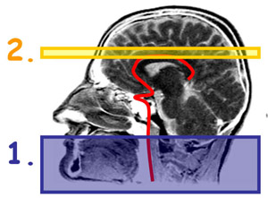
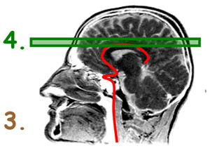
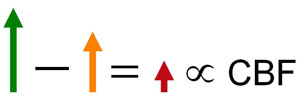

.. _ASL:

Overview of ASL
==========

.. note::
  This page is under construction; it is being designed for an ASL tutorial and practical exercises with ASL data. It may be relocated to another repository in the future.
  

Arterial Spin Labeling (ASL) is a neuroimaging technique that measures the perfusion of blood in the brain. In contrast to fMRI, which measures signal that is several steps removed from neuronal firing, ASL directly measures signal caused by changes in blood flow. As a result, it is a useful tool for studying perfusion changes in both patient populations (such as people with strokes, hemorrhages, or other pathologies) and healthy subjects (e.g., blood flow changes as a result of exercising).

ASL Summary
---------

.. note::
  The following images are taken from Luis Hernandez-Garcia's `webpage <http://fmri.research.umich.edu/research/main_topics/asl.php>`__.
  
The following pictures illustrate a typical ASL analysis:

  Incoming arterial blood to the brain is "tagged" by a radiofrequency pulse \(1\). A **Tag Image** is acquired that includes brain tissue \(2\). This can be a single slice, or a volume encompassing the entire brain.
  

  The experiment is repeated without tagging any incoming arterial blood \(3\). A **Control Image** is then acquired in the same area as the previous Tag Image \(4\).
  

  The difference between the Control Image and the Tag Image is then calculated to create a **Contrast Image** \(5\).
  
  
  
  Now that you have a basic understanding of how ASL works, click on the Next button to see examples of different approaches to ASL perfusion imaging.
