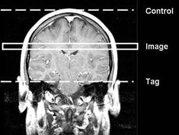
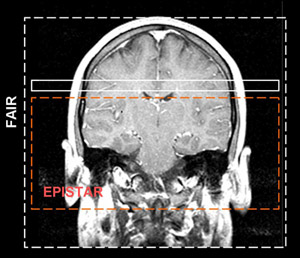

.. _ASL_Techniques:

============================
fASL Tutorial #1: Background
============================

There are several approaches to ASL perfusion imaging:

CASL
---------

CASL, or **continous ASL**, where the inversion of the arterial blood occurs continuously through the application of a continuous RF pulse. During the acquisition of the control image, an RF pulse is supplied above the image slice to account for magnetic distortions caused by the pulse itself, but the pulse itself will not label any blood. This method of inversion is also called flow-driven inversion.

PASL
---------

PASL, or **pulsed ASL**, where the inversion of the arterial blood occurs over a specific area. The RF pulse is applied in a spatially selective manner (slice-specific). Several versions exist, including EPISTAR (echo planar imaging and signal targeting with alternating radiofrequency) and FAIR (flow-sensitive alternating inversion recovery). Please refer to the image on the right. These methods of inversion are also referred to as spatial inversion.

ASL vs. BOLD fMRI
---------------

How do the results obtained from ASL experiments differ from those obtained with BOLD? How do BOLD and ASL differ?

* ASL noise is a lot whiter than BOLD noise (Wang 2003).
* ASL does not require contrast agents.
* Changes in perfusion are more localized to the parenchyma, whereas BOLD changes are tied to the veins and venules (Duong 2002).
* It does take longer to collect a single ASL image, though, but we can go as fast as 2.5 seconds for a subtraction pair with our methods. After sinc subtraction, we end up with an ASL image every 1.2 seconds. With BOLD we can get the images in less than 500 msec.
* We get less slices at a time with ASL, and they tend to be thicker.

* In addition to the items mentioned above, it also turns out that the change in ASL signal that results from activation is cleaner than what is normally observed in utilizing your average BOLD technique. This is illustrated in the image given on the right which shows the results of an experiment that was first conducted using CASL and then repeated using BOLD.

.. figure:: asl_vs_bold.jpg

    The top row shows 2-coil CASL images and the bottom one shows BOLD images. We used the same TR (4 seconds) and spiral acquisition in both ASL and BOLD. The left column of images were averaged over 4 minutes of rest. The middle column of images were averaged over four minutes of finger tapping. The right column is simply the difference of the other two columns - No modeling, filtering, regressing, or anything. Just subtraction.
    
As you can see, ASL images are intrinsically a lot noisier, in fact, they look awful, you can barely see the white mater... but the change in ASL signal that results from activation is huge (we observe 50%, or even more).

Next Steps
---------

Now that you've become familiar with different approaches to ASL analysis, click on the Next button to learn how to download ASL software and a sample dataset to analyze.
