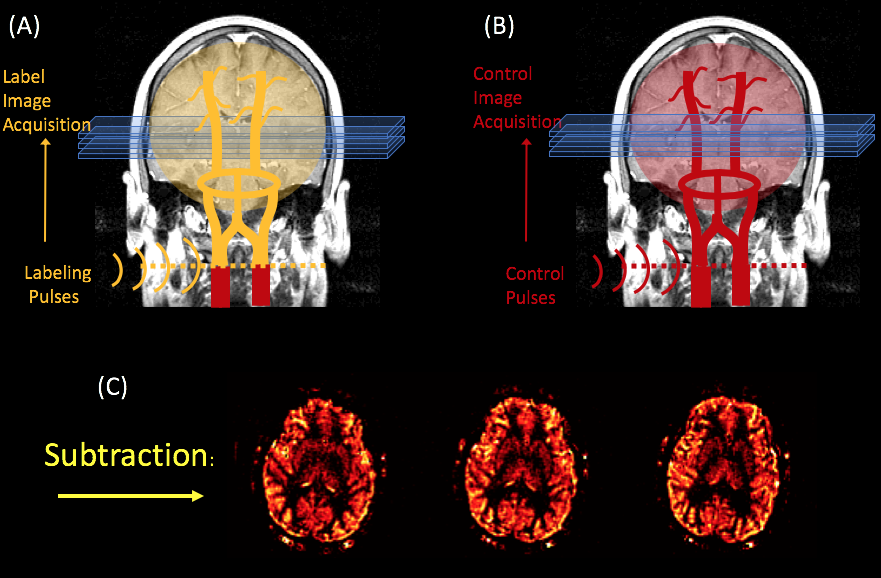
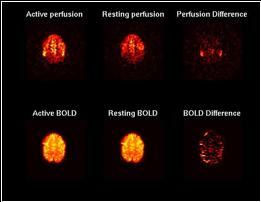

.. _ASL_Techniques:

============================
fASL Tutorial #1: Background
============================

-------------

Overview
***********

Throughout the 1980's and early 1990's, neuroimaging researchers would measure the contrast between brain tissues using methods such as positron emission tomography, or PET. This involves injecting a radioactive glucose tracer that is absorbed by neurons when they tfire. By taking images of the brain under different experimental conditions, such as seeing a flashing checkerboard or doing a cognitively demanding problem, researchers could see which regions were more active compared to other regions.

However, this method is invasive, and the idea of being injected with a radioactive tracer deterred many people from being subjects in such experiments. By the early 1990’s, an alternative imaging technique called magnetic resonance imaging (MRI) had become much faster and less expensive, and researchers were looking for a way to make it more widespread for clinical use. It was soon discovered that more deoxygenated blood leads to a decrease in the signal measured from a brain region. An increase in oxygenated blood, on the other hand, increases the signal - and this increase in oxygenated blood was later shown to be correlated with increased neural firing. This change in signal is known as blood oxygen level dependent signal (or BOLD signal).

An alternative method to image brain activity is to look at the perfusion rate, since perfusion also goes up when the brain is more active. Adding radioactive water to the blood could be used to measure the perfusion rate using PET, and this could be used as a surrogate for brain activity.

However, there is an alternative to this:  Instead of injecting a tracer into the blood and following it into the tissue, we can “create” a tracer in the blood by changing its magnetization state. Arterial Spin Labeling (ASL), uses radiofrequency pulses to continuously excite the inflowing blood - usually at the neck. After a couple of seconds (an interval referred to as the **bolus arrival time**), a **labeled image** of the brain is acquired which is sensitized to pick up signal from the labeled blood. In order to quantify how much of the labeled blood has perfused the tissue, a **control image** (without the label) is acquired to compare against the labeled image.

.. figure:: 01_ASL_Demonstration.gif

    Animation by Luis Hernandez-Garcia

However, CASL is relatively slow, difficult to implement on clinical scanners, and is susceptible to **magnetization transfer** effects. An alternative method called **pseudo-Continuous Arterial Spin Labeling (p-CASL)** applies a series of short radiofrequency pulses at a target slice, which achieves the same efficiency as CASL, but with lower magnetiziation transfer effects and lower SAR.    

    An illustration of the pCASL method. A radiofrequency pulse inverts the spins of arterial water as it crosses a plane through the neck, after which a "label" image is acquired (A). A second “control” image is acquired without the label (B). The subtraction of these two images yields a perfusion weighted image (C). Figure created by Luis Hernandez-Garcia.

ASL vs. BOLD fMRI
^^^^^^^^^^^

Although both ASL and BOLD contrast are used to measure brain activity, there are several important differences between the two:

* ASL noise is whiter than BOLD noise (Wang 2003).
* Changes in perfusion are more localized to the parenchyma, whereas BOLD changes are tied to the veins and venules (Duong 2002).
* It takes longer to collect a single ASL image - around 1.2-2.5 seconds, versus 500ms for BOLD images acquired with multiband.
* We acquire less slices at a time with ASL, and they tend to be thicker (i.e., the spatial resolution is lower compared to BOLD imaging).

* ASL signal is cleaner than what is normally observed in BOLD data. This is illustrated in the image given on the right which shows the results of an experiment that was first conducted using ASL, and then repeated using BOLD.

    The top row shows ASL images and the bottom one shows BOLD images. Both used a TR of 4 seconds and were generated using spiral acquisition. The left column of images were averaged over 4 minutes of rest, while the middle column of images were averaged over four minutes of finger tapping. The right column shows the difference of the left two columns without modeling, filtering, or regressing. Just subtraction.
    
As you can see, ASL images are noisier. [This was taken from the text listed on the fASL webpage; how does this make sense given the statement above about how ASL signal is cleaner than BOLD data?]  However, the change in ASL signal that results from activation is much larger than with other imaging techniques - changes of 50% or more are not uncommon.

------------

Next Steps
**********

Now that you've become familiar with different approaches to ASL analysis, click on the ``Next`` button to learn how to download ASL software and a sample dataset to analyze.
