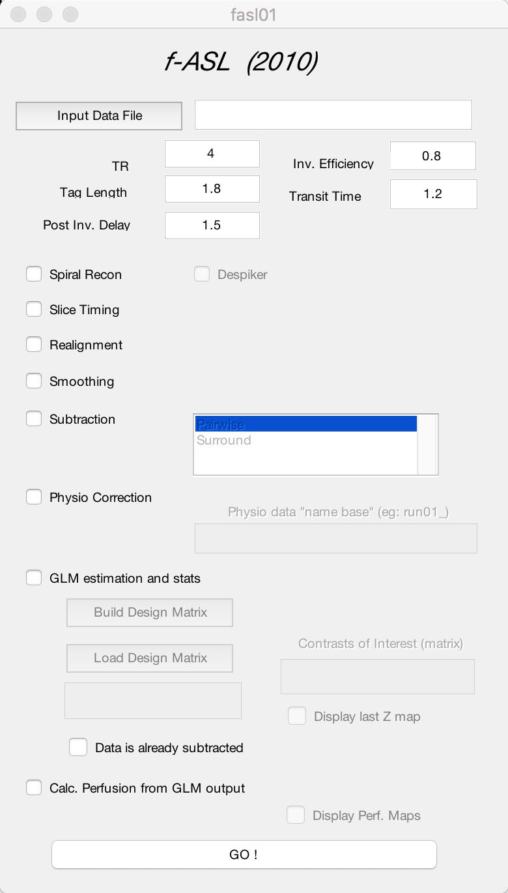

.. _fASL_Download:

Downloading f-ASL
===============

.. note::
    You will need to have Matlab installed to run f-ASL. Most universities can give you a license for free; ask your local IT person for more information.

f-ASL (functional ASL) is an ASL analysis package written by `Luis Hernandez-Garcia <http://web.eecs.umich.edu/~hernan/>`__. The package is available for download from Luis's github page located `here <https://github.com/HernandezGarciaLab>`__. Click on the ``Matlab_ASL_Repo`` repository, and click on the ``Clone or Download`` button; select ``Download ZIP``.

.. note::

    There are other ways to download a repository from github, such as from the command line. For now, we will focus on how to do it from a web browser.

    
After you have downloaded the LuisTools file, in your Downloads you should see a file called ``LuisTools.tgz``. Either expand this file by double-clicking on it, or navigating to it with a Terminal and typing the following:

::

    tar -xzf LuisTools.tgz
    
    
This will create a folder called ``LuisTools``.

---------

Setting the Path
----------------

In order to use f-ASL from anywhere on your computer, you will need to set a path pointing to the f-ASL libraries. If LuisTools is in your Downloads directory, for example, open up Matlab and then type:

::
    
    addpath ~/Downloads/LuisTools
    
    
You will then be able to open up f-ASL by typing ``fasl01`` and pressing Enter.

    If you have downloaded and set the path to the f-ASL toolbox correctly, you should see this GUI when you type ``fasl01`` at the Matlab command line.
    
    
    
---------

Video
----------

Click here to see a video of how to download and install f-ASL (coming soon).

Next Steps
---------

Now that you have f-ASL installed, we will use it to analyze a sample ASL dataset. (Need to find a suitable open-access ASL dataset and then point to it)
