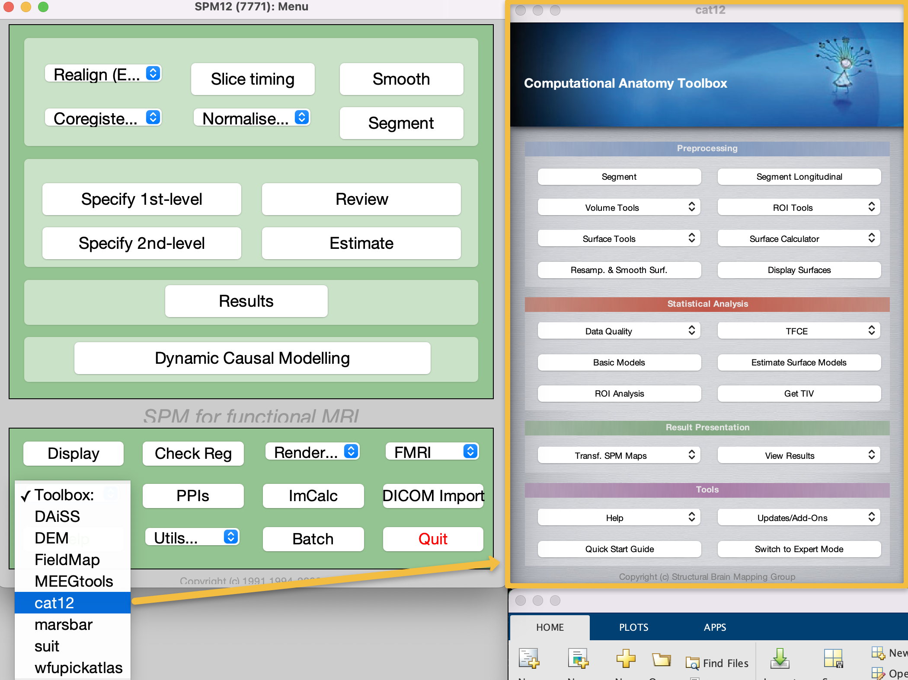

.. _CAT12_01_DownloadInstall:

=====================================
CAT Tutorial #1: Download and Install
=====================================

-----------------

The CAT12 toolbox is designed to work with SPM12, using the same libraries for many of its functions. If you haven't already, I recommend working through the :ref:`SPM12 tutorials <SPM_fMRI_Intro>`; in addition to learning how the SPM12 graphical user interface works, which is similar to the CAT12 interface, you will also learn about toolboxes - separate programs that rely on a foundational program, such as SPM12. Just like Marsbar and WFU Pickatlas, for example, CAT12 is another toolbox that will be opened through the SPM GUI.

1. Download and Install SPM
===========================

The download and installation instructions for SPM12 can be found :ref:`here <SPM_fMRI_Intro>`, as well as on the SPM12 website. 

2. Download the CAT12 Toolbox
=============================

The CAT12 toolbox can be found `here <http://www.neuro.uni-jena.de/cat/index.html#DOWNLOAD>`__. Click on the ``Download CAT12`` button, which will start the download; then, unzip the file. Assuming that your ``spm12`` folder is located in your home directory, open a terminal and type the following:

::

  mv ~/Downloads/cat12 ~/spm12/toolbox
  
Then open a Matlab terminal, and type ``spm fmri``. When the GUI appears, click on the ``Toolbox:`` dropdown menu, and select ``cat12``. This will open the CAT12 GUI, which should look like this:

If that works without any issues, you are ready to download and analyze data from the ADNI website. Click the ``Next`` button to learn how to do that.

Video
=====

For a video overview of how to download and install CAT12, click `here <https://youtu.be/GpuN5F1kmr0>`__.
