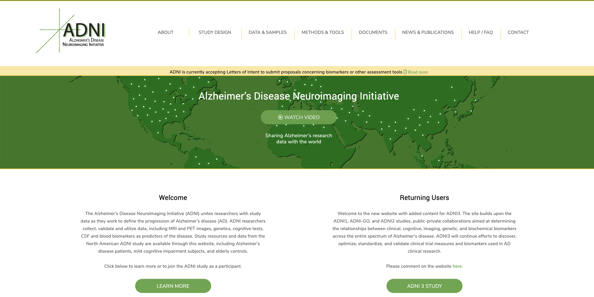
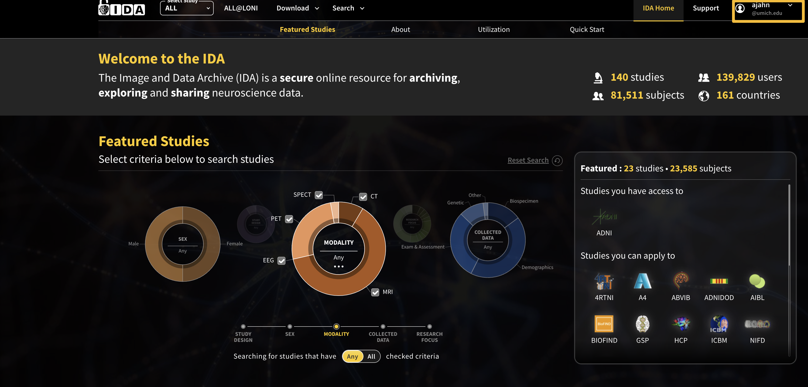
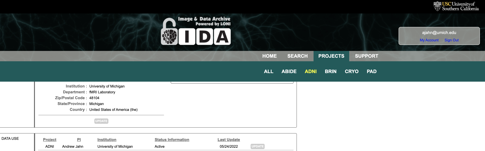
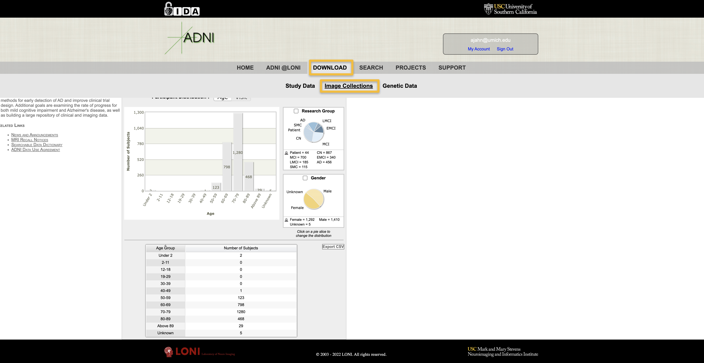
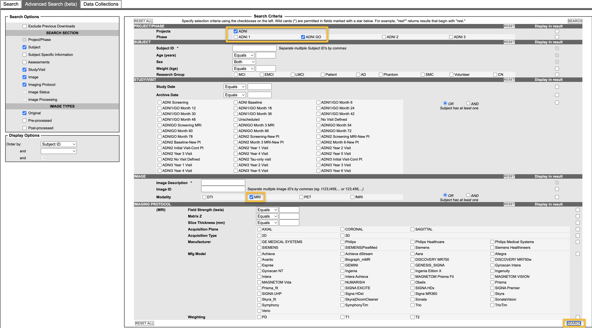
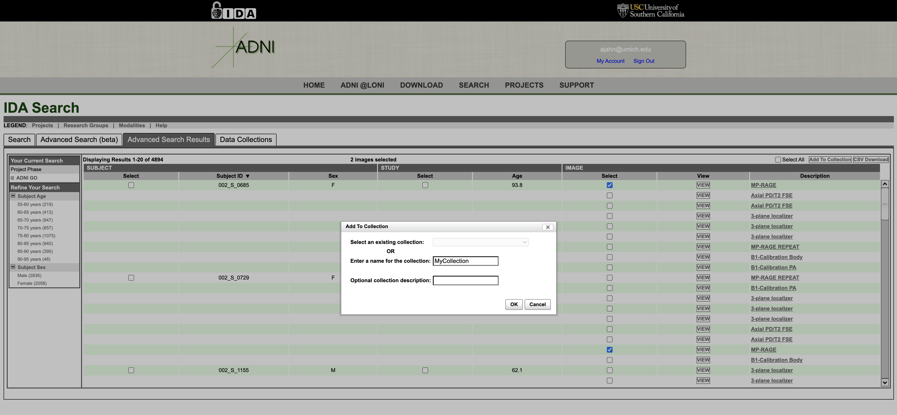

.. _CAT12_02_DownloadingADNIData:

========================================
CAT12 Tutorial #2: Downloading ADNI Data
========================================

---------------

Overview
********

The Alzheimer's Disease Neuroimaging Initiative (`ADNI <https://adni.loni.usc.edu/>`__) is a large, open-access database that contains hundreds of brain scans from both healthy controls and people with Alzheimer's. In addition to imaging data, there are several covariates that have been collected for each subject: in addition to basic measurements such as age and years of attending school, there are measurements of cognitive ability, anxiety, depression, and genotypes, such as the presence or absence of the APOE4 allele.

  The ADNI website.
  
To access the imaging data, click on ``Data & Samples``, and then select ``Access Data and Samples``. This will take you to the access page; scroll down and click on the button ``Apply for ADNI Data``. You will be requested to accept the terms of using their data; select the ``I agree`` radio button, and then click ``Submit``. You will be asked to provide your email address. Upon submitting your address, you will be sent a security code; copy and paste it into the security code field, and click ``Continue``. Fill out the required details, including your name, degree, institution, and a short description of your proposed analysis. In this case, you can enter something like, "I will be analyzing morphometry differences between Alzheimer's patients and control subjects". Click "Continue", and finish the rest of the application. It may take one to two weeks for your application to be reviewed and approved.

Once your application is approved, you will be given a link to the `Laboratory of Neuroimaging (LONI) webpage <https://ida.loni.usc.edu/login.jsp>`__. This webpage, hosted by the USC Mark and Mary Stevens Neuroimaging and Informatics Institute, contains the Image & Data Archive (IDA). You will be prompted to create a password; afterwards, whenever you visit the LONI website, click on the ``Login`` button at the top right of the page, and enter your email address and password, and then go to ``My Account``.

Your landing page on the IDA should look something like this, showing that you have access to the ADNI project. Click on ``Projects``, and then click on ``ADNI``.

You should now see the ADNI homepage, with graphs depicting the participant demographics. Click on the ``Download`` button, and then select ``Image Collections``:

This will take you to the ``IDA Search`` page, with different tabs for Search, Advanced Search, and Data Collections. If you want to search for images, I recommend using the ``Advanced Search (beta)`` tab, which allows you to select different phases of the study, as well as specific imaging modalities, such as DTI or fMRI:

For instance, checking the boxes ``ADNI GO`` in the Project/Phase area, and ``MRI`` in the Modality field, would display a list of any image that was acquired as a structural MRI; this includes a typical MP-RAGE scan, as well as localizers and calibration scans. (You can click on the ``View`` button next to each image to open a viewer and scroll through the slices of the volume.) For now, we are only interested in the high-quality T1-weighted MRIs, which are the MP-RAGE images. Check the boxes next to the MP-RAGE image for Subjects ``002_S_0685`` and ``002_S_0729``, and click on ``Add to collection``. You can enter a new name for it, such as ``MyCollection``, and then access it from the ``Data Collections`` tab:

Instead of having to select all of the MP-RAGE images by hand, however, there are a few collections that have already been saved for you. In the ``Data Collections`` tab, in the Collections sidebar click on ``Other Shared Collections -> ADNI -> ADNI1:Baseline 3T``; This will display a list of all the structural MRIs that were collected for this particular phase and magnetic field strength.
