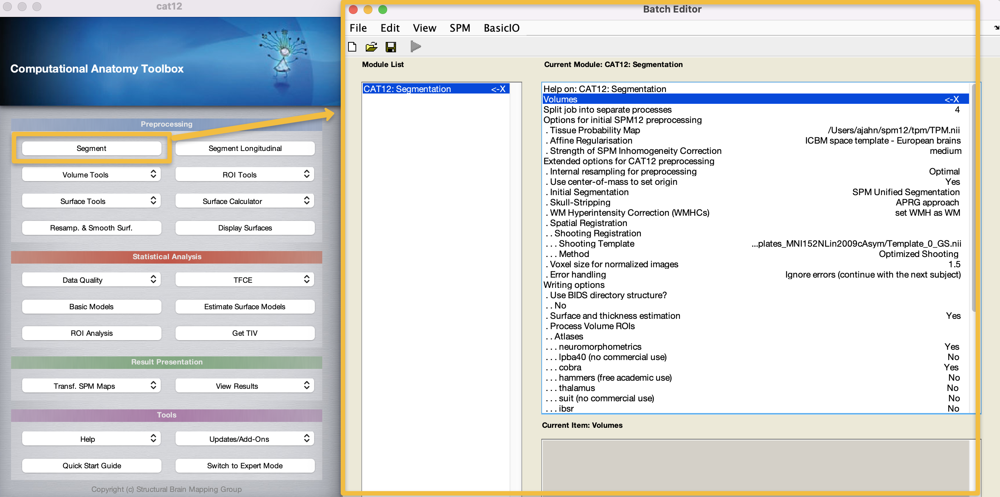
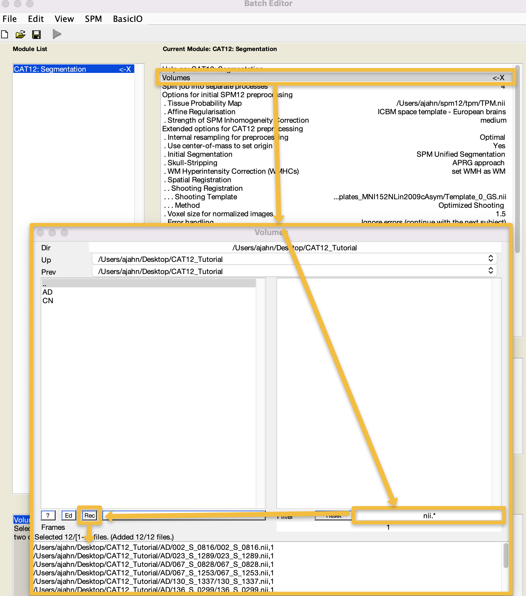
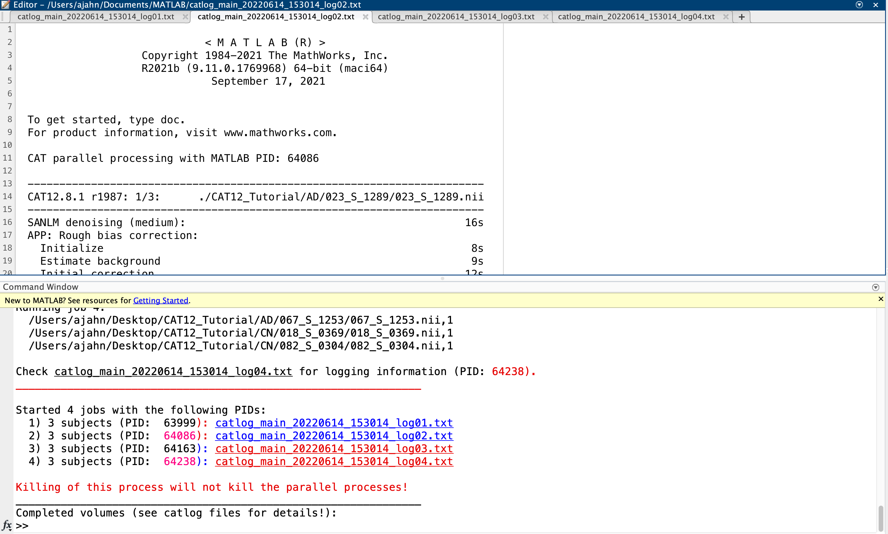
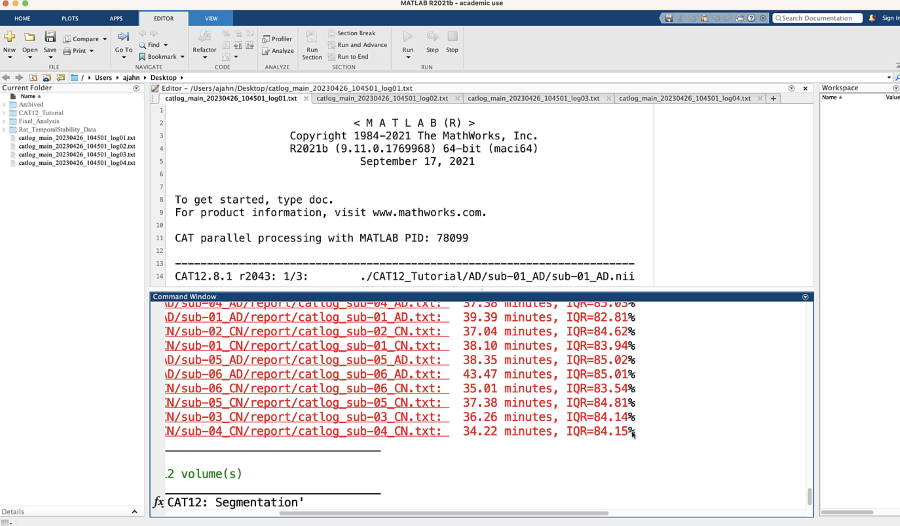
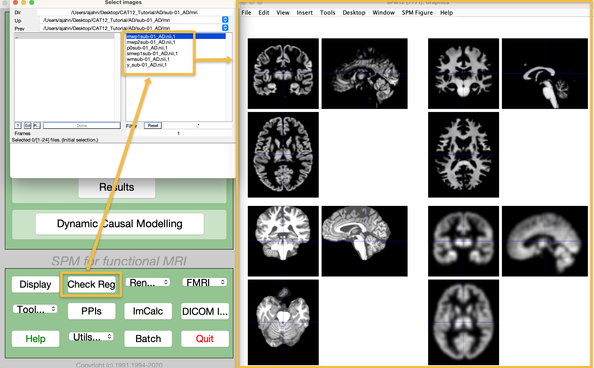
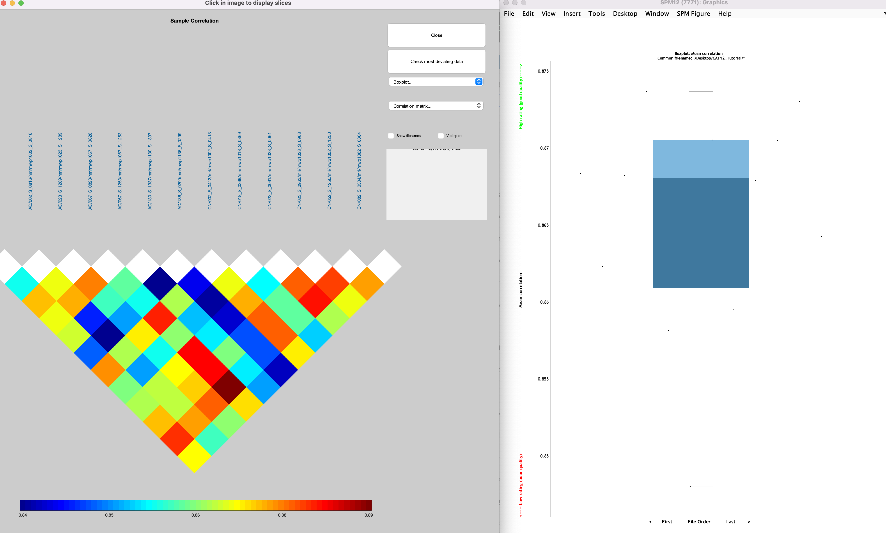
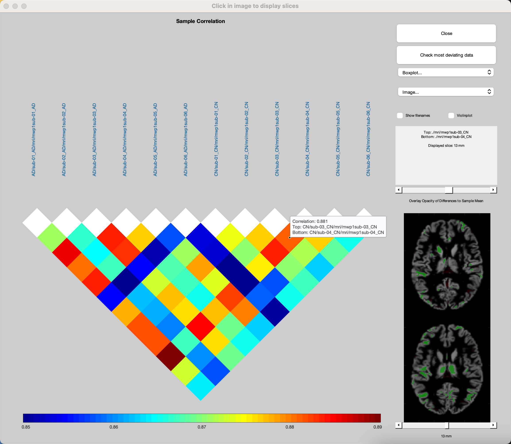
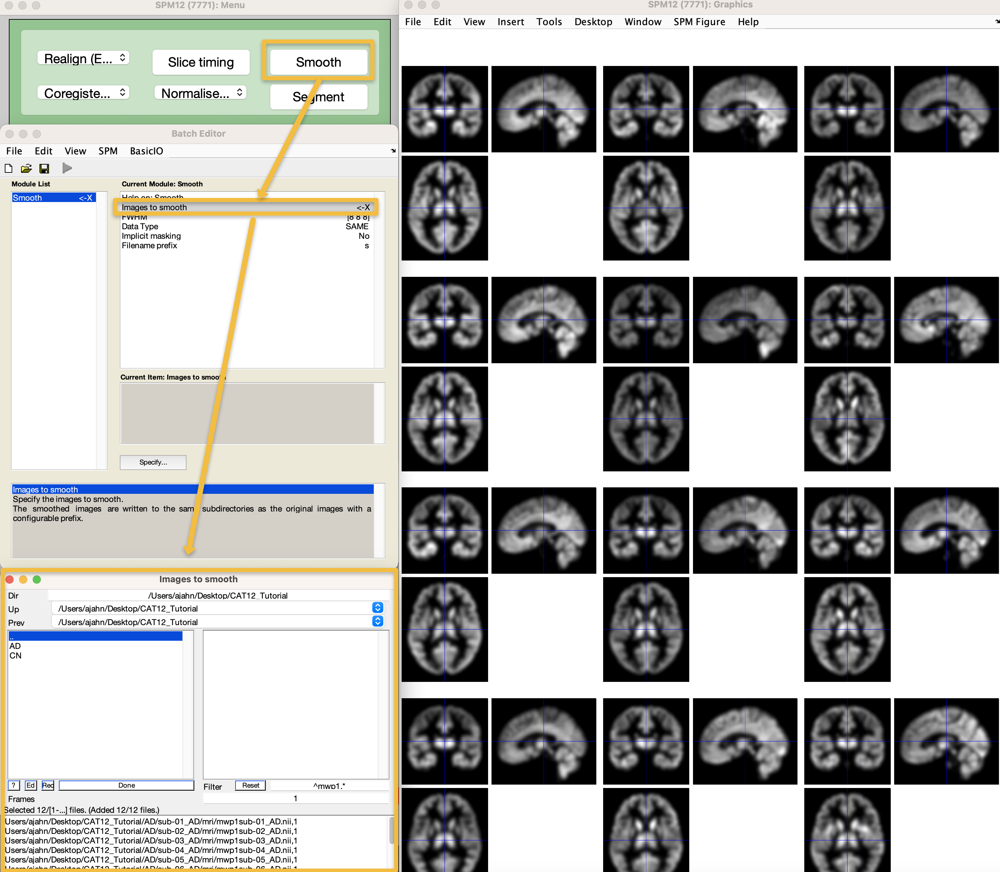

.. _CAT12_03_Preprocessing:

=======================================================
CAT12 Tutorial #3: Preprocessing the Data and QA Checks
=======================================================

Overview
********

Compared to analyzing fMRI data, structural data is relatively quick and easy: The defaults work fine for most purposes, and the main preprocessing step is segmentation. This takes about 30 minutes per subject depending on which options you use, but given that there is usually one anatomical image per subject, about half an hour is usually the upper limit. This can be longer for longitudinal studies which involve separate anatomical scans being collected at each timepoint, but for now we will focus on a cross-sectional comparsion between Alzheimer's patients and control subjects.

Segmenting the Data
*******************

If you don't already have CAT12 open from the previous chapter, open a Matlab terminal, and type ``spm fmri``. (SPM12 should already be installed; if it isn't, see the previous chapter about downloading and installing the CAT12 toolbox.) Select the CAT12 toolbox from the ``toolbox`` dropdown menu, and click on the ``Segment`` button in the CAT12 GUI. This will open a new batch editor window:



As you recall from the SPM12 tutorials, an ``X`` indicates the fields that need to be filled in before the module can be run. Double-click on the ``Volumes`` field, and navigate to the ``CAT12_Tutorial`` directory on your Desktop. Go into the ``AD`` directory, and select each subject's anatomical image, going in the order that the subjects are listed in the GUI window; then, go into the ``CN`` directory and do the same. Alternatively, you can use the file selection window to navigate to the ``CAT12_Tutorial`` directory containing both the ``AD`` and ``CN`` directories, enter the string ``nii.*`` in the ``Filter`` field, and click the ``Rec`` button to recursively search all the sub-folders in the current directory for any files ending in ``nii``. You should see something like this:



We will leave the rest of the options as the defaults. For now, however, take a look at the field ``Split job into separate processes``. The default value is ``4``, which means that four processors, if available, will be used to analyze the data. Click the green Go button, and observe what happens:



Note that there are four instances of Matlab now running which are analyzing the data: three subject have been assigned to each processor, and each subject currently in each processor's queue are being analyzed simultaneously. This is a preview of what we will be doing on a much larger scale when we analyze more subjects using the supercomputing cluster. Each processor's logfile is also open, click between the different logfiles to see how they update as the data is analyzed. This will take a couple of hours; we will come back to it when it has finished.


Examining the Output
********************

When all of the jobs have finished, you will see the completed jobs listed in the Matlab terminal, along with the time it took to complete the job and an IQR value representing the quality of the anatomical scan. In my experience, most jobs take around 30-45 minutes on a typical iMac computer, and the IQR from most open-access databases is around the 75%-80% range, representing average to above-average quality:



If you inspect the output files in each subject's ``mri`` directory, you will see five files, with the prefixes ``mwp1`` (grey matter segmentation), ``mwp2`` (white matter segmentation), ``p`` (segmented anatomical image with the skull and face removed), ``wm`` (segmented anatomical scan warped to MNI space), and ``y`` (inverse deformation field, used to identify and correct for field inhomogeneities). From the SPM12 GUI, click on ``Check Reg``, and then select all of these images in the folder ``CAT12_Tutorial/AD/002_S_0816/mri`` to view them side by side: 



To quickly check whether the normalization was successful for all of the images, from the CAT12 GUI click the ``Data Quality`` dropdown menu, and select ``Single Slice Display``. This will open a new batch editor window, from which you can select all of the images starting with ``mwp1`` (the grey matter segmentation images). Enter the string ```mwp1`` in the Filter field, and then click the ``Rec`` button (difficult to see in the following figure; it is the one next to the ``Ed`` button). You can choose any slice you want, and any orientation you want; the defaults are slice 0 and Axial, which will display an axial slice that crosses through the anterior commissure, the origin coordinates of MNI space. Click ``Done``, and observe whether any of the slices look significantly different from each other, either in orientation or segmentation. If they all look roughly like they do in the following figure, you can assume that normalization completed without any errors:


Our last QA check is to examine the homogeneity of our sample. Not all of the anatomical scans will have the same volume in every voxel, but most brains should be pretty close, usually in the correlation range of r=0.80-0.90. From the CAT12 GUI, click on the ``Data Quality`` dropdown menu and select ``Check Sample Homogeneity``. Click on ``Data -> New: Sample Data``, and then double-click on ``Sample data``. Similar to before, use the resulting selection window to navigate to the ``CAT12_Tutorial`` directory, enter ``wmp1`` in the Filter field, and click the ``Rec`` button. Click ``Done``. Then, double-click on the ``Quality measures`` field, navigate to the ``CAT12_Tutorial`` directory, and click the ``Rec`` button to recursively load each subject's .xml file, then click ``Done`` and the Green Go button. you will see both a boxplot of each anatomical images mean correlation with every other anatomical image, and a correlation plot color-coded to show how much each anatomical scan is correlated with every other anatomical scan:



In the correlation plot window, click on the ``Correlation matrix`` dropdown menu, and sort by ``Mean Correlation``. Click on any of the colored squares in the figure, which will display the same numbered slice for two different anatomical scans. Overlaid colors of green and red indicate positive and negative correlation with the sample mean anatomical image, respectively. Most of these correlations will be somewhat randomly spread throughout the brain, which is normal. You can use the slider above the brains to change the opacity of these colors, or the slider below the brains to change the slice that is displayed. You can also click on the button ``Check most deviating data``, and specify the number of volumes you want to see. For example, entering a number of ``2`` will display the volumes ranked first and second in deviating from the sample mean. Note that even if there is a large amount of deviation, this doesn't necessarily mean there is something wrong with the volume; it's simply a heuristic for selecting the most deviating volumes, and then deciding whether that deviation is due to natural variation, or because of noise or other artifacts.



Smoothing the Data
******************

The last preprocessing step is to **smooth** the data, which, similar to functional MRI data, will average together signal and cancel out noise. Since we are focusing on volumetric data for now we will use a similar smoothing kernel to those used in functional MRI data. Go to the SPM12 GUI and click on ``Smooth``. The CAT12 manual recommends a smoothing kernel of 6-8; for this tutorial, let's keep the default values of [8 8 8]. Double-click on ``Images to smooth``, and, as before, navigate to the ``CAT12_Tutorial`` directory, enter ``mwp1`` in the Filter field, and click ``Rec``. When the images are loaded, click the ``Done`` button, and then click the green Go button. This should only take a few moments. When it finishes, check the output by loaded all of the smoothed images using the ``Check Reg`` button, and make sure the images look blurred, indicating that they have in fact been smoothed.




Next Steps
**********

Now that you have finished preprocessing and quality-checking the data, we can build our statistical model. To see how to do that, click the ``Next`` button.
