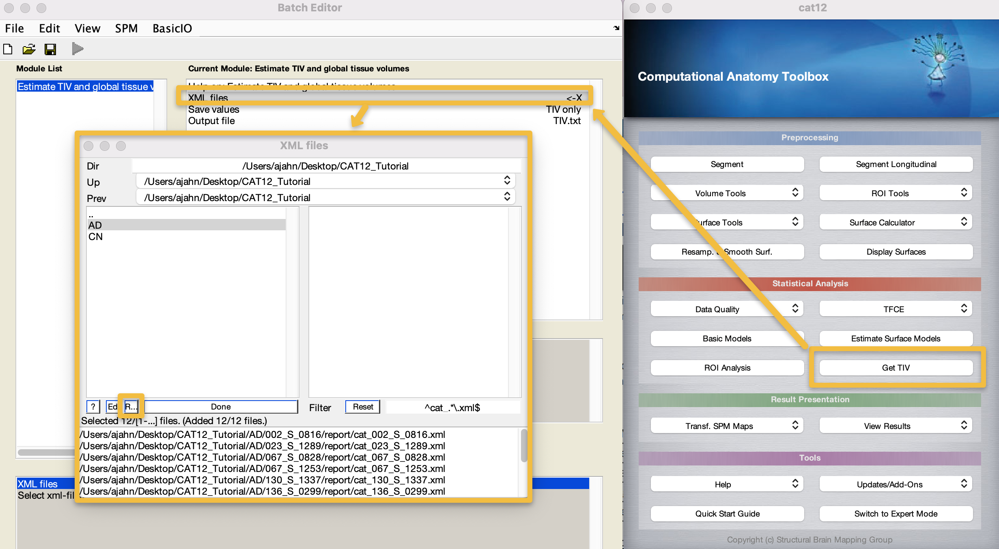
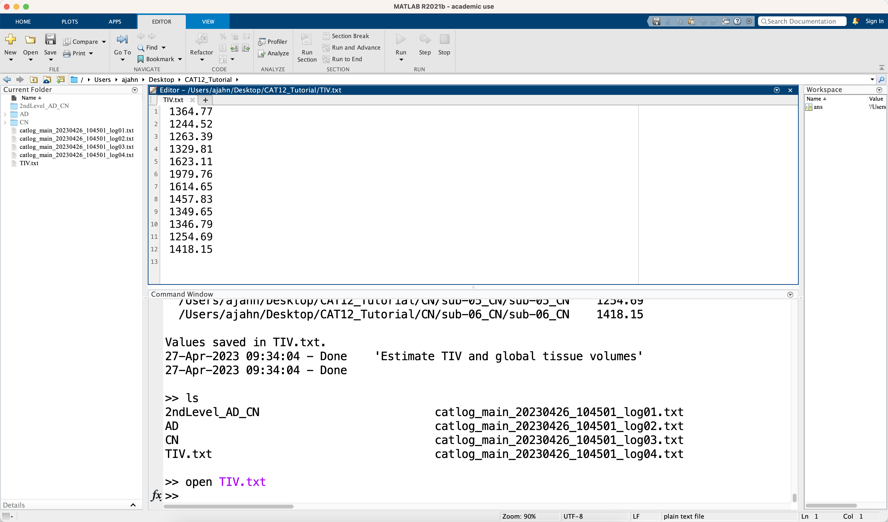
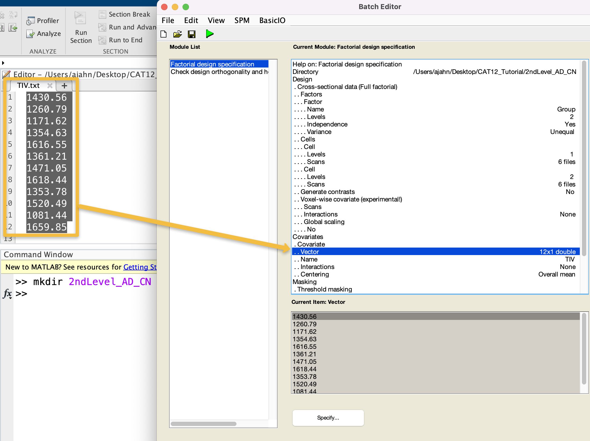
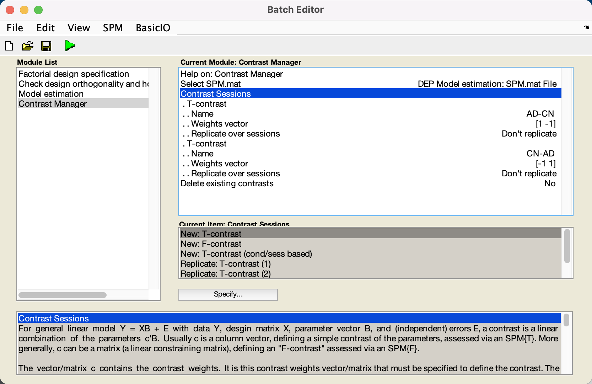
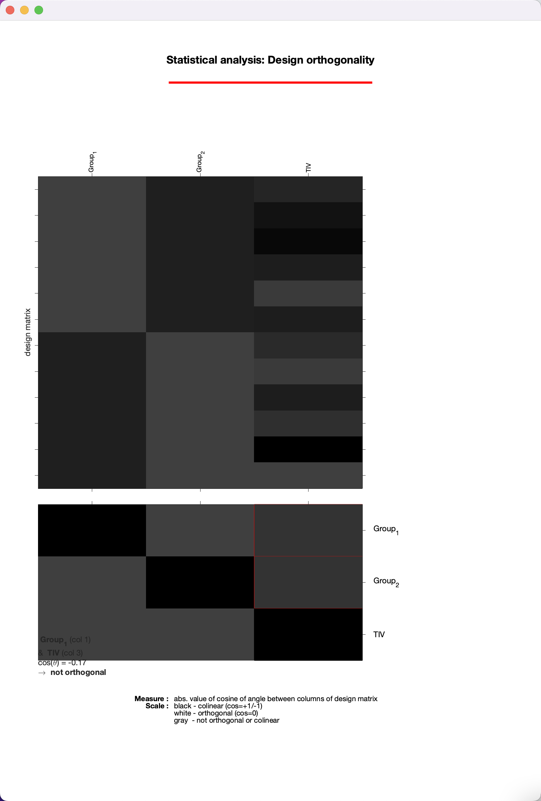
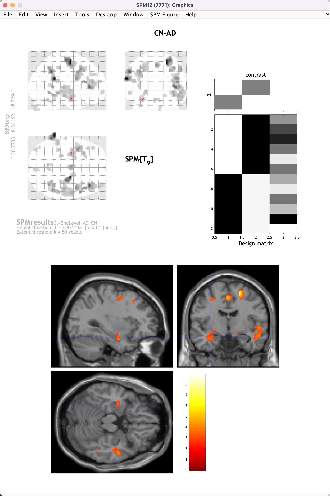

.. _CAT12_04_Analysis:

=======================================
CAT12 Tutorial #4: Group-Level Analysis
=======================================

-------------

Doing a group-level analysis is similar to what you have done for functional MRI data, with one important difference: Since there is no time-series for anatomical data, there is no need to specify conditions and onset times, and therefore no need to do a first-level analysis. We can therefore go directly to a group-level analysis, in which we can compare groups, examine correlations between individual difference measures and cortical volumetrics, or run a longitudinal analysis. For this tutorial, we will be simply comparing two groups, and seeing whether there are any significant differences between them.

Before You Begin: Extracting Total Intracranial Volume (TIV)
************************************************************

During segmentation and preprocessing, a measurement called total intracranial volume (TIV) was calculated for each subject, representing the overall volume, in cubic millimeters, of the space within the skull. Since this can be a plausible confound when examining differences in cortical volume between groups, we will use this as a nuisance covariate in our analysis.

To extract these measurements into a single text file, from the CAT12 GUI click on ``Get TIV``. Double-click on ``XML files``, and note that the filter is already set to detect .xml files. Navigate to the ``CAT12_Tutorial`` directory, and then click the ``Rec`` button; it should populate the lower window with twelve files, one for each subject. Click ``Done`` and then the Green Go button.

This only takes a second, and you can see whether it finished by going to the Matlab terminal; you should see a new file called ``TIV.txt``. Open it with the command ``open TIV.txt``, and look at the values. These will be in the same order as the .xml files were loaded, which, if all of the other steps have used the filter field and recursive command when selecting files, should be the same as when we load them during group-level analysis.

Doing the Group-Level Analysis
******************************

You have two options for setting up a group-level analysis: You can either click on the button ``Basic Models`` in the CAT12 GUI, or click on ``Specify 2nd-level`` in the SPM GUI. Both are basically the same; the only difference is that the CAT12 GUI uses a factorial design as the default. These can be modified to do the same thing as a two-sample t-test in the SPM GUI, for example; you just have to specify the appropriate factors and levels. For this tutorial, we will use CAT12's ``Basic Models`` button.

Before we do that, however, use the Matlab terminal to navigate to the ``CAT12_Tutorial`` directory, and then type ``mkdir 2ndLevel_AD_CN``. Then click on ``Basic Models`` and double-click ``Directory``, selecting this new directory you just created. Under ``Factors``, change the ``Name`` to ``Group``, and set the number of ``Levels`` to ``2``. Click on ``Cells``, and then ``New: Cell``. For the first cell, click on ``Levels``, and enter ``1``. Double-click on ``Scans``, navigate to the ``AD`` directory, and in the filter field type ``smwp1``, to select the smoothed grey matter maps for the AD subjects, and click the ``Rec`` button. Click ``Done``. Do the same for the next cell, entering a level of ``2``, and then for the scans navigating to the ``CN`` directory, entering ``smwp1`` in the filter field, and clicking the ``Rec`` button and then ``Done``.

In the ``Covariates`` field, select ``New: Covariate``, and double-click on ``Name`` and call the covariate ``TIV``. Double-click on ``Vector``, and then copy and paste the values from the TIV.txt file you generated. Leave the rest of the defaults as they are; when you are done, you should see something like this:

Note that, by using the CAT12 Basic Models, by default there is another module in the list called ``Check design orthogonality and homogeneity``. This will load the design file you generated in the previous step, and check whether there are high correlations between your covariates and any of the other regressors in your model. Leave these defaults as they are.

To save time, and to increase your proficiency with the SPM GUI, I also recommend adding two additional modules: One to estimate the model, and one to generate the contrasts. You can do this by clicking on each of the buttons, as you saw how to do in the :ref:`SPM Tutorial <SPM_08_GroupAnalysis>`, or you can add them to the current batch and run everything in one go. To do the latter, in the menu at the top of the Batch Editor, click ``SPM -> Stats -> Model Estimation`` to add this module to the list. Then click on ``SPM -> Stats -> Contrast Manager``. Click on the new ``Model Estimation`` module, highlight the ``Select SPM.mat`` field, and click on ``Dependency`` in the lower right corner of the batch editor window; select the SPM.mat file dependency from the Factorial design specification module.

Similarly, click on the ``Contrast Manager`` module, highlight the ``Select SPM.mat`` field, and click the ``Dependency`` button, selecting the SPM.mat file from the Model Estimation step. Then, click on ``Contrast Sessions``, and create two new T-contrasts. Since the AD group is the first regressor in our model and the CN group is the second regressor, the first contrast weight in our vector will correspond to AD, and the second weight will correspond to CN. For the first T-contrast, therefore, change the ``Name`` to ``AD-CN``, and change the ``Weights vector`` to ``1 -1``. Likewise, for the second T-contrast, change the ``Name`` to ``CN-AD``, and give it a contrast vector of ``-1 1``. When you are done, the module list and the contrast manager should look like this:

Now click the green Go button, and wait for the modules to finish.

Reviewing the Orthogonality
***************************

The first output you will see from the batch are a few pop-up windows, showing the boxplot and correlation windows we examined previously during preprocessing. You can review that chapter about how to interpret these windows; however, for now we will focus on the **Design Orthogonality** window, which shows your design matrix on the top half, and correlations between the regressors on the bottom half. The boxes highlighted in red represent the correlation between your covariates - in this case, TIV - and the other regressors in your model. Left-click on them to see how large the correlation is; in this case, it is 0.17, which is relatively small, and we can go ahead with our analysis as usual. 

.. note::

  If the correlation was much higher - say, above 0.4 or 0.5 - you may want to consider scaling your other regressors by TIV. You can learn more about this on page 31 of the CAT12 manual, which can be found `here <http://141.35.69.218/cat12/CAT12-Manual.pdf>`__.
  
Viewing the Results
*******************

Now that we have estimated the model and generated the contrasts, we can look at the results just like we would the results from an fMRI experiment. From the SPM12 GUI, click on ``Results``, and select the SPM.mat file in the directory ``2ndLevel_AD_CN``. When the contrast manager appears, select the contrast ``CN-AD``, and click ``Done``. For the viewing options, selecting the following:

::

  apply masking -> none
  p value adjustment to control -> none -> 0.01
  extent threshold (voxels) -> 50
  
These numbers are arbitrary, selected in part because we only have six subjects per group, and therefore have relatively low power. You will see that none of the results pass correction (although there is one cluster that has a cluster-level correction level of p=0.12). However, we still see some results that may indicate trends; click on the ``overlays`` dropdown menu in the Display window, and click ``sections``. Navigate to your SPM12/canonical directory (for me, /Users/ajahn/spm12/canonical), and select the template ``single_subj_T1.nii``. Click ``Done``, and then use the crosshairs in the viewing pane to click and scroll around the image, looking at where there is significantly larger grey matter volume for the CN group compared to the AD group. There are small clusters in the hippocampal and frontal areas, not enough to reach statistical significance for now, but still in line with what is reported in most studies. It is reasonable to assume that if we increased our sample size by a factor of ten or a hundred, we would find significant differences; and that is what we will be doing when we begin analyzing a much larger sample on the supercomputing cluster.

Video
*****

For a video overview of how to run a group-level analysis, click `here <https://youtu.be/fwNwBupw2RM>`__.

Exercises
*********

1. Try examining the reverse contrast of AD-CN, using the same thresholds as above. Where do you see differences at this threshold? Do you think they would hold at a larger sample size, or do you think they are false positives?

2. In addition to TIV, another plausible confound is Age, which in this type of analysis we should probably also control for. In the ADNI webpage that you downloaded the data from, go back to your Collections tab, and click on the ``Downloaded`` images for this analysis. There is a button to download a .csv file for these subjects, or you can just copy the Age values that you see in the Downloads page for these subjects. Create another analysis through the CAT12 GUI, adding in this additional covariate, and making sure they correspond to the correct subject. Rerun the analysis and observe if any of the effects change.
