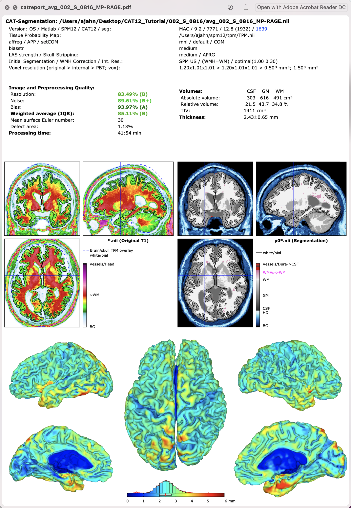

.. _CAT12_Overview:

==================================
Voxel-Based Morphometry with CAT12
==================================

--------------

Overview of the Computational Anatomy Toolbox
*********************************************

The Computational Anatomy Toolbox (CAT) is a software package for measuring brain volume and thickness. Developed by the `Structural Brain Mapping Group <http://www.neuro.uni-jena.de/wordpress/>`__ at the University of Jena in Germany, the toolbox is designed as a toolbox for SPM12 - hence the name of the most recent version, CAT12. It is similar to FreeSurfer, but much faster. Furthermore, although a study by `Seiger et al. (2018) <https://onlinelibrary.wiley.com/doi/pdfdirect/10.1111/jon.12521>`__ found that in general CAT12 generates higher thickness estimates than FreeSurfer, the estimates from both packages were significantly correlated, and were able to reliably detect differences in cortical thickness between Alzheimer's patients and healthy controls. (Another comparison study carried about by `Velázquez et al., 2021 <https://link.springer.com/article/10.1007/s10548-021-00852-2>`__, found similar results.)

In any case, CAT12 is siginifcantly faster than FreeSurfer, and may be a good alternative software package for some researchers. CAT12 also generates useful quality assurance reports in PDF format which quantify, among other metrics, the amount of noise and distortion in the anatomical images. This provides a quick and simple check for whether to exclude particular subjects, and can help determine whether the scanner is producing high- or low-quality data, as shown here:

  Sample QA report generated by CAT12. Note how scores are assigned for the amount of noise and bias present in the image.

What is Voxel-Based Morphometry?
********************************

Voxel-based morphometry, or VBM, is the measurement of brain structure at each voxel. For example, VBM can measure the cortical thickness at each voxel, warp each subject's anatomical image to a standardized template, and then compare groups to see where there are any differences: compared to controls, persons with Alzheimer's may have reduced grey matter thickness in the hippocampus, and patients with major depressive disorder may have less grey matter volume in the frontal lobes. Longitudinal designs can go further by testing whether these changes in grey matter predict the onset of a cognitive disorder, and whether specific interventions are effective.

In addition to voxel-based morphometry, the CAT12 toolbox has options for deformation-based morphometry (DBM), surface-based morphometry (SBM), and region-based morphometry (RBM). We will cover each of these at various points during the tutorial.

.. note::

  The CAT12 website has an excellent and thorough walkthrough of how to use their software, which can be found `here <http://141.35.69.218/cat12/CAT12-Manual.pdf>`__. Much of my tutorial is simply rephrasing what they have already written, and all credit needs to be given to their group. There is also a good overview video of how to use CAT12 that can be found `here <https://www.youtube.com/watch?v=F6-HbSMjZ6I>`__.

The following walkthrough will demonstrate how to use CAT12 with data downloaded from the Alzheimer's Disease Neuroimaging Initiative (ADNI). Consequently, this tutorial will also be one of the first to demonstrate how to analyze data from a large open-access repository focusing on a specific clinical population. We will also learn how to use this toolbox both on your local machine, and how to submit it as a job on a supercomputing cluster.

.. toctree::
   :maxdepth: 1
   :caption: Start to Finish Analysis with CAT12

   CAT12_01_DownloadInstall
   CAT12_02_DownloadingADNIData
   CAT12_03_Preprocessing
   CAT12_04_Analysis
   CAT12_05_Supercomputer
   
