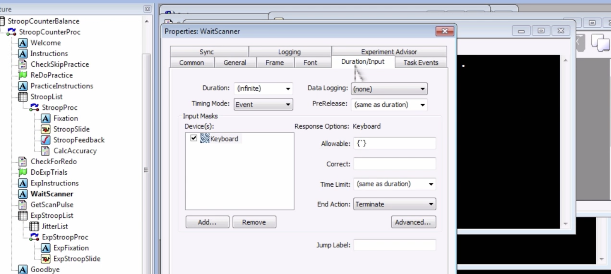

.. _E-Prime_Overview:

===================
Overview of E-Prime
===================

--------

**E-Prime** is a stimulus presentation software that is used in both behavioral and neuroimaging research. The goal of this module is to help you learn E-Prime, as well as some of the basics of object-oriented programming. Don't worry if you've never heard of object-oriented programming before; E-Prime has an intuitive graphical user interface that makes it easy to see the link between the objects used in the interface, and the objects that are created and modified using code. 

As you work through the tutorials, you will be introducted to object-oriented programming through E-Basic - E-Prime's scripting language - which in turn will allow you to adapt your experiment to different situations, including fMRI experiments.

.. toctree::
   :maxdepth: 1
   :caption: Preprocessing Steps

   E-Prime_ShortCourse/EP_01_Introduction
   E-Prime_ShortCourse/EP_02_Objects
   E-Prime_ShortCourse/EP_Intermezzo_Stroop
   E-Prime_ShortCourse/EP_03_Duration_Termination_Pre-Release
   E-Prime_ShortCourse/EP_04_Lists_Procedures_Attributes
   E-Prime_ShortCourse/EP_05_Counterbalancing
   E-Prime_ShortCourse/EP_06_FeedbackDisplay
   E-Prime_ShortCourse/EP_07_SlideStates
   E-Prime_ShortCourse/EP_08_InlineObjects
   E-Prime_ShortCourse/EP_09_StartupInfo
   E-Prime_ShortCourse/EP_10_EMergeEDataAid
   E-Prime_ShortCourse/EP_11_fMRI_Experiment
   
