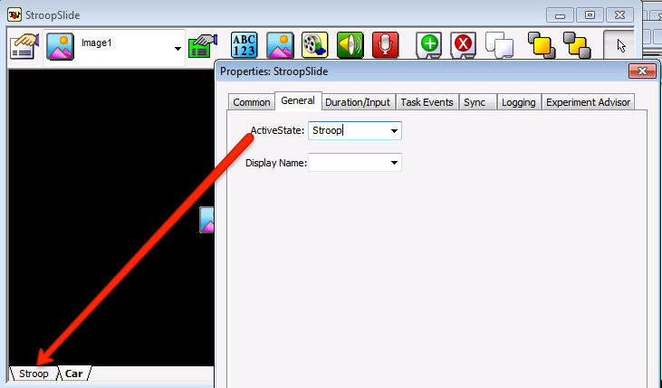
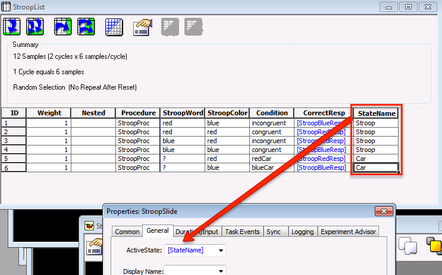

.. _07_SlideStates:

=============================================
E-Prime Tutorial #7: Slide States
=============================================

Overview
***********************

In the previous tutorial, you were introduced to the concept of **Slide States**. That is, one slide can contain many states, or stimuli that can be displayed depending on another condition being met - such as whether the response on a previous slide is correct or incorrect.

Put another way, Slide States are different instances of the same Slide object. For example, you may want to present two types of conditions: one in which the subject responds to the color of a word, and another condition in which the subject responds to the color of a car. Instead of creating two separate Slide objects, you can put both conditions into a single Slide object, making the experiment more compact and more flexible.

Creating the Slide State
**************************

You can create Slide States by clicking on the Add Slide State button (which looks like a green plus sign in the Slide object toolbar). Once you create a Slide State, it will look like a default Slide object with a white background. Change the background color to black, and click and drag an Image object to the center of the workspace. Double-click on the Image object, and click on the folder next to the Filename field. Navigate to the ``My Experiments`` folder that comes as a default with E-Prime, and then navigate to the ``Tutorials`` folder. Select the ``BlueCar.bmp`` image. From the Image sub-object's properties window, set the BackColor to Black, then click on the ``Frame`` tab and set the Width and Height to 100% to make the image take up the entire canvas.

The Slide State that is presented depends on the ActiveState field, which is found in the property pages of the Slide. The Slide State names can be changed through the sub-object properties pages, and then the ActiveState can point to any one of the Slide States.

Instead of pointing to just one Slide State, we can have the ActiveState depend on which condition is chosen from a List object. Create another attribute in the Slide object and enter the names of the SlideStates. In our example, we created a new attribute called "StateName", and have the ActiveState field refer to this attribute when presenting a trial. In our example, if the StateName attribute is "Car", then the Car SlideState is activated; if the StateName attribute is "Stroop", then the Stroop SlideState is activated.

Once you've mastered these basics of objects, properties, and slide states, you will be able to create more sophisticated experiments. The next tutorial will expand the structure of our experiment by including a separate practice session in addition to the experimental trials. To do this, we will use Inline objects, which give you even greater power and flexibility in building your experiments.

---------------

Video
********

For a video review of Slide States, click `here <https://www.youtube.com/watch?v=q_h6qYjK3d0&list=PLIQIswOrUH68zDYePgAy9_6pdErSbsegM&index=7>`__.
