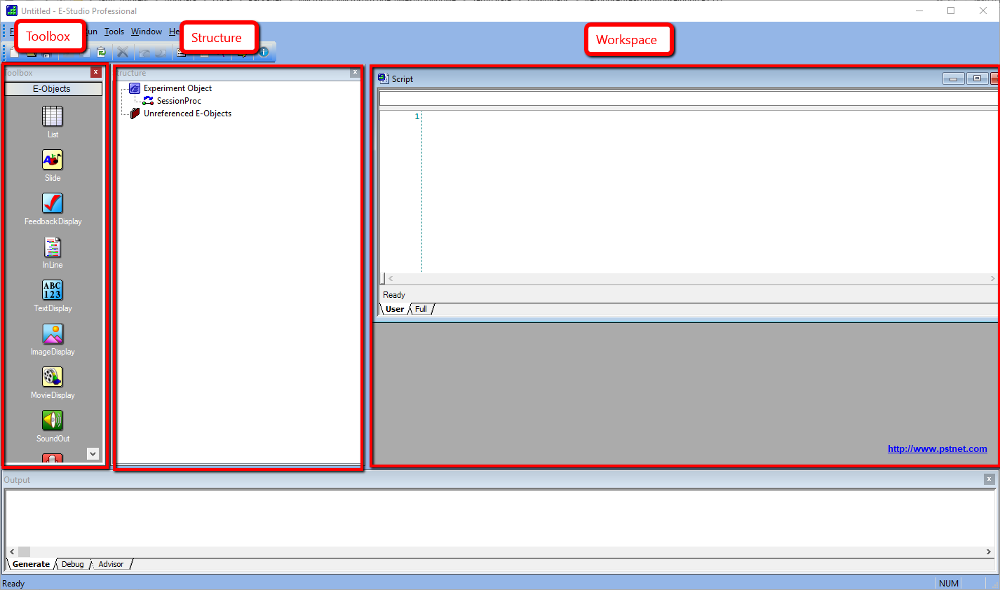
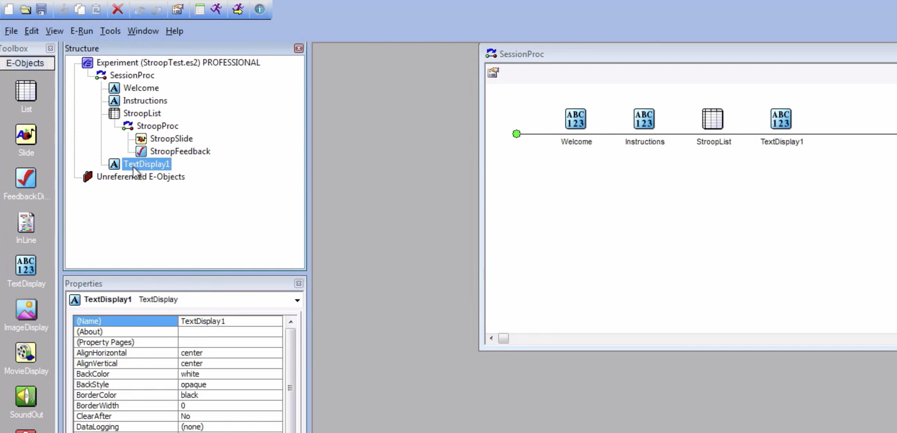

.. _EP_01_Introduction:

=================
E-Prime Tutorial #1: Introduction to E-Prime
=================

-------------

**E-Prime** is a stimulus presentation program that can display text, images, and videos, while recording the participant's responses, accuracy, and reaction time. The program's graphical user interface allows the user to quickly create a simple experiment by clicking and dragging **objects** onto the screen. Although this is enough for simple experiments, more advanced users can write **E-basic** code to perform more complex operations; this will be reviewed later in a tutorial on :ref:`Inline objects <EP_08_InlineObjects>`.

When you open E-Prime on your computer, you will be prompted to select a **template**. The Standard templates will generate a basic experiment template with fixations, stimuli, and feedback slides. (Don't worry if you don't know what these terms mean right now; we will cover them in later tutorials.) If you select the Blank template, you will see the following screen:

.. There are several other stimulus presentation programs, such as `PsychoPy <https://www.psychopy.org/>`__ and `Presentation <https://www.neurobs.com/menu_presentation/menu_features/features_overview>`__. E-Prime is commercial software and costs around $1,000 for a single license; PsychoPy is free and has many of the same features, but may be more difficult to learn for students new to programming.

  The layout of a typical E-Prime experiment. The sidebars on the left contain a list of objects that can be placed on the experiment timeline (the "Toolbox" sidebar); ; a representation of the experiment from start to finish ("Structure"); and a space for the currently selected object ("Workspace"). When you create objects on the experimental timeline (discussed below), you will also have access to a list of properties for the currently selected object, such as the name, duration, and color (which will be called the "Properties" window). 

As we learn more about E-Prime, you will be creating more complex experiments that contain multiple objects, or building blocks of an experiment, as shown below:

  
  
The backbone of an E-Prime experiment is the **procedure** object; each new E-Prime experiment starts with a procedure object called **SessionProc**. If you double-click on the object to see its contents, you will see a window that contains a horizontal line - the **Procedural Timeline**. It depicts the timeline of the experiment going from left to right. As we construct our experiment with **objects**, the timeline will present each object in sequence as it appears on the timeline. How these objects are constructed and how we use them to build an experiment, we will turn to in the next chapter.
  
  
Video
**********

For a video overview of what E-Prime is and what it looks like, click `here <https://www.youtube.com/watch?v=t3hZHveUVE8&list=PLIQIswOrUH68zDYePgAy9_6pdErSbsegM>`__.
