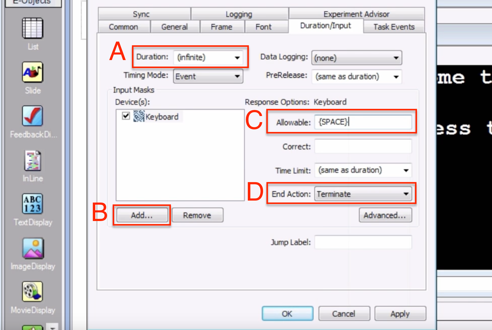
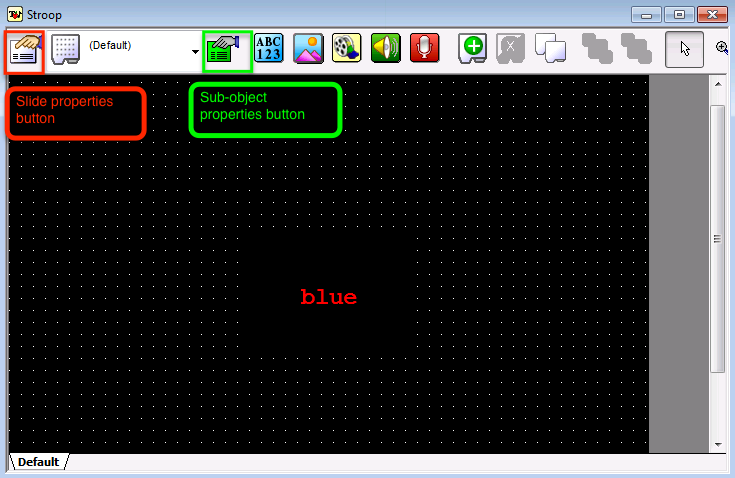

.. _EP_03_Duration_Termination_Pre-Release:

===================================================
E-Prime Tutorial #3: Slides and Advanced Properties
===================================================

----------

Overview
********

This tutorial will show you how to make a basic Stroop experiment by using **Slides** - objects that can contain several sub-objects, or objects within the object, such as multiple images and text boxes. The Slide object's properties are controlled by the property pages tab, while the sub-objects are controlled by the sub-object property pages tab.

Before we learn about Slides, we will revisit our TextDisplay objects and examine more advanced properties: Duration, Timing Mode, and Pre-release. To begin, click and drag a TextDisplay object to the experimental timeline, rename it to "Welcome", and type the following text in the textbox: "Welcome to the experiment! Press the SPACEBAR to continue." To make the text easier to read, change the background color to Black, the font size to 24, and the font color to White. (These can be found in the General tab - ForeColor corresponding to the font color, and BackColor to the background color - and the Font tab.) You should see the changes in the TextDisplay object occur as you make them.

At this point you could run the experiment by clicking the **Run** icon - a tiny purple man running through a door. When you are prompted to enter a Subject and Session number, use the defaults. You should then see the TextDisplay object briefly appear on the screeen and then disappear. This goes by too quickly to be of any use; how can we keep the text on the screen for a longer period of time, or only proceed when the subject makes a response?

Advanced Properties
*******************

----------

Duration and Input Masks
^^^^^^^^^^^^^^^^^^^^^^^^

By default, the TextDisplay object will be presented on the screen for 1000 milliseconds; in other words, one of its properties is a **duration** of 1000 milliseconds. This is probably too short for most purposes, and in any case you will want more flexibility for your own experiment. Within the TextDisplay object's properties, the ``Duration/Input`` tab allows you control these details about the timing of the object. The **Duration** field, for example, specifies how long, in milliseconds, the object will be presented on the screen. You can enter any number you want - or, you can set it to ``Infinite``, which will leave the object on the screen until a button is pressed or some kind of input is received.

This requires you to add an **Input Mask**, which is a device that records a response. If you click on the ``Add`` button underneath the Devices box, you will see two default options: the Keyboard and the Mouse. Since the participant usually responds by pushing one of several different keys, the Keyboard is the best input to use. Selecting the Keyboard as in input mask enables you to fill in the **Response Options** fields, such as Allowable and Correct responses.

In this case there is no Correct response, only an Allowable one: pressing the spacebar. To specify this we will have to use one of E-Prime's reserved keywords - in other words, a string of letters and symbols that indicates a specific key. To indicate the spacebar in this example, we will have to write the word "SPACE" in all capital letters, bookended by curly braces.

.. note::

  Other reserved keywords are "{ENTER}" and "{TAB}" (typed in the Allowable field without quotation marks). You may have noticed that the default in the Allowable field was "{ANY}". What do you think this means?
  
The **End Action**, set by default to "Terminate", indicates what to do once the subject makes a response. In this case, if he presses the spacebar, the TextObject will be removed from the display and the experiment will go on to the next object in the timeline. If there are no more objects in the timeline, E-Prime will exit the experiment. (The other options in the End Action menu - "None" and "Jump to" - will be covered later.) These options are summarized in the figure below.

  Selecting a Duration of Infinite (A) requires you to select an input device. Clicking on the Add button (B) allows you to choose from different inputs, such as a Keyboard or Mouse. Providing an Allowable response (C) enables the participant to make a response and to terminate the current object and move on to the next object (D).
  
  
Before moving on, drag another TextDisplay object onto the experimental timeline, placing it after the "Welcome" object. Rename the new object "Instructions", change the font to white and the background to black, and enter the following text:

::

  Press the 'f' key if the color of the word is blue.

  Press the 'j' key if the color of the word is red.

  Remember to respond to the color of the word, not the word itself.
  
As with the "Welcome" object, set the duration to ``Infinite``, selecting the Keyboard as an input and {SPACE} as an allowable response.

Timing Mode
^^^^^^^^^^^

Sometimes you want an object to be displayed until the subject makes a response; but other times, you want the object displayed for a specific amount of time - for example, fixation crosses that are displayed for a couple of seconds to signalize that the last trial is over, and a new trial is coming up. If the experiment is part of an fMRI scan, then accurate timing is especially important - you want the experiment to end at the same time as the scanner stops collecting images.

However, your computer is always running several processes simultaneously: Refreshing the screen, checking for viruses, and keeping applications open in the background, to name a few. Each of these processes requires memory, and sometimes a process can temporarily require enough memory to put the other processes on hold. These processes are running even when an E-Prime experiment is being displayed on the screen, and these processes can introduce small delays into the experiment.

**Timing Mode** specifies how E-Prime will incorporate these delays. To illustrate how to use different timing modes, drag another TextDisplay object onto the timeline after the "Instructions" object. Rename it to "Fixation", type a plus sign ("+") in the text box, and change the object to white font on a black background. Then open the Properties page and select the ``Duration/Input`` tab. Selecting the "Event" option makes the object stay on the screen for as long as the Duration, no matter what delays there are before presenting the object. For example, if the Duration is 2000ms and there was a delay of 10ms when presenting the object, the object stays on the screen for 2000ms, but the additional 10ms is added on to the duration of the experiment.

In case you do not want these delays adding up over time - in other words, you want the entire experiment to be the same duration for every subject - selecting the "Cumulative" option will subtract these delays from the Duration of the object. For example, if the Duration is 2000ms and there was a delay of 10ms, then the duration of the object will be 2000ms-10ms = 1990ms. Including the delay, the entire duration of the entire trial will be 2000ms: 1990ms (object duration) + 10ms (delay) = 2000ms. This minimizes any cumulative timing errors, which may be important for experiments which need to end at an exact time for all the trials to be collected.

Pre-Release
^^^^^^^^^^^

Another way to mitigate timing errors and delays is through the **Pre-release** option. Once an object is displayed on the screen, E-Prime is able to load another object in the background which is ready to display as soon as the current object terminates. Pre-release indicates when E-Prime can begin loading the next object. For example, if you specify a pre-release time of 200, then the last 200ms of the current object are used to load the next object into memory. Leaving this as the default of ``(same as duration)`` is fine for most experiments; there are exceptions to this, which we will talk about in a later tutorial on :ref:`Inline objects <EP_08_InlineObjects>`.

The Slide Object
****************

Let's now take an in-depth look at the **Slide object**. Click and drag a Slide object onto the experimental timeline after the Fixation object, rename the Slide to "Stroop", and double-click on it to open up the Slide workspace. Notice how this is different from the TextDisplay object - there are dots representing a grid, and there are several **sub-objects** on the menu bar that you can click and drag onto the workspace. For example, within this Slide object you can display Text, Images and Videos. The Properties tab with the white card, as with the Properties tab of the TextDisplay object, allows you to specify properties such as the color of the background and the Duration of the Slide. The icon with the green card allows you to specify properties of the currently selected sub-object, such as the font size and color of a Text object.

Let's begin creating our Stroop stimulus by clicking and dragging a Text object onto the Slide workspace. Click on the Slide Object Properties tab and set the background color to "Black"; then click on the Text Sub-Object Properties tab and type the text "blue". Set the font color to "Red" and set the background color to "Black". In the Frame tab of the Sub-Object Properties, center the sub-object by setting both the X and Y positions to 50%. Observe how this moves the location of the sub-object to the center of the Slide workspace.

Go back to the Slide Object Properties tab and navigate to the Duration/Input tab. Leave the Duration at 1000ms, and add a Keyboard device as an Input Mask. In the Response Options Allowable field, type ``fj``. This indicates that either 'f' or ''j' are allowable responses; recall our instructions which prompt the subject to press 'j' if the *color* of the word is blue, and 'f' if the color of the word is red. Because this particular stimulus is in red font, we will type ``f`` in the Correct field.

.. note::

  The "Time Limit" menu specifies how long the participant has in order to have his response recorded.
  
Once you set a correct response, a pop-up window will ask you whether you want to set the Data Logging to standard. Data Logging records several different outputs from the current object, such as the reaction time, accuracy, and which response was made; other outputs to record can be seen under the "Logging" tab. Unless you don't need the information from the slide, it's a good idea to always set the data logging to Standard.

In order to standardize the duration of the experiment, we will also set the End Action to "(none)". This means that although a response will be recorded if it is made during the presentation of the Slide object, the object will stay on the screen until the full Duration has elapsed.

Summary
*******

By expanding your tools to include Slide objects and more advanced options, you can create an entire Stroop experiment. In order to make this process more efficient, however, we next turn to Procedures and Lists to create larger-scale, more flexible experiments.

Exercises
*********

1. Add a new device to the TextDisplay Welcome object, and select "Mouse". Note the Allowable responses that are selected by default. Now run the experiment, and see if you can advance the slide by simply left-clicking on the screen.

2. Note that the Data Logging for the Stroop slide will ask you whether it should be set to default. When you select the default settings, what do you see in the "Logging" tab? We will revisit this in a later tutorial, but for now, look at some of the attributes that can be written, and think about which ones might be useful for your experiment.

3. Create two new Stroop objects, each one separated by a Fixation object. (Remember that you can copy and paste objects by right clicking on them, selecting Copy, and then right-clicking and selecting Paste.) Make each Stroop object a different combination of a word and color, either congruent or incongruent, and then run the experiment.

-----------

Video
*****

To see how all of the above steps are implemented in E-Prime, see `this video <https://www.youtube.com/watch?v=S8zO8T_0DiA&list=PLIQIswOrUH68zDYePgAy9_6pdErSbsegM&index=3>`__.
