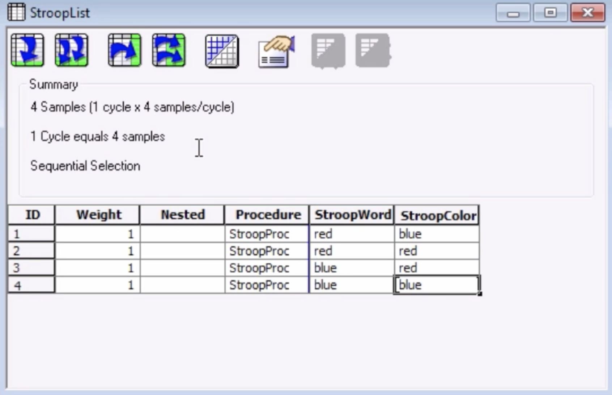

.. _EP_04_Lists_Procedures_Attributes:

======================================================
E-Prime Tutorial #4: Lists, Procedures, and Attributes
======================================================

Expanding the Experiment
************************

So far we have created the bare minimum of an experiment: We have an introductory screen; the participant sees a screen with instructions about how to perform the task; a fixation screen signalizes that a trial is about to begin; and a Slide object presents the word "blue" in red text, to which the participants need to override their impulse to respond to the word, and respond to the color instead. Afterwards a Text Object ties up the experiment and bids the subject farewell.

This is the skeleton of any experiment, and can be used as a template for virtually any study that you have in mind. The only problem lies in how to extend this template to include as many trials as we want. If we required one hundred Stroop trials in our experiment, it would be tedious to continue manually inserting the same sequence of Fixation -> Stroop.

The List Object
**************

Fortunately, E-Prime has a feature that allows us to loop through several instances of the same or similar trials: The **List Object**. The List Object will repeat all of the objects that come after it as many times as we like; we can also indicate how many trials of a particular condition we would like to display in the experiment, and which properties we would like to change on a given trial - such as the color of the text.

To illustrate this, click and drag a List Object from the Toolbox sidebar onto the experimental timeline and place it between the Instructions and Fixation Text Objects, and then rename it to "StroopList". If you double-click on it, you will see a window that contains both rows and columns. The rows we will refer to as **Levels**, and the columns will be called **Attributes**. Levels correspond to trials, and the Attributes are variables that we can specify for each trial. Attributes can be used in any of the Objects of your experiment, and all Attributes will be saved into the output files at the end of the experiment.

Notice that the default Attributes of a new List Object are called Weight, Nested, and Procedure. We will ignore the first two Attributes for now; they can be left as is. The Procedure Attribute, on the other hand, needs to be specified in order for the List Object to do anything. Typing a string of letters in this cell - for example, "StroopProc" - will create a new **Procedure Object** with a new Experimental Timeline contained within that List Object.

This new Procedure Object is similar to the Procedure Object at the top of the Structure tree, called "SessionProc": Just as all of the objects on the SessionProc timeline are displayed consecutively, when a List Object is encountered, the Objects on that Experimental Timeline will also be run in order. The only difference is that the List Object allows us to loop over a subset of Objects as many times as we want, and also allows us to change the properties those objects.

.. note::

  This illustrates how E-Prime is organized **hierarchically**. The main Procedure Object determines the flow of the overall experiment, while the List Object allows you to specify Procedures nested within that Procedure. The experiment will run all of the Objects specified by the List Object before returning to the primary Experimental Timeline.
  
  
Creating a List of Stroop Trials
********************************

Instead of creating new Fixation and StroopSlide objects on the new Experimental Timeline (i.e., StroopProc), we can save time by simply clicking and dragging the Fixation and StroopSlide objects from the main Experimental Timeline onto the StroopProc timeline. Double-click on the StroopProc object to open a new timeline window, and then click and drag the above-mentioned objects onto the timeline. Notice that when an object is copied from one timeline onto another, it leaves the original copy in its place; the new copy has the same properties as the original. If you move an object around its own timeline, it is simply moved to a different place without making a copy.

.. note::

  Since we don't need the original Objects on the original timeline, we can right click on them and delete them in turn.
  
Let's say that we want to use two colors, red and blue; and that we want to create both congruent and incongruent stimuli. This leads to four different trial types. If we wanted two trials of each possible type, this results in eight trials total. To create these, double-click on the StroopList object and click on the button ``Add Multiple Levels`` (represented by two downward-facing arrows). Enter a value of "3" and press OK. Next, click on the ``Add Multiple Attributes`` button (represented by two rightward-facing arrows) and enter a value of "2" when prompted. If you double-click on the column header ``Attribute1``, you can rename the Attribute; let's call it "StroopWord". Do the same thing for ``Attribute2``, renaming it "StroopColor".

We will now create each possible combination of trial types in our experiment. For the first level of "StroopWord", click on the cell and type "red"; for the first level of "StroopColor", click on the cell and type "blue". The combination will look something like this when you are finished:

Looping Over Stroop Trials
^^^^^^^^^^^^^^^^^^^^^^^^^^

In the List Object above, there are a few lines below the word "Summary", which say:

::

  4 Samples (1 cycle x 4 samples/cycle)
  1 Cycle equals 4 samples
  Sequential Selection
  
This means that there are 4 samples in the current list, and that the list is run one time. "Sequential Selection" indicates that each of the rows of the list are run consecutively.

To make our experiment more compact and to repeat the same list of trials that we have created in our List object, click on the "Properties" button (i.e., the icon with a hand pointing to a white card). There are several tabs in the window that opens, but we will focus here on the "Selection" and "Reset/Exit" tabs. 

The "Selection" tab allows you to specify the order in which the trials are selected. The default is Sequential, but we can change the selection to "Random". This will randomly select a trial with the given attributes in our list, and then select each of the other trials until all of them have been selected; then the list will either exit or repeat, if we indicate it to do so. "Random with Replacement" allows the list to re-select a trial even after it has been selected on the current cycle.

The "Reset/Exit" tab specifies how many trials are in a **cycle**, or how many trials are run before the List object either repeats or exits. The deafult of "All samples" will run through however many samples there are; or, you can only run a limited number of samples. The "Exit List" panel in the lower right allows you to specify how many cycles you want to run in the current List. In our case, since we want to run two trials of each condition type, we will change this to 2 cycles. Once you have finished making these changes, notice how the text in the summary panel is updated, and then click OK.
