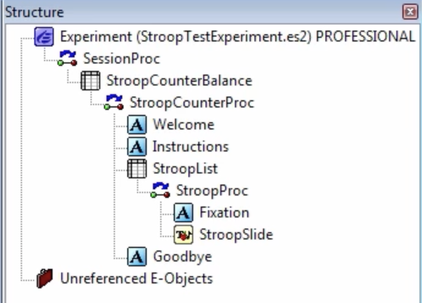
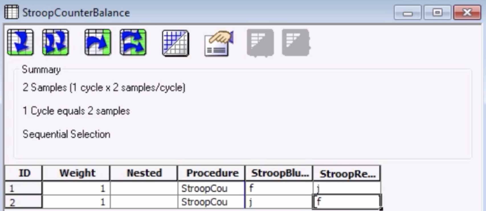
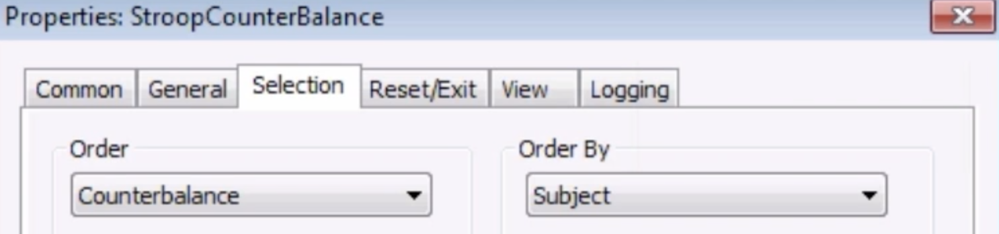
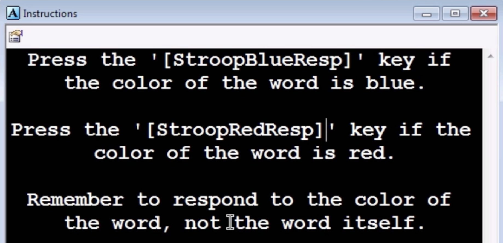
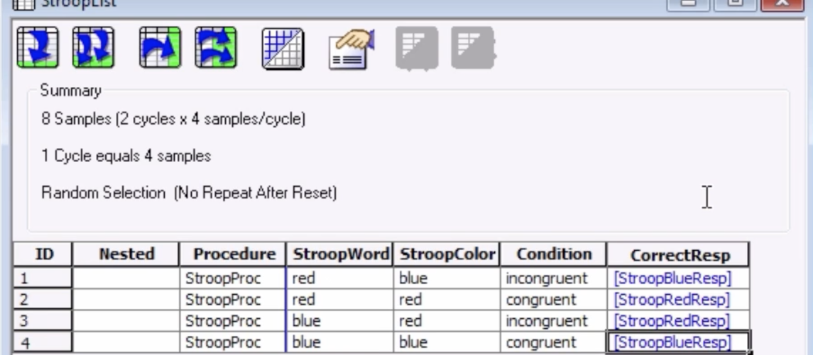

.. _EP_05_Counterbalancing:

=============================================
E-Prime Tutorial #5: Counterbalancing
=============================================

-------------

Overview
***********************

An important aspect of experimental design is **counterbalancing**: making sure that the order of stimuli or responses are different across subjects.

Consider our Stroop experiment. What if the first four trials were congruent, and the last four trials were incongruent? If we were testing for a difference between the congruent and incongruent trials, this difference would be confounded with **ordering effects**. If we found that incongruent conditions require longer reaction times than congruent conditions, it could be because the incongruent trials really are more difficult than the congruent trials; but it could also be that the subject is more fatigued when he gets to the latter half of the experiment. (In our example with only eight trials this explanation is implausible, but it becomes more plausible in a scenario in which the first hundred trials are congruent and the last hundred are incongruent.)

Strict counterbalancing would require that every subject be presented with a different ordering of the stimuli. Instead, we chose to randomize the order of the stimuli, which serves the same purpose - it is unlikely that two subjects would get the same ordering of stimuli, especially with large numbers of trials. Although this is not guaranteeed by randomizing, it is virtually the same.

Counterbalancing Responses
***************************

A more serious counterbalancing problem arises with our responses. In our current version of the Stroop task, subjects are required to press "f" when the color is blue, and "j" when the color is red. It could be that this particular combination of mapping colors to responses is easier or more difficult than an alternative combination. However unlikely that may be, we can control for it by using E-Prime's counterbalancing function.

To counterbalance the responses, create a new List object at the head of the experimental timeline and call it "StroopCounterBalance". Make its default Procedure "StroopCounterProc", and click and drag each of the other objects onto the StroopCounterProc timeline. Delete the objects when you have finished copying them.

In the StroopCounterBalance List, create two new attributes: "StroopBlueResp" and "StroopRedResp". Create a new level as well, and enter the following matrix of responses:

==================   ============
StroopBlueResp       StroopRedResp
==================   ============
f                     j
j                     f
==================   ============

In the E-Prime window, it will look like this:

Then click on the Properties button and click on the "Selection" tab. In the dropdown menu underneath "Order", select "Counterbalance". When you enter a subject number, it will select the level corresponding to that subject number; for example, entering a subject number of "1" will use the attributes of level 1 in the StroopCounterBalance List, a subject number of "2" will use the attributes of the second level, and so on. If you enter a subject number outside of the List's range (such as 3), it will divide that number by the total number of levels, and select the level corresponding to the remainder (e.g., 3 / 2 = remainder of 1).

Propagating the Counterbalanced Attributes
******************************************

Now that we have the counterbalanced conditions set up, we will need to call upon those attributes throughout the rest of the experiment. For example, in the Instructions text object, we will replace the ``'f'`` and ``'j'`` strings with the attributes ``'[StroopBlueResp]'`` and ``'[StroopRedResp]'``:

We will do the same thing for the CorrectResp attribute of the StroopList object, which illustrates how attributes within one list can call upon attributes from a higher-level list:

As an exercise, try placing the relevant windows side-by-side and see how the ``[StroopBlueResp]`` and ``[StroopRedResp]`` attributes correspond to the attributes specified in the Instructions and StroopList objects.

-------------

Video
********************

For a video demonstrating how to create a counterbalanced Stroop experiment, click `here <https://www.youtube.com/watch?v=r_LW7vFg93M&list=PLIQIswOrUH68zDYePgAy9_6pdErSbsegM&index=5>`__.
