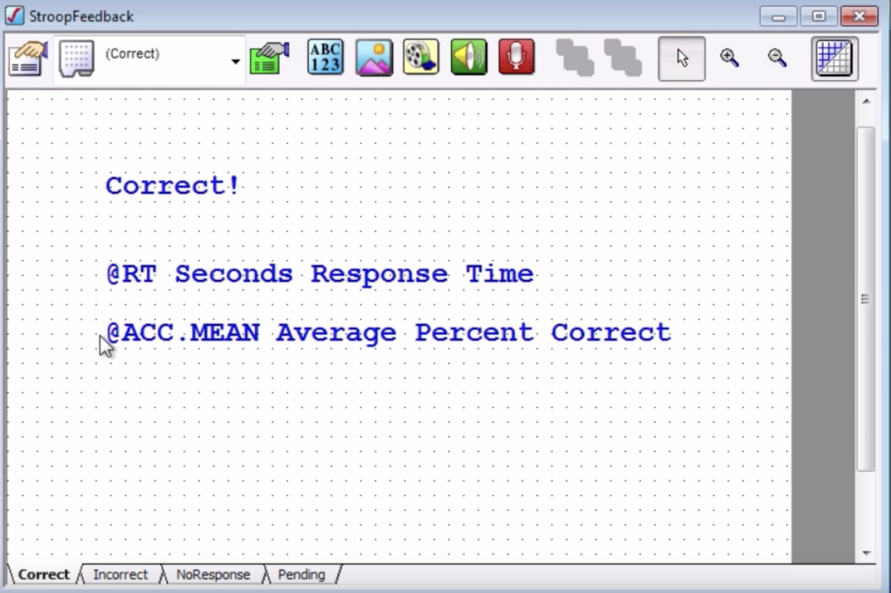
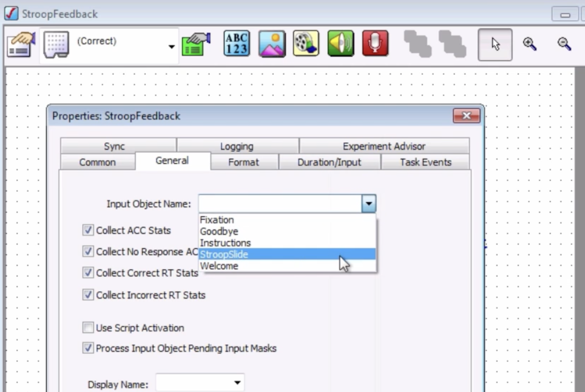

.. _EP_06_FeedbackDisplay:

=============================================
E-Prime Tutorial #6: The FeedbackDisplay Object and an Introduction to Slide States
=============================================

-------------

Overview
*********

In some experiments, you may want the subject to know how he did immediately after a trial. For example, if he was too slow to respond, he should receive feedback telling him so and encouraging him to respond faster on the next trial. Likewise, you may want to give him feedback about whether his response was correct or incorrect so that he is using the right response mappings.

This feedback can be given with a **FeedbackDisplay** object, which you can find in the toolbox on the left sidebar. Click and drag one of these objects onto the StroopProc timeline after the StroopSlide object, and rename it "StroopFeedback". When you double-click on the object, you will notice that the window is similar to that of a Slide object. The main difference is that it already contains text, and that there are several tabs at the bottom of the window labeled Correct, Incorrect, NoResponse, and Pending.

These tabs are technically called **Slide States**, which we will review in more detail in the next chapter. For now, you need to know that they are "activated", or presented to the subject, based on which response is made on a previous slide.

This slide is indicated by clicking on the FeedbackDisplay's Property button, and then clicking on the "General" tab. The Input Object Name dropdown menu includes a list of all of the objects on the procedural timeline before the current FeedbackDisplay object. In this case, we are interested in the reaction time and accuracy of the StroopSlide object; select it, leave all of the default boxes checked, and then click OK.

The Duration and Input of the FeedbackSlide object can be changed, just like any other Slide object. However, since we usually aren't interested in collecting responses during the Feedback state, leave the defaults as they are. You can increase or decrease the Duration of the Slide if you want.

Changing the Presentation of the FeedbackDisplay Object
*******************************************************

As with other Slide objects, the FeedbackDisplay object can contain several sub-objects in the workspace window. The default is three text objects: One saying "Correct!", one displaying the reaction time in seconds, and one displaying the overall accuracy. You can change the color of the text, as well as the color of the background.

Since the subjects are already focusing on color for this experiment, perhaps it's best to standardize the color scheme of the FeedbackDisplay object and make it as uniform as possible. For each text object on each slide state (i.e., tab), change the color of the text to white, and change the background color to black:

.. figure:: 06_StroopFeedback_Color.png

It may also help to align the text in the center of the FeedbackDisplay object. This is a personal preference; the final decision is up to you.

Now run the experiment and see how the feedback slide states are triggered based on your performance. If everything is programmed correctly, you should get correct feedback displays when a correct response is made, incorrect displays when you press the wrong key, and a "No Response" slide if you don't make a response. Try to trigger all three states, and see how your accuracy changes as the experiment progresses.

-----------------

Video
*********

For a video demonstration of the FeedbackDisplay object, click `here <https://www.youtube.com/watch?v=3XwQpwcAY4U&list=PLIQIswOrUH68zDYePgAy9_6pdErSbsegM&index=6>`__.
