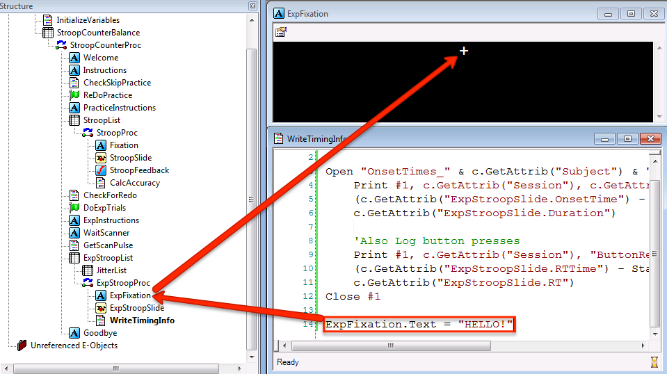
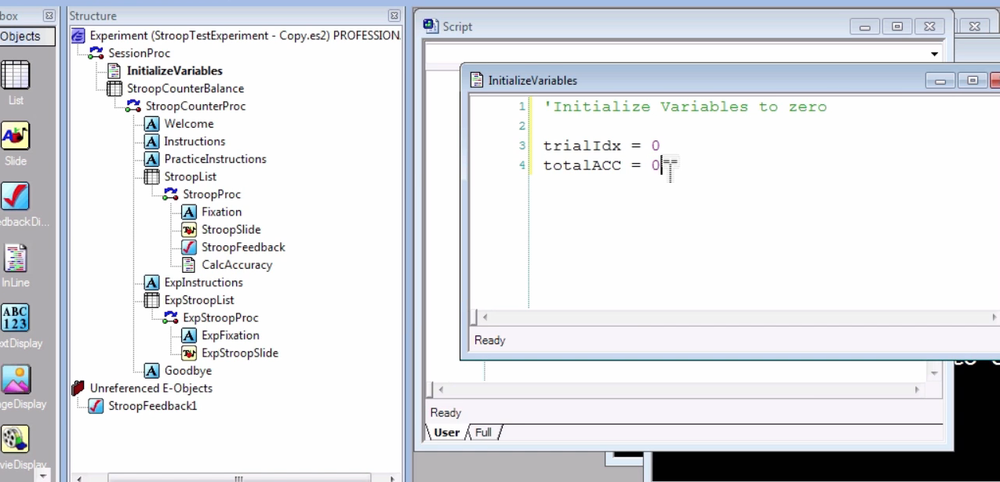
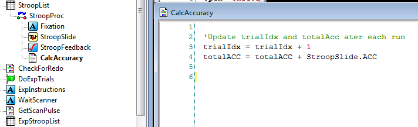
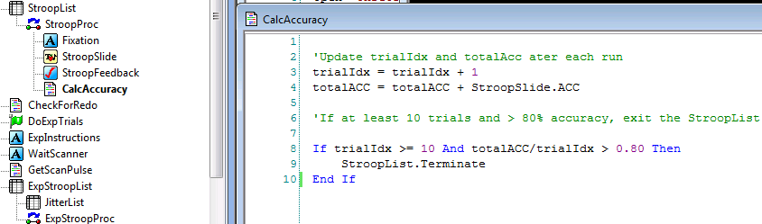
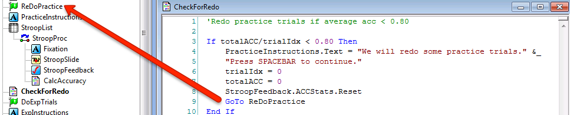

.. _EP_08_InlineObjects:

=============================================
E-Prime Tutorial #8: Inline Objects
=============================================

Overview of E-Basic
***********************

What if we want to have both practice trials and experimental trials in a single E-Prime experiment? What if we want to exit the practice trials when the subject's accuracy had reached a certain level? Both of these goals can be achieved with E-Basic, E-Prime's programming language. If you're new to programming, be prepared to spend some time learning the vocabulary and syntax - things like conditional statements, data types, and declarations. While this may seem overwhelming at first, remember that all we're doing is converting logical thoughts from English into computer code. Keeping that in mind will make the process more comprehensible and less mysterious.

E-Basic is written in InLine objects, which contain code that can affect other objects. For example, if an InLine object contains code that changes the text of a TextDisplay object called ExpFixation, then E-Prime will change the text of ExpFixation whether it is the next object in the timeline or the last object, or whether it comes after the InLine object in the next loop of a Procedure.

  On the first trial of ExpStroopProc, the textbox of ExpFixation will be "+". After E-Prime reads the code in the InLine object WriteTimingInfo, on the next trial the text will be set to HELLO.
  
Using E-Basic to Set Create Variables and Set Attributes
***********************
  
Although E-Basic code can change the properties and attributes of other objects, it can also read and update variables specified by the user. Let's say we decided that we wanted to add a practice block and that we wanted to exit the List after certain conditions were met - namely, when at least 10 trials were completed and the accuracy for that block was greater than 80%. We first wrote this out as pseudo-code in our InLine object (starting the line with an apostrophe to signalize that we are writing a comment that should not be interpreted as code):

'If at least 10 trials and StroopSlide accuracy greater than 80%, then exit list

To translate this into code, we needed to create variables. Variables can be created, or declared, in the InLine object, or they can be declared in the User tab of the Script (which you can access from the toolbar by clicking on View -> Script). Variables declared in InLine objects can only affect other objects within that procedure, a concept known as scope. The scope of variables created in the User tab, on the other hand, is global - they can be used at any level of the experiment.

.. figure:: 08_UserScript.png

  Global variables are declared in the User tab of the Script window. The syntax is "Dim" followed by the variable name, followed by "As [Datatype]", where datatype can be a string, integer, or other type.
  
It is also good practice to initialize your variables - setting their initial values - at the beginning of the experiment. 

These variables can then be used in InLine objects. For example, if we wanted to use the variable trialIdx as a counter that updates after each trial, and to have another variable totalACC that update the total accuracy after each trial, we could write something like the following:

Translated into English, this code reads: "Take the value of trialIdx (which is initially zero) and add it to itself, plus 1. Make that the new value of trialIdx. Do the same for the variable totalACC by adding the value of StroopSlide.ACC to it at the end of each trial."

E-Basic and Conditional Statements
**********************************

We can then use these values with a conditional statement to determine whether to exit the block. The conditional statement (also called an if/else or if/then statement) checks whether a conditional statement is true, and if it is, runs the code in the statement. Note the structure of the code: If the statement is true, then run the code.

This conditional statement will be checked whenever the CalcAccuracy InLine object runs - in this case, at the end of each trial. If both conditions are met - trialIdx greater than or equal to 10, and the average accuracy greater than 0.80 - then the StroopList.Terminate method is activated, which exits the list.

E-Basic and GoTo Objects
************************

What if the subject didn't achieve accuracy greater than 80%, even after doing all the practice trials? The practice block will terminate after all the levels are sampled in StroopProc regardless of how the subject performed. If we want the subject to repeat the practice trials until he achieves greater than 80% accuracy, we will need to use the Label object to "jump back" to right before the practice block. Labels are markers on the procedural timeline that InLine code can "jump to" with the command "GoTo":

There are two other lines of code we haven't seen before. PracticeInstructions.Text will set the text of the TextDisplay object PracticeInstructions to whatever string you specify; this will override any text that was previously typed in the object. The line StroopFeedback.ACCStats.Reset is a method of the FeedbackDisplay object which will reset the ACC counter back to zero. The values of the other variables are also set to zero, so that the list will only exit if the average accuracy of that block is greater than 80%, not across all the repeat practice blocks.

Note that this InLine object, CheckFor Redo, is placed outside of the practice block. This is because the scope of an InLine object is whatever procedure it is located in. If the GoTo line of code were placed inside the StroopProc procedure, it would be unable to "see" where the Label is, and the experiment would exit with an error.

Exercises
*********

The next tutorial will cover how to use the Startup information to set attributes at the start of the experiment. In the meantime, try some of these exercises to see how you can apply the concepts we learned in the tutorial:

Add code which exits the StroopList object if at least 9 trials have been completed, the accuracy is greater than 70%, and the average reaction time to StroopSlide is less than 800ms. (Hint: Accuracy is stored in the StroopSlide.ACC attribute. Open up StroopSlide, click on property pages and then the Logging tab, and determine which attribute you will need to use.)
Include code in the CheckForRedo object which redoes the practice block if the average reaction time was greater than 800ms, OR if the average accuracy was less than 70%.
If there was no response to the StroopSlide object, add a Label and some code which will redo the trial. (Hint: The Label object and the code will both need to be within the StroopProc procedure.)

----------------

Video
***********

For a video overview of Inline objects and how to use them in E-Prime, click `here <https://www.youtube.com/watch?v=z7cBvOJq9FE&list=PLIQIswOrUH68zDYePgAy9_6pdErSbsegM&index=8>`__.
