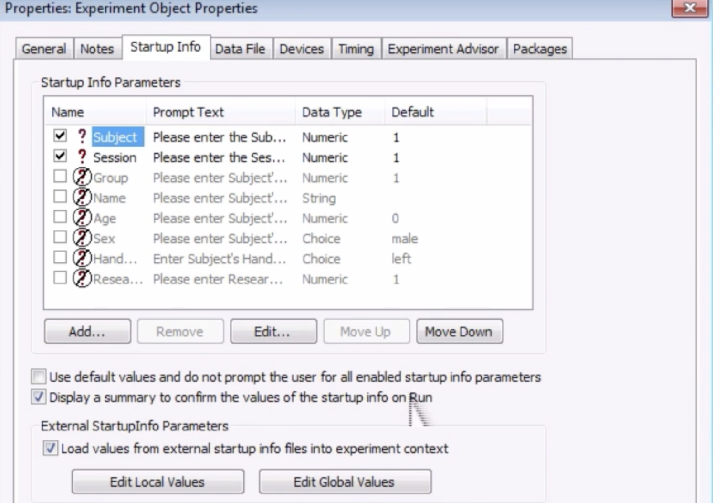
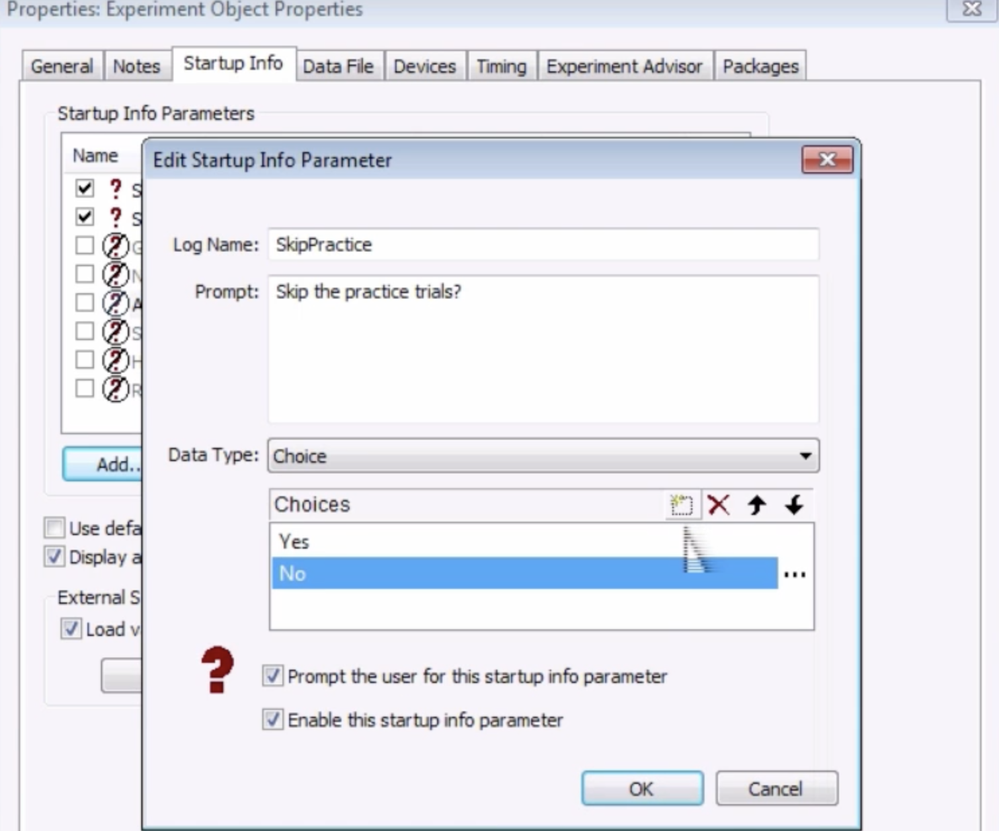
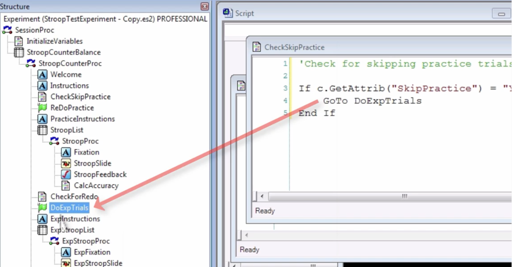

.. _EP_09_StartupInfo:

=============================================
E-Prime Tutorial #9: The Startup Info Tab
=============================================

-------------

Setting Variables when Starting the Experiment
***********************

So far, you have learned how to create variables and attributes using Inline objects and List objects. These variables and attributes can then be used by other objects on the procedural timeline, and they allow you to create more compact and flexible experiments.

But what if you want to set a variable that isn't hard-coded into the experiment; rather, what if we wanted to create a variable that we set ourselves when we begin the experiment? For example, let's say that your subject is left-handed. In that case, we may want them to have a different color-response mapping - maybe the color "red" should be mapped to the response made by the dominant hand, for example. Instead of creating a separate experiment - one for left-handers and one for right-handers - we can set these variables in the **Startup Info** tab.

Skipping the Practice Trials
****************************

In our current example, let's say that we want to allow the user to skip the practice trials at the beginning of the experiment. To do that, we will use everything we've learned so far about objects, flags, and Inline scripts.

Double-click on the Experiment object at the top of the experiment hierarchy - in other words, the first object at the top of the ``Structure`` window. This opens up another window with several different tabs, with labels like "General", "Notes", and so on. Take a look at each of the tabs, noting that these are the variables that are set by default at the beginning of the experiment. 

  The Experiment Object Properties window. This window contains several different tabs, which you can modify as you please. Most of the defaults are fine as they are; if you want to customize your experiment, the tabs you will most likely use are the Startup Info and Devices tabs.

Then click on the ``Startup Info`` tab and notice that there are two defaults already selected for you: ``Subject`` and ``Session``. You will remember that these are text boxes displayed whenever you run a new instance of the experiment; all we will be doing in this example is adding another text box that will be displayed at the beginning of the experiment which you can use to indicate whether to skip the practice trials or not.

Click on the ``Add`` button, and call the parameter "SkipPractice". In the Prompt box, type "Skip the practice trials?" Leave the Data Type default as "Choice", and click on the box icon to add two new choices: "Yes" and "No". Then click OK.

Now, click and drag an Inline object after the Instructions text object, and type the following in this Inline script:

::

  'Check for skipping practice trials
  
  If c.GetAttrib("SkipPractice") = "Yes" Then
    GoTo DoExpTrials
  End If
  

Then click and drag a Label object and place it after the CheckForRedo Inline object, labeling the object "DoExpTrials". Note how this Label object relates to the Inline code we just typed: If the SkipPractice attribute is set to "Yes", then the user will skip the practice trials and go directly to the experimental trials.

Running the Experiment
**********************

Test whether this variable works by running the experiment. When you are prompted about skipping the practice trials, select "Yes". Observe whether you actually do skip the practice trials. Then repeat the experiment, this time selecting "No" for whether the skip the practice trials. Always run these checks to make sure the experiment is running as you want it to.

Try enabling some of the other Startup Info parameters, such as Sex, Age, and Group. Even if you do not use these attributes in your experiment directly, then will still be logged for use later, in case you want to include any of them as covariates or factors in your statistical model.

-----------------

Video
***********

For a video overview of the Startup Info tab, see `this video <https://www.youtube.com/watch?v=SvFCwf-J5wE&list=PLIQIswOrUH68zDYePgAy9_6pdErSbsegM&index=9>`__.
