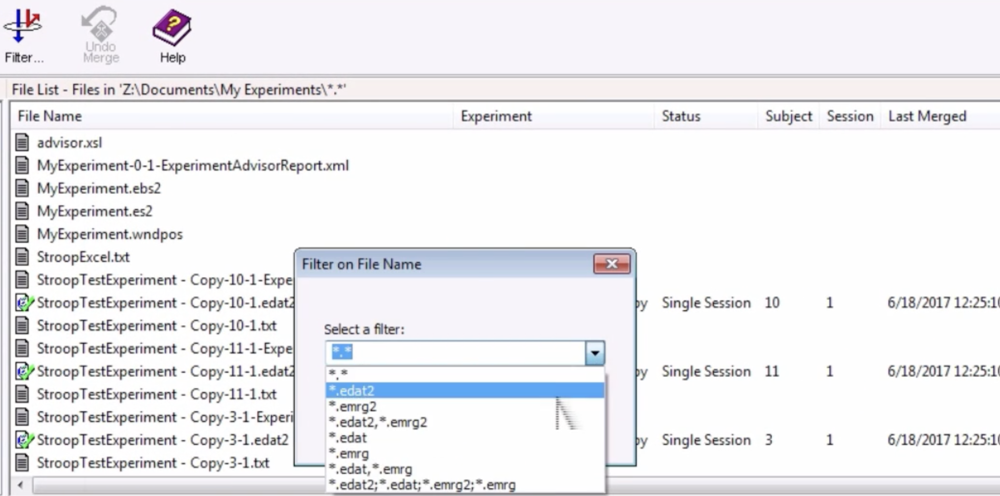
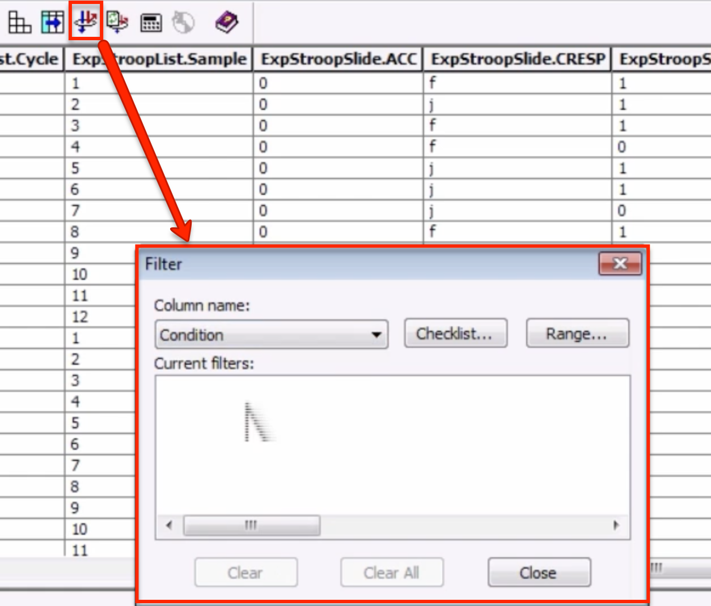
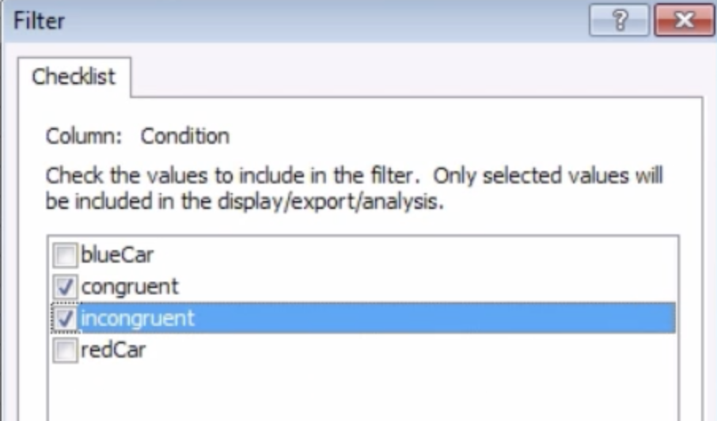
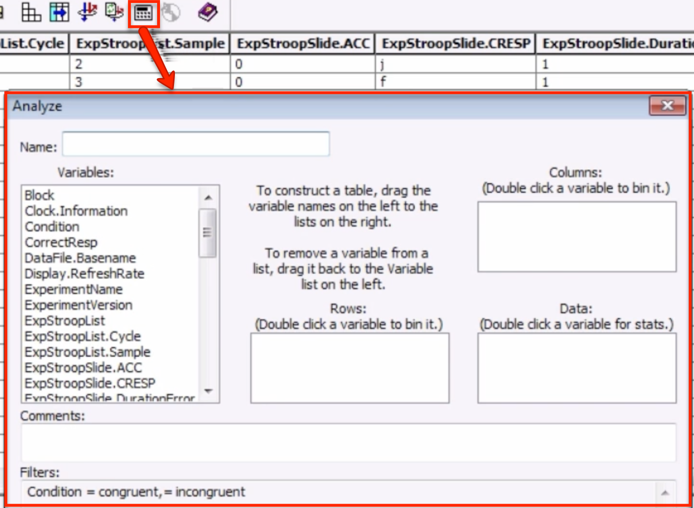
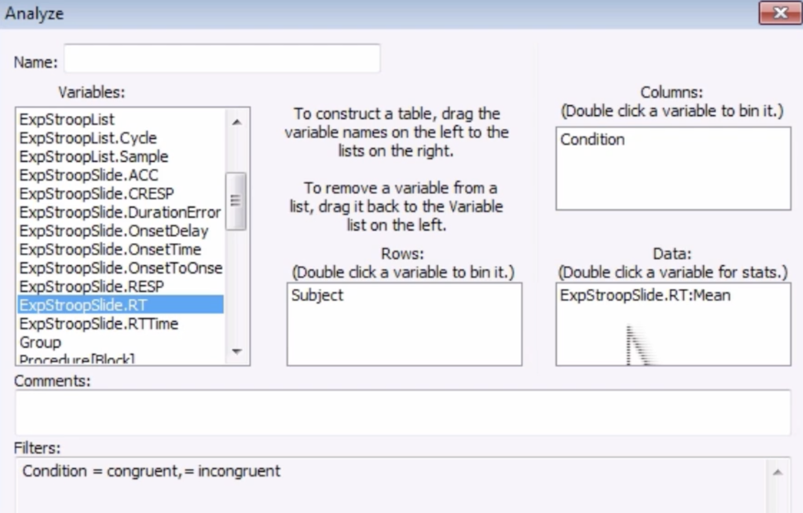
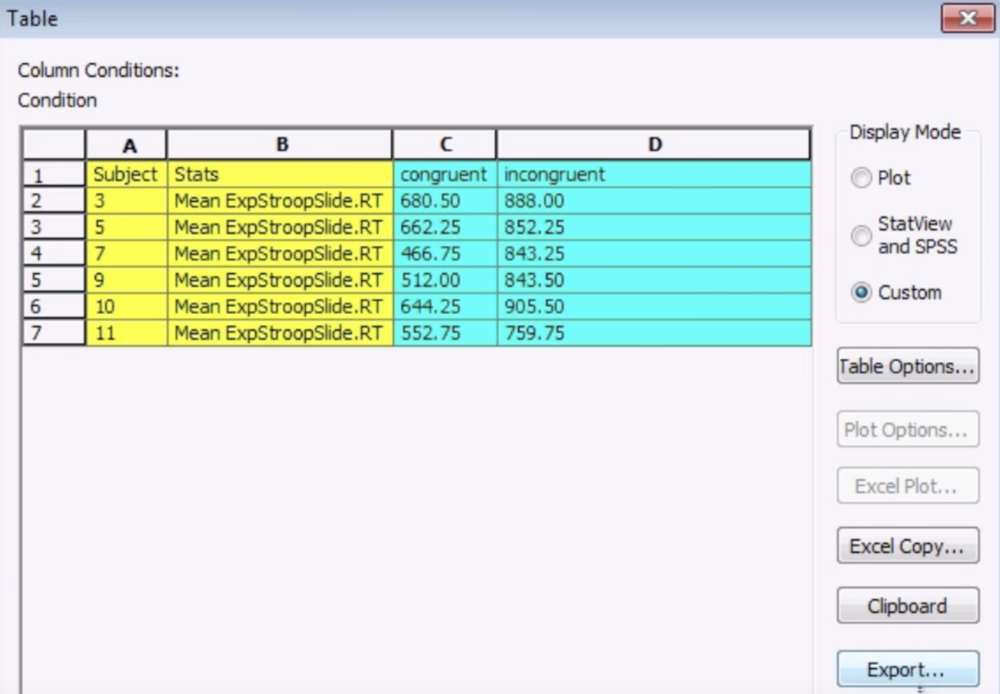
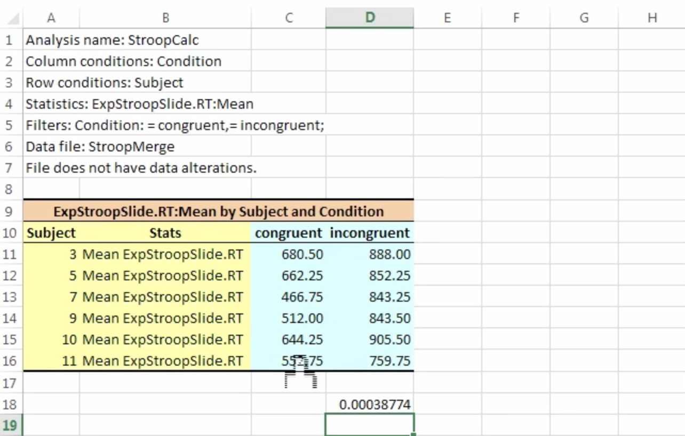

.. _EP_10_EMergeEDataAid:

=============================================
E-Prime Tutorial #10: E-Merge and E-Data Aid
=============================================

-------------

Overview
***********************

Let's say that we've run a handful of subjects, and we now have enough data to run a group-level analysis. E-Prime comes with two separate packages, **E-Merge** and **E-Data Aid**, which allow you to merge the data files for several subjects and then analyze them. E-Data Aid includes several features that allow you to filter and organize the data, as well as compute averages within and across conditions. Once you have the data formatted the way you like, you can export it to a spreadsheet or text file for analysis in a separate statistical software package.

E-Merge
*********

Both E-Merge and E-Data Aid can be found in the E-Prime package suite that was installed on your computer. Search for the E-Merge program, open it, and navigate to the folder where your e-dat files are output. Click on the ``Filter`` button and select ``*.edat2`` as a filter, which will leave only those files ending in **.edat2**. 

.. note::

  e-dat files, which have an **edat** extension, are files created at the end of each run. E-Prime 2 will generate files with an **edat2** extension.
  
Next, hold down shift and click to highlight all of the .edat2 files, and then click the ``Merge`` button. Select the ``Standard Merge`` option, and call the output file ``StroopMerge``. This will create a single file that contains the data for all of subjects.

.. figure:: 10_EMerge_Merge.png

E-Data Aid
************

Now open the E-Data Aid program and open the StroopMerge file that you just created. The first thing you will notice is that there are many columns and many rows - many more than you probably care about. The file contains so many rows and columns because it contains every attribute that was logged on every trial of the experiment.

To make this more manageable, and to focus on only the data we are interested in, click on the Filter button; the icon looks like a small disc with one arrow going through it and another arrow bouncing off of it, symbolizing a sieve. In the filter window, from the dropdown menu select "Condition".

We can now filter our trials by condition. If you click on the Checklist button, you have the option of restricting the filter to a subset of the condition attributes. If we are only interested in the Stroop trials, for example, we should check the boxes next to "congruent" and "incongruent". 

Calculating Averages
****************

To calculate the averages within each condition, click on the Analyze button - an icon that looks like a calculator. This will open a new window that allows you to construct tables of averages or other statistics for the variables that you have selected.

Let's say that we want the average for the congruent and incongruent conditions for each subject. The easiest way to organize this would be to have the rows list the subject, and the columns list the RTs for each condition. Click and drag the Subject variable into the Rows window and the Condition variable into the Columns window. Lastly, click and drag the ExpStroopSlide.RT variable into the Data window. The default statistic will be the Mean; if you double-click on the variable, you can calculate other statistics as well, such as the standard deviation. For now, we will leave it as the Mean. 

.. note::

  If you want to save this template for a later analysis, you can click on the Save Analysis button and name it whatever you want (such as "StroopCalc").
  
Now click the Run button, and observe what it generates. You will see the subject number in the leftmost column, and the average reaction time for that subject in both the congruent and incongruent conditions in the two rightmost columns.

You can then click the Export button to format it into a file that can be read by another package, such as SPSS. Alternatively, if you click on Excel Copy, it will automatically copy and paste the data to an Excel spreadsheet. You can then perform a paired t-test between the conditions using Excel's ``t.test`` function. In this example, you would click in an empty cell and type the following code:

::

  =T.TEST(D11:D16,C11:C16,2,1)
  
When means to compare the data in rows D11 to D16 (in this case, our incongruent reaction times) to the data in rows C11 to C16 (our congruent reaction times). The last two numbers specify to do a two-tailed test ("2"), and to run the test as a paired-samples t-test ("1"). The resulting number will be a p-value; if it is less than 0.05, you can declare the result statistically significant.

Next Steps
**********

At this point, you have learned everything you need to analyze a simple experiment with two conditions. You can use what you've learned as a template for more complex experimental designs, but the basic idea is the same: we compare conditions in order to detect whether there is a significant behavioral effect, which is usually measured by reaction time.

In the last tutorial, we will learn how to format our experiment so that it can be run in an MRI experiment. The basic structure of the experiment will remain the same, but we will need to make some adjustments in order to use it in a specialized environment.

Exercises
*********

1. Run the experiment on yourself or some friends for a total of 5 sessions. Use E-Merge to merge the sessions into a single file called "Stroop_Merge".

2. Use the filter to only select the blueCar and redCar conditions instead of the incongruent and congruent Stroop conditions. Run the same analysis in E-Data Aid to compare the reaction times between the blueCar and redCar conditions. Do you observe any significant difference between the two when you run a paired t-test in Excel? Why do you think you get the result that you do?

----------------

Video
***********

To see how to use E-Merge and E-Data Aid, watch `this video <https://www.youtube.com/watch?v=RUTxxGCQxFc&list=PLIQIswOrUH68zDYePgAy9_6pdErSbsegM&index=10>`__.
