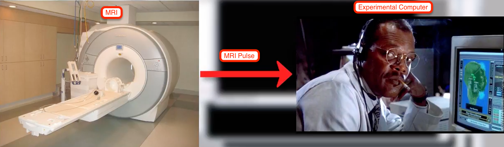
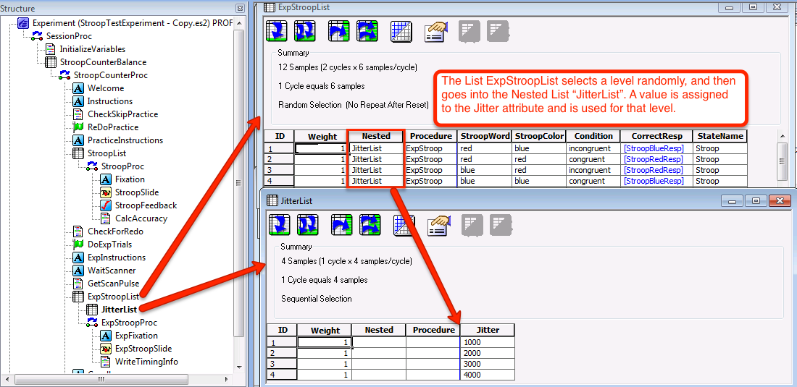
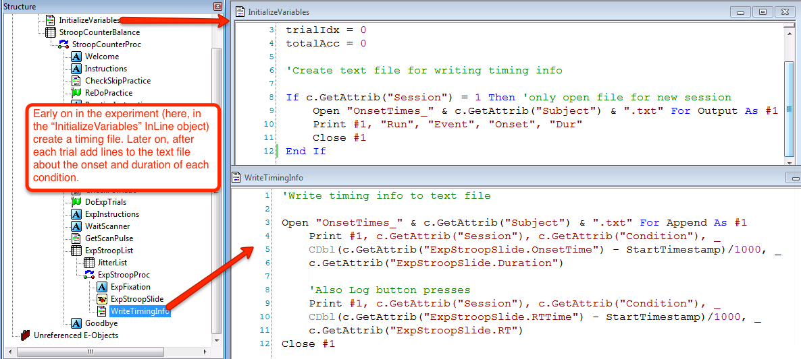

.. _EP_11_fMRI_Experiment:

=============================================
E-Prime Tutorial #11: Making an fMRI Experiment
=============================================

-------------
  
.. note::

  This tutorial uses many of the concepts you've learned so far about E-Prime: Objects, attributes, E-Basic code, and more. It is a summary of everything we've done in the previous tutorials and also applies your learning to something you may do for your research: Creating a scanner-compatible E-Prime experiment.

Overview
***********************

Once you have created a behavioral experiment, you may think that all you need to do is present it to the subjects while they are in the MRI scanner. However, there are certain aspects of the experiment that we need to change, such as inserting **jitters** between the trials that we are interested in.

Another point: You should make sure that you are detecting a behavioral effect before you scan the subject. fMRI data is very noisy, and the odds are small that you will detect a neural effect without a corresponding behavioral effect.

The Trigger Pulse
************************

When a scanner begins to collect images, it sends a trigger pulse, more commonly known as a **trigger**, to the experimental computer. (The setup for this varies between laboratories - for example, you may need to bring your own laptop to the control room and plug in the cable yourself - so you'll need to ask what the procedure is where you work.) In order to ensure that all of our timings are aligned to a common reference point - in other words, that we have a point in our experiment representing the start of our timings at zero seconds - we will need to include an object whose purpose is to wait for the trigger, and then begin the experiment when the trigger is detected.

.. warning::

  It is becoming more common for scanners to run a few "dummy" scans before sending the pulse. During these dummy acquisitions no data is collected. Make sure to ask your scanner technician whether these dummy scans are part of your sequence; if they aren't, you may need to discard the first few images during your analysis.
  
The first step is to synchronize the pulse with the onset of your experiment. The pulse is typically a number (such as "5") or a special keyboard character (such as the backtick, " ` ", found in the upper left corner of the keyboard, or an equals sign, `=`). We can create an object that listens for this special character, and which executes a block of InLine code to timestamp when the pulse was sent.  

.. figure:: 11_WaitScanner.png

  Synchronizing E-Prime and the Scanner pulse. In this example a TextSlide object called WaitScanner terminates when it receives the number "5" (Duration/Input tab not shown). An InLine object after the WaitScanner object assigns the value of the RTTime attribute into the variable StartTimestamp.
  
Jitter
^^^^^^

Another feature of many fMRI experiments is "Jitter", or variable duration between trials. Adding jitter to experiments with conditions that are relatively close to each other (e.g., less than 10-15 seconds apart) allows the independent estimation of the hemodynamic response to each condition. We can add this by creating a nested List object called JitterList. This is created through the Nested attribute in a List, and Lists can be nested recursively (e.g., nested Lists can contain nested Lists, with no theoretical upper limit).

  Example of a List object containing Jitter durations. Note that the variable "StartTimestamp" will need to be declared in the User script.
  
Writing Timing Files
*********************
  
Another useful option is to add InLine objects that output the timing information into a text file as the experiment runs. This is easier to manage than sifting through the edat files and trying to reconstruct the timing manually.

And that's it! If you're new to E-Prime, these tutorials should give you the foundation you need to begin creating your own experiments and adapting them to fMRI scanners. Remember that the best way to learn it is to do it: Following along with these tutorials is a good start, and you'll gain an even deeper understanding if you use the same framework to create a new experiment for your own study. Search the Internet for other example experiments, change different settings, and observe what happens. The more you use it, the more fluent you will become.

----------------

Video
***********

To watch a video about how to format your E-Prime experiment for an MRI scanner, click `here <https://www.youtube.com/watch?v=FeC0SLWC7B0&list=PLIQIswOrUH68zDYePgAy9_6pdErSbsegM&index=11>`__.
