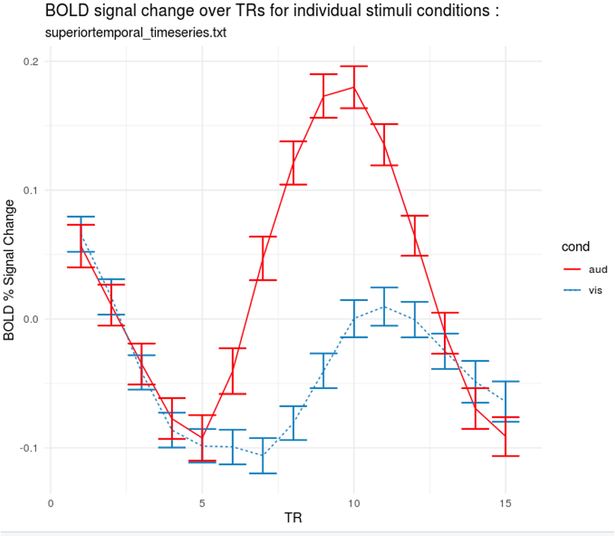
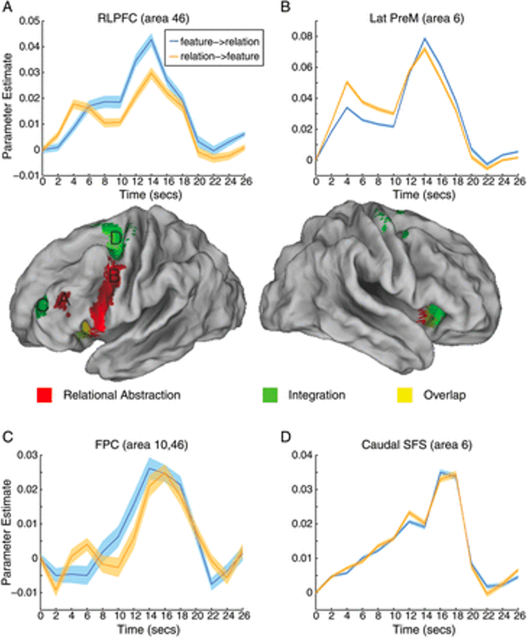

.. _FIR_Overview:

=============================
Finite Impulse Response (FIR)
=============================

----------------

Overview
********

If you have completed the tutorials on task-based fMRI studies, you are familiar with how **basis functions** are convolved with onset times to best fit the time-series. One drawback of this method is that a single best-fitting parameter is estimated for all of the instances of a particular condition; what if instead we wanted to examine the average time-course of the activity after the onset of the condition?

This method is known as a **Finite Impulse Response** (FIR) model, in which you specify the length of the time window and how many time-points you want to estimate. Instead of a single estimate of the average amplitude of the response, which is done in most analyses, you will estimate the activity at each time-point. For example, if you want to estimate the activity for a condition across a ten-second window every two seconds, this would generate five beta estimates; you could then compare the activity for the condition at certain time-points, instead of the overall amplitude of the condition.

The main advantage of a Finite Impulse Response analysis is that it is not biased toward a particular shape, such as the hemodynamic response function which is used in most analyses. Instead, the shape is unconstrained, which means that the individual time-points can in theory be any value; although the overall shape of the time-points should look roughly like a Gamma distribution if there was a genuine BOLD response in the voxel you are analyzing, there may be cases in which the shape looks noticeably different, even if there is a BOLD response. Since the canonical hemodynamic response function was modeled from robust BOLD responses to auditory and visual stimuli, it is possible that the hemodynamic response in other areas, such as the prefrontal cortex or subcortical regions, may be different.

Even if the shapes aren't that different from the canonical hemodynamic response function, a Finite Impulse Response analysis can be useful in determining aspects of the response such as the latency in the rise of the BOLD signal. For example, if we are looking at the BOLD response to auditory and visual stimuli within the superior temporal gyrus, the overall amplitude of the BOLD response to the auditory stimuli is greater compared to the visual stimuli - a predictable effect that would be captured by an analysis using the canonical hemodynamic response function. But that is not all; with a Finite Impulse Response analysis, we can see that the rise in the BOLD response occurs earlier for the auditory stimuli than it does for the visual stimuli. This more subtle difference between the conditions would be missed if we used a fixed, stereotyped response function for the BOLD signal.

Another example of more complicated differences between conditions can be seen in this figure from Nee et al., 2013, which examined the difference in the BOLD response when the subject was first given a feature cue - such as whether the stimulus was green or red - or a relational cue, such as the word "or", "and", or "any". The similarities and differences of the BOLD response can be better visualized using a Finite Impulse Responses analysis, which shows how the signal unfolds.

In any case, this type of analysis can be a useful supplement to the more widely-used single-parameter hemodynamic response function model. The drawbacks, however, are that the analysis can be less powerful; fMRI data is already very noisy as it is, and trying to divide it even further into single time-points may lead nowhere - at that scale, it is even easier to overfit the data and model noise instead of the signal. Group analyses are also more complicated, as you will ideally want to select a single time-point (or subset of time-points). The more time-points you analyze at the group level, the more tests you will need to control for.

Next Steps
**********

For this tutorial, we will be using the data from the `Pauli et al., 2016 paper <https://internal-journal.frontiersin.org/articles/10.3389/fninf.2016.00024/full>`__. The dataset analyzed in this paper can be found on OpenNeuro `here <https://openneuro.org/datasets/ds000011/versions/00001>`__. We will learn how to analyze this dataset in the three major fMRI analysis packages: AFNI, FSL, and SPM.

Video
*****

For a video overview of Finite Impulse Response analysis, click `here <https://youtu.be/gktsdZwwyfc>`__.

.. note::

  The following tutorials assume that you are already experienced in preprocessing fMRI data; we will be repeating many of those same steps, but not going over the rationale for each step. Fortunately, the preprocessing steps for a Finite Impulse Response analysis are identical in many cases to how you would preprocess an fMRI dataset using a canonical hemodynamic response function for the statistical analysis. If you need to review how to preprocess the data, see the tutorials for AFNI, FSL, and SPM on the main page of this e-book.
  
.. toctree::
   :maxdepth: 1
   :caption: Finite Impulse Response Analysis

   FIR_ShortCourse/FIR_01_AFNI
   FIR_ShortCourse/FIR_02_SPM
   FIR_ShortCourse/FIR_03_FSL
