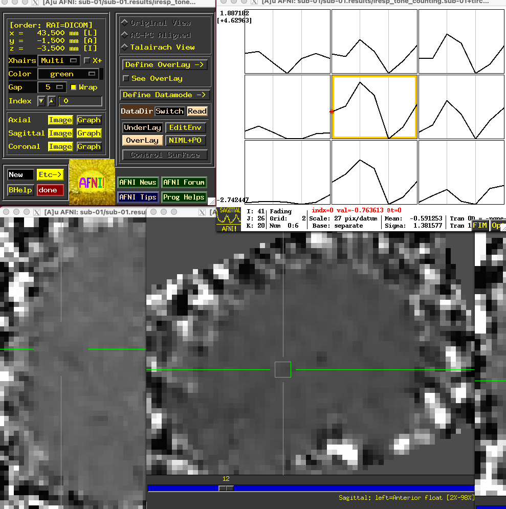

.. _FIR_01_AFNI:

================================
Chapter #1: FIR Analysis in AFNI
================================

------------------

Overview
********

In AFNI, the individual time-points you estimate are called TENTs - possibly because each basis function looks like a pup tent. The peak of this TENT function is estimated for each time-point that is specified, including the end-points of the interval; for example, if you wanted to estimate each time-point from zero (that is, when the stimulus occurs) to twelve seconds after the start of the stimulus, there would be seven estimates total: at the time-points 0, 2, 4, 6, 8, 10, and 12.

To begin, navigate to the directory ``ToneCounting_AFNI`` by opening a Terminal and typing ``cd ToneCounting_AFNI``. Then, download `this script <https://github.com/andrewjahn/AFNI_Scripts/blob/master/make_AFNI_Timings_TENT.sh>`__ to the ``ToneCounting_AFNI`` directory, and execute the script by typing ``bash make_AFNI_Timings_TENT.sh``. This will create two separate timing files for each subject, ``tone_counting_onset_times.txt`` and ``tone_counting_probe_onsets.txt``. 

For the rest of this analysis, we will make edits to the ``cmd`` file provided on the study's associated `NITRC website <https://www.nitrc.org/projects/frcl>`__ (the directory can be found by clicking on the button ``See All Files`` next to the Download dropdown menu, and selecting ``afni_hrf_tent.tar.gz``). This file uses the command ``afni_proc.py`` to create a script with all of the individual AFNI commands needed to do each step of the preprocessing and statistical analysis.

Editing the Script
******************

To use the script in a for-loop to analyze all of the subjects in this dataset, we will change the ``set subj`` line to equal ``$1``, so that our input from the for-loop will be the subject identification code. To save time, we will also insert the line ``-regress_run_clustsim no``. The edited script will look like this:

::

  #!/usr/bin/env tcsh

  # created by uber_subject.py: version 0.37 (April 14, 2015)
  # creation date: Tue Mar 22 11:56:09 2016

  # set data directories
  set top_dir = $PWD

  # set subject and group identifiers
  set subj      = $1
  set group_id  = ToneCounting

  # run afni_proc.py to create a single subject processing script
  afni_proc.py -subj_id $subj                                      \
          -script proc.$subj -scr_overwrite                        \
          -blocks tshift align tlrc volreg blur mask scale regress \
          -copy_anat $top_dir/anat/${subj}_T1w.nii.gz                    \
          -tcat_remove_first_trs 0                                 \
          -dsets $top_dir/func/${subj}_task-tonecounting_bold.nii.gz     \
          -volreg_align_to third                                   \
          -volreg_align_e2a                                        \
          -volreg_tlrc_warp                                        \
          -blur_size 4.0                                           \
          -regress_stim_times                                      \
              $top_dir/func/tone_counting_onset_times.txt               \
              $top_dir/func/tone_counting_probe_onsets.txt              \
          -regress_stim_labels                                     \
              tone_counting probe                                  \
          -regress_basis_multi                                     \
              'TENT(0,12,7)' 'TENT(0,14,8)'                        \
          -regress_censor_motion 0.3                               \
          -regress_make_ideal_sum sum_ideal.1D                     \
          -regress_run_clustsim no                                \
          -html_review_style none

  tcsh -xef proc.$subj |& tee output.proc.$subj
  
Either make these edits to the original script, or copy and paste the above code into a file called ``cmd.ap.AFNI_Tent``. The main difference between this analysis and previous ones using the canonical hemodynamic response function is the line ``-regress_basis_multi 'TENT(0,12,7)' 'TENT(0,14,8)'``, which uses a TENT analysis for the onset_times condition spanning an interval from 0 to 12 seconds with 7 TENTs each, and 8 TENTs spanning the interval 0 to 14 seconds for the probe_onsets condition. Make sure the above script is in the folder that contains all of the subjects, and then copy and paste the following code into your terminal:

::

  #!/bin/bash

  if [[ ! -e subjList.txt ]]; then
    ls | grep ^sub- > subjList.txt
  fi

  for i in `cat subjList.txt`; do 
    cp cmd.ap.AFNI_Tent $i; 
    cd $i; 
    tcsh cmd.ap.AFNI_Tent $i; 
    cd ..; 
  done
  
This will create the file ``subjList.txt`` (if it doesn't exist already), and use a for-loop to run the above ``cmd`` script for each subject. This will take a couple of hours to run.

Examining the Results
*********************

Once the preprocessing and analysis is finished, navigate to the directory ``sub-01/sub-01.results``. Similar to the results folder from the AFNI tutorials, we see output from all of the steps; however, if we look at the output from the statistical analysis by typing ``3dinfo -verb stats.sub-01+tlrc``, we see the following (truncated to just the tone_counting condition):

::

  -- At sub-brick #1 'tone_counting#0_Coef' datum type is float:       -50.34 to         60.68
  -- At sub-brick #2 'tone_counting#0_Tstat' datum type is float:     -6.03381 to       4.62057
     statcode = fitt;  statpar = 68
  -- At sub-brick #3 'tone_counting#1_Coef' datum type is float:     -64.2838 to       89.6593
  -- At sub-brick #4 'tone_counting#1_Tstat' datum type is float:     -5.57096 to       4.79652
     statcode = fitt;  statpar = 68
  -- At sub-brick #5 'tone_counting#2_Coef' datum type is float:       -119.9 to        102.47
  -- At sub-brick #6 'tone_counting#2_Tstat' datum type is float:     -5.04005 to       4.87468
     statcode = fitt;  statpar = 68
  -- At sub-brick #7 'tone_counting#3_Coef' datum type is float:     -132.215 to       136.358
  -- At sub-brick #8 'tone_counting#3_Tstat' datum type is float:     -5.70406 to       5.24604
     statcode = fitt;  statpar = 68
  -- At sub-brick #9 'tone_counting#4_Coef' datum type is float:     -100.065 to       99.7619
  -- At sub-brick #10 'tone_counting#4_Tstat' datum type is float:     -5.50184 to       5.14456
     statcode = fitt;  statpar = 68
  -- At sub-brick #11 'tone_counting#5_Coef' datum type is float:      -134.37 to       156.491
  -- At sub-brick #12 'tone_counting#5_Tstat' datum type is float:     -5.12016 to        6.7376
     statcode = fitt;  statpar = 68
  -- At sub-brick #13 'tone_counting#6_Coef' datum type is float:     -76.8142 to        77.716
  -- At sub-brick #14 'tone_counting#6_Tstat' datum type is float:     -4.45098 to        4.4271
     statcode = fitt;  statpar = 68
     
There are 14 sub-briks total for the tone_counting condition, with 7 beta weights (i.e., those labeled "Coef") and 7 T-statistics. In other words, we have an average beta estimate for each time-point in a 12-second window after the onset of each tone_counting condition; these beta weights can then be submitted to a group-level analysis just like the beta weights from a canonical HRF analysis.

Plotting the TENT Activity
^^^^^^^^^^^^^^^^^^^^^^^^^^

Each of the "coef" sub-briks representing the activity at each time-point are also contained within the files beginning with ``iresp``. In this example, the file ``iresp_probe.sub-01+tlrc`` contains just the TENT sub-briks for the 14-second window after the onset of the probe stimuli, while the file ``iresp_tone_counting.sub-01+tlrc`` contains the TENT sub-briks for the tone counting stimuli. If you open the AFNI GUI by typing ``afni``, click ``Underlay`` and select the file ``iresp_tone_counting.sub-01+tlrc``. Place the crosshairs on a voxel around the primary auditory cortex and click the ``Graph`` button next to any of the orthogonal viewers; you will see a 3x3 matrix of the center voxel and its neighbors, with the estimated activity at each time-point.

.. note::

  Some researchers find it more useful to force the activity of the first time-point to zero as a constant baseline for comparison with the activity of the other time-points. This can be done by changing the basis function in the above script from ``TENT`` to ``TENTzero``. Keeping all of the other options the same, the resulting activity profile at the same voxel in the above figure would look like this:
  
  .. figure:: 01_FIR_AFNI_TENTzero.png
  
  The overall profile looks almost the same, but the values are now relative to the first sub-brik's value of zero.
  
Group-Level Analysis
********************

The group-level analysis of the TENT sub-briks is virtually identical to those analyses using the canonical HRF; the only difference is that you will select which sub-briks you want to compare against each other.

For example, let's say that we wanted to compare the zero time-point to the third time-point - in this case, those sub-briks corresponding to time-points 0s and 6s, since the TR is 2 seconds. From the above output from the ``stats`` dataset, we see that the sub-brik 7 is the third time-point after the onset of the tone counting condition, and sub-brik 1 is the onset of the condition. Thus, we could write a paired t-test script like this:

::

  #!/bin/tcsh -xef

  # created by uber_ttest.py: version 2.0 (December 28, 2017)
  # creation date: Wed Feb 19 11:33:21 2020

  # ---------------------- set process variables ----------------------

  set mask_dset = $PWD/sub-01/sub-01.results/mask_group+tlrc

  set dirA = $PWD

  # specify and possibly create results directory
  set results_dir = test.results_6s-0s
  if ( ! -d $results_dir ) mkdir $results_dir

  # ------------------------- process the data -------------------------

  3dttest++ -prefix $results_dir/results_6s-0s -paired                    \
          -mask $mask_dset                                         \
          -setA SixSeconds                                           \
             01 "$dirA/sub-01/sub-01.results/stats.sub-01+tlrc[7]" \
             02 "$dirA/sub-02/sub-02.results/stats.sub-02+tlrc[7]" \
             03 "$dirA/sub-03/sub-03.results/stats.sub-03+tlrc[7]" \
             04 "$dirA/sub-04/sub-04.results/stats.sub-04+tlrc[7]" \
             05 "$dirA/sub-05/sub-05.results/stats.sub-05+tlrc[7]" \
             06 "$dirA/sub-06/sub-06.results/stats.sub-06+tlrc[7]" \
             07 "$dirA/sub-07/sub-07.results/stats.sub-07+tlrc[7]" \
             08 "$dirA/sub-08/sub-08.results/stats.sub-08+tlrc[7]" \
             09 "$dirA/sub-09/sub-09.results/stats.sub-09+tlrc[7]" \
             10 "$dirA/sub-10/sub-10.results/stats.sub-10+tlrc[7]" \
             11 "$dirA/sub-11/sub-11.results/stats.sub-11+tlrc[7]" \
             12 "$dirA/sub-12/sub-12.results/stats.sub-12+tlrc[7]" \
             13 "$dirA/sub-13/sub-13.results/stats.sub-13+tlrc[7]" \
             14 "$dirA/sub-14/sub-14.results/stats.sub-14+tlrc[7]" \
          -setB ZeroSeconds                                           \
             01 "$dirA/sub-01/sub-01.results/stats.sub-01+tlrc[1]" \
             02 "$dirA/sub-02/sub-02.results/stats.sub-02+tlrc[1]" \
             03 "$dirA/sub-03/sub-03.results/stats.sub-03+tlrc[1]" \
             04 "$dirA/sub-04/sub-04.results/stats.sub-04+tlrc[1]" \
             05 "$dirA/sub-05/sub-05.results/stats.sub-05+tlrc[1]" \
             06 "$dirA/sub-06/sub-06.results/stats.sub-06+tlrc[1]" \
             07 "$dirA/sub-07/sub-07.results/stats.sub-07+tlrc[1]" \
             08 "$dirA/sub-08/sub-08.results/stats.sub-08+tlrc[1]" \
             09 "$dirA/sub-09/sub-09.results/stats.sub-09+tlrc[1]" \
             10 "$dirA/sub-10/sub-10.results/stats.sub-10+tlrc[1]" \
             11 "$dirA/sub-11/sub-11.results/stats.sub-11+tlrc[1]" \
             12 "$dirA/sub-12/sub-12.results/stats.sub-12+tlrc[1]" \
             13 "$dirA/sub-13/sub-13.results/stats.sub-13+tlrc[1]" \
             14 "$dirA/sub-14/sub-14.results/stats.sub-14+tlrc[1]" 

Visualizing these results and determining a significance threshold for them is the same as in the previous AFNI tutorials.

.. note::

  For more details on how to set up contrasts within AFNI for to compare different TENTs, as well as a comparison of TENT to other basis functions, see `this post <https://blog.cogneurostats.com/2014/10/08/tidbits-on-afnis-tent-function/>`__ by Pete Molfese.
  
Exercises
*********

1. Imagine that instead of analyzing the interval of 0-12 seconds, we wanted to just look the interval of 0-8 seconds for the ``tone_counting`` condition. Show how you would modify the ``afni_proc.py`` script above, and run the script for ``sub-01``. How has the 0-8 second interval changed compared to the previous TENT analysis, if at all? Choose a voxel located at MNI coordinates [47, 3, -6] to illustrate the comparison between the analyses.

2. FIR analyses can also analyze an interval with a given number of TENT functions that is not divisible by your TR. For example, change the ``afni_proc.py`` script for the ``tone_counting`` condition to 'TENT(0,12,5)', which will span the 12-second range with 5 TENT functions; these will be interpolated to match the time grid. (Using TENTs that evenly divide into your TRs will be more accurate, but there may be theoretical reasons for using a different time scale.) Run this updated analyses, and examine how the output compares to the original afni_proc.py script, again using MNI coordinates [47, 3, -6] to illustrate the comparison between the analyses.

Video
*****

For a video overview of how to do FIR analysis in AFNI, click `here <https://youtu.be/prl6JOoQxkY>`__.

Next Steps
**********

Now that you are familiar with how to analyze the data with AFNI, we will move on to analyzing the data in SPM. To see how to do that, click the ``Next`` button.
