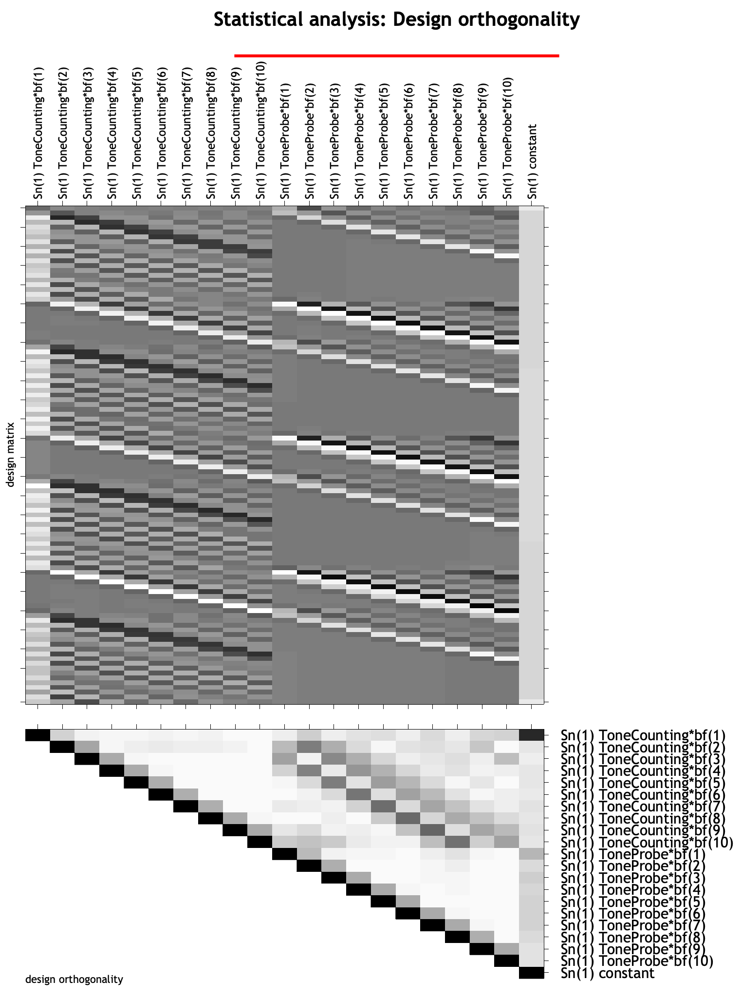
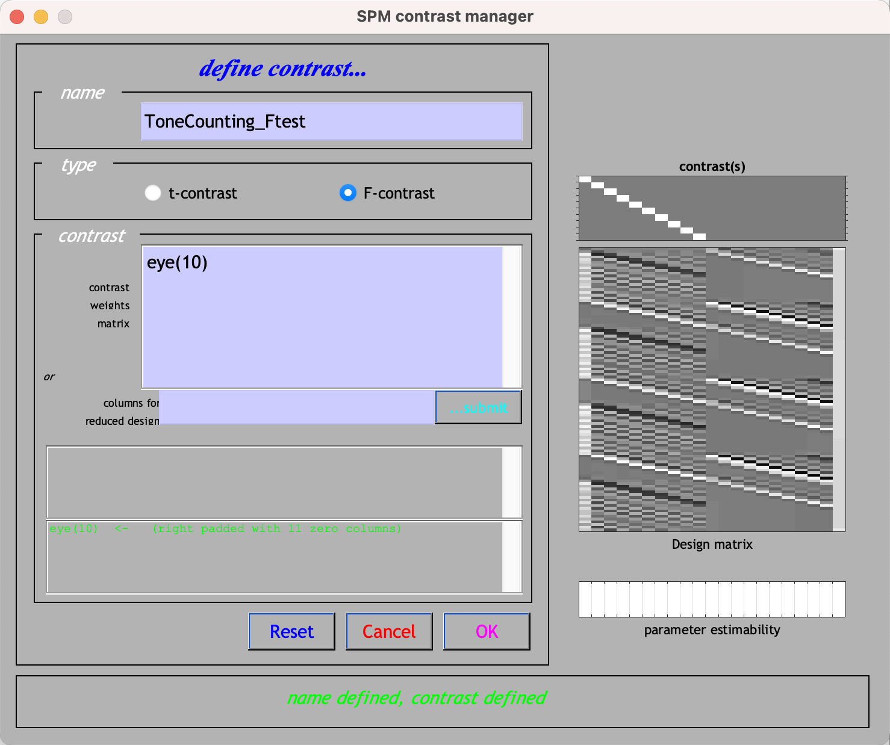
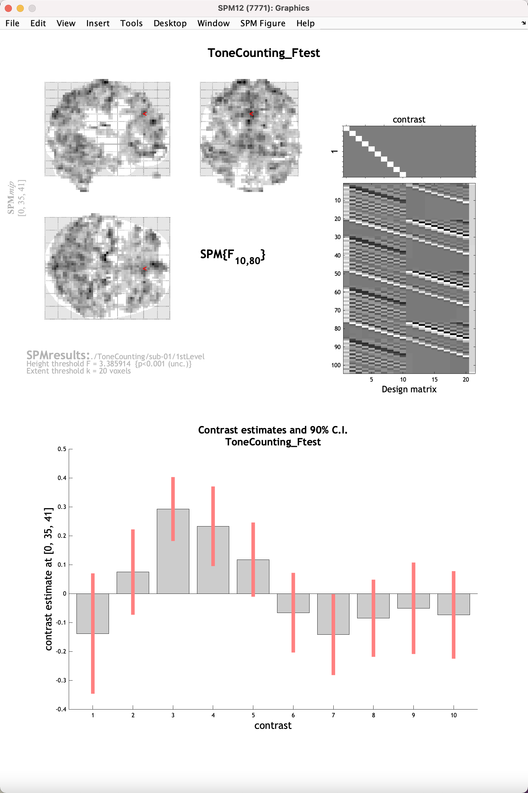
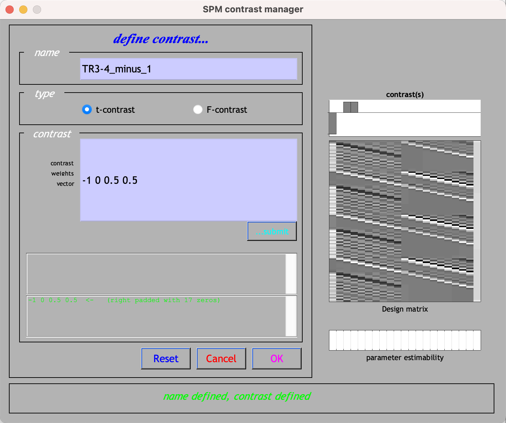

.. _FIR_02_SPM:

===============================
Chapter #2: FIR Analysis in SPM
===============================

------------------

Overview
********

Compared to FIR analysis AFNI, the implementation in SPM is quite easy. The preprocessing is the same as in the previous SPM tutorial on analyzing event-related data from the Flanker task; the only difference is in how the first-level model is specified for each subject.

Setting Up the First-Level Model
********************************

Once you have finished preprocessing, go to the SPM GUI and click the button ``Specify 1st-level``. Use the Terminal to create a new directory ``1stLevel`` within the directory ``sub-01``, and select that in the ``Directory`` field for the output. Set the ``Units for design`` to ``Seconds``, the ``Interscan interval`` to ``2``, and leave the rest of the defaults as they are. 

Add a new Subject/Session from the ``Data & Design`` field, and use the file navigator to select all of the functional data that begin with the prefix ``swr`` (i.e., those files that have been smoothed, warped, and realigned). Use a frame selector range of 1:104 to select all of the volumes within the dataset.

Create two Conditions, ``ToneCounting`` and ``ToneProbe``. The onsets and durations for each condition can be found in the first and second columns of the file ``sub-01_task-tonecounting_events.tsv``; to make the files easier to read, and to split them into separate timings for both the probe and tone counting conditions, run the following script from the directory containing all of the subjects:

::

  #!/bin/bash

  #Check whether the file subjList.txt exists; if not, create it
  if [ ! -f subjList.txt ]; then
          ls -d sub-?? > subjList.txt
  fi

  #Loop over all subjects and format timing files into FSL format
  for subj in `cat subjList.txt` ; do
          cd $subj/func #Navigate to the subject's func directory, which contains the timing files

          #Extract the onset times for the incongruent and congruent trials for each run. NOTE: This script only extracts the trials in which the subject made a correct response. Accuracy is nearly 100% for all subjects, but as an exercise the student can modify this to extract the incorrect trials as well.
          cat ${subj}_task-tonecounting_events.tsv | awk '{if (NR!=1 && $5=="") {print $1, $2, "1"}}' > toneCount_run1.txt
          cat ${subj}_task-tonecounting_events.tsv | awk '{if ($5=="probe") {print $1, $2, "1"}}' > toneProbe_run1.txt

          cd ../..
  done

This will create new onset files, toneCount_run1.txt and toneProbe_run1.txt. Now, copy and paste the onset times and durations into their respective conditions. (Note that the duration for the ToneCounting conditions is always 4 seconds, so you can just enter a value of 4 in this field.) Lastly, under ``Basis Functions``, change the function from ``Canonical HRF`` to ``Finite Impulse Response``. This generates two fields, ``Window Length`` and ``Order``; enter values of ``20`` and ``10``, respectively, to create an FIR model that estimates 10 time-points over a window of 20 seconds.

.. note::

  Unlike AFNI's TENT function, SPM doesn't generate an estimate of the activity of the time-point at time zero - i.e., the onset of the stimulus. This is assumed to be zero, and all of the time-points afterwards are estimated relative to that.
  
At this point, you can click the Green ``Go`` button. You will also need to estimate the model by clicking the ``Estimate`` button and selecting the SPM.mat file you just created. If you need to review the model, click on the ``Review`` button in the SPM GUI and select the SPM.mat file. Further, you can click on ``Design -> Design Orthogonality`` to see the correlation between the regressors. Note that there are 10 regressors per condition, with one column per regressor. 

Scripting The Analysis
**********************

Just like with analyzing the Flanker task, we can create a script that will automate the preprocessing and model setup for this dataset. You can download the script by clicking ``here <https://github.com/andrewjahn/SPM_Scripts/blob/master/ToneCount_AnalysisScript_job.m>`__, clicking on ``Raw``, and then right-clicking anywhere in the screen and selecting ``Save As``, removing the ``.txt`` extension, and saving it to the directory containing all of your subjects. Assuming that you have already run the onset time conversion code above, open a Matlab terminal, navigate to the directory containing your subject, and type:

::

  ToneCount_AnalysisScript_job
  
This will run the preprocessing and model analysis for all of your subjects, and should take a couple of hours.

Viewing the Results
*******************

To view the results, click on the ``Results`` button and select the SPM.mat file within the directory ``sub-01/1stLevel``. This will show the design matrix, with ten finite impulse response regressors per subject. If we wanted to see where there was any event-related response to any of the time-points that we estimated, we could calculate an F-test - in other words, conduct multiple t-tests, one per regressor, and see whether any one of them is significant. Click on the ``F-contrasts`` radio button, and click on ``Define new contrast``. Give it the name ``ToneCounting_Ftest``, and in the contrast field, type ``eye(10)``. This will create a diagonal of ones, with one per time-point for the ToneCounting condition.

Click ``OK``, and then ``Done``. Similar to the Flanker analysis, set ``apply masking`` to ``none``, the ``p-value adjustment`` to ``0.001``, and the ``extent threshold`` to ``20``. In the results maximum intensity projection (MIP) window, click on ``plot -> Contrast estimates and 90% CI -> Which Contrast? -> ToneCounting_Ftest``. This will display a plot of the estimated activity at each time-point in the time window you specified during the 1st-level analysis setup; if you click and drag the red arrowhead in the glass brain window, you will see the plot update with new estimates at that particular voxel. For example, at the coordinates ``0, 35, 41``, the plot looks like this:

Note how the overall pattern looks similar to the canonical HRF - there is a rise and a distinct peak around 3-4 TRs, corresponding to approximately 6-8 seconds after the onset of the sitmulus, followed by a gradual decrease and undershoot. This pattern is not the same everywhere, however; navigate around the brain and see the variety of profiles that have been estimated in this time window.

Other Contrasts
^^^^^^^^^^^^^^^

Aside from an F-test, you may want to compare specific time-points or combinations of time-points against each other. Let's say we were interested in the average of TRs 3-4 compared to TR 1, and where this difference was significant. Click on ``Results`` again, select the same SPM.mat file, and define this contrast:

::

  -1 0 0.5 0.5
  
Note that since we are comparing two regressors against one, we will need to control for this number by weighting them by 0.5 each. This will create a series of contrast weights that looks like this:

Click ``OK -> Done``, and use the same correction settings as for the F-test. The resulting map will show where the average of TRs 3 and 4 are greater than TR 1.

Next Steps
**********

Now that you have learned how to set up a Finite Impulse Response analysis and create contrasts, the group-level analysis and ROI analysis will be the same as in the Flanker dataset. The interpretation will be different and slightly more complicated, but you will be able to make more nuanced claims about what is happening at specific points after the onset of the stimulus. Once you are satisfied with this analysis, you can now learn how to do it in FSL, the last of the major software packages we will be covering.
