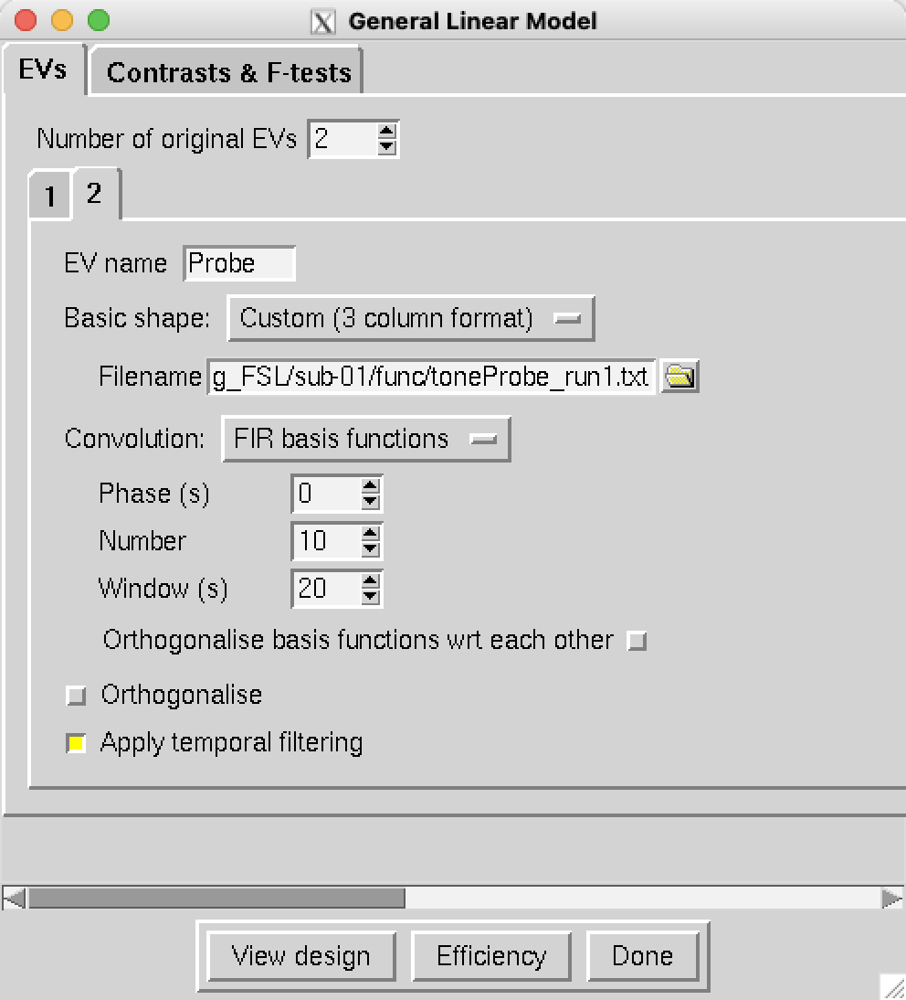
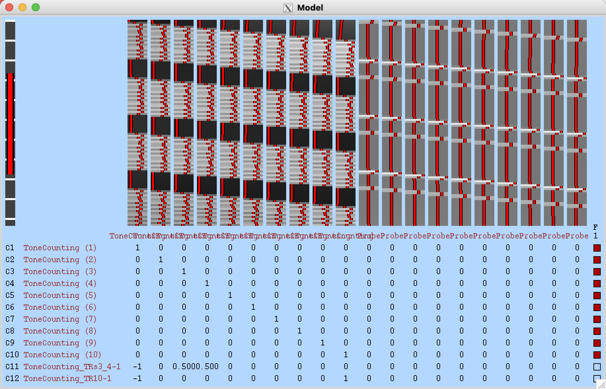

.. _FIR_03_FSL:

===============================
Chapter #3: FIR Analysis in FSL
===============================

------------------

Overview
********

Finite Impulse Response analysis in FSL is more similar to SPM than to AFNI; the basic setup happens in the GUI, and you specify a window along with the number of time-points you want to estimate. Since both the preprocessing and modeling happens within the same FEAT GUI, the analysis will be more compact than in SPM.

Before you begin, create the onset time files by navigating to the directory containing all of your subject, and then copying and pasting the following code:

::

  #!/bin/bash

  #Check whether the file subjList.txt exists; if not, create it
  if [ ! -f subjList.txt ]; then
          ls -d sub-?? > subjList.txt
  fi

  #Loop over all subjects and format timing files into FSL format
  for subj in `cat subjList.txt` ; do
          cd $subj/func #Navigate to the subject's func directory, which contains the timing files

          #Extract the onset times for the incongruent and congruent trials for each run. NOTE: This script only extracts the trials in which the subject made a correct response. Accuracy is nearly 100% for all subjects, but as an exercise the student can modify this to extract the incorrect trials as well.
          cat ${subj}_task-tonecounting_events.tsv | awk '{if (NR!=1 && $5=="") {print $1, $2, "1"}}' > toneCount_run1.txt
          cat ${subj}_task-tonecounting_events.tsv | awk '{if ($5=="probe") {print $1, $2, "1"}}' > toneProbe_run1.txt

          cd ../..
  done
  
This will create new files in the ``func`` directory called ``toneCount_run1.txt`` and ``toneProbe_run1.txt``, respectively.

Preprocessing and the First-Level Model
***************************************

Now, navigate to the folder ``sub-01`` and type ``Feat_gui``. This will open the FEAT GUI; make sure the defaults of ``First-level analysis`` and ``Full Analysis`` are selected, and then click on the button ``Select 4D data``. Select the file ``func/sub-01_task-tonecounting_bold.nii.gz``, and click ``OK``. In the field next to ``Output directory`` type ``run1``, and leave the other defaults in the Data and Pre-stats tabs as they are. In the ``Registration`` tab, set the search values in both the Main structural image and Standard space fields to ``Full Search`` and ``12 DOF`` (you may use ``BBR`` if you want; to make the analysis quicker, we will use these other settings). In the ``Main structural image`` field, select the image ``anat/sub-01_T1w_brain.nii.gz``. Then, click on the ``Stats`` tab and click the b utton ``Full model setup``. 

Set the ``Number of original EVs`` to ``2``, and for the EV name for the first regressor, type ``ToneCounting``. Change the ``Basic shape`` to ``Custom (3 column format)``, and select the file ``toneCount_run1.txt``. In the dropdown menu next to ``Convolution``, select ``FIR basis functions``. As with AFNI and SPM, you can select the time window and the number of time-points to estimate; change the ``Number`` to ``10`` and the ``Window`` to ``20``. This will estimate 10 time-points at 2 second intervals in a 20-second window after the onset of the stimulus. Click on the ``2`` tab to select the second regressor, give it the name ``Probe``, and select ``Custom (3 column format)`` and the file ``toneProbe_run1.txt``; use the same ``Number`` and ``Window`` values of ``10`` and ``20``:

Specifying the Contrasts
^^^^^^^^^^^^^^^^^^^^^^^^

If you click on the ``Contrasts & F-tests`` tab, you may get a message telling you to use Real EVs; this is because the Original EVs are usually restricted to estimating the amplitude of the regressor, and ignore additional regressors such as temporal derivatives and motion regressors. In this case we are interested in the additional regressors, specifically the estimated time-points after the onset of the condition.

In the field next to ``F-tests``, type ``1`` and press enter. You should see 10 contrasts automatically filled in with a diagonal of 1's for each time-point after the ToneCounting condition, and a box selected in the column ``F1``. Just as in the SPM tutorial, this will test whether there is any significant difference anywhere for any of the time-points. We can also add two more contrasts by changing the ``Contrasts`` number to ``12``; name these additional contrasts ``ToneCounting_TRs3_4-1`` and ``ToneCounting_TR10-1``, and give them the contrasts [-1 0 0.5 0.5 0 0 0 0 0 0] and [-1 0 0 0 0 0 0 0 0 1], respectively. The first will test whether the average of TRs 3 and 4 is greater than 1, and the second will test whether TR 10's activiy is greater than TR 1's.

.. figure:: 03_FEAT_FIR_Contrasts.png

If you click on ``View Design``, you should see the following image, representing 10 regressors after the onset of each condition:

Creating the Script
*******************

Next, click ``Done``, and then click ``Save``; call the output file ``Design_run1``. 
