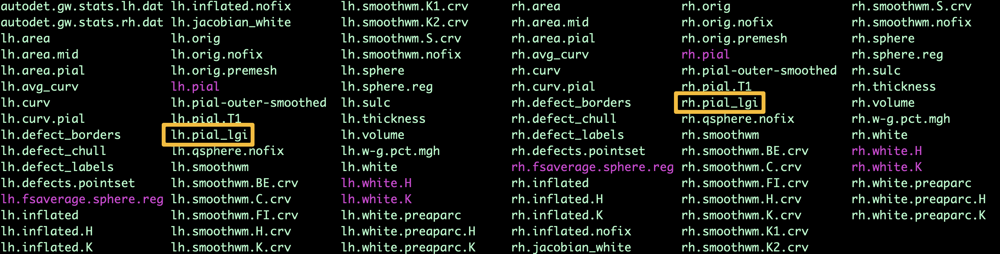
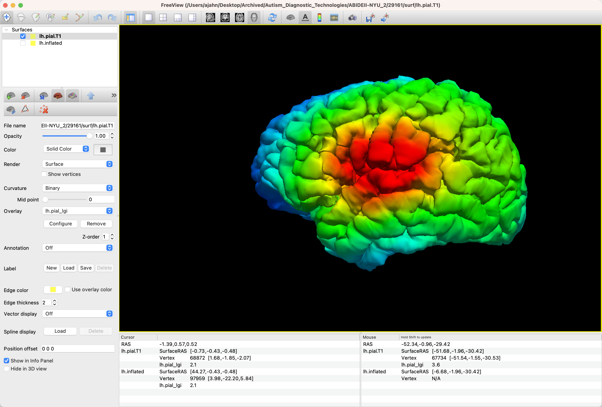
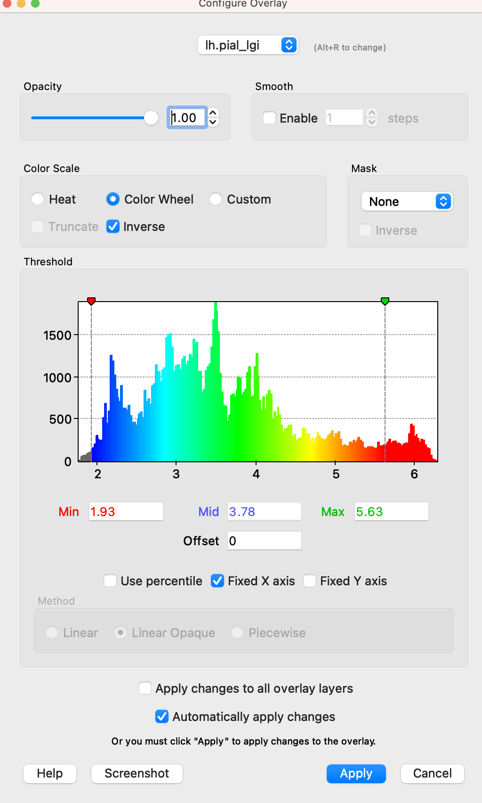
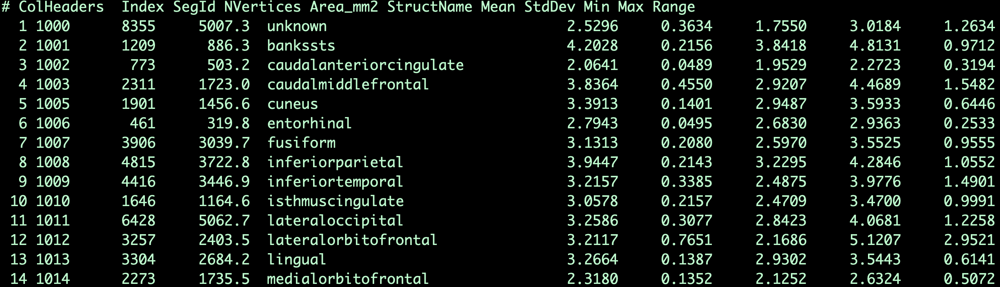

.. _AppendixA_LGI:

====================================
Appendix A: Local Gyrification Index
====================================

Analyzing the Subject
*********************

Local Gyrification Index (LGI) is a measure of cortical folding. For example, a region of the brain that has more involutions in a smaller space, such as the inferior frontal gyrus, will have a larger LGI than a region with fewer cortical folds. Once you have processed a subject through recon-all, you can calculate a whole-brain LGI map 

However, FreeSurfer alone is unable to generate an LGI map; you will need to first install Matlab, along with its `Image Processing Toolbox <https://www.mathworks.com/products/image.html>`__. Once you have installed it, you will then need to set the Path to point to your Matlab. In my case, I typed:

::

  export PATH=/Applications/MATLAB_R2021b.app/bin:${PATH}
  
Then type ``getmatlab`` to make sure the path has been set properly. If it has, you should see the path returned to the command prompt.

To run the LGI analysis, type:

::

  recon-all -s <subj> -localGI
  
Replacing ``<subj>`` with the subject ID that you want to analyze. For example, if I have a subject with the ID 29161, and I have already analyzed the subject using recon-all, I would first navigate to the directory containing that subject, and set the SUBJECTS_DIR path if I haven't already. Then, I would run the -localGI command:

::

  cd Directory_Containing_Subjects
  SUBJECTS_DIR=`pwd`
  recon-all -s 29161 -localGI

This will take a couple of hours. When it has finished, you will see new files in the ``surf`` directory with an ``_lgi`` extension:

Viewing the Results
*******************

You can then view the results using ``freeview`` by using the Overlay option. For example, if you want to load the LGI results from the command line for the left hemisphere, you could type the following:

::

  freeview -f 29161/surf/lh.inflated:overlay=lh.pial_lgi
  
Which should show you something like this:

The default is to display the LGI results as a heatmap; however, you may find it more useful to display it as a color wheel. Click on the ``Configure`` button, which will display a new window showing the intensity range of the overlay. In the ``Color Scale`` panel, select the ``Color Wheel`` radio button; also, check the box next to ``Inverse``. This will display the highest intensities as more red, and the lower intensities as shades of blue. You can also move the green and red arrowheads to find an intensity range that looks best to you:

ROI Analysis
************

Just as we did with the ROI analysis for measurements such as thickness and volume, you can extract LGI results from the parcellations provided by FreeSurfer. For example, from the directory containing the subjects that have already been analyzed using LGI, type:

::

  mri_segstats --annot 29161 lh aparc --i 29161/surf/lh.pial_lgi --sum lh.aparc.pial_lgi.stats
  
This will generate a new file, ``lh.aparc.pial_lgi.stats``, which contains LGI results, measured in square millimeters, for each of the parcellations:

These data can then be used for group comparisons and correlation with individual differences.
