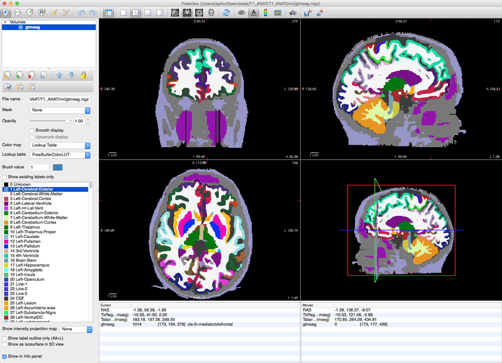
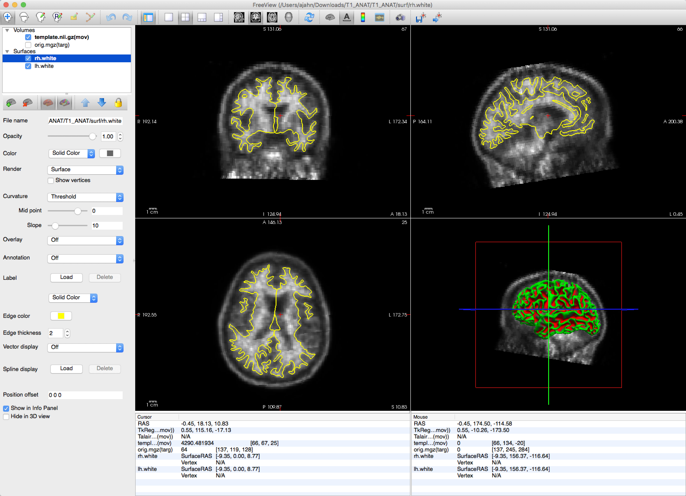

.. _AppendixB_PETSurfer:

=====================
Appendix B: PETSurfer
=====================

--------------

.. note::

  These steps are taken from the FreeSurfer `PETSurfer page <https://surfer.nmr.mgh.harvard.edu/fswiki/PetSurfer>`__; I am adapting them to be used with another dataset. Note that PETSurfer is only available in FreeSurfer version 6.0 or later.
  As of January 5th, 2021, this page is still under revision; I may come back to it if there seems to be a demand.

Overview
********

This section contains a few notes about how to run PETSurfer, a suite of tools within the `FreeSurfer package <https://surfer.nmr.mgh.harvard.edu/>`__. In other words, if you have already downloaded and installed FreeSurfer, you will be able to use PETSurfer.

If you have collected Positron Emission Tomography (PET) data, you will also need an anatomical image from the same subject. The following steps will segment the PET image, coregister it to the anatomical image, and then apply partial volume correction (PVC). The last step, PVC, is necessary for avoiding partial volume effects (PVEs), in which a single voxel can contain signal from multiple tissue types or different gyri - without it, we wouldn't be able to determine whether the signal measured in the voxel comes from the grey matter, the white matter, or a mix of both.

.. note::

  PETSurfer contains the following methods:

  * Symmetric Geometric Transfer Matrix (SGTM) - used primarily for ROI analyses
  * Meltzer Method - used for voxel-wise analyses
  * Muller-Gartner Method (MG) - also used for voxel-wise analyses
  
  We will be referring to them using each of these acronyms.
  
  
Preparing the Data - Running recon-all
**************************************

The first step will be to reconstruct the anatomical image using ``recon-all``. Instructions for how to do this can be found in :ref:`this chapter`. Wherever you are running the analysis with your anatomical image, make sure to navigate to that directory and point to it with SUBJECTS_DIR:

::

  SUBJECTS_DIR=`pwd`
  recon-all  -s T1_ANAT -i T1_ANAT.nii.gz -all
  
This will take a few hours to process, depending on the speed of your computer. When it has finished, make sure to run the quality checks described in :ref:`this chapter <FS_06_Freeview>`.

Segmenting the Data
*******************

If the reconstructed anatomical image looks satisfactory, you can then segment the image using ``gtmseg``:

::

  gtmseg --s T1_ANAT
  
This will take about an hour. When it finishes, you will see a new image called ``gtmseg.mgz`` located in the folder ``T1_ANAT/mri``. You can view this in freeview by typing:

::

  freeview -v T1_ANAT/mri/gtmseg.mgz:colormap=lut
  
Which will display the segmented anatomical image with the colormap "lut" (look-up table) overlaid on top of it. Hovering your mouse around the different colors will show which color corresponds to which segmentation.

Registering the PET data to the anatomical image
************************************************

You have three options for coregistering your data: If you have only one PET image, then you just use that as your template. If you have multiple PET images, on the other hand, you can either average all of the PET images together to create a template, or extract a single image. In this tutorial, we will use the single image method:

::

  mri_convert PET.nii.gz --frame 0 template.nii.gz
  
And then use this for the coregistration:

::

  mri_coreg --s T1_ANAT --mov template.nii.gz --reg template.reg.lta
  
The coregistration can then be checked with ``tkregisterfv``:

::

  tkregisterfv --mov template.nii.gz --reg template.reg.lta --surfs
  
You should see a clear outline of the boundary between the grey matter and the white matter, highlighted in yellow:

Applying Partial Volume Correction
**********************************

