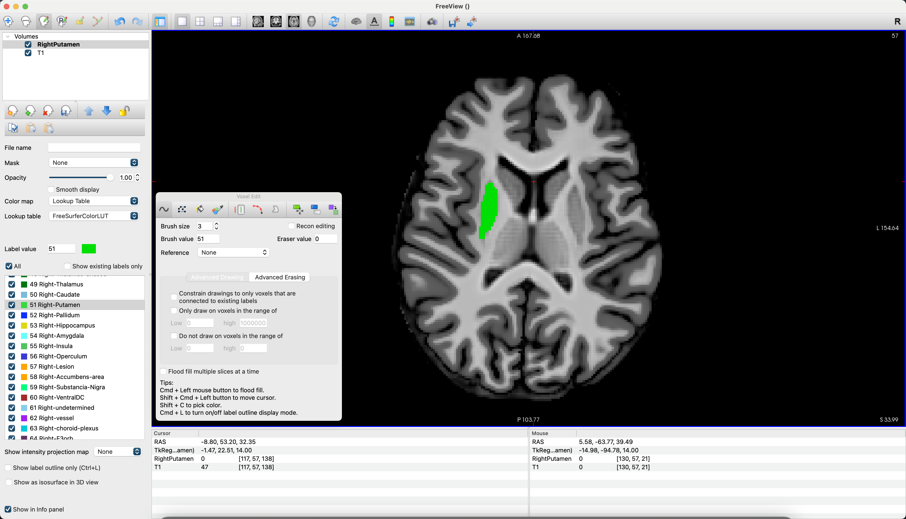

.. _AppendixC_Annotations:

======================================================
Appendix C: Annotating Anatomical Images with Freeview
======================================================

---------------

Overview
********

Freeview, in addition to allowing you to view images and edit them for recon-all, also enables you to **annotate** images. For example, if you want to draw on a T1-weighted anatomical image yourself to trace out where a specific region of the brain is - say, the putamen - you can do so within the Freeview interface. When we select the voxels that we decide are part of a specific region of the brain, we fill those voxels with a certain number - say, the number one - and leave the rest of the voxels as zeros. This is called creating a **mask**, also sometimes referred to as a **Region of Interest (ROI)**.

Annotating a Region of Interest (ROI)
*************************************

First, open Freeview by either double-clicking on the icon in your FreeSurfer directory, or by opening a Terminal and typing ``freeview``. When it opens, click on ``File -> Load Volume`` and select the anatomical image that you want to annotate. When it loads, you should see something like this:

.. figure:: AppendixC_FreeviewLayout.png

In order to create our region of interest, click on ``File -> New ROI``. You will be prompted to type a label for the ROI; in this case, we are annotating the right putamen, so let's call it ``Right Putamen``. Make sure that the dropdown menu below it is the T1 image you are annotating; this will ensure that the ROI has the same resolution and dimensions as the image you are drawing on, also called the **Template Image**. Click OK.

There will now be a small floating window called ``ROI Edit`` that is open as long as you are annotating the ROI. The brush size refers to the size of the radius of the brush, in voxels, which for most anatomical images will be the same as millimeters. For smaller regions and thinner bands of cortex, you should probably use a smaller brush size. In our current example, we will change the brush size to ``3``. Also note that in this window there are other drawing options, such as ``Polyline``, ``Livewire``, and ``Fill``. We will cover these later; for now, leave it as the default of ``Freehand``. 

.. figure:: AppendixC_ROIEdit.png

.. note::

The icons on the top row of the Freeview GUI indicate which viewing or drawing mode is now active; right now you should see highlighted the icon with a pencil on a piece of paper.

Drawing the Region
&&&&&&&&&&&&&&&&&&

Once the drawing tool has been selected, you can left-click on the voxels in any of the viewing panes to begin annotating voxels. You may prefer one viewing pane to another; if you want to only see the Axial pane, for example, click on the icon at the top of the Freeview window that is an Axial view, and then click the white square, which will display only that orthogonal view. You may also choose to change the color and opacity of your annotation by using those options in the left panel of the Freeview GUI:

.. figure:: AppendixC_AxialView.png

.. note:: You can zoom in and out by using your mouse's scrolling function. You can also move between adjacent slices by pressing the up and down arrows on your keyboard.

Now, begin left-clicking and dragging to draw your annotation on the voxels that you believe belong to the Putamen. Move on to each adjacent slice until you are able to annotate the entire region.

When you are finished drawing your ROI, you can save it by clicking ``File -> Save ROI As``. This will automatically save it as a ``.label`` file, which we can later convert into NIFTI format using the command ``mri_label2vol``.

You can annotate many different ROIs simultaneously. For example, if you select ``File -> New ROI`` and name the new ROI ``Left Putamen``, make sure it is highlighted in the left panel of Freeview. Then, you can choose a different color for it, and annotate it as you like. Whichever ROI is highlighted will be written to disk when you select ``File -> Save ROI As``.

.. note::

  If you make a mistake during annotation, you can press ``command + z`` to undo the last stroke. Typing ``Shift + command + z`` will redo the last stroke. Holding down shift and left-clicking will remove any annotated voxels from the ROI that is currently highlighted in the selection pane.

Saving the ROIs as NIFTI
************************

Label files are able to be read only by FreeSurfer, but you may wish to use or view the ROIs in other software as well. To make them as portable as possible between groups, you can convert the label file to a NIFTI file using ``mri_label2vol``. For example, this line of code, executed from the directoy containing both the T1.mgz file and the RightPutamen.label file, will convert RightPutamen.label into RightPutamen.nii.gz:

::

  mri_label2vol --label RightPutamen.label --temp T1.mgz --regheader T1.mgz --tkr-template T1.mgz --o RightPutamen.nii.gz

Calculating the Dice Coefficient
********************************

Imagine that you are a trained anatomist who wants to annotate the brain regions by hand, and compare how your annotations match up with the ones automatically generated by FreeSurfer. The most common technique is to calculate the **Dice Coefficient**, a measure of similarity between sets. Theoretically, the sets can be anything - letters, numbers, and so on. It is particularly well suited for comparing segmentations, as the overlap can be calculated between the segmentations. Given segmentation A and segmentation B, the Dice Coefficient is calculated as:

.. figure:: AppendixE_DiceCoefficient_Equation.png

In which **D** is the Dice Coefficient, **A** is the pattern of voxels for one of the segmentations, and **B** is the pattern of voxels for the other segmentation. Another way to look at it is to compare the Putamen mask that we just created with the Putamen generated by FreeSurfer:

::

  mri_label2vol --seg aparc+aseg.mgz --temp T1.mgz --o aparc-in-rawavg.mgz --regheader aparc+aseg.mgz

In which ``T1.mgz`` refers to the original T1 anatomical image you provided, and ``aparc+aseg.mgz`` is the segmentation output from FreeSurfer. You can then calculate the overlap with:

::

  mri_seg_overlap segmentation.mgz aparc-in-rawavg.mgz

Which gives Dice scores like the following:

.. figure:: AppendixE_DiceScores

In this case, I only annotated a few of the regions by hand; the ones that were not annotated have a Dice score of ``0``. 
