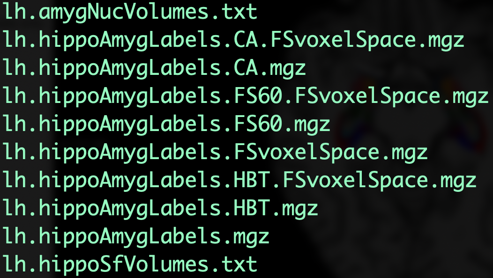
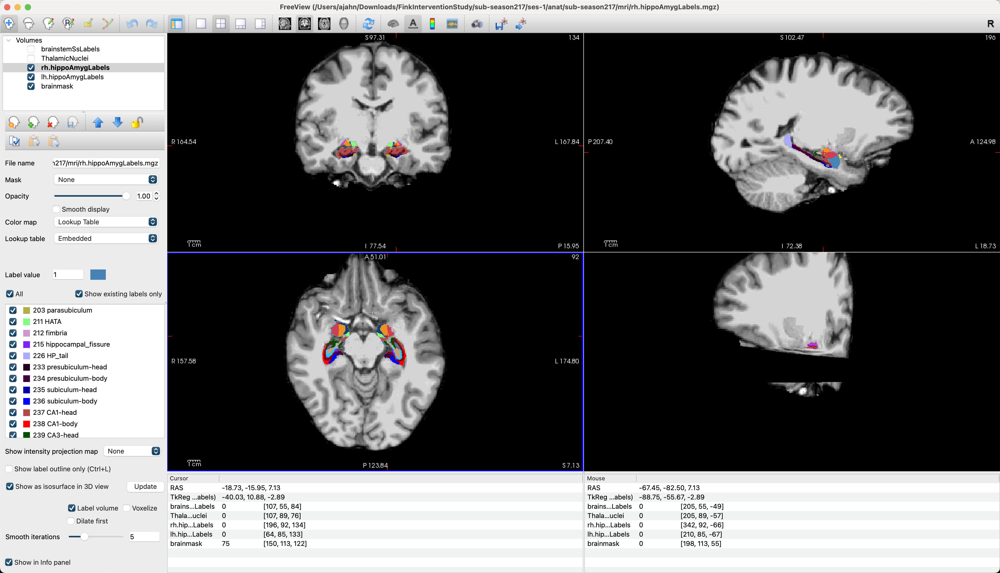
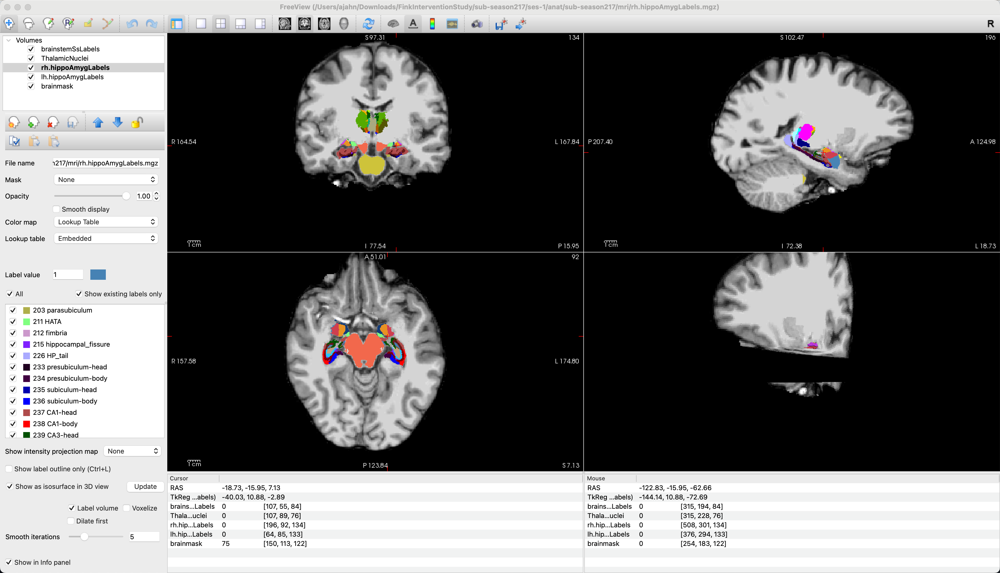

.. _AppendixD_SegmentingSubfields

===============================================================================
Appendix D: Segmenting Hippocampal, Amygdala, Brainstem, and Thalamus Subfields
===============================================================================

---------------

Overview
********

Within a structure as tiny as the amygdala - a brain region the size of a cashew, roughly one centimeter in diameter - there are many subdivisions, around a dozen, which have different functions. There are also subregions of the thalamus, brainstem, and hippocampus that researchers are still exploring.

You can segment these regions into their parts with the FreeSurfer command ``segment_subregions``. Available in the most recent releases of FreeSurfer (versions 7.3.x and above), this command combines the features that were found in the separate segmentation commands used in older versions of FreeSurfer, such as ``segment_HA``, ``recon-all -brainstem-structures``, and ``segmentThalamicNuclei``. Note that it only accepts T1-weighted anatomical scans, and that you are not able to use T2-weighted scans.

The benefit of the new command is that you can choose any of the subregions individually, or segment them in sequence. It also does not require Matlab runtime, which could be difficult to install on supercomputing clusters.

Assuming that you have already run a subject through ``recon-all`` and that you are segmenting one scan (i.e., you are not doing a longitudinal analysis), you can type the following (making sure to also set ``SUBJECTS_DIR`` to the directory from which you are running ``segment_subregions``):

::

  segment_subregions hippo-amygdala --cross $subject

In which ``$subject`` is replaced by the name of the directory that contains your FreeSurfer output.

For example, imagine that we are analyzing the data from a study by Fink et al. (2021) which examined whether the volume of different subregions of the hippocampus increased as the result of having the subjects run for exercise over a two-week period. If we download one of the subjects - in this case, ``sub-season217`` - we see that the participant has three sessions (``ses-1``, ``ses-2``, and ``ses-3``), each with an ``anat`` directory containing a T1-weighted anatomical scan. Assume that we analyzed the ``ses-1`` directory by navigating to ``sub-season217/ses-1`` and typing:

::

  SUBJECTS_DIR=`pwd`
  recon-all -s sub-season217 -i sub-season217_ses-1_acq-MPrageHiRes_T1w.nii.gz -all

Once that has finished, we can run this command from the same directory to segment the subregions of the hippocampus and the amygdala:

::

  segment_subregions hippo-amygdala --cross sub-season217

Which, after about fifteen minutes, will generate different levels of granularity for the segmentations, for both the left and right hemisphere:

  Output from ``segment_subregions`` for the hippocampus and amygdala. Shown here are the left hemisphere segmentations, which can be found in the ``mri`` directory. The volume with the most complete labeling scheme is ``lh.hippoAmygLabels.mgz``; the meaning of the other suffixes can be found on `this page <https://surfer.nmr.mgh.harvard.edu/fswiki/HippocampalSubfieldsAndNucleiOfAmygdala>`__ under the section "Motivation and General Description". The files ``lh.amygNucVolumes.txt`` and ``lh.hippoSfVolumes.txt`` contain the volume estimates for each subregion of the amygdala and the hippocampus, respectively.

The segmentations can then be visualized in Freeview by loading them as volumes, along with the file ``brainmask.mgz`` as an underlay:

Running segment_subregions on a supercomputing cluster
******************************************************

This analysis can also be run on a supercomputing cluster by using something like the following template. Note that ``freesurfer/7.4.1`` is loaded as a module, and that three separate instances of ``segment_subregions`` are called, each one segmenting a different structure. Two hours is allocated for the entire process, although each segmentation takes about 10-15 minutes:

::

  #!/bin/bash

  #----------------------------
  # Slurm variables
  
  #SBATCH --job-name=FinkInterventionSeg
  #SBATCH --time=2:00:00
  
  #SBATCH --nodes=1
  #SBATCH --ntasks-per-node=1
  #SBATCH --cpus-per-task=1
  #SBATCH --mem=8gb
  
  #SBATCH --account=ajahn0
  #SBATCH --partition=standard
  
  #SBATCH --mail-type=NONE
  
  #-----------------------------
  # Load modules
  module load freesurfer/7.4.1
  
  #-----------------------------
  # Print diagnostic information to the job output file
  my_job_header
  
  #-----------------------------
  # Commands to run during job
  cd sub-season217/ses-1/anat
  SUBJECTS_DIR=`pwd`
  segment_subregions hippo-amygdala --cross sub-season217
  segment_subregions thalamus --cross sub-season217
  segment_subregions brainstem --cross sub-season217

All of the segmentations can be loaded into Freeview at the same time:

Any further ROI analyses can be done by extracting the data in the relevant text file. For example, here is the data contained in the file ``rh.amygNucVolumes.txt``, which can be easily loaded into a spreadsheet like Excel:

::

  Lateral-nucleus 641.904705
  Basal-nucleus 407.362812
  Accessory-Basal-nucleus 254.086566
  Anterior-amygdaloid-area-AAA 49.233018
  Central-nucleus 40.191365
  Medial-nucleus 15.293715
  Cortical-nucleus 27.076169
  Corticoamygdaloid-transitio 166.302591
  Paralaminar-nucleus 45.725635
  Whole_amygdala 1647.176577
