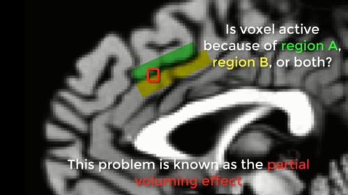
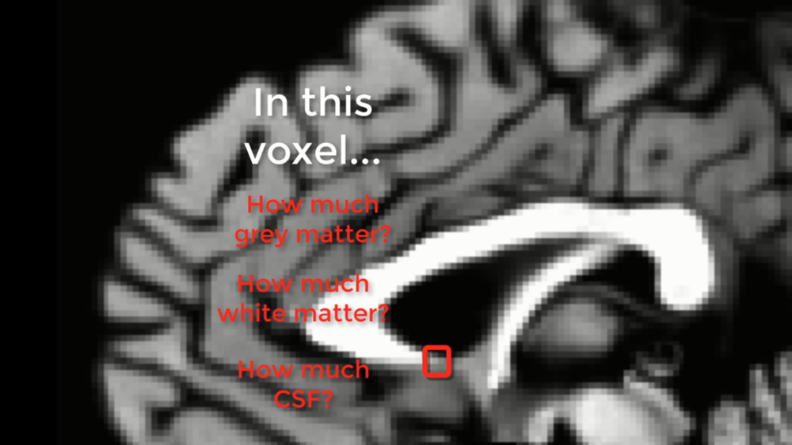
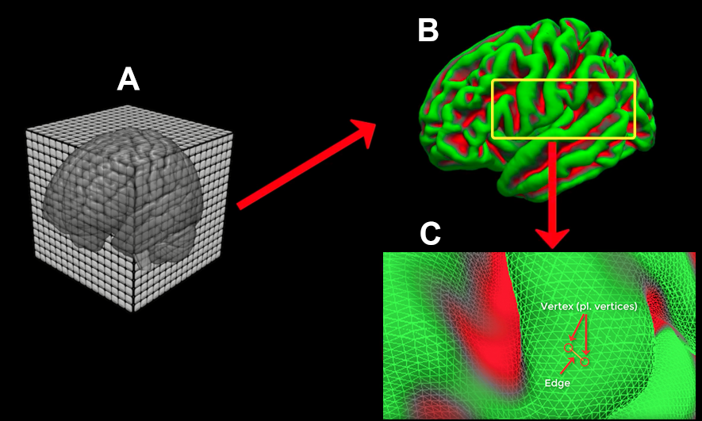
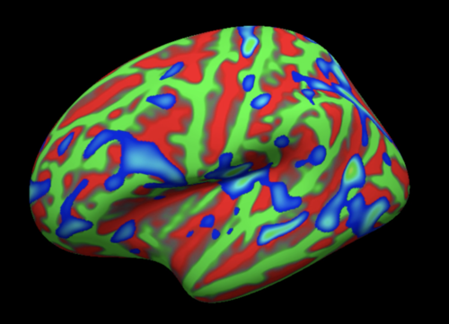

.. _FS_01_BasicTerms:

===============
FreeSurfer Tutorial #1: Basic Terms
===============

-------------

Overview
*********

Virtually all neuroimaging studies acquire a T1-weighted **anatomical scan**: A high-resolution image with high contrast between the white matter and the grey matter. In these images white matter is lighter, grey matter is darker, and cerebrospinal fluid is black. These are the images that will be used by FreeSurfer to partition the cortical surface and the subcortical structures into distinct areas.

Instead of analyzing the brain as a 3D volume, however, FreeSurfer transforms the cortex into a 2D surface. Why a 2D surface? Picture a voxel that straddles both edges of a sulcus. The voxel contains a mixture of signals from both regions, and it is impossible to determine which region contributed to the signal - a problem known as the **partial voluming effect**.

  An illustration of the partial voluming effect. A voxel, outlined in red, contains signal from both region A (green) and region B (yellow). The partial voluming effect can also occur when the signal contains both grey matter and white matter.
  

We run into a similar problem with a voxel that contains two or more different tissue types. Picture a voxel that contains grey matter, white matter, and cerebrospinal fluid. In this case we cannot tell how much of each is contained by that voxel: It is a single number which represents each of the different tissue types within the voxel, but it is impossible to tell how much of each tissue type is within the voxel.

  The partial voluming effect in a structural scan. The box highlighted in red represents a voxel that encompasses three different tissue types: White matter, grey matter, and CSF. If you imagine that the greyscale image is a real brain, and our red box is the smallest resolution element of our scan, the red box would be an average of the different tissue types contained within it.
  
  
FreeSurfer's Solution
*********

FreeSurfer gets around this problem by tracing the boundaries between the different tissues of the brain - grey and white matter, grey and pial matter, and so on - and then inflating those surfaces into spheres. Most of the leftover defects in the inflated surface are automatically corrected (although some defects need to be fixed manually). These surfaces can then be rendered as partially inflated, fully inflated, or spherical brains.

To help you better understand what FreeSurfer does, picture this: You’ve just removed someone’s brain and placed it on the table. The brain is like a flaccid balloon, with the wrinkles representing the gyri and sulci of the cortex. Now, you put your mouth on the severed brainstem (after washing it with soap and hot water, of course) and blow as hard as you can, inflating the brain to its maximum extent. The wrinkles disappear and the brain becomes a fully inflated balloon, like a sphere. This is a different way to view your data - instead of using voxels as the building blocks of our image, we use vertices and edges. Think of these vertices and edges as a chain link fence wrapped around the surface of the cortex; the links are the edges and the intersections of the links are the vertices. The vertex is now our smallest resolution element, and at each vertex we can calculate structural measurements such as thickness, volume, and surface area.

  Sample illustration of the FreeSurfer reconstruction (recon) process. (A) The T1-weighted anatomical scan is created by the scanner, usually with a resolution of about 1mm cubed. (B) The 3D anatomical image is converted by FreeSurfer’s recon-all into a 2D mesh. The pial surface is displayed here. (C) A closeup of the mesh surface, showing how it is composed of Vertices (intersections of the triangles making up the mesh) and Edges (connections between vertices).

Once you’ve reconstructed the surface you can resample your fMRI statistical maps and view them on an inflated surface, or deflate the surface and see where the activation lies on the original, wrinkled cortex. This gives you a better picture of how the statistical maps lie along the ridges and valleys of the brain. (For a practical exercise in analyzing fMRI data on the surfaces generated by FreeSurfer, see :ref:`this module <AFNI_09_SurfaceAnalysis>`.

FreeSurfer uses the reconstructed surface, along with prior knowledge about the topology of a typical human brain, to label the cortical and subcortical structures. The labeling of the cortex is called **Parcellation**, and the labeling of the subcortical structures is called **Segmentation**. These labelings are based on the two atlases that come with FreeSurfer: The Desikan-Killiany atlas and the Destrieux atlas, with the Destrieux atlas containing finer-grained parcellations. Structural measurements are then averaged within each parcellation. These measures can be compared across groups, or correlated with some individual difference measure, such as age, IQ, or sex.

  Brain activity mapped onto the surface. The inflated pial surface is displayed here. Green: Gyri; Red: Sulci. The thresholded activation map is displayed in blue. Note that this type of rendering gives the viewer a better idea of where activity lies within the sulci, which is otherwise hidden in a volumetric, 3D view.
  
Next Steps
**********

Now that you have a sense of what FreeSurfer does and why reconstructed surfaces are useful, you are ready to download and install the software. Click the ``Next`` button for a link and a video demonstrating how to install FreeSurfer on your computer.
  
-------------

Video
*******

For a video overview of FreeSurfer and a definition of it's basic terms, see `this video <https://www.youtube.com/watch?v=6wxJ1up-E7E>`__.
