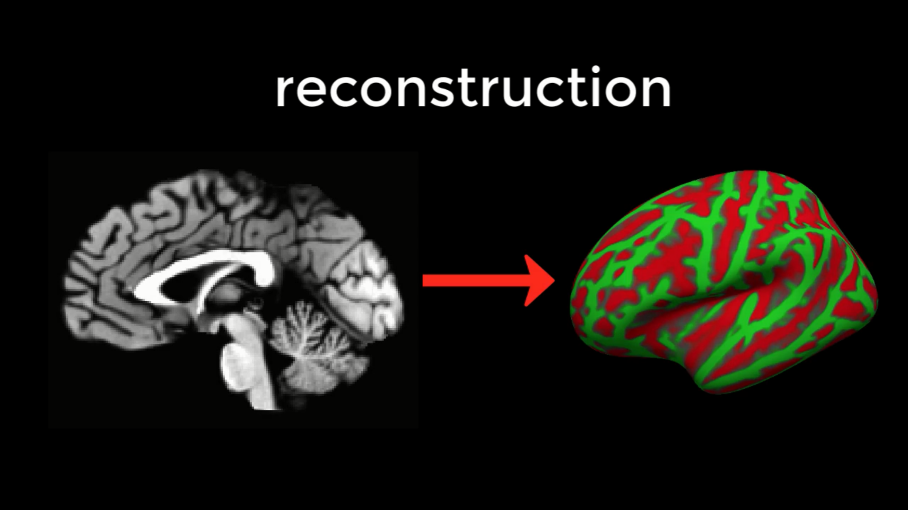
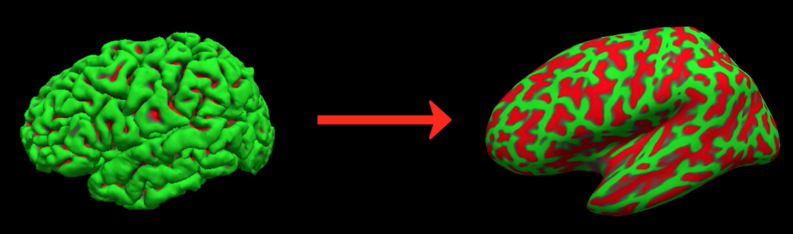

.. _FS_03_ReconAll:

=================================
FreeSurfer Tutorial #3: Recon-all
=================================

Overview: Reconstructing the Cortical Surface
*********************************************

FreeSurfer contains a large suite of programs which can take several hours to process a single subject, and days to process an entire dataset. Fortunately, the processing itself is very simple to do - FreeSurfer has a single command that, when executed, does virtually all of the most tedious parts of preprocessing a single subject. This command, **recon-all**, is easy to use and requires only a few arguments in order to run. Later on, you will learn how to execute multiple recon-all commands simultaneously, which will save you a considerable amount of time.

Recon-all stands for **reconstruction**, as in reconstructing a two-dimensional cortical surface from a three-dimensional volume. The images we collect from an MRI scanner are three-dimensional blocks, and these images are transformed by recon-all into a smooth, continuous, two-dimensional surface - similar to taking a paper lunch bag crumpled into the size of a pellet, and then blowing into it to expand it like a balloon.

  The command recon-all converts a three-dimensional anatomical volume (shown on the left, represented by a typical sagittal slice taken through a volume) into a two-dimensional surface (right). As you will see in the tutorial on :ref:`Freeview <FS_06_Freeview>`, FreeSurfer creates several different types of inflated brains that you can use for visualizing your results.
    

The Output of Recon-all
***********************

Before discussing how to use the recon-all command, it is informative to see examples of what it creates. Recon-all first strips the skull from the anatomical image to generate a dataset called **brainmask.mgz**. (The .mgz extension stands for a compressed, or zipped, Massachusetts General Hospital file; it is an extension specific to FreeSurfer, similar to AFNI's BRIK/HEAD extension.) Any files that are output as three-dimensional volumes are stored in a folder called **mri**. Recon-all then estimates where the interface is between the white matter and grey matter for both hemispheres, and these surface estimates are stored in files called **lh.orig** and **rh.orig**.

This initial estimate is refined and then saved into files called **lh.white** and **rh.white**. This boundary is then used as a base from which recon-all extends feelers to search for the edge of the grey matter. Once this edge is reached, a third pair of datasets are created: **lh.pial** and **rh.pial**. These datasets represent the pial surface, which is like a plastic film wrapped around the edge of the grey matter. Each one of these datasets can be viewed as a surface, or on the original 3D volume by using :ref:`freeview <FS_06_Freeview>`.

.. figure:: 03_Orig_White_Pial.png

  An illustration of how recon-all creates different surfaces. The original estimate of the location of the white-matter and grey-matter interface (yellow) is refined into a more accurate estimate (blue). This refined estimate is then used to assist with detecting the edge of the grey matter (red). These surfaces as seen in Freeview (FreeSurfer's viewer) are shown on the right.

One of the advantages of using these surfaces is the ability to depict within the sulci measurements such as cortical thickness differences or the BOLD signal. In a three-dimensional volume, it is possible for a single voxel to span two separate ridges of grey matter, which makes it impossible to determine which part of the cortex generates the observed signal. To more easily see where the activation maps lie along the banks of the sulci and the ridges of the gyri, the surface datasets can be further expanded to create the datasets **lh.inflated** and **rh.inflated**. (For an example of how to analyze fMRI data on a surface generated by FreeSurfer, see :ref:`this tutorial on SUMA <AFNI_09_SurfaceAnalysis>`.

  An illustration of converting the lh.pial file into lh.inflated.
  
These inflated surfaces can be inflated yet again, this time into a sphere. This is not an image that you would use to visualize your results; it is an image that is instead normalized to a template image called **fsaverage**, an average of 40 subjects, and then re-shaped into an inflated surface or a pial surface. Once the individual subject's surface map is normalized to this template, an atlas can be used to **parcellate** the cortex into anatomically distinct regions. Recon-all will parcellate the individual subject's brain according to two atlases: The Desikan-Killiany atlas, and the Destrieux atlas. The Destrieux atlas contains more parcellations; which one you use for your analysis will depend on how fine-grained an analysis you wish to perform.

.. figure:: 03_FreeSurfer_Atlases.png

  A comparison of the Desikan-Killiany (left) and Destrieux (right) atlases. Note the greater number of parcellations in the Destrieux atlas as compared to the Desikan-Killiany atlas.

Using the Recon-all command
***************************

We will generate all of the images mentioned above with the command recon-all, which only requires a T1-weighted anatomical image with good contrast between the white matter and the grey matter. If you are in the Cannabis directory, navigate to sub-101's anatomical directory by typing ``cd sub-101/ses-BL/anat``. You can then run recon-all with the following command:

::

  recon-all -s sub-101 -i sub-101_ses-BL_T1w.nii.gz -all
  
The ``-s`` option specifies the subject name, which you can set to whatever you want. The ``-i`` option points to the anatomical image that you will analyze; and the ``-all`` option will run all of the preprocessing steps on your data. Except for when you are re-running a recon-all command after :ref:`editing the data <FS_12_FailureModes>`, you will always want to use the ``-all`` option.

As the command is running, the output will be placed in a directory called $SUBJECTS_DIR. By default, $SUBJECTS_DIR is a variable that points to the directory $FREESURFER_HOME/subjects, in which $FREESURFER_HOME is another variable pointing to the directory in which FreeSurfer was installed - such as ``/usr/local/freesurfer``. In other words, the output of this recon-all command will be in ``/usr/local/freesurfer/subjects``. 

.. note::

  If you get a permission error when running recon-all, type the following:
  Sudo chmod -R a+w $SUBJECTS_DIR
  And then rerun the recon-all command.
  

I also recommend adding the qcache option, which will smooth the data at different levels and store them in the subject’s output directory. These will be useful for :ref:`group level analyses <FS_08_GroupAnalysis>`, which we will cover in a future tutorial. If you’ve already run the recon-all preprocessing on your subjects, you can run qcache with the following command:

::

  recon-all -s <subjectName> -qcache

Which should take about 10 minutes per subject.

Next Steps
**********

We could run recon-all for each of our subjects, one by one. You will soon find, however, that this is tedious and impractical for analyzing large datasets. We will learn how to speed up the process in the next chapter by using a command called ``parallel``.

---------

Video
*****

For a video overview of recon-all and how to use it, click `here <https://www.youtube.com/watch?v=gkjvKMjH7iM>`__.
